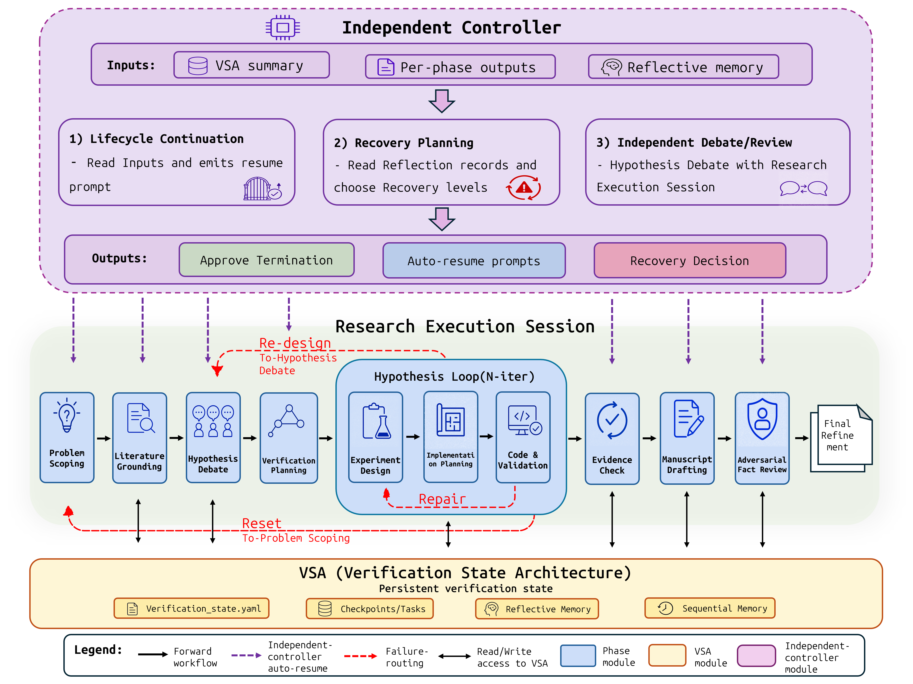

# YouRA: A Persistent-State Architecture for Evidence-Traceable Autonomous Research Agents

> AACL-IJCNLP 2026

## Abstract

End-to-end research agents can now produce complete scientific papers, but manuscript claims can diverge from executed experiments. YouRA (Your Research Agent) addresses this reliability gap by making research state, execution evidence, and trajectory-level failure history explicit, persistent, and verifiable across the full research lifecycle.

YouRA combines three architectural components:

| Component | Description |
|:----------|:------------|
| **Verification State Architecture (VSA)** | Tracks hypotheses, gates, evidence pointers, checkpoints, tasks, reflective memory, and sequential memory as persistent state. |
| **Independent Controller** | Reads VSA summaries, per-phase outputs, and reflective memory to control lifecycle continuation, recovery planning, and independent debate/review. |
| **Stateful Reflection** | Records failures as structured lessons and routes recovery through bounded repair, hypothesis redesign, or problem-scoping reset. |

Given only a topic-level description, YouRA expands it into a research question, hypothesis, experiment plan, implementation, validation evidence, and final manuscript. For benchmark evaluation, runs are held to fully autonomous mode; for practical use, the same infrastructure exposes stage-specific CLI commands and resumable hook-driven orchestration.

## Key Results

The paper evaluates YouRA on the MLR-Bench predefined ten-task end-to-end subset.

### End-to-End Scores

[MLR-Bench](https://github.com/chchenhui/mlrbench) scores use a 1-10 rubric where higher is better. Each cell reports mean ± task standard deviation over four judges.

| System | Backbone LLM | Clarity | Novelty | Soundness | Significance | Overall |
|:--|:--|--:|--:|--:|--:|--:|
| [MLR-Agent](https://neurips.cc/virtual/2025/loc/san-diego/poster/121719) | Sonnet 4.5 | 7.42 ± 0.24 | 5.12 ± 0.74 | 2.48 ± 0.61 | 3.52 ± 0.68 | 3.10 ± 0.64 |
| MLR-Agent | Opus 4.5 | 7.30 ± 0.35 | 5.25 ± 0.31 | 3.05 ± 0.96 | 3.80 ± 0.71 | 3.62 ± 0.80 |
| MLR-Agent | Sonnet 4.6 | **7.78 ± 0.22** | **5.95 ± 0.44** | 4.05 ± 1.19 | 4.72 ± 1.14 | 4.42 ± 1.11 |
| [AI Scientist V2](https://www.nature.com/articles/s41586-026-10265-5) | Sonnet 4.5 | 6.72 ± 0.43 | 4.85 ± 0.60 | 3.45 ± 1.18 | 3.92 ± 0.85 | 3.62 ± 0.84 |
| AI Scientist V2 | Opus 4.5 | 6.38 ± 1.25 | 5.22 ± 0.86 | 4.18 ± 1.31 | **4.47 ± 1.03** | 4.28 ± 1.16 |
| AI Scientist V2 | Sonnet 4.6 | 6.45 ± 0.65 | 5.75 ± 0.47 | 3.32 ± 1.01 | 4.22 ± 0.95 | 3.88 ± 0.88 |
| **YouRA** | Sonnet 4.5 | **7.50 ± 0.49** | **5.23 ± 0.92** | **3.98 ± 1.74** | **4.30 ± 1.28** | **4.20 ± 1.45** |
| **YouRA** | Opus 4.5 | **7.73 ± 0.48** | **5.33 ± 1.03** | **4.58 ± 1.86** | 4.33 ± 1.42 | **4.45 ± 1.51** |
| **YouRA** | Sonnet 4.6 | 7.72 ± 0.32 | 5.70 ± 0.57 | **4.92 ± 1.09** | **5.05 ± 1.00** | **5.05 ± 0.92** |

### Pairwise Preferences

Each row summarizes 40 order-collapsed judge-task verdicts from the YouRA perspective (10 tasks x 4 judges). Each verdict is evaluated in both presentation orders; order reversals are counted as ties.

| Comparison | Backbone | Win | Tie | Lose |
|:--|:--|--:|--:|--:|
| YouRA vs [MLR-Agent](https://neurips.cc/virtual/2025/loc/san-diego/poster/121719) | Sonnet 4.5 | 25 | 14 | 1 |
| YouRA vs MLR-Agent | Opus 4.5 | 26 | 5 | 9 |
| YouRA vs MLR-Agent | Sonnet 4.6 | 21 | 14 | 5 |
| YouRA vs [AI Scientist V2](https://www.nature.com/articles/s41586-026-10265-5) | Sonnet 4.5 | 18 | 14 | 8 |
| YouRA vs AI Scientist V2 | Opus 4.5 | 17 | 12 | 11 |
| YouRA vs AI Scientist V2 | Sonnet 4.6 | 20 | 12 | 8 |


## Architecture Overview



YouRA's lifecycle proceeds left to right under the VSA. The independent controller consumes persistent state and reflective memory to decide whether to approve termination, emit auto-resume prompts, or select recovery routing. Sub-hypotheses move through an iterative experiment-design, implementation-planning, and code-validation loop. Failed gates are routed through repair, redesign, or reset, while final evidence passes through manuscript drafting, adversarial fact review, and refinement.

## Installation

### Prerequisites

- A Linux environment for the unattended launchers (`run_phase*.py` stream the Claude CLI through POSIX `select()` on pipes and use `/proc` for hang detection). On Windows, run the pipeline under WSL.
- Python 3.10+
- Claude Code CLI at exactly `~/.local/bin/claude`. Every launcher hard-codes this path (`CLAUDE_CLI` in `YOURA/.claude/hooks/run_phase*.py`); if the CLI is installed elsewhere, symlink it there (see [Claude Hook Setup](#claude-hook-setup)).
- Claude Code CLI must be logged in and backed by an active **Claude subscription** or **API-backed account** before running YouRA.
- Codex CLI must be installed, logged in, and backed by an active **subscription** or **API key** before running Codex-backed evaluation scripts.
- `OPENROUTER_API_KEY` in `.env` for the GPT-5.2-based auto-responder/controller
- A TeX toolchain providing `pdflatex`, `xelatex`, and `bibtex`. Phase 6.5.1 compiles the Overleaf project with `pdflatex` + `bibtex`; the `--enable-refine` pass compiles the refined manuscript with `xelatex` + `bibtex`. `YOURA/setup_tex.py` installs TinyTeX plus the required packages (see [TeX Toolchain Setup](#tex-toolchain-setup)). Without a TeX toolchain, Phase 6.5.1 still writes the `.tex` project (its verifier treats `output.pdf` as optional), and the refine pass writes `06_paper_refinement.md` and the `.tex` sources before `run_phase_refine.py` aborts on the missing `xelatex` binary, so the run ends without a PDF and with the refine step reported as failed.
- `conda` (miniforge3/miniconda): Phase 4 creates a conda environment for each experiment and stops if `conda` is not found.
- MCP services: [Serena](https://github.com/oraios/serena) (strongly recommended) and [Archon](https://github.com/coleam00/Archon/tree/archive/v1-task-management-rag) (recommended). The phase workflows declare both as required tool servers and the prompts instruct the model to use them for Reflective Memory, task tracking, and knowledge-base search; the Python launchers do not check for them, and runs complete without them with reduced tool grounding (the `*_no_mcp` ablation lanes ran with no MCP servers). Other optional MCP services can be found in the [Smithery server directory](https://smithery.ai/servers).

### Setup

Install in this order; each step is detailed below.

1. Python virtual environment, then `pip install -e .` at the repository root
   (installs the `mlrbench-youra` evaluation/analysis package).
2. `.env` at the repository root with `OPENROUTER_API_KEY`.
3. `cd YOURA && python install_hooks.py --install-deps` — installs the hook
   runtime dependencies from `YOURA/requirements.txt` into the same virtual
   environment and writes `.claude/settings.local.json`
   ([Claude Hook Setup](#claude-hook-setup)).
4. `cd YOURA && python setup_tex.py`, then add the TinyTeX `bin` directory to
   `PATH` ([TeX Toolchain Setup](#tex-toolchain-setup)). Standard library
   only, so it does not depend on the virtual environment; needed only for
   PDF output.
5. `conda` on `PATH` for the Phase 4 experiment environments.

```bash
# Clone repository
git clone https://github.com/PrayPrey/Your-Research-Agent.git
cd Your-Research-Agent

# Create virtual environment
python -m venv .venv
source .venv/bin/activate        # Linux/Mac
# or: .venv\Scripts\activate     # Windows

# Install root evaluation package
pip install -e .

# Configure environment
cp .env.example .env
# then edit .env and fill in OPENROUTER_API_KEY
# OPENAI_API_KEY is optional; needed only for direct OpenAI/Codex API calls
```

This repository has two Python setup layers plus one non-Python step:

- `pyproject.toml` installs the root evaluation/analysis package under `src/mlrbench`.
- `YOURA/install_hooks.py` installs the small Claude Code hook runtime dependencies
  (`requests`, `PyYAML`, `python-dotenv`, `openai`, `pytest`) and writes
  repository-specific absolute paths into `YOURA/.claude/settings.local.json`.
- `YOURA/setup_tex.py` installs the TeX toolchain used for PDF generation
  (see [TeX Toolchain Setup](#tex-toolchain-setup)).

Run both Python steps in the same virtual environment. Do not manually edit
`YOURA/.claude/settings.local.json`; regenerate it with `install_hooks.py` after
moving or recloning the repository. The hooks read `.env` from `YOURA/` first
and then from the repository root, so a single `.env` at the root is enough
(`YOURA/.env.example` is a copy of the root template).

`ANTHROPIC_API_KEY` is not required for the default YouRA workflow when Claude Code
CLI is already logged in. It is only needed if you run the MLR-Bench evaluators
with direct Anthropic API models instead of OpenRouter/Claude Code CLI.
The default model choices work without additional environment variables; override
them only when needed via CLI flags such as `--judge-model`, `--model`, or the
optional `LLM_JUDGE_MODEL`, `CLAUDE_MODEL`, and `CODEX_MODEL` variables.

### Claude Hook Setup

Run the hook installer from the `YOURA/` directory. It writes absolute Python paths into `YOURA/.claude/settings.local.json`, so rerun it after moving the repository.

```bash
cd YOURA
python install_hooks.py --install-deps
```

`--claude-bin` only tells the installer which binary to version-check; the
path is not written to any config. The launchers themselves always call
`~/.local/bin/claude`, so if the CLI is installed elsewhere, put a symlink at
that path before running the pipeline:

```bash
mkdir -p ~/.local/bin
ln -s "$(command -v claude)" ~/.local/bin/claude
python install_hooks.py --install-deps
```

**On Windows**, the unattended launchers do not run natively (see
Prerequisites); use WSL and the Linux instructions above. The installer alone
can still be run on Windows to check a `claude.EXE` install by passing its
absolute path with `--claude-bin "C:\Users\<you>\.local\bin\claude.EXE"`.

To skip the Claude CLI check entirely (e.g., when only configuring on a machine where Claude Code will be installed later), add `--skip-claude-check`.

### TeX Toolchain Setup

Phase 6.5.1 compiles the Overleaf project with `pdflatex` + `bibtex`, and the
`--enable-refine` pass compiles the refined manuscript with `xelatex` +
`bibtex`. If an existing TeX Live installation already provides these
binaries, nothing else is needed. Otherwise install TinyTeX plus the required
packages with the bundled script (each agent folder ships an identical copy):

```bash
cd YOURA
python setup_tex.py                                    # TinyTeX under ~/.TinyTeX, then tlmgr packages
export PATH="$HOME/.TinyTeX/bin/x86_64-linux:$PATH"   # add to ~/.bashrc; aarch64-linux / universal-darwin on other platforms
pdflatex --version && xelatex --version && bibtex --version
```

The script prints a verification block at the end; every entry must resolve to
a path (the script exits 0 even when something is `NOT FOUND`, so check the
block). Useful options:

- `--dry-run` prints the commands without running them.
- `--skip-install-tinytex` reuses an existing `tlmgr` and installs only the packages.
- `--packages ...` overrides the package list. The default list includes CJK
  support (`kotex`, `cjk`, `xecjk`) and the large `collection-latexextra`
  bundle; English-only manuscripts can drop the CJK entries.

## Usage

YouRA can be run in two modes. The benchmark runs in this repository use the
unattended Python launcher for reproducibility. Human users can also open Claude
Code in `YOURA/` and use slash commands such as `/phase0-brainstorm`,
`/phase1-research`, `/phase2a-dialogue`, and `/hypothesis-loop` to enter a
specific phase directly and proceed interactively with the AI. See
`YOURA/README.md` for the detailed YouRA workflow layout and phase-command
summary.

### Quick Start: Full Unattended Pipeline

Run the pipeline from the `YOURA/` subdirectory. If you are at the repository
root, enter it first. Include `--enable-refine` so Phase 6.5.1 is followed by
the final refinement/PDF pass.

```bash
cd YOURA

# Text input
python .claude/hooks/run_total_youra.py "Weak supervision for image classification" \
    --research-folder docs/youra_research/20260304_scsl \
    --enable-refine

# Existing research idea file with a fixed output folder
python .claude/hooks/run_total_youra.py docs/research_idea.md \
    --research-folder docs/youra_research/20260304_scsl \
    --enable-refine
```

### Interactive Start for Very Short Research Topics

The commands above run the end-to-end pipeline automatically. For human-guided
use, avoid starting the full pipeline from an overly terse research topic such as
`weak supervision` or `LLM alignment`. A short topic can make Phase 0 generate a
too-simple idea and continue before you have shaped the research direction.

Instead, start Claude Code from `YOURA/` and run the Phase 0 slash command first:

```text
/phase0-brainstorm
```

Use Phase 0 to expand the topic into a concrete research question and check the
generated `docs/youra_research/<run>/00_brainstorm_session.md`. After reviewing
or editing that Phase 0 output, continue the automated pipeline from Phase 1:

```bash
python .claude/hooks/run_total_youra.py dummy \
    --resume-from phase1 \
    --research-folder docs/youra_research/<run> \
    --enable-refine
```

Claude Code also exposes phase-by-phase slash commands if you want to inspect or
steer each phase interactively. See `YOURA/README.md` for the command summary.

The full pipeline runs:

```text
Phase 0  Problem Scoping / Brainstorm
Phase 1  Literature Grounding
Phase 2A Hypothesis Dialogue
Phase 2B Verification Planning
Phase 2C Experiment Design
Phase 3  Implementation Planning
Phase 4  Coding & Validation
Phase 4.5 Hypothesis Synthesis
Phase 6  Manuscript Drafting
Phase 6.5 Adversarial Fact Review
Phase 6.5.1 Overleaf LaTeX + PDF Generation
Refine   Manuscript refinement
```

### Runtime Configuration

Default run behavior can be edited in `YOURA/.claude/hooks/auto_responder_config.yaml`.

| Setting | YAML Path | Meaning |
|:--------|:----------|:--------|
| Claude Code model | `claude_model` | Selects the Claude CLI execution model used by `run_phase*.py`, for example `claude-sonnet-4-6`, `claude-opus-4-6`, or `claude-haiku-4-5-20251001`. Empty/null uses the Claude CLI default. |
| Claude effort | `claude_effort` | Controls Claude extended thinking level: `low`, `medium`, `high`, or `max`. |
| Claude thinking switch | `claude_thinking` | `false` sets `MAX_THINKING_TOKENS=0` for every Claude CLI subprocess, disabling extended thinking regardless of `claude_effort`; `true` (or absent) lets `claude_effort` / the CLI default apply. The shipped config uses `claude_model: claude-sonnet-4-6`, `claude_effort: low`, `claude_thinking: false`. |
| Reflection budget | `pipeline_reflection.max_reflections` | Default maximum number of reflection reroutes after `MUST_WORK` failures. `-1` means unlimited; `0` disables reflection. CLI `--max-reflections` can be used per run. |
| Auto-responder model | `openrouter.model` | Model used by the OpenRouter-based auto-responder/controller when OpenRouter analysis is enabled. |

### Resume From The Middle

Use `--resume-from` when intermediate outputs already exist. Resume points other than `phase0` require `--research-folder`. Keep `--enable-refine` on resumed commands so the final refinement pass runs after Phase 6.5.1.

```bash
# Resume from any supported phase by changing the --resume-from value
python .claude/hooks/run_total_youra.py dummy \
    --resume-from hypothesis-loop \
    --research-folder docs/youra_research/20260304_scsl \
    --enable-refine
```

Supported `--resume-from` values:

| Value | Meaning |
|:------|:--------|
| `phase0`, `phase1`, `phase2a`, `phase2b` | Restart the early pipeline at the selected phase. |
| `hypothesis-loop` | Skip early phases and resume Phase 2C -> 3 -> 4. |
| `phase45`, `phase5`, `phase6`, `phase65`, `phase651` | Resume the post-experiment manuscript pipeline. |
| `refine` | Run refinement after Phase 6.5.1 with `--enable-refine`. |

### Running the no-VSA Ablation Variant (`YOURA_no_VSA/`)

`YOURA_no_VSA/` is a self-contained copy of the agent used for the
persistence-versus-context ablation (the `*_no_VSA` lanes in
[`results/README.md`](results/README.md)). It shares the full pipeline,
launchers, and phase commands with `YOURA/`; the differences are:

- A `guard_state_files.py` PreToolUse hook blocks the task model from reading
  or writing the durable VSA files (`verification_state.yaml` and its
  checkpoints).
- `ablation_state_manager.py` supplies the equivalent state as prompt-visible
  context and maintains harness-only shadow copies under
  `docs/youra_research/<run>/.ablation_shadow/`, preserving identical stage
  transitions.
- `ablation_audit.py` verifies after each run that the task model made no
  reads or writes to the durable VSA files.

Setup mirrors `YOURA/` — run the hook installer from inside `YOURA_no_VSA/`:

```bash
cd YOURA_no_VSA
python install_hooks.py --install-deps
```

**Always pass `--state-mode shadow`.** The flag defaults to `normal` (the
environment variable `YOURA_STATE_MODE=shadow` changes that default); a run
launched in normal mode behaves like the full system and cannot be used as an
ablation arm.

```bash
cd YOURA_no_VSA
python .claude/hooks/run_total_youra.py tasks_youra/iclr2025_scsl.md \
    --research-folder docs/youra_research/20260304_scsl \
    --enable-refine \
    --state-mode shadow
```

All other launcher options (`--resume-from`, `--max-reflections`, the runtime
configuration in `.claude/hooks/auto_responder_config.yaml`) work exactly as
described above for `YOURA/`; keep `--state-mode shadow` on resumed commands
too. The artifacts generated by this variant for the paper are bundled under
`results/generations/youra/<backbone>_no_VSA/`.

### Running the Controller-off Ablation Variant (`YOURA_no_IC/`)

`YOURA_no_IC/` is a self-contained copy of the agent used for the
independent-controller ablation (the `*_no_IC` lanes in
[`results/README.md`](results/README.md)). The independent GPT-5.2 controller
route is disabled: controller-owned lifecycle and recovery decisions, plus
debate and review moderation, run from predefined static prompts. Concretely,
`phase_auto_responder.py` gains a `responder_mode: "fixed"` path (enabled in
`.claude/hooks/auto_responder_config.yaml`) that replaces the GPT-5.2 stop-hook
decision with the deterministic `phase_output_verifier.py` checks plus a fixed
resume prompt, and `run_phase2a.py` runs the hypothesis debate as a self-play
loop inside the execution session instead of through the external
`orchestrate_exchange.py` moderator, so debate itself is conducted by the
execution model. The persistent VSA, MCP tools, Reflective Memory, and stage
graph are unchanged.

Setup and launch are identical to `YOURA/` — no extra flag is needed; the
substitution lives in the hook code and config. The artifacts generated by
this variant are bundled under `results/generations/youra/<backbone>_no_IC/`.

### Running the Combined no-VSA + Controller-off Variant (`YOURA_no_VSA_no_IC/`)

`YOURA_no_VSA_no_IC/` is a self-contained copy of the agent that applies both
ablations above at once (the `sonnet45_no_VSA_no_IC`, `sonnet46_no_VSA_no_IC`,
and `opus45_no_VSA_no_IC` lanes in [`results/README.md`](results/README.md)):

- The no-VSA hooks from `YOURA_no_VSA/` (`guard_state_files.py`,
  `ablation_state_manager.py`, `ablation_audit.py`) block the task model from
  the durable VSA files and supply the equivalent state as prompt-visible
  context.
- The controller-off substitution from `YOURA_no_IC/` (`phase_auto_responder.py`
  with `responder_mode: "fixed"` in `.claude/hooks/auto_responder_config.yaml`,
  and the self-play debate in `run_phase2a.py`) replaces the GPT-5.2 controller
  route with predefined static prompts; the external LLM is additionally
  hard-disabled in the phase configs.

Setup mirrors `YOURA_no_VSA/`, and **`--state-mode shadow` is required** for
the same reason as there:

```bash
cd YOURA_no_VSA_no_IC
python install_hooks.py --install-deps
python .claude/hooks/run_total_youra.py tasks_youra/iclr2025_scsl.md \
    --research-folder docs/youra_research/20260304_scsl \
    --enable-refine \
    --state-mode shadow
```

The artifacts generated by this variant are bundled under
`results/generations/youra/<backbone>_no_VSA_no_IC/`.

These four agent folders (`YOURA/`, `YOURA_no_VSA/`, `YOURA_no_IC/`,
`YOURA_no_VSA_no_IC/`) are the only ones bundled. The `*_no_mcp`,
`*_no_reflection`, and the three- and four-way combined lanes under
`results/` ship their generated artifacts and scores only; see
[`results/README.md`](results/README.md) for their definitions.

### MCP Tool Stack

Claude Code is the execution host and hook surface. Serena and Archon are the main recommended MCP-backed memory/tool layers; the remaining MCP services are optional and can be found in the [Smithery server directory](https://smithery.ai/servers). The per-phase server requirements are listed in `YOURA/bmad-custom-src/custom/modules/youra-research/mcp-phase-config.yaml`; they are enforced by the workflow prompts, not by the Python launchers, so a missing server degrades tool grounding rather than aborting a run.

| Tool | Status | Usage in YouRA |
|:-----|:-------|:---------------|
| [Serena](https://github.com/oraios/serena) | Strongly recommended (declared required by the phase workflows) | Code-aware symbol navigation/editing and Reflective Memory failure-context recording. |
| [Archon](https://github.com/coleam00/Archon/tree/archive/v1-task-management-rag) | Recommended (declared required by the phase workflows) | Sequential Memory, RAG-backed knowledge base, implementation-pattern storage, and task lifecycle management. |
| Clear Thought, Exa, Semantic Scholar | Optional | Available through the [Smithery server directory](https://smithery.ai/servers) if you want structured reasoning, web evidence search, or literature search integrations. |

## Modified MLR-Bench Evaluation Utilities

This repository includes a modified `mlrbench-youra` package under `src/mlrbench`.
It is used for evaluation, not for launching the YouRA research loop. The package
provides unified judge wrappers for YouRA, AI Scientist V2, and MLR-Agent
outputs; install it once from the repository root with `pip install -e .`.

**→ See [`src/README.md`](src/README.md)** for setup, the single-task
`run_eval` runner, supported systems, output locations, and the
`experiments/`-folder builder for new YouRA runs.

The package also carries the idea/proposal-stage pipeline behind the paper's
stagewise comparison (Tables 13-14): `src/mlrbench/evals/youra/generate_*.py`
regenerate `idea.md`/`proposal.md`/`related_work.md` from the source documents
bundled under `results/generations/idea_and_proposal/`, and the
`review_idea.py`/`review_proposal.py` scripts in `evals/{youra,mlragent}/`
re-run the stage judge reviews over those artifacts. **→ See
[`results/README.md`](results/README.md)** for the exact order, `--verify`
modes, and judge notes.

## Experiment Reproduction

All table- and figure-regeneration scripts, the pairwise LLM-as-judge harness,
the data-provenance (Real/Synthetic/Fabricated) diagnostics, the ablation-study
score statistics, and the human validation of hallucination flags live under
`analysis/`. Install the `mlrbench-youra` package first (`pip install -e .`).
The data-provenance diagnostic can be re-run over the bundled
`results/generations/` main lanes (three systems x three backbones x ten
tasks) with a single command,
`python analysis/Data_type_fabrication_analysis/run_generations_data_type.py --engine both`,
which drives both the Claude (claude-opus-4-6) and Codex (gpt-5.4) analyzers.

**→ See [`analysis/README.md`](analysis/README.md)** for the per-folder guide
and copy-paste commands that reproduce each paper artifact from the bundled
evaluation outputs.

## Project Structure

```text
YouRA/
+-- README.md                         # Repository-level overview (this file)
+-- overview.png                      # Main lifecycle overview figure
+-- pyproject.toml                    # Root evaluation package metadata
+-- YOURA/                            # The YouRA agent itself (see YOURA/README.md)
|   +-- install_hooks.py              # Claude Code hook installer
|   +-- setup_tex.py                  # TinyTeX + LaTeX package installer (PDF generation)
|   +-- requirements.txt              # Hook runtime dependencies
|   +-- tasks_youra/                  # Research task prompts
|   +-- .claude/
|   |   +-- commands/                 # Stage-specific Claude commands
|   |   +-- hooks/                    # Pipeline launchers, responder, verifier
|   |   +-- agents/                   # Phase-specialized agents
|   |   +-- prompts/                  # Phase responder prompts
|   |   +-- skills/                   # Tool/reasoning skill wrappers
|   +-- bmad-custom-src/              # YouRA BMAD module sources
+-- YOURA_no_VSA/                     # no-VSA ablation variant of the agent (see "Running the no-VSA Ablation Variant")
+-- YOURA_no_IC/                      # controller-off ablation variant of the agent (see "Running the Controller-off Ablation Variant")
+-- YOURA_no_VSA_no_IC/               # combined no-VSA + controller-off variant (see "Running the Combined no-VSA + Controller-off Variant")
+-- analysis/                         # Reproduction scripts (see analysis/README.md)
+-- results/                          # Evaluation outputs + generated artifacts (see results/README.md)
+-- src/
    +-- mlrbench/                     # Evaluation utilities (see src/README.md)
```

Each top-level folder has its own README with the full details:

| Folder | README | Contents |
|:--|:--|:--|
| `YOURA/` | [`YOURA/README.md`](YOURA/README.md) | YouRA workflow layout, phase commands, and hook runtime. |
| `analysis/` | [`analysis/README.md`](analysis/README.md) | Scripts that reproduce every table and figure in the paper, incl. the ablation-study score statistics. |
| `results/` | [`results/README.md`](results/README.md) | Layout of the bundled evaluation scores (incl. `youra_ablation_study`) and generated research artifacts (incl. the ablation control lanes). |
| `src/` | [`src/README.md`](src/README.md) | The `mlrbench-youra` evaluation package and its CLI runners. |

## Results Format

Primary generated research artifacts are saved under `YOURA/docs/youra_research/`
and mirrored in benchmark-generation results under
`results/generations/youra/<lane>/<task>/docs/youra_research/`. The final
refined manuscript of each run is `paper/refinement/06_paper_refinement.md`.

**→ See [`results/README.md`](results/README.md)** for the full per-run layout,
the evaluation-score folder structure, the ablation lanes, and the release
anonymization notes.

## Safety and Reliability Mechanisms

| Mechanism | Purpose |
|:----------|:--------|
| Phase output verification | Each launcher checks required files and structured fields before advancing. |
| Auto-responder stop control | The hook router either approves stop, emits a resume prompt, or escalates `MUST_STOP`. |
| VSA gates | `MUST_WORK` and `SHOULD_WORK` gates determine whether failures trigger repair, redesign, reset, or limitation recording. |
| Independent fact review | Later manuscript stages check generated claims against VSA, stage artifacts, results, logs, and code. |

## Citation

```bibtex
@inproceedings{woo2026youra,
  title={YouRA: A Persistent-State Architecture for Evidence-Traceable Autonomous Research Agents},
  author={Woo, Yoonkyu and Lee, Woojin and Huang, Jin-xia},
  booktitle={Proceedings of AACL-IJCNLP 2026},
  year={2026},
  note={Yoonkyu Woo and Woojin Lee contributed equally}
}
```

## License

This repository is released under the [PolyForm Noncommercial License 1.0.0](LICENSE.md). MLR-Bench tasks, reference papers, datasets, and starter code remain under their original upstream licenses; generated artifacts (papers, code, and logs under `results/`) are released under the same terms as this repository and inherit applicable upstream obligations.
