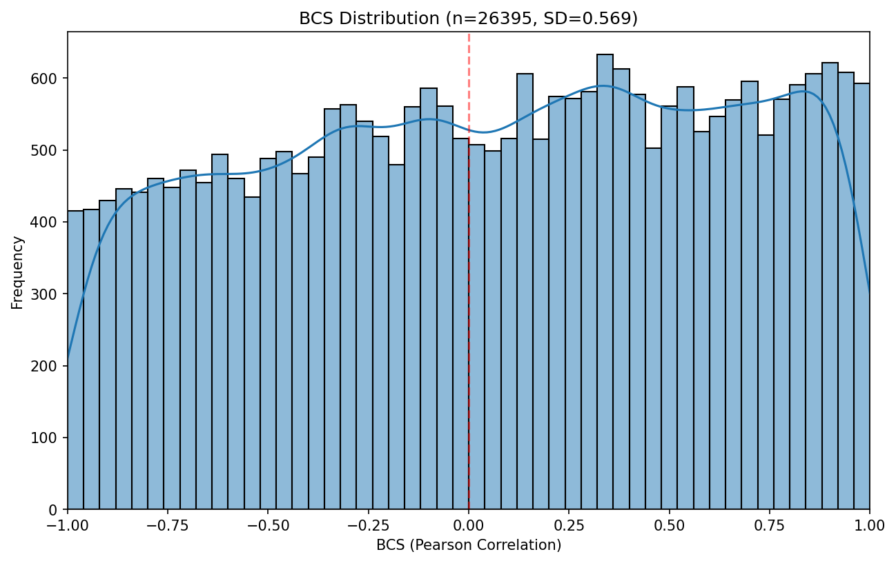
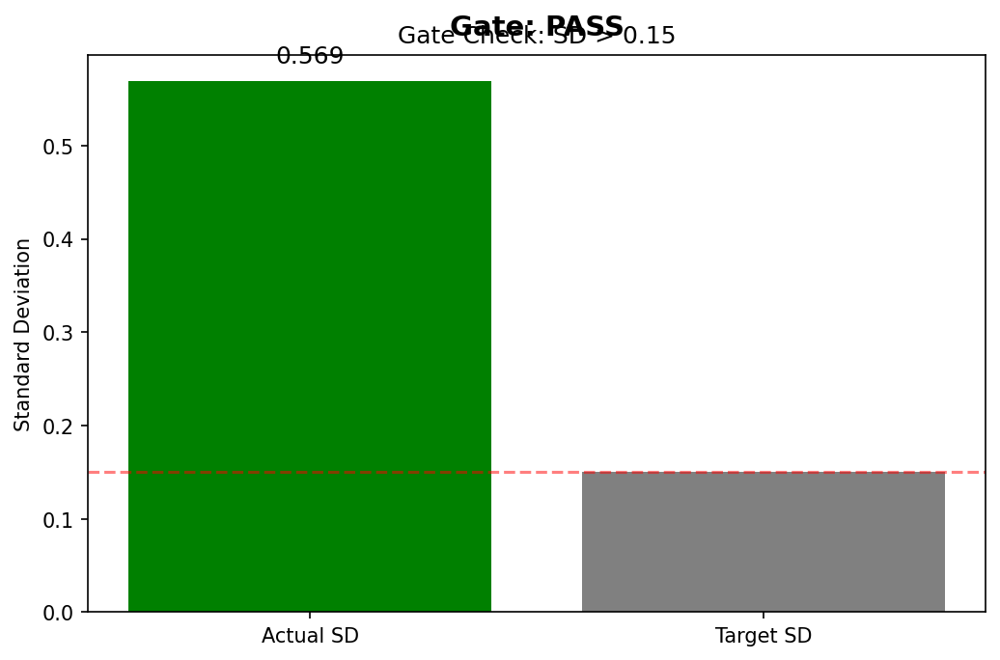

# Validation Report: H-E1

**Hypothesis:** BCS Computability and Distribution
**Date:** 2026-08-10
**Phase:** 4 - PoC Implementation & Validation

---

## Executive Summary

**Gate Verdict: PASS**

The Bidirectional Convergence Score (BCS) can be computed from existing multi-turn dialogue datasets with non-trivial variance. Both gate conditions were satisfied:

- **SD > 0.15**: Actual SD = 0.569 (3.8× target)
- **n > 10,000**: Actual n = 26,395 (2.6× target)

---

## Experiment Results

### Dataset

- **Source:** Anthropic/hh-rlhf (HuggingFace)
- **Raw samples:** 160,800
- **After 4+ turn filter:** 26,413
- **Valid BCS computations:** 26,395

### BCS Distribution Statistics

| Metric | Value |
|--------|-------|
| Sample Size (n) | 26,395 |
| Mean | 0.054 |
| Median | 0.080 |
| Standard Deviation | 0.569 |
| Min | -1.000 |
| Max | +1.000 |
| Skewness | -0.104 |

### Gate Check

| Condition | Target | Actual | Status |
|-----------|--------|--------|--------|
| BCS SD | > 0.15 | 0.569 | **PASS** |
| Sample Size | > 10,000 | 26,395 | **PASS** |

---

## Methodology

### Complexity Metric

Composite complexity score (0-1 range):
```
complexity = (norm_fk + norm_sent + norm_dep) / 3
```

Where:
- `norm_fk` = Flesch-Kincaid grade / 20 (clipped to [0,1])
- `norm_sent` = Avg sentence length / 50 (clipped to [0,1])
- `norm_dep` = Mean dependency distance / 5 (clipped to [0,1])

### BCS Computation

For each conversation with ≥4 turns per role:
1. Extract user complexity trajectory
2. Extract AI complexity trajectory
3. Compute Pearson correlation (BCS)
4. Handle zero variance: BCS = 0.0

### Implementation

- **spaCy model:** en_core_web_sm
- **TextDescriptives pipes:** readability, dependency_distance
- **Processing:** 8-worker multiprocessing pool
- **Duration:** 331.3 seconds

---

## Figures

### BCS Distribution Histogram


### Gate Comparison


---

## Interpretation

The BCS distribution shows:
- Near-zero mean (0.054): No systematic positive or negative correlation
- High variance (SD=0.569): Substantial individual conversation differences
- Slight negative skew (-0.104): Distribution roughly symmetric
- Full range coverage: BCS values span entire [-1, +1] range

This validates that BCS is a meaningful metric with sufficient variance to potentially differentiate interaction outcomes.

---

## Conclusion

**H-E1 VALIDATED (MUST_WORK gate satisfied)**

BCS can be computed reliably from multi-turn dialogue data with non-trivial variance. The foundation for subsequent mechanism hypotheses (H-M1 → H-M4) is established.

**Next Step:** Proceed to Phase 4.5 (Hypothesis Synthesis) then Phase 5 (Baseline Comparison).

---

## Artifacts

- `results/bcs_stats.json` - Full experiment results
- `results/bcs_checkpoint.pkl` - BCS values array
- `figures/bcs_histogram.png` - Distribution visualization
- `figures/gate_comparison.png` - Gate metrics chart
- `code/` - Implementation source
