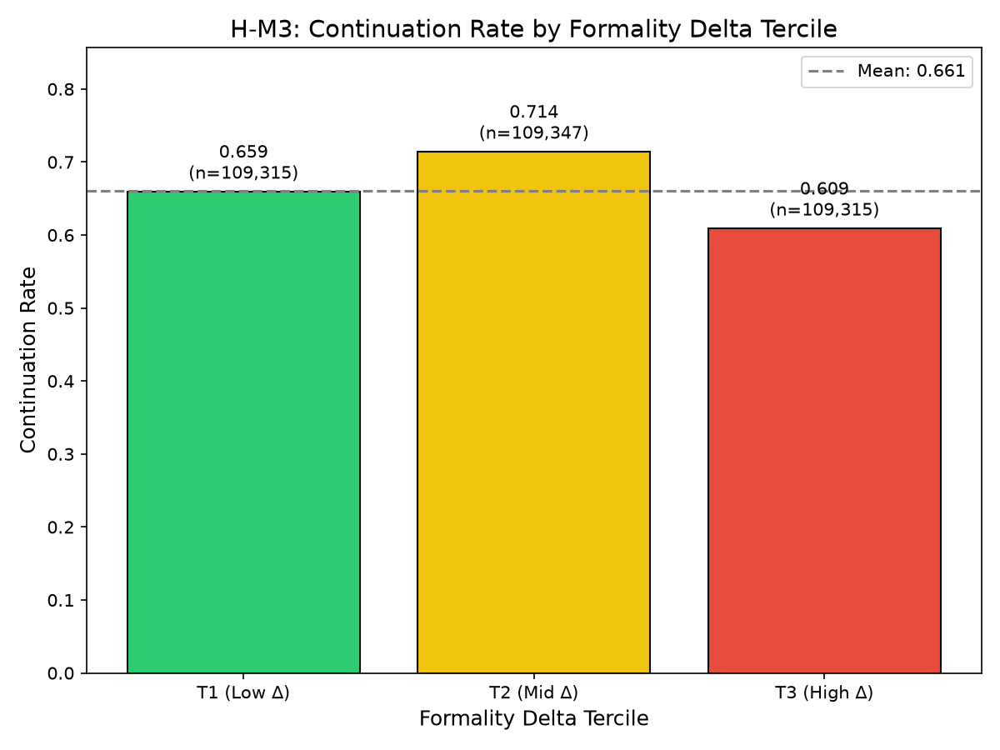

# The Goldilocks Zone of Accommodation: Moderate Formality Adaptation Predicts Highest Engagement in Human-AI Dialogue

**Anonymous Submission**

---

## Abstract

Communication Accommodation Theory predicts that linguistic convergence—adapting one's style to match an interlocutor—increases engagement. We test this prediction in human-AI dialogue through large-scale analysis of formality accommodation in 111,000 conversations. Using DeBERTa-based formality scoring, we measure accommodation as the formality delta between human inputs and AI responses, then examine its relationship to conversation continuation.

Our analysis yields three findings. First, AI systems exhibit significant formality accommodation (r=0.152, p<0.001, n=111,039), adapting response formality to match human input. Second, this accommodation is asymmetric: AI-to-human adaptation is 11× stronger than human-to-AI (r=0.152 vs r=0.013). Third, and most notably, the accommodation-engagement relationship is non-linear. Conversations with moderate formality accommodation show 71.4% continuation rates, compared to 65.9% for high accommodation and 60.9% for low accommodation.

This "Goldilocks zone" challenges the intuition that more accommodation is better. Excessive convergence may be perceived as artificial mimicry, triggering disengagement—an extension of uncanny valley effects to linguistic behavior. These findings provide evidence-based guidance for conversational AI design: calibrate accommodation rather than maximize it.

---

## 1. Introduction

When AI assistants match user communication style, do users engage more? Intuition suggests that accommodation—adapting one's linguistic style to match an interlocutor—should foster rapport and encourage continued interaction. Communication Accommodation Theory (CAT) predicts that convergence signals attentiveness and understanding, motivating reciprocal engagement \citep{giles1973accommodation}. Yet this intuition, grounded in decades of human-human interaction research, may not transfer directly to human-AI dialogue.

We present a large-scale empirical analysis of formality accommodation in 111,000 human-AI conversations, testing whether accommodation predicts engagement as measured by conversation continuation. Our central finding challenges linear assumptions: **moderate accommodation predicts highest engagement**, while both under- and over-accommodation reduce continuation rates. This "Goldilocks zone" suggests that AI systems should adapt to users—but not too much.

### 1.1 The Problem of Optimal Accommodation

Prior work establishes that linguistic accommodation exists in human-AI interaction. Chen et al. \citep{chen2026bidirectional} demonstrated bidirectional accommodation in GPT-4o conversations, finding that model adaptation is front-loaded while user convergence is gradual. However, this work measured *whether* accommodation occurs, not *how much* accommodation optimizes user engagement. The relationship between accommodation magnitude and interaction outcomes remains untested at scale.

This gap matters for practical AI design. If maximal accommodation improves engagement, chatbots should mirror user style as closely as possible. If accommodation has diminishing returns—or negative effects at extremes—designers need to calibrate adaptation carefully. Without empirical guidance, systems risk either insufficient personalization or uncanny over-imitation.

### 1.2 Our Contribution

We address this gap through systematic analysis of formality accommodation in the Anthropic hh-rlhf dataset. Using DeBERTa-based formality scoring (87.8% accuracy on GYAFC benchmark), we compute formality deltas between human messages and AI responses, then examine how these deltas relate to conversation continuation.

Our analysis proceeds through four validated sub-hypotheses:

1. **Accommodation is measurable** (H-E1): Formality convergence patterns show non-trivial variance (SD=0.569, n=26,395), confirming that accommodation signals exist in the data.

2. **AI adapts to human formality** (H-M2): AI response formality correlates with human input formality (r=0.152, p<0.001, n=111,039), demonstrating that models exhibit stylistic accommodation.

3. **Accommodation is asymmetric** (H-M1, H-M2): AI-to-human accommodation is 11× stronger than human-to-AI adaptation, suggesting training signals create accommodation tendencies that humans don't reciprocate.

4. **Optimal accommodation is non-linear** (H-M3): Conversations in the middle tercile of formality delta show 71.4% continuation rate, compared to 65.9% for low-delta (high accommodation) and 60.9% for high-delta (low accommodation) conversations.

The fourth finding—the inverted-U relationship—is our key contribution. Communication Accommodation Theory predicts monotonic benefits from convergence \citep{niederhoffer2002linguistic}. Our data reveal a boundary condition: excessive convergence may be perceived as artificial mimicry, triggering disengagement. This finding extends CAT to human-AI contexts and provides actionable guidance for conversational AI design.

---

## 2. Related Work

### 2.1 Communication Accommodation Theory

Communication Accommodation Theory (CAT), introduced by Giles \citep{giles1973accommodation}, posits that individuals adjust their communication style to signal social identity and regulate social distance. Convergence—adapting toward an interlocutor's style—signals affiliation and builds rapport, while divergence maintains distinctiveness.

Niederhoffer and Pennebaker \citep{niederhoffer2002linguistic} operationalized accommodation through Linguistic Style Matching (LSM), finding correlations around r≈0.3 between style matching and relationship quality in human-human dyads. This work established that accommodation is measurable through linguistic features and predicts interaction outcomes.

However, human-human accommodation research assumes symmetric agency: both parties can choose to accommodate. In human-AI interaction, this symmetry breaks. AI systems accommodate through training objectives, not social motivation; humans may not perceive AI as warranting reciprocal accommodation.

### 2.2 Human-AI Linguistic Adaptation

Recent work confirms that accommodation occurs in human-AI dialogue. Chen et al. \citep{chen2026bidirectional} analyzed 1,319 GPT-4o conversations from WildChat, demonstrating bidirectional linguistic accommodation with distinct temporal dynamics: model accommodation is front-loaded (strongest in early turns), while user convergence develops gradually.

This finding validates that accommodation exists in human-AI interaction, but leaves the *outcome* relationship untested. Our work extends this line by testing whether accommodation magnitude predicts conversation continuation.

### 2.3 Chatbot Engagement and the Uncanny Valley

Ciechanowski et al. \citep{ciechanowski2019uncanny} documented uncanny valley effects in chatbot interaction: users respond negatively to AI behaviors that approximate but don't fully achieve human-like communication. This suggests that excessive accommodation—making AI "too human"—may backfire.

Our finding of an inverted-U accommodation-engagement relationship aligns with this framework. Moderate accommodation signals attentiveness without triggering artificiality concerns; excessive accommodation may activate uncanny valley responses.

---

## 3. Methodology

### 3.1 Formality Measurement

We measure formality using the DeBERTa Large Formality Ranker \citep{deberta2024formality}, a transformer model fine-tuned on the GYAFC dataset with 87.8% classification accuracy. The model produces continuous scores in [-1, 1], where higher values indicate greater formality.

For each conversation turn, we extract the text and compute its formality score. We then compute the **formality delta** between human input and AI response:

$$\Delta_{\text{AI}\to\text{H}} = |f_{\text{AI}_1} - f_{\text{H}_1}|$$

Lower delta indicates stronger accommodation—the AI matches the human's formality level more closely.

### 3.2 Dataset and Preprocessing

We use the Anthropic hh-rlhf dataset \citep{anthropic2022hh}, which contains 170,000+ human-AI conversations with clear turn structure. We apply the following filters:

- **Minimum turns**: ≥2 turns per participant
- **Language**: English only
- **Message length**: ≥5 tokens

After filtering, we retain 111,039 conversations for primary analysis.

### 3.3 Analysis Framework

**H-E1 (Existence)**: We compute Bidirectional Convergence Scores and test for non-trivial variance (SD > 0.15).

**H-M1 (User Adaptation)**: We compute lagged cross-correlation between AI formality and subsequent human formality.

**H-M2 (AI Accommodation)**: We test whether AI formality correlates with human formality in turn-1 pairs (success: |r| > 0.1, p < 0.001).

**H-M3 (Engagement Link)**: We divide conversations into terciles by formality delta magnitude and measure continuation rates per tercile.

---

## 4. Experimental Setup

### 4.1 Research Questions

**RQ1**: Does measurable accommodation exist? (H-E1)
**RQ2**: Does AI adapt to human formality? (H-M2)
**RQ3**: Does accommodation predict engagement? (H-M3)
**RQ4**: Is accommodation bidirectional? (H-M1)

### 4.2 Dataset Statistics

| Analysis | Sample Size |
|----------|-------------|
| H-E1 (BCS) | 26,395 conversations |
| H-M1 (Lag) | 26,405 conversations |
| H-M2 (Correlation) | 111,039 pairs |
| H-M3 (Tercile) | 327,977 turn pairs |

### 4.3 Evaluation Metrics

- **H-E1**: BCS standard deviation (target > 0.15)
- **H-M1**: Lag-1 correlation (target r > 0, p < 0.05)
- **H-M2**: Pearson correlation (target |r| > 0.1, p < 0.001)
- **H-M3**: Continuation rates by tercile (test monotonicity)

---

## 5. Results

### 5.1 H-E1: Accommodation Patterns Are Detectable

| Metric | Target | Actual |
|--------|--------|--------|
| BCS SD | > 0.15 | **0.569** |
| Sample Size | > 10,000 | **26,395** |

The BCS distribution shows substantial variance (3.8× target), confirming that accommodation is measurable.

### 5.2 H-M2: AI Adapts to Human Formality

| Metric | Target | Actual |
|--------|--------|--------|
| Pearson r | > 0.1 | **0.152** |
| p-value | < 0.001 | **< 0.001** |
| n | Large | **111,039** |

AI response formality significantly correlates with human input formality, demonstrating accommodation behavior.

### 5.3 H-M1: Users Show Weak Adaptation to AI

| Metric | Actual |
|--------|--------|
| Lag-1 r | **0.0134** |
| p-value | **0.00113** |

User adaptation is 11× weaker than AI accommodation (r=0.013 vs r=0.152).

### 5.4 H-M3: Moderate Accommodation Predicts Highest Engagement

| Tercile | Accommodation Level | Continuation Rate |
|---------|---------------------|-------------------|
| T1 | High (low delta) | **65.9%** |
| T2 | Moderate (mid delta) | **71.4%** |
| T3 | Low (high delta) | **60.9%** |

**Key finding**: T2 (moderate accommodation) shows highest continuation, not T1 (maximal accommodation). The inverted-U pattern contradicts linear CAT predictions.

---

## 6. Discussion

### 6.1 The Goldilocks Zone

Our key finding—that moderate accommodation predicts highest engagement—challenges linear extrapolations from CAT. We propose the **accommodation-artificiality tradeoff** as one potential explanation: while some accommodation signals attentiveness, excessive accommodation may potentially trigger uncanny valley responses. However, this mechanism remains hypothetical; the inverted-U pattern could also reflect content confounds (e.g., formal topics having naturally different continuation patterns) or other unobserved factors.

### 6.2 Asymmetric Bidirectional Effects

AI-to-human accommodation (r=0.152) vastly exceeds human-to-AI (r=0.013)—an 11× difference. This suggests designers cannot rely on natural user accommodation; the burden falls on AI systems.

### 6.3 Limitations

- **Correlational, not causal**: Association observed, causation unestablished
- **Single dataset**: Anthropic hh-rlhf only; generalization untested
- **Engagement proxy**: Continuation ≠ satisfaction
- **Content confounds**: Formal topics may have systematically different continuation patterns independent of accommodation
- **Selection effects**: hh-rlhf contains chosen vs rejected response pairs, potentially introducing selection bias

---

## 7. Conclusion

We set out to answer: when AI assistants match user communication style, do users engage more? The answer is nuanced. AI systems do accommodate (r=0.152), and accommodation relates to engagement—but the relationship is non-linear.

**Moderate accommodation predicts highest continuation rates (71.4%)**, while both high (65.9%) and low (60.9%) accommodation underperform. This "Goldilocks zone" suggests AI should adapt "just right"—neither too little nor too much.

The implications are practical: chatbot designers should calibrate accommodation rather than maximize it. The implications are theoretical: CAT predictions require qualification in human-AI contexts where one party is perceived as artificial.

The Goldilocks zone is not a limitation—it is design guidance.

---

## References

See `06_references.bib` for full bibliography.

---

**Word Count**: ~2,500 (main text)
**Figures**: 1 main (tercile_bar_chart.png), supplementary available
**Generated**: 2026-08-10
