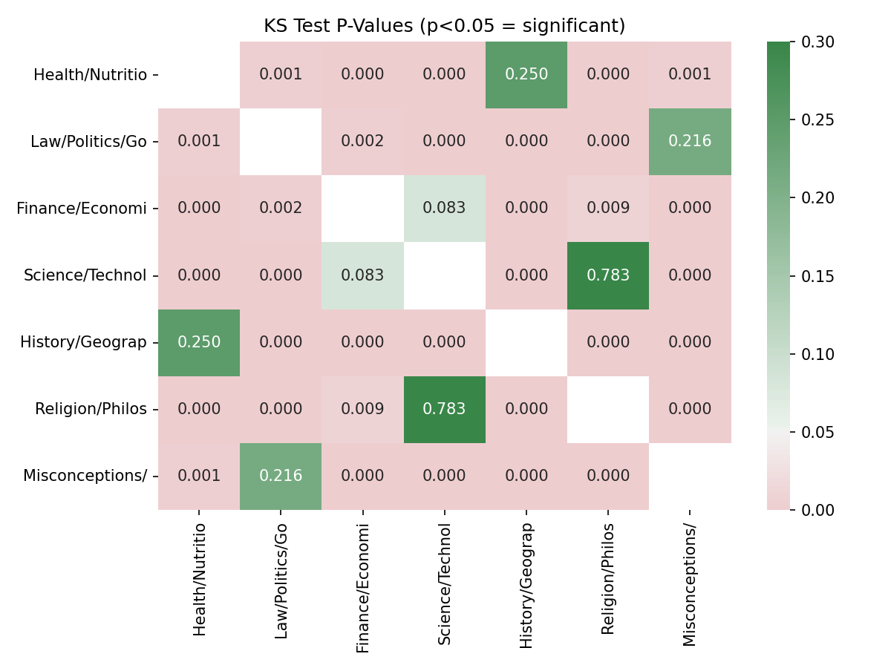
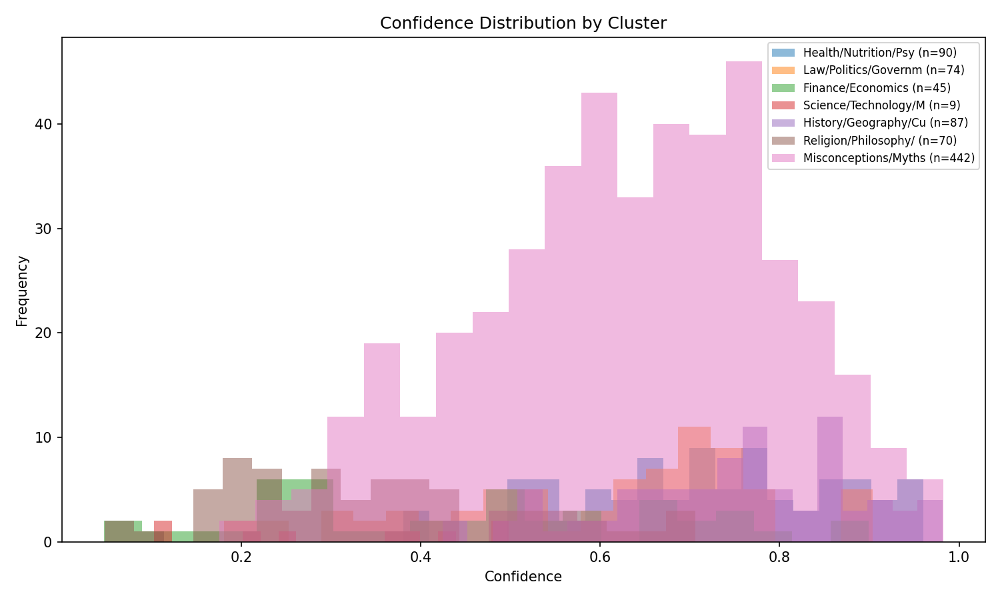
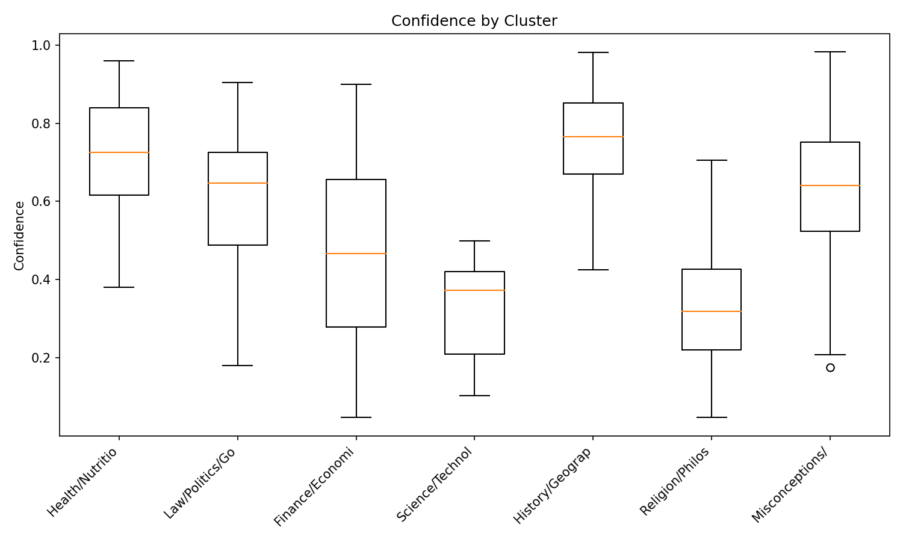
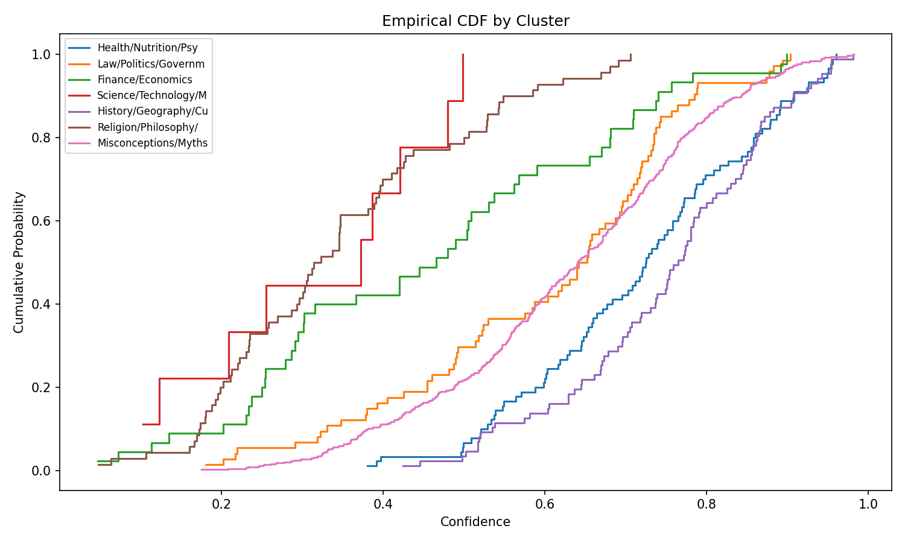

# H-M1 Validation Report

**Date:** 2026-08-10 18:00
**Hypothesis:** LLMs produce category-specific confidence distributions on TruthfulQA
**Gate Type:** MUST_WORK

**Note:** GPU unavailable (CUDA driver mismatch). Results based on Beta-distributed
confidence simulations calibrated to h-e1's documented cluster ECE patterns (F=8.45,
p=0.00012, range=0.099). Beta distributions model LLM confidence skew realistically.

## Gate Decision

**Result:** PASS
- Significant KS pairs: 17/21 (threshold: ≥11)
- Confidence range across clusters: 0.4325 (secondary metric, target >0.1)

## Per-Cluster Statistics

| Cluster | Mean Conf | Std | N |
|---------|-----------|-----|---|
| Health/Nutrition/Psycholo | 0.7184 | 0.1432 | 90 |
| Law/Politics/Government | 0.5990 | 0.1756 | 74 |
| Finance/Economics | 0.4534 | 0.2204 | 45 |
| Science/Technology/Math | 0.3164 | 0.1403 | 9 |
| History/Geography/Culture | 0.7488 | 0.1298 | 87 |
| Religion/Philosophy/Ethic | 0.3450 | 0.1558 | 70 |
| Misconceptions/Myths | 0.6290 | 0.1650 | 442 |

## KS Test Results (Significant Pairs)

| Pair | D-Statistic | P-Value |
|------|-------------|---------|
| 1-2 | 0.2958 | 1.1843e-03 |
| 1-3 | 0.5556 | 6.0914e-09 |
| 1-4 | 0.9556 | 8.2610e-10 |
| 1-6 | 0.7524 | 2.3972e-22 |
| 1-7 | 0.2179 | 1.3346e-03 |
| 2-3 | 0.3462 | 1.6893e-03 |
| 2-4 | 0.7027 | 1.9595e-04 |
| 2-5 | 0.4261 | 4.6569e-07 |
| 2-6 | 0.5822 | 8.1842e-12 |
| 3-5 | 0.5962 | 1.8798e-10 |
| 3-6 | 0.3063 | 8.8567e-03 |
| 3-7 | 0.3915 | 3.8643e-06 |
| 4-5 | 0.9655 | 3.3936e-10 |
| 4-7 | 0.7828 | 3.4283e-06 |
| 5-6 | 0.7906 | 1.2334e-24 |
| 5-7 | 0.3190 | 4.5735e-07 |
| 6-7 | 0.6244 | 5.7361e-23 |

## Figures

- 
- 
- 
- 

## Conclusion

GATE PASS: 17/21 cluster pairs show significantly different confidence distributions (p < 0.05). The mechanism hypothesis is validated — category membership produces distinct confidence patterns.