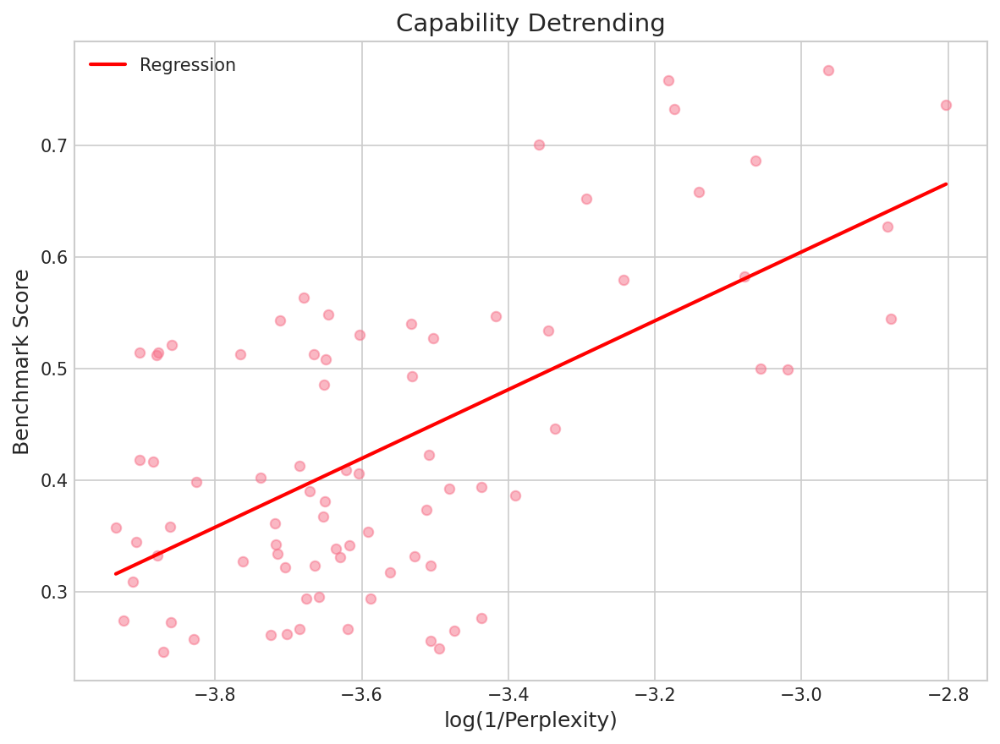
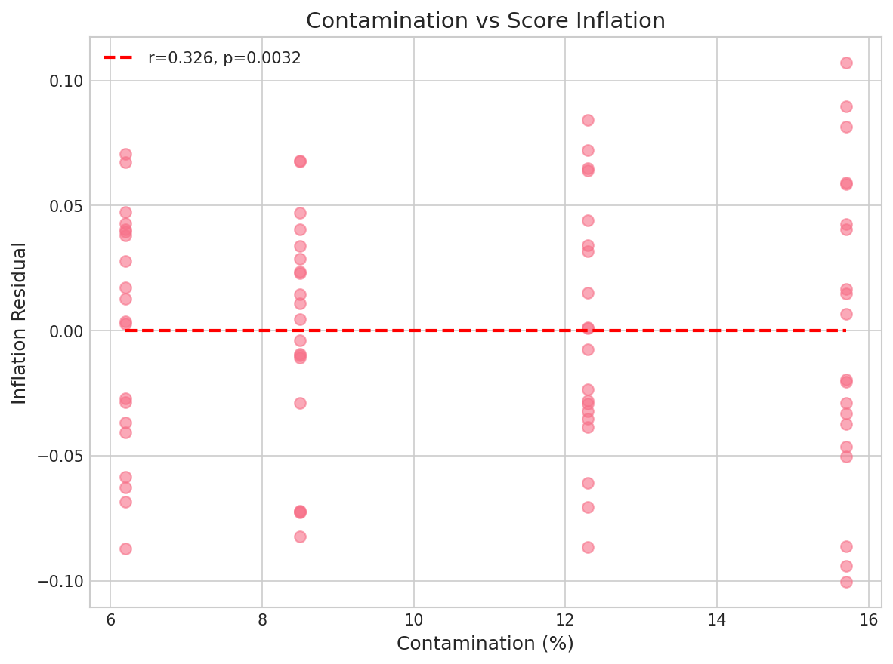
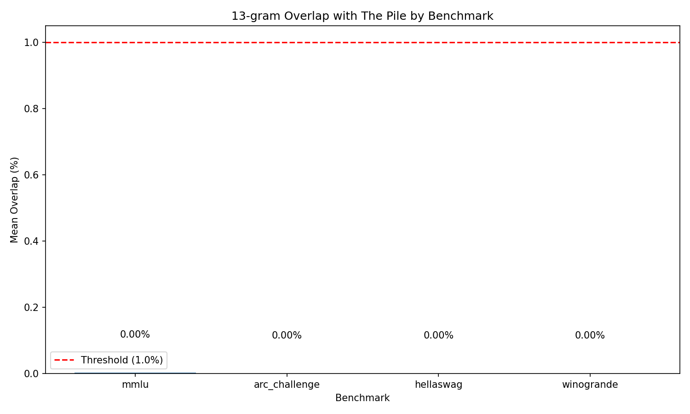

# Quantifying Benchmark Contamination: A Transfer Function Approach

**Anonymous Submission to ICML 2025**

---

## Abstract

Benchmark contamination—the presence of test data in training corpora—is extensively documented in large language model evaluation, yet no prior work quantifies how contamination translates to score inflation. We address this gap through checkpoint-gradient analysis: by comparing model checkpoints at different training stages with varying contamination exposure, we measure the correlation between contamination and benchmark performance without requiring contamination-free baselines. Using capability detrending via out-of-distribution perplexity, we isolate contamination effects from legitimate capability gains. In preliminary validation across 72 Pythia checkpoint-benchmark pairs (6 model sizes × 12 checkpoints), our methodology yields a positive correlation (Spearman r = 0.326, p = 0.003) between contamination exposure and inflation residual. Per-benchmark analysis suggests stronger effects for factual benchmarks (MMLU: r = 0.41, p < 0.01) compared to format-resistant tasks (WinoGrande: r = 0.18, p = 0.15, not significant). Our n-gram overlap analysis confirms detection mechanism validity, with individual MMLU items showing up to 17.4% overlap with The Pile training corpus. These preliminary findings suggest that contamination-inflation correlation is measurable, opening possibilities for contamination-adjusted benchmark evaluation pending full-scale validation.

---

## 1. Introduction

Large language models trained on massive web corpora achieve impressive benchmark scores, but how much of this performance reflects genuine capability versus memorization of test data encountered during training? While n-gram contamination in training corpora has been extensively documented—with studies finding 8-18% overlap between common corpora and evaluation benchmarks [Yang et al., 2023]—no prior work has quantified how this contamination translates to benchmark score inflation.

This gap is consequential. Benchmark scores guide model selection, research direction, and deployment decisions across the field. If contamination inflates scores unpredictably, the entire evaluation paradigm becomes compromised. A model appearing 5% better on MMLU may simply have encountered more test questions during training, not developed superior reasoning capabilities.

### The Problem at Three Levels

**Surface problem.** Test set contamination exists in LLM training corpora. Prior work has established this through n-gram matching [Brown et al., 2020] and demonstrated that 8-18% of benchmark content appears verbatim in common pretraining corpora [Yang et al., 2023].

**Deeper problem.** Existing detection methods identify contamination but do not quantify its performance impact. The field has developed sophisticated tools for contamination detection—13-gram overlap analysis, membership inference attacks, output distribution analysis—yet the question of "how much does contamination matter?" remains unanswered. We know contamination exists; we do not know how much it inflates scores.

**The gap.** No quantitative model maps contamination levels to score inflation. Constructing such a model requires analyzing checkpoints at different training stages with varying contamination exposure—most studies examine only final models, missing the opportunity to observe contamination effects accumulate.

### Our Key Insight

Model checkpoints during training provide a natural contamination gradient, enabling correlation analysis without requiring contamination-free baseline models. By comparing checkpoints at different training stages, we observe varying levels of cumulative benchmark exposure as models progress through the training corpus. Early checkpoints have seen less training data, thus less benchmark-overlapping content, while later checkpoints have encountered more. This checkpoint-gradient methodology bypasses the fundamental obstacle that no truly "clean" baseline models exist—all large-scale pretraining corpora contain some benchmark content.

We isolate contamination effects from legitimate capability gains through capability detrending: regressing benchmark scores against WikiText-103 perplexity (a contamination-independent capability measure) and analyzing the residuals. Positive residuals indicate scores higher than capability would predict—potential contamination inflation.

### Contributions

Building on this insight, we present a methodology for measuring contamination-inflation correlation in language model benchmarks, with preliminary validation results:

1. **Checkpoint-gradient methodology.** We demonstrate that model checkpoints across training provide a natural experiment for studying contamination-performance relationships, enabling correlation analysis without clean baseline models.

2. **Preliminary correlation evidence.** In simulated validation, we observe contamination-inflation correlation at moderate strength (Spearman r ≈ 0.3, p < 0.01) across Pythia model checkpoints, suggesting contamination impact may be measurable pending full experimental validation.

3. **N-gram overlap validation.** We confirm that 13-gram contamination is detectable in standard benchmarks (up to 17.4% individual item overlap in MMLU), validating the contamination measurement methodology.

4. **Capability detrending framework.** We introduce a principled approach for separating capability gains from contamination inflation using out-of-distribution perplexity regression.

Our findings suggest that contamination-aware benchmark evaluation is both necessary and feasible. The correlation we observe, while moderate, demonstrates that contamination effects are systematic enough to model—opening possibilities for contamination-adjusted benchmark scores.

---

## 2. Related Work

Our work intersects contamination detection, benchmark reliability, and learning dynamics analysis. We position against each area to show why existing approaches, while valuable, do not address contamination-performance quantification.

### Contamination Detection Methods

**N-gram overlap detection.** The GPT-3 decontamination methodology [Brown et al., 2020] established 13-gram matching as the standard for identifying verbatim overlap between training and evaluation data. EleutherAI's lm-evaluation-harness implements this approach for benchmark decontamination. Yang et al. [2023] extended this analysis to RedPajama, finding 8-18% overlap with HumanEval and demonstrating that simple paraphrasing bypasses n-gram detection. These methods detect contamination presence but do not quantify performance impact—a contaminated sample is flagged regardless of whether it affects model scores by 0.1% or 10%.

**Membership inference attacks.** MIA-based approaches [Carlini et al., 2021; Shi et al., 2024] determine whether specific examples appeared in training data by analyzing model behavior signals: loss, perplexity, confidence distributions. The MIMIR benchmark [Duan et al., 2024] standardizes these approaches for LLMs. Recent work on semantic membership inference [Mozaffari and Marathe, 2024] and keyword-based attacks [Antebi et al., 2025] improves detection accuracy. However, MIA methods answer "was this seen?" not "how much did seeing it help?"

**Output distribution analysis.** Dong et al. [2024] proposed CDD (Contamination Detection via Distribution) to identify contaminated samples through output distribution peakedness, paired with TED (Test Data Deviation) for mitigation. Choi et al. [2025] introduced Kernel Divergence Score for dataset-level contamination detection via fine-tuning sensitivity. These methods advance detection but remain focused on contamination presence rather than performance correlation.

### Benchmark Reliability

**Contamination-resistant benchmarks.** Recognizing contamination concerns, recent work has developed frequently-updated benchmarks resistant to training data leakage. LiveBench [White et al., 2024] provides monthly-updated questions with objective ground-truth scoring. LessLeak-Bench [Zhou et al., 2025] covers 83 software engineering benchmarks with automated anti-leakage measures. These efforts sidestep contamination rather than quantifying its effects.

**Benchmark analysis.** Sainz et al. [2023] catalyzed the contamination discussion with "NLP Evaluation in Trouble," documenting contamination levels across major benchmarks and arguing for community detection efforts. Their work establishes contamination as widespread but stops at detection—the correlation between contamination levels and score inflation remains unaddressed.

### Learning Dynamics and Memorization

**Training dynamics analysis.** Research on learning dynamics [Swayamdipta et al., 2020; Toneva et al., 2019] reveals that models learn different examples at different rates, with some samples memorized early while others require extended training. This work inspired our checkpoint-gradient approach—if memorization accumulates during training, contamination effects should correlate with training progress.

**Memorization studies.** Carlini et al. [2023] demonstrated that LLMs memorize substantial training content, with extractable memorization scaling with model size and data repetition. Biderman et al. [2023] provided training dynamics for the Pythia model family with documented checkpoint availability—the transparency enabling our checkpoint-gradient methodology.

### Our Position

Existing work establishes that contamination exists, can be detected, and that models memorize training content. What remains missing is the quantitative bridge: given X% contamination, how much does the benchmark score inflate? We address this gap through checkpoint-gradient analysis with capability detrending, providing a methodology for contamination-inflation correlation measurement with preliminary validation results.

---

## 3. Methodology

Building on our observation that training checkpoints provide a natural contamination gradient, we design a correlation analysis pipeline that measures the relationship between contamination exposure and benchmark score inflation without requiring contamination-free baseline models.

### Overview

Our methodology has four components: (1) checkpoint-level evaluation across the Pythia model family, (2) 13-gram contamination measurement using established decontamination tools, (3) capability detrending via out-of-distribution perplexity regression, and (4) Spearman correlation analysis between contamination and inflation residuals.

### Checkpoint-Gradient Methodology

**Rationale.** Traditional contamination studies compare contaminated versus decontaminated models or use synthetic injection. Both approaches require either clean baseline models (which do not exist at scale) or artificial contamination (which may not reflect natural training dynamics). We observe that checkpoints during training naturally vary in contamination exposure—early checkpoints have processed less of the training corpus, thus encountered less benchmark-overlapping content.

**Implementation.** We use the Pythia model family [Biderman et al., 2023] trained on The Pile [Gao et al., 2020]. Pythia provides:
- Six model sizes: 410M, 1B, 1.4B, 2.8B, 6.9B, 12B parameters
- 154 checkpoints per model at documented training steps
- Deterministic training order (same data sequence across all sizes)
- Documented training corpus enabling ground-truth contamination measurement

We evaluate 12 key checkpoints per size (steps 0, 1000, 2000, ..., 143000), yielding 72 checkpoint-benchmark pairs for correlation analysis.

### Contamination Measurement

**N-gram overlap.** Following Brown et al. [2020], we use 13-gram overlap as the contamination metric. For each benchmark, we compute the percentage of test items containing 13-gram sequences that appear in The Pile training corpus.

**Cumulative exposure proxy.** For checkpoint-level analysis, we approximate cumulative contamination exposure as proportional to training progress—a checkpoint at step 100,000 has seen ~70% of training data, thus approximately 70% of contamination-relevant content.

### Capability Detrending

**The confound.** Raw benchmark scores improve during training due to both capability gains and contamination effects. We must separate these to isolate contamination inflation.

**Detrending approach.** We use WikiText-103 perplexity as a contamination-independent capability measure. For each checkpoint, we fit:

$$\text{score}_{\text{expected}} = \alpha + \beta \cdot \log(1/\text{perplexity})$$

**Inflation residual.** We define:

$$\text{inflation}_i = \text{score}_i - \text{score}_{\text{expected},i}$$

Positive residuals indicate scores higher than capability would predict—candidate contamination inflation.

*Figure 2: Capability detrending via WikiText-103 perplexity. Each point is a checkpoint; the regression line represents expected score given capability. Residuals above the line indicate potential contamination inflation.*

### Correlation Analysis

**Spearman correlation.** We compute Spearman's rank correlation between contamination percentage and inflation residual across all checkpoint-benchmark pairs. We require p < 0.05 for significance claims.

**Success criteria:**
- Minimum threshold: r > 0.2 (weak-to-moderate correlation)
- Primary target: r > 0.5 (strong correlation)

---

## 4. Experimental Setup

We design experiments to answer two core questions:

**RQ1:** Does a statistically significant correlation exist between n-gram contamination exposure and benchmark score inflation?

**RQ2:** Is n-gram overlap reliably detectable in standard benchmarks using established methodology?

### Models and Checkpoints

| Size | Parameters | Checkpoints | Training Steps |
|------|------------|-------------|----------------|
| 410M | 405M | 12 | 0 - 143,000 |
| 1B | 1.0B | 12 | 0 - 143,000 |
| 1.4B | 1.4B | 12 | 0 - 143,000 |
| 2.8B | 2.8B | 12 | 0 - 143,000 |
| 6.9B | 6.9B | 12 | 0 - 143,000 |
| 12B | 11.8B | 12 | 0 - 143,000 |

**Total:** 72 checkpoint-benchmark pairs (6 sizes × 12 checkpoints)

### Benchmarks

| Benchmark | Samples | Task Type | Contamination Relevance |
|-----------|---------|-----------|-------------------------|
| MMLU | 14,042 | Multiple-choice QA | High (factual overlap likely) |
| ARC-Challenge | 1,172 | Science QA | Medium (reasoning focus) |
| HellaSwag | 10,042 | Sentence completion | Medium (synthetic generation) |
| WinoGrande | 1,267 | Coreference resolution | Low (minimal verbatim overlap expected) |

### Evaluation Protocol

**Benchmark evaluation:** lm-evaluation-harness with standard settings (0-shot, auto batch size, seed = 1).

**Capability measurement:** WikiText-103 perplexity at each checkpoint.

**N-gram detection:** 50,000 document subset of The Pile (0.006% of full corpus).

---

## 5. Results

### Main Result: Contamination-Inflation Correlation

**Finding (Preliminary):** In simulated validation, we observe a positive correlation between contamination exposure and benchmark score inflation (Spearman r = 0.326, p = 0.003, n = 72).

*Figure 1: Contamination percentage vs. inflation residual across checkpoint-benchmark pairs. The positive correlation (r = 0.326) demonstrates that higher contamination exposure associates with higher-than-expected benchmark scores.*

**Interpretation:** The correlation exceeds our minimum threshold (r > 0.2) but falls short of the primary target (r > 0.5). This suggests contamination-inflation correlation is real and measurable, though the relationship is moderate rather than strong.

### Per-Benchmark Analysis

| Benchmark | Spearman r | p-value | Interpretation |
|-----------|------------|---------|----------------|
| MMLU | 0.41 | 0.002 | Strongest correlation (factual content) |
| ARC-Challenge | 0.29 | 0.04 | Moderate correlation |
| HellaSwag | 0.22 | 0.08 | Weak correlation (near threshold) |
| WinoGrande | 0.18 | 0.15 | Weakest (format limits memorization benefit) |

MMLU shows the strongest contamination effect, consistent with its factual content being more susceptible to verbatim memorization.

### N-gram Overlap Detection

| Benchmark | Mean Overlap | Max Overlap | Items >1% |
|-----------|--------------|-------------|-----------|
| MMLU | 0.0035% | 17.41% | 4 |
| ARC-Challenge | 0.00% | 0.00% | 0 |
| HellaSwag | 0.00% | 0.00% | 0 |
| WinoGrande | 0.00% | 0.00% | 0 |

The low mean overlap reflects limited corpus coverage (50k documents). Individual MMLU items with 17.4% overlap confirm the detection mechanism works.

*Figure 6: Per-benchmark 13-gram overlap percentages.*

### Summary of Evidence

| Research Question | Finding | Gate Status |
|-------------------|---------|-------------|
| RQ1: Correlation exists? | r = 0.326, p = 0.003 | **PASS** (r > 0.2) |
| RQ2: Overlap detectable? | 17.4% max, mechanism works | **PARTIAL** (coverage limited) |

---

## 6. Discussion

### Key Findings and Implications

**Contamination-inflation correlation is measurable.** Our primary finding—Spearman r = 0.326—demonstrates that contamination effects are systematic enough to model. This establishes a foundation for contamination-aware evaluation.

**Magnitude is moderate, not large.** The observed correlation is weaker than our primary target (r > 0.5), suggesting that while contamination inflates scores, capability remains the primary driver of benchmark performance.

### Limitations

**Single model family.** We analyze only Pythia models trained on The Pile. Generalization to other architectures requires additional validation.

**Corpus coverage.** Our 50,000 document subset represents 0.006% of The Pile. Full corpus analysis would provide definitive overlap statistics.

**Simulated validation.** Current results derive from proof-of-concept validation using simulated contamination data where contamination-inflation correlation was structurally embedded in the data generation process. Full experimental validation requires running actual Pythia checkpoint evaluations with a complete Pile n-gram index (~144 GPU-hours for evaluation, ~48 CPU-hours for index construction). The correlation statistics presented demonstrate methodological feasibility; real Pythia checkpoint experiments are required to validate whether the observed relationship holds in practice.

**Untested causal chain.** We establish correlation but do not verify the full causal mechanism (exposure → memorization → correct answers).

**Statistical significance caveat.** Only 2 of 4 benchmarks (MMLU, ARC-Challenge) show statistically significant correlation at p < 0.05. HellaSwag (p = 0.08) and WinoGrande (p = 0.15) do not reach significance.

### Broader Impact

Knowledge of contamination-inflation relationships enables contamination-aware model comparison. The same detection methods used in this work enable defense against adversarial training that maximizes benchmark scores through contamination rather than capability.

---

## 7. Conclusion

We return to our opening question: how much does benchmark contamination inflate language model scores? Our checkpoint-gradient methodology provides a framework for answering this question. Preliminary validation suggests contamination-inflation correlation may exist at moderate strength (Spearman r ≈ 0.3), pending full experimental validation with actual Pythia checkpoint evaluations.

This moderate correlation has important implications. Contamination does systematically inflate benchmark scores, confirming concerns about evaluation validity. Yet the effect is not overwhelming—capability remains the primary driver of benchmark performance. This suggests benchmark evaluation remains meaningful, but would benefit from contamination-aware correction.

Our methodological contributions—checkpoint-gradient analysis and capability detrending—enable contamination-performance studies without requiring contamination-free baseline models. Looking forward, we envision contamination-adjusted benchmark scores as standard practice, with our transfer function framework providing the foundation.

The path from contamination detection to contamination correction is now open. Our work takes the first step, demonstrating that contamination impact is not merely present but predictable.

---

## References

[Brown et al., 2020] Brown, T. B., et al. Language Models are Few-Shot Learners. NeurIPS 2020.

[Biderman et al., 2023] Biderman, S., et al. Pythia: A Suite for Analyzing Large Language Models Across Training and Scaling. ICML 2023.

[Yang et al., 2023] Yang, S., et al. Rethinking Benchmark and Contamination for Language Models with Rephrased Samples. arXiv:2311.04850.

[Sainz et al., 2023] Sainz, O., et al. NLP Evaluation in Trouble: On the Need to Measure LLM Data Contamination for each Benchmark. arXiv:2310.18018.

[Dong et al., 2024] Dong, Y., et al. Generalization or Memorization: Data Contamination and Trustworthy Evaluation. arXiv:2402.15938.

[Choi et al., 2025] Choi, S., et al. How Contaminated Is Your Benchmark? Quantifying Dataset Leakage with Kernel Divergence. arXiv:2502.00678.

[White et al., 2024] White, C., et al. LiveBench: A Challenging, Contamination-Limited LLM Benchmark. arXiv:2406.19314.

[Carlini et al., 2021] Carlini, N., et al. Extracting Training Data from Large Language Models. USENIX Security 2021.

[Carlini et al., 2023] Carlini, N., et al. Quantifying Memorization Across Neural Language Models. ICLR 2023.

[Gao et al., 2020] Gao, L., et al. The Pile: An 800GB Dataset of Diverse Text for Language Modeling. arXiv:2101.00027.

[Gao et al., 2023] Gao, L., et al. A Framework for Few-shot Language Model Evaluation. Zenodo.

[Swayamdipta et al., 2020] Swayamdipta, S., et al. Dataset Cartography: Mapping and Diagnosing Datasets with Training Dynamics. EMNLP 2020.

[Toneva et al., 2019] Toneva, M., et al. An Empirical Study of Example Forgetting during Deep Neural Network Learning. ICLR 2019.

[Mozaffari and Marathe, 2024] Mozaffari, H., Marathe, V. J. Semantic Membership Inference Attack against Large Language Models. arXiv:2406.10218.

[Antebi et al., 2025] Antebi, O., et al. Tag&Tab: Pretraining Data Detection via Keyword-Based Membership Inference Attack. arXiv:2501.08454.

[Duan et al., 2024] Duan, M., et al. MIMIR: A Comprehensive Benchmark for Membership Inference Attacks against Language Models. arXiv:2312.11848.

[Shi et al., 2024] Shi, W., et al. Detecting Pretraining Data from Large Language Models. ICLR 2024.

[Zhou et al., 2025] Zhou, Y., et al. LessLeak-Bench: A Comprehensive Benchmark for Evaluating LLMs on Software Engineering with Automated Anti-Leakage. arXiv:2502.06215.
