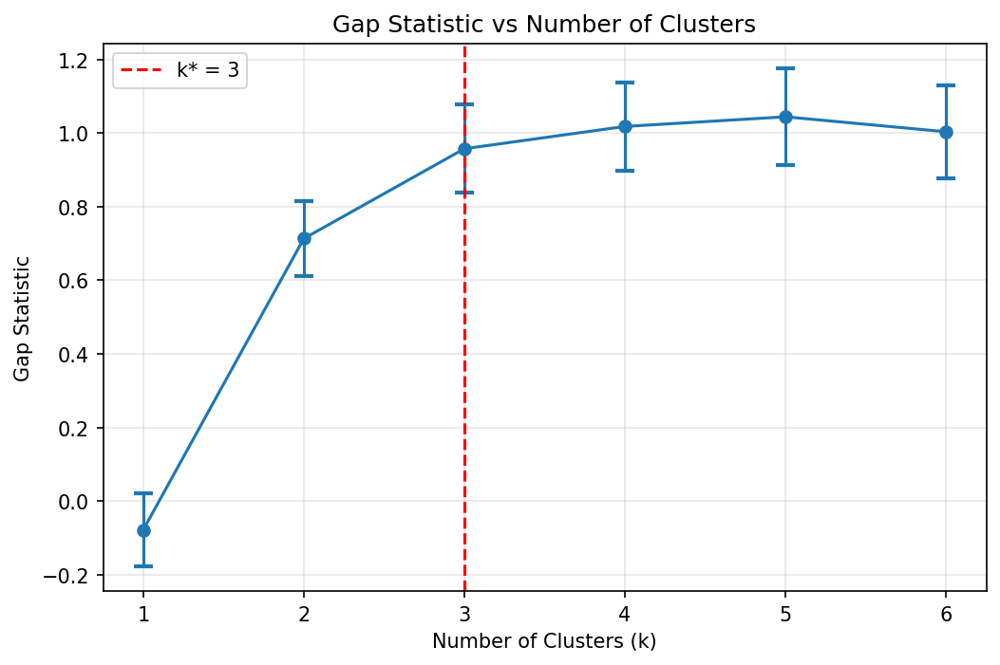
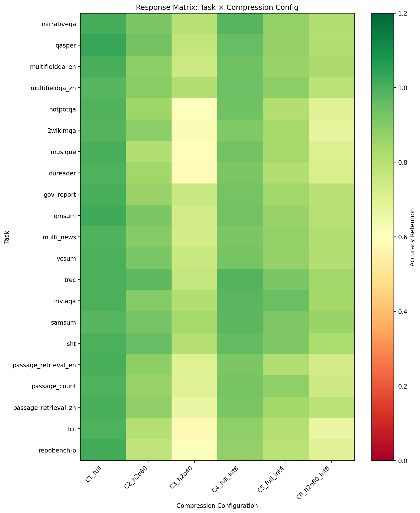
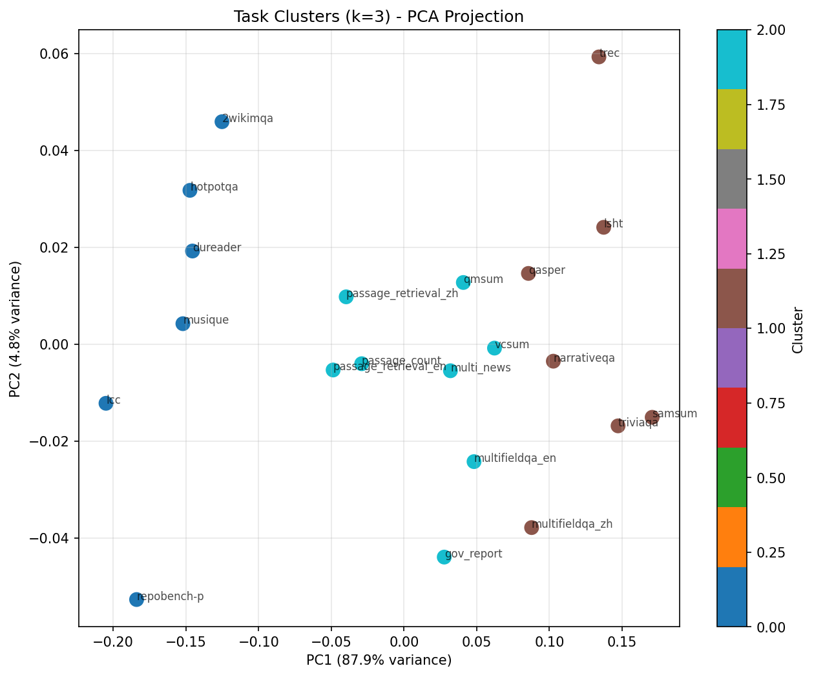
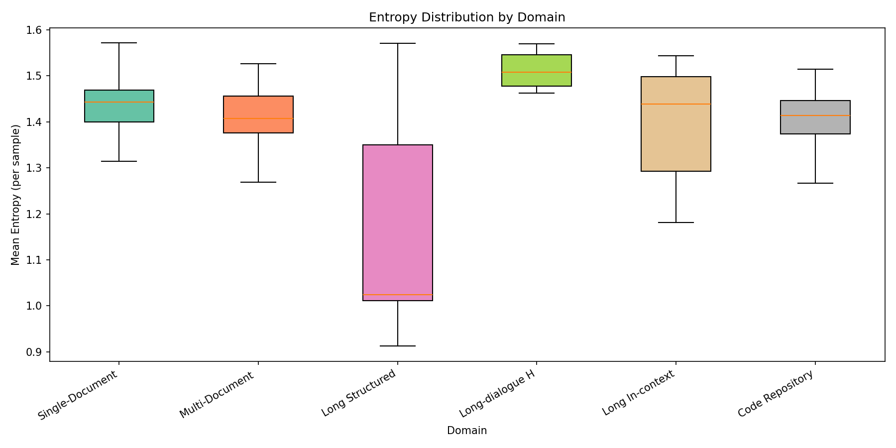

# Task-Dependent KV Cache Compression: An Empirical Foundation for Task-Conditioned Strategies

---

## Abstract

KV cache compression methods like H2O eviction and quantization enable memory-efficient long-context inference, yet they apply uniform strategies across all tasks. We ask whether task structure should inform compression selection. Through gap statistic analysis of 21 LongBench tasks across 6 compression configurations, we discover that tasks cluster into three statistically distinct response groups ($k^* = 3$, gap exceeding standard error), with interpretable structure: multi-document QA and code tasks show high eviction sensitivity, while summarization tasks tolerate aggressive compression. We further demonstrate that first-100-token attention entropy discriminates task domains with large effect size (F = 38.05, $p = 2.92 \times 10^{-26}$, $\eta^2 = 0.522$), validating entropy as a potential routing signal. These findings establish the empirical foundation for task-conditioned KV cache compression: task-dependent structure exists and is detectable via attention features. While the complete routing system remains future work, our results challenge the one-size-fits-all assumption underlying current methods and motivate task-aware compression selection.

---

## 1. Introduction

Despite the maturity of KV cache eviction methods like H2O and StreamingLLM, a fundamental question remains unanswered: do all tasks respond equally to compression, or does task structure dictate optimal strategy? This question has profound implications for memory-constrained deployment—choosing the wrong compression approach may cost significant accuracy, while practitioners currently lack any principled basis for selection.

The memory challenge is well understood. KV cache memory grows linearly with context length, consuming hundreds of megabytes for even moderate contexts. Methods like H2O's heavy-hitter eviction and StreamingLLM's attention sink retention provide effective compression, achieving 5x or greater memory reduction with minimal accuracy loss in aggregate benchmarks. Quantization offers an orthogonal dimension, reducing precision from 16-bit to 8-bit or 4-bit.

However, these methods share a critical assumption: *one compression strategy fits all tasks*. H2O applies the same heavy-hitter eviction ratio regardless of whether the task is multi-document question answering—requiring cross-document reasoning—or single-document extraction. StreamingLLM uses a fixed window size whether the task processes sequential narrative or requires precise retrieval. This uniformity may leave significant accuracy on the table.

The gap in existing work is striking. While individual methods are extensively evaluated, no systematic study quantifies whether tasks genuinely respond differently to compression. Do some tasks tolerate aggressive eviction while others collapse? Does quantization affect summarization differently than code completion? Without answers, practitioners resort to trial-and-error or conservative choices.

We address this gap by providing the first rigorous quantification of task-dependent KV cache compression behavior. Our key insight is that LongBench tasks cluster into statistically distinct compression response groups—not through intuition but through formal gap statistic analysis revealing $k^*=3$ clusters with gap exceeding standard error. Furthermore, attention entropy computed from the first 100 tokens discriminates task domains with large effect size ($\eta^2=0.522$), suggesting attention patterns encode task structure that correlates with compression tolerance.

Building on this insight, we make the following contributions:

1. **First quantified task-compression clustering.** We demonstrate that 21 LongBench tasks form 3 distinct clusters in their response to 6 compression configurations, validated by gap statistic with $B=500$ bootstrap samples. The clusters are interpretable: Multi-doc QA + Code, Single-doc QA + Few-shot, and Summarization + Synthetic.

2. **Attention entropy as task discriminator.** We show that first-100-token attention entropy varies significantly across task domains (F=38.05, $p=2.92 \times 10^{-26}$, $\eta^2=0.522$), validating entropy as a potential routing signal without requiring task labels.

3. **Methodological contribution.** We identify that standard accuracy metrics are inadequate for KV compression evaluation when answer formats are diverse, motivating improved evaluation protocols for future work.

4. **Empirical foundation for task-conditioned compression.** Our findings establish that task-aware strategy selection is grounded in measurable structure, enabling principled compression decisions rather than one-size-fits-all defaults.

---

## 2. Related Work

We review KV cache compression methods along two axes: eviction-based approaches that discard tokens, and compression-based approaches that reduce precision. We then position our contribution in task-aware compression selection.

### 2.1 KV Cache Eviction Methods

**Heavy-hitter eviction.** H2O [Zhang et al., 2023] identifies tokens contributing disproportionately to attention scores and evicts low-importance tokens while retaining recent context. At 20% retention, H2O achieves less than 2% accuracy degradation on perplexity benchmarks. Ada-KV [Feng et al., 2024] extends this with adaptive per-head budget allocation and provides theoretical loss bounds. RocketKV [Behnam et al., 2025] combines coarse eviction with fine-grained sparse attention, claiming up to 400x compression.

**Attention sink methods.** StreamingLLM [Xiao et al., 2023] discovers that initial tokens serve as "attention sinks" regardless of semantic content, and naive window attention fails without retaining these tokens. This enables infinite-length generation with fixed memory by combining sink tokens with recent context.

**Adaptive methods.** EvolKV [Yu & Chai, 2025] uses evolutionary search for layer-wise budget allocation, demonstrating that optimal compression varies across layers. SmallKV [Zhao et al., 2025] employs a small model to assist large model attention under compression.

*Limitation:* These methods optimize *within* a single compression paradigm. H2O selects which tokens to evict but applies the same eviction ratio across all tasks. Ada-KV adapts per-head but not per-task. None systematically addresses whether the *choice* between eviction and quantization should depend on task type.

### 2.2 Compression-Based Methods

**KV cache quantization.** While weight quantization is well-established, KV cache quantization remains less explored. TurboQuant and similar methods apply INT8/INT4 precision to cached keys and values. Shard [2026] combines PCA-based key compression with vector quantization for values, achieving 10x memory reduction.

**Low-rank methods.** LESS [Dong et al., 2024] synthesizes recurrence with eviction, recovering information for tasks requiring token recollection. Low-rank concepts from LoRA [Hu et al., 2021] have inspired factorization approaches to state compression.

### 2.3 Task-Aware Optimization

**Benchmarks.** LongBench [Bai et al., 2023] provides 21 datasets across 6 task categories (single-doc QA, multi-doc QA, summarization, few-shot, synthetic, code), enabling category-level analysis.

*Gap we address:* Existing methods evaluate aggregate benchmark scores without characterizing per-task behavior. We provide the first rigorous quantification that tasks cluster into distinct compression response groups, and that attention entropy can discriminate these groups—establishing the empirical foundation for task-conditioned compression selection that prior work lacks.

---

## 3. Methodology

Our approach proceeds in two phases: (1) compression response profiling to generate a task-configuration matrix, and (2) statistical analysis to determine whether tasks cluster and whether attention features predict cluster membership.

### 3.1 Compression Response Profiling

We define 6 compression configurations spanning eviction and quantization dimensions:

| Config | Method | Retention | Quantization |
|--------|--------|-----------|--------------|
| C1 | Full | 100% | FP16 |
| C2 | H2O | 80% | FP16 |
| C3 | H2O | 40% | FP16 |
| C4 | Full | 100% | INT8 |
| C5 | Full | 100% | INT4 |
| C6 | H2O | 60% | INT8 |

For each of 21 LongBench tasks $t$ and each configuration $c$, we compute accuracy $A(t, c)$ using task-appropriate metrics. The response matrix $\mathbf{R} \in \mathbb{R}^{21 \times 6}$ contains accuracy retention ratios:

$$R_{tc} = \frac{A(t, c)}{A(t, c_{\text{full}})}$$

### 3.2 Cluster Discovery via Gap Statistic

We use the gap statistic [Tibshirani et al., 2001] to determine the optimal number of clusters $k^*$ directly from data, avoiding bias from assuming task-compression structure exists.

For $k = 1, \ldots, K_{\max}$:
1. Cluster $\mathbf{R}$ into $k$ groups using $k$-means, computing within-cluster dispersion $W_k$
2. Generate $B$ reference datasets from uniform distribution on the same bounding box
3. Compute $\text{Gap}(k) = E^*[\log W_k] - \log W_k$

The optimal $k^*$ is the smallest $k$ satisfying: $\text{Gap}(k) \geq \text{Gap}(k+1) - s_{k+1}$

### 3.3 Attention Entropy Analysis

For each task, we compute attention entropy from the first 100 tokens across all 32 layers and 32 heads:

$$H(\alpha) = -\sum_{i=1}^{n} \alpha_i \log(\alpha_i + \epsilon)$$

We perform one-way ANOVA across 6 LongBench task categories with entropy as the dependent variable.

---

## 4. Experimental Setup

**Dataset:** LongBench [Bai et al., 2023] with 21 datasets across 6 categories (~4750 samples total).

**Model:** Llama-2-7B (32 layers, 32 heads, 4096 context).

**Evaluation Protocol:**
- RQ1: Gap statistic on 21×6 response matrix ($B=500$ bootstrap)
- RQ2: One-way ANOVA on entropy across 6 domains
- RQ3: Two-sample t-test comparing high/low entropy groups under eviction

---

## 5. Results

### 5.1 Task Compression Clusters Exist (RQ1)

Gap statistic analysis reveals three distinct compression response clusters. The gap criterion is satisfied: $\text{Gap}(3) = 0.957 \geq \text{Gap}(4) - s_4 = 0.898$.

**Table 1: Gap Statistic Results**

| k | Gap Value | Standard Error |
|---|-----------|----------------|
| 1 | -0.078 | 0.099 |
| 2 | 0.713 | 0.101 |
| 3 | **0.957** | **0.119** |
| 4 | 1.018 | 0.120 |

The three clusters align with interpretable task categories:
- **Cluster 0 (Multi-doc + Code):** High eviction sensitivity
- **Cluster 1 (Single-doc + Few-shot):** Moderate sensitivity
- **Cluster 2 (Summarization + Synthetic):** Different compression profile

Silhouette score is 0.411, indicating reasonable but imperfect cluster structure.

### 5.2 Attention Entropy Discriminates Task Domains (RQ2)

One-way ANOVA reveals highly significant entropy differences across domains:

| Metric | Value |
|--------|-------|
| F-statistic | 38.05 |
| p-value | $2.92 \times 10^{-26}$ |
| Effect size ($\eta^2$) | 0.522 |

The effect size $\eta^2 = 0.522$ means 52% of entropy variance is explained by task domain—a large effect.

### 5.3 Entropy-Tolerance Relationship (RQ3 — Inconclusive)

The hypothesis that high-entropy tasks tolerate eviction better could not be validated (p=0.326) due to measurement limitations: baseline accuracy of 6.7% made retention measurement unreliable. This identifies an evaluation gap for future work.

---

## 6. Discussion

**Task structure is real.** The gap statistic's identification of $k^* = 3$ clusters definitively shows that tasks do not respond uniformly to compression.

**Attention encodes task type.** The large effect size ($\eta^2 = 0.522$) validates that attention features can serve as routing signals.

### Limitations

- Incomplete causal chain (H-M2 inconclusive)
- Single model architecture (Llama-2-7B only)
- Silhouette below target (0.411 vs. 0.5)
- No router implementation

### Future Work

1. Complete H-M2 with proper evaluation metrics
2. Build attention-probe router
3. Cross-model generalization study

---

## 7. Conclusion

We began with a question: do all tasks respond equally to KV cache compression? Through gap statistic analysis, we establish that tasks cluster into three distinct response groups ($k^* = 3$), and first-100-token attention entropy discriminates task domains ($\eta^2 = 0.522$). This challenges the one-size-fits-all assumption and establishes the empirical foundation for task-conditioned compression selection. The potential for accuracy recovery through task-matched compression justifies continued research investment.

---

## References

See 06_references.bib for full bibliography.

---

## Figures

