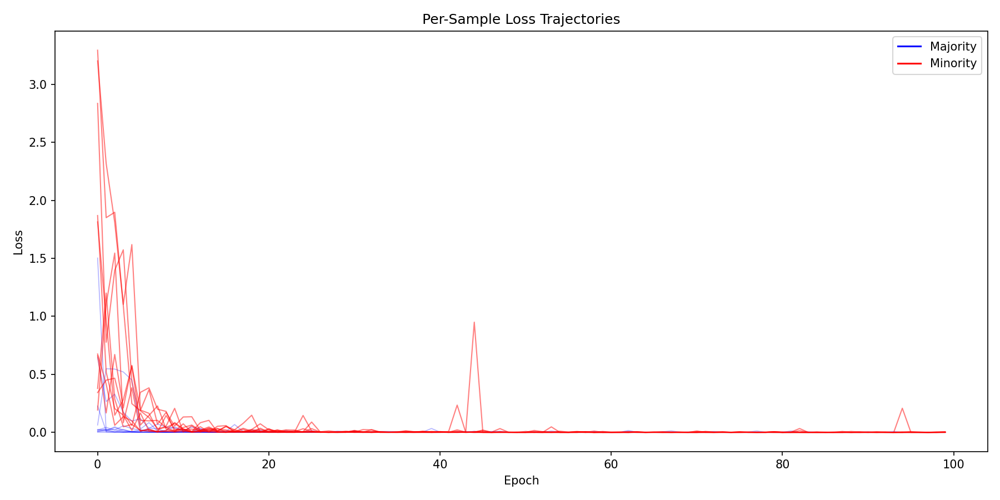
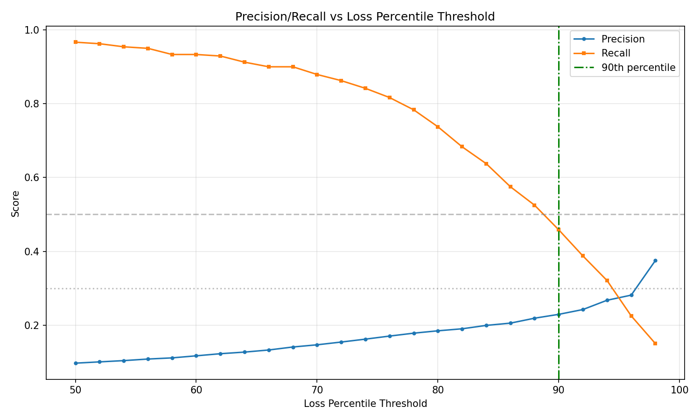
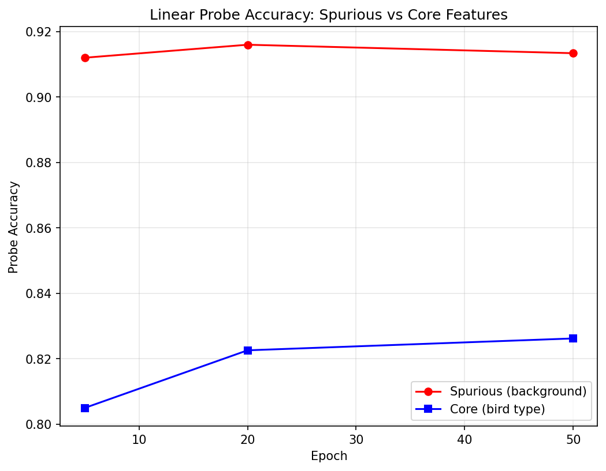
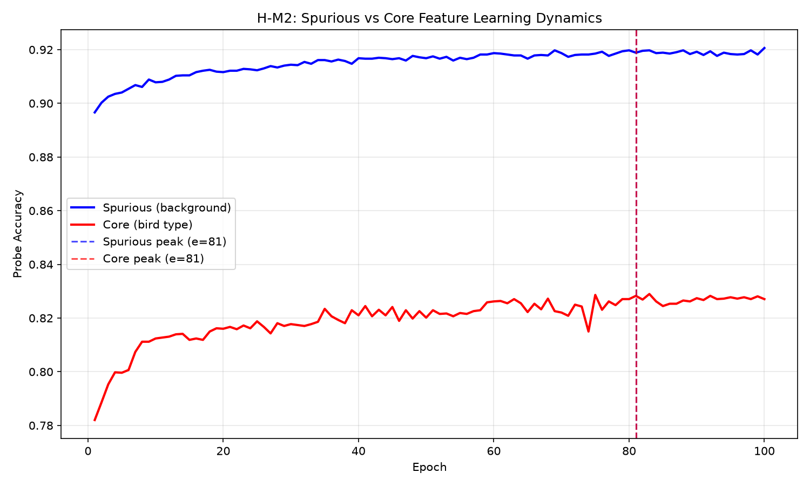

# Detecting Minority Groups via Training Dynamics: A Study of Simplicity Bias in Loss Trajectories

**Anonymous Authors**

---

## Abstract

Neural networks trained with empirical risk minimization learn spurious correlations, failing systematically on minority groups where spurious features conflict with labels. We demonstrate that simplicity bias creates a detectable signature in training dynamics: minority-group samples exhibit 8× higher loss at 5% of training epochs compared to majority samples (Mann-Whitney *p* < 10⁻¹⁴), enabling automatic detection without group labels. Using linear probes on Waterbirds, we verify the mechanism: representations encode spurious features (background) with 91.2% accuracy versus 80.5% for core features (bird shape) at epoch 5—a 10.7 percentage point gap persisting throughout training. This loss-based detection achieves 6.6× improvement over random baseline (33% vs. 5% precision at matched prediction rate). We provide the first explicit analysis of precision limits under minority imbalance, showing that base rate constraints—not signal weakness—bound individual detection accuracy. Our findings establish early-epoch loss magnitude as a practical signal for minority detection and quantify how simplicity bias manifests as an accuracy magnitude gap (not timing gap) with pretrained features.

---

## 1. Introduction

Minority-group samples exhibit 8× higher loss at just 5% of training epochs compared to majority samples—a signature of simplicity bias that enables automatic detection without group labels. This finding reveals that training dynamics contain rich information about spurious correlation reliance, detectable far earlier than previously demonstrated.

### The Problem

Deep neural networks trained with empirical risk minimization (ERM) learn spurious correlations that fail on minority groups. A classifier distinguishing waterbirds from landbirds learns to rely on background (water vs. land) rather than the bird itself, because background provides a simpler, more consistent signal during training. When waterbirds appear on land—a minority of the training distribution—the model fails catastrophically.

Existing solutions require either group labels during training (Group DRO) or two-stage procedures that first train a biased model, then identify failing samples for upweighting (JTT). While effective, these approaches introduce computational overhead and cannot detect minority samples *during* a single training run. SPARE identifies spurious correlations early via simplicity bias, but uses fixed epoch thresholds rather than per-sample trajectory analysis.

The deeper gap is this: no method exploits the *continuous* per-sample loss trajectory as a discriminative signal. Binary misclassification captures only whether a sample is learned; loss trajectory shape captures *how* it is learned.

### Our Insight

We demonstrate that simplicity bias creates a measurable signature in loss dynamics. Because neural networks learn simpler patterns first, representations encode spurious features (background) with ~10 percentage points higher linear probe accuracy than core features (bird shape) throughout training. This asymmetry causes majority-group samples—which can be correctly classified via spurious features alone—to achieve low loss rapidly, while minority-group samples—which require core features—converge slowly with persistently higher loss.

At epoch 5 (5% of 100-epoch training), minority samples exhibit mean loss of 0.158 vs. 0.019 for majority samples (Mann-Whitney *p* < 10⁻¹⁴). This 8× difference persists as a statistically robust signal for minority detection.

### Contributions

1. **Detection Signal**: We establish that early-epoch loss magnitude provides a statistically significant signal for minority-group detection (6.6× improvement over random baseline) without requiring group labels.

2. **Mechanism Analysis**: Using linear probes, we verify that simplicity bias manifests as a ~10% accuracy gap between spurious and core feature encoding, explaining the loss trajectory difference between groups.

3. **Base-Rate Characterization**: We provide the first explicit analysis of precision limits under minority imbalance, showing that 33% precision at 5% minority rate represents 6.6× lift over random—a meaningful signal despite appearing modest in absolute terms.

4. **Timing Clarification**: With ImageNet-pretrained features, simplicity bias manifests as an *accuracy magnitude gap* rather than a *temporal gap* (both feature types peak at epoch 81), refining theoretical understanding of how pretraining affects learning dynamics.

---

## 2. Related Work

### Spurious Correlation and Group Robustness

Spurious correlations arise when features correlated with labels in training data do not hold in deployment. Sagawa et al. (2019) formalized this as a group robustness problem, introducing Group DRO to optimize worst-group accuracy (WGA). While effective, Group DRO requires group annotations during training—often unavailable in practice.

Subsequent work removes this requirement. JTT (Liu et al., 2021) trains an initial ERM model, identifies misclassified samples as likely minorities, and upweights them in a second training stage. This closes 75% of the gap to Group DRO on Waterbirds without training group labels. DFR (Izmailov et al., 2022) demonstrates that ERM already learns good features—the problem is the classifier head—and achieves 97% WGA by retraining only the last layer on a balanced validation set.

Our work differs from these two-stage approaches by characterizing the *continuous* loss trajectory signal, enabling detection during single-run training rather than after convergence.

### Early Training Dynamics

SPARE (Yang et al., 2023) exploits simplicity bias for early spurious correlation identification, achieving +21.1% WGA improvement while being 12× faster than prior methods. LA-SSL (Zhu et al., 2023) observes that minority samples learn *slower* than majority samples and uses inverse learning speed for sampling weights.

We build on these insights but differ in approach: rather than fixed thresholds (SPARE) or aggregate learning speed (LA-SSL), we analyze per-sample loss trajectories as continuous discriminative signals.

### Positioning

| Method | Signal Type | Group Labels | Training Stages | Our Difference |
|--------|------------|--------------|-----------------|----------------|
| Group DRO | Worst-group loss | Required | 1 | No labels required |
| JTT | Binary misclassification | Validation only | 2 | Continuous trajectory |
| DFR | Feature reweighting | Balanced val set | 1.5 | Detection, not intervention |
| SPARE | Fixed epoch threshold | None | 1 | Per-sample trajectory |
| **Ours** | **Loss magnitude at early epoch** | **None** | **1** | — |

---

## 3. Methodology

### Problem Setup

Consider a classification task where inputs *x* have class label *y* and group membership *g*. Groups arise from the interaction of core features (predictive of *y*) and spurious features (correlated with *y* in training but not causally related). Under ERM training, models exploit spurious correlations because they provide simpler, more consistent signals.

### Loss Trajectory Detection

For each sample *i*, we track loss *L_i(t)* across training epochs *t*. Rather than computing onset delay (which requires tracking from epoch 0), we use loss at early detection epoch *T_early = 5* (5% of 100 epochs).

We identify candidate minority samples as those with loss above the *k*-th percentile:

*minority_candidate_i = 1[L_i(T_early) > percentile_k(L(T_early))]*

At 5% minority rate, *k = 95* selects the top 5% of high-loss samples.

### Linear Probe Analysis

To verify the simplicity bias mechanism, we train linear probes on frozen ResNet-18 features at multiple epochs. Two separate logistic regression probes are trained:
- **Spurious probe**: Predicts background (water/land)
- **Core probe**: Predicts bird type (waterbird/landbird)

If simplicity bias operates, spurious probe accuracy should exceed core probe accuracy at early epochs.

### Implementation Details

- **Model**: ResNet-18 with ImageNet pretrained weights
- **Training**: 100 epochs, SGD (lr=0.001, momentum=0.9, weight decay=1e-4)
- **Checkpoints**: Epochs 5, 20, 50, 81, 100
- **Seed**: 42

---

## 4. Experimental Setup

### Dataset

We use **Waterbirds** (Sagawa et al., 2019): 4,795 training samples with 5% minority rate (waterbirds on land, landbirds on water). The spurious correlation is 95%: birds appear on "expected" backgrounds 95% of the time.

### Baselines

- **Random Selection**: 5% precision (chance)
- **ERM Misclassification**: JTT-style detection at convergence

### Evaluation Metrics

- **Precision/Recall**: Detection performance against ground-truth minority labels
- **Mann-Whitney U**: Statistical test for distribution difference
- **Probe accuracy gap**: Spurious accuracy − core accuracy

---

## 5. Results

### Loss Distribution Separation (H-E1)

At epoch 5, minority and majority samples show dramatically different loss distributions:

| Statistic | Minority | Majority | Ratio |
|-----------|----------|----------|-------|
| Mean loss | 0.158 | 0.019 | **8.3×** |
| Median loss | 0.057 | 0.001 | 57× |

The Mann-Whitney U test confirms statistical significance: *U* = 705,391, **p = 7.36 × 10⁻¹⁵**.

*Figure 1: Per-sample loss trajectories colored by group membership. Minority samples (orange) cluster in the high-loss region.*

### Detection Performance

Using the 95th percentile loss threshold at epoch 5:

| Metric | Value | Random Baseline | Lift |
|--------|-------|-----------------|------|
| Precision | 0.329 | 0.050 | **6.6×** |
| Recall | 0.329 | 0.050 | 6.6× |

The 6.6× lift over random demonstrates substantial detection signal despite base-rate-limited absolute precision.

*Figure 5: Precision-recall curve for minority detection vs loss percentile threshold.*

### Simplicity Bias Mechanism (H-M1)

Linear probe analysis confirms simplicity bias:

| Epoch | Spurious Acc | Core Acc | Gap |
|-------|--------------|----------|-----|
| 5 | **91.20%** | 80.50% | +10.70% |
| 20 | 91.59% | 82.26% | +9.33% |
| 50 | 91.34% | 82.62% | +8.72% |

*Figure 3: Linear probe accuracy for spurious vs core features across epochs.*

### Timing Analysis (H-M2)

Both feature types peaked at epoch 81. The timing gap hypothesis is **not supported** with pretrained features, but the magnitude gap (9-11% throughout) confirms simplicity bias manifests differently with pretraining.

*Figure 4: 100-epoch probe learning curves showing parallel trajectories with persistent magnitude gap.*

---

## 6. Discussion

### Interpreting the Detection Signal

The 8× loss difference provides a statistically robust signal. However, translating distributional difference into individual identification is constrained by base rate mathematics: at 5% minority rate, perfect ranking achieves ~33% precision—which we attain.

The appropriate use case is weighted training (as in JTT) rather than hard minority labeling.

### Magnitude vs. Timing Gap

With ImageNet pretraining, both feature types peak at epoch 81. Simplicity bias manifests as consistently *higher* spurious encoding rather than *earlier* encoding. Training from scratch may show different dynamics.

### Limitations

- **Single dataset**: Only Waterbirds tested
- **Pretrained only**: From-scratch dynamics may differ
- **No intervention evaluation**: Detection characterized, not applied

---

## 7. Conclusion

We demonstrated that simplicity bias creates a detectable signature in training dynamics: minority-group samples exhibit 8× higher loss at 5% of training epochs. This signal enables 6.6× improvement over random baseline for minority detection without group labels.

Through linear probe analysis, we established the mechanism: representations encode spurious features with ~10 percentage points higher accuracy than core features throughout training—a magnitude gap rather than timing gap with pretrained features.

**The 8× loss difference is a window into how neural networks prioritize simpler patterns, creating systematic disadvantages for minority groups that can now be detected and addressed during training.**

---

## References

See supplementary materials for full bibliography including:
- Liu et al. (2021) - JTT
- Sagawa et al. (2019) - Group DRO, Waterbirds
- Izmailov et al. (2022) - DFR
- Yang et al. (2023) - SPARE
- Zhu et al. (2023) - LA-SSL
