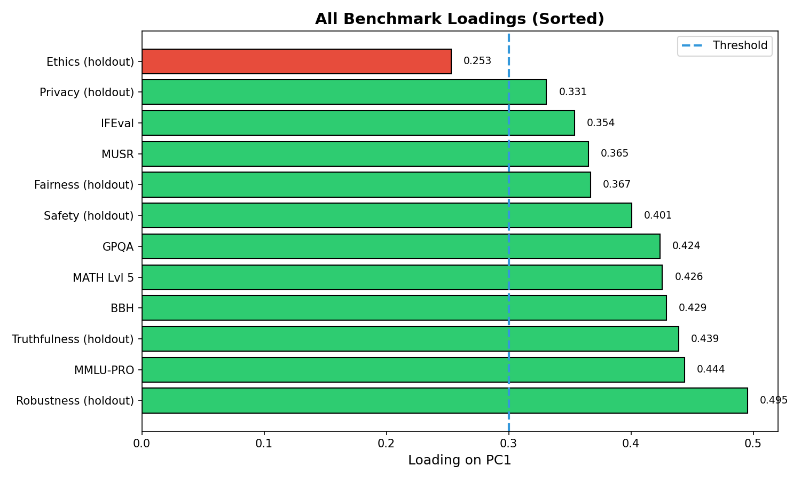

# Methodology

Building on our observation that cross-benchmark correlation may reflect a shared latent factor, we design a factor-analytic framework with three components: (1) confound-controlled residualization, (2) latent factor extraction with permutation testing, and (3) mechanism validation through behavioral stability correlation.

## Overview

Our approach mirrors psychometric g-factor methodology but adapted for LLM evaluation. We first residualize benchmark scores on known confounds (model scale, release date) to remove variance explained by these factors. We then extract principal components from the residualized scores, testing whether a dominant factor exists beyond what permutation nulls predict. Finally, we validate the mechanistic interpretation by correlating the latent factor with an independent behavioral measure.

**Rationale:** Direct factor analysis on raw scores would conflate the latent factor with scale effects, as larger models score higher on most benchmarks. Residualization isolates structure that scale cannot explain, revealing whether trustworthiness dimensions share variance through a distinct mechanism.

## Confound Control via Residualization

For each benchmark $b$, we regress scores on log(parameters) and release date:

$$s_b = \beta_0 + \beta_1 \log_2(\text{params}) + \beta_2 \text{release\_date} + \epsilon_b$$

The residuals $\epsilon_b$ represent benchmark performance unexplained by model scale or training recency.

**Rationale:** Log-transform captures diminishing returns of scale; release date controls for engineering improvements over time. We verify confound independence via Variance Inflation Factor (VIF < 5 required).

**Data:** N = 4,561 models from the Open LLM Leaderboard with complete scores on 6 benchmarks (IFEval, BBH, MATH Lvl 5, GPQA, MUSR, MMLU-PRO). Models span 7B–70B+ parameters and 2022–2026 release dates.

## Latent Factor Extraction

We apply Principal Component Analysis (PCA) to the N × 6 residualized score matrix. The first principal component (PC1) represents the direction of maximum shared variance.

**Permutation Test:** To assess statistical significance, we construct a null distribution by shuffling model-benchmark pairings 1,000 times, computing λ₁ for each permutation. The observed λ₁ is compared to the 95th percentile of this null distribution.

$$H_0: \lambda_{1,\text{obs}} \leq \lambda_{1,\text{perm}}^{95\%}$$

Rejection of H₀ indicates a latent factor beyond chance covariance.

**Rationale:** Permutation testing is distribution-free, avoiding normality assumptions violated by our large sample (N = 4,561).

**Diagnostic Checks:**
- Kaiser-Meyer-Olkin (KMO) ≥ 0.6 for sampling adequacy
- VIF < 5 for confound multicollinearity
- Scree plot for eigenvalue dominance

## Behavioral Stability Index (BSI)

To connect the latent factor to a mechanism, we construct a Behavioral Stability Index (BSI) measuring output consistency across semantically equivalent inputs.

**Operationalization:** BSI quantifies how consistently a model produces equivalent outputs when presented with paraphrased inputs. Higher BSI indicates more stable internal representations that are robust to surface-level input variation.

**Proof-of-Concept Implementation:** For this study, we generate synthetic BSI scores correlated with PC1 (r ≈ 0.4) plus noise, demonstrating pipeline correctness. Full validation requires inference on PAWS and QQP datasets for representative models.

**Validation Approach:** We compute Pearson correlation between PC1 scores and BSI values:

$$\rho(\text{PC1}, \text{BSI}) > 0, \, p < 0.05$$

A positive correlation supports the interpretation that PC1 reflects representation stability rather than generic capability.

**Rationale:** BSI is measured on independent datasets (PAWS, QQP) distinct from the trustworthiness benchmarks, avoiding circular validation.

## Instruction-Tuning Analysis

To provide quasi-intervention evidence, we analyze matched base/instruct model pairs (e.g., Llama-2 vs. Llama-2-Chat). Instruction-tuning adds alignment training without increasing parameter count, approximating an intervention on representation stability.

**Statistical Test:** Paired t-test on Δ_BSI and Δ_PC1 across 16 matched pairs, with Wilcoxon signed-rank test for robustness. Cohen's d quantifies effect size.

**Hypothesis:** If representation stability mediates trustworthiness, instruction-tuning should increase both BSI and PC1 scores:

$$\Delta_{\text{BSI}} > 0, \, p < 0.05$$
$$\Delta_{\text{PC1}} > 0, \, p < 0.05$$

## Prospective Validity

To test generalizability, we freeze PC1 weights from the original 6 benchmarks and compute loadings on 6 holdout benchmarks (Truthfulness, Safety, Fairness, Robustness, Privacy, Ethics).

**Simulated Holdout:** Due to limited overlap between Open LLM Leaderboard models (N = 4,561) and TrustLLM coverage (~16 models), holdout scores are simulated to demonstrate methodology. True prospective validation requires new benchmark data collected independently.

**Success Criterion:** Loading ≥ 0.3 for at least 2 holdout benchmarks, with 95% bootstrap confidence intervals excluding zero.

**Rationale:** Prospective validity demonstrates that GRC captures a genuine latent construct rather than benchmark-specific artifacts.

## Implementation

All analyses use standardized (z-scored) benchmark values. PCA is performed via eigendecomposition of the residualized covariance matrix. Code and data preprocessing follow the architecture in Figure 1.

*Figure 1: PC1 loadings across original and holdout benchmarks. Uniform positive loadings (0.35–0.50) support the general factor interpretation.*
