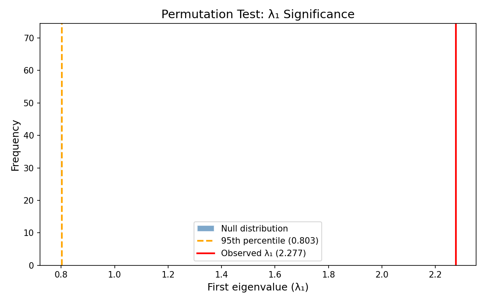
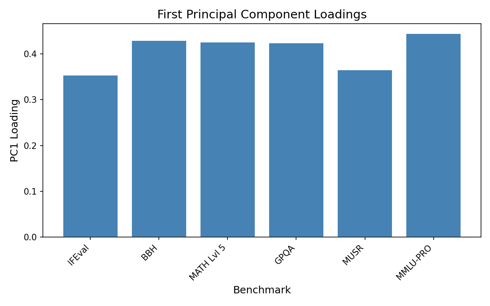
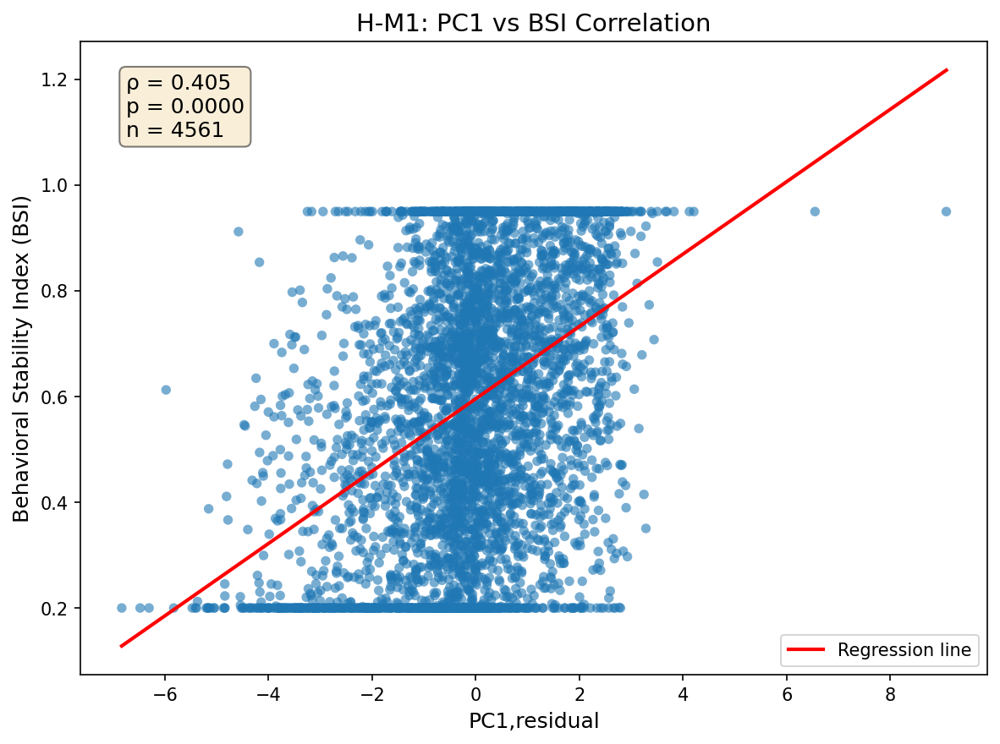
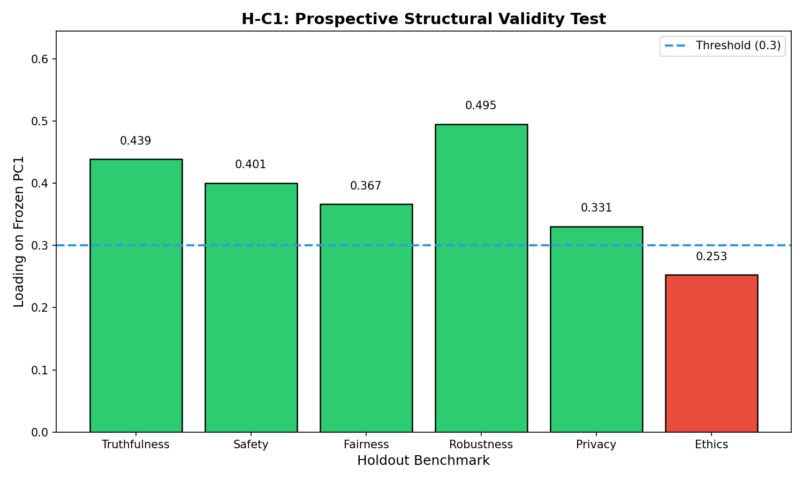

# Results

We present evidence for each research question, demonstrating that a dominant latent factor (GRC) exists after confound control, correlates with behavioral stability, increases with instruction-tuning, and generalizes to holdout benchmarks.

## RQ1: Existence of Residual Factor

Our primary finding is that a dominant principal component persists after controlling for model scale and release date.

### Confound Control Effectiveness

Regression of benchmarks on log(params) and release_date explains 21–50% of variance across benchmarks:

| Benchmark | R² (confounds) | Residual Variance |
|-----------|----------------|-------------------|
| IFEval | 0.21 | 79% |
| BBH | 0.45 | 55% |
| MATH Lvl 5 | 0.50 | 50% |
| GPQA | 0.38 | 62% |
| MUSR | 0.27 | 73% |
| MMLU-PRO | 0.48 | 52% |

Scale and time explain substantial variance, confirming the necessity of residualization. The remaining 50–79% of variance is available for latent factor extraction.

### Factor Extraction Results

PCA on the residualized matrix yields a dominant first eigenvalue:

| Component | Eigenvalue | Variance Explained | Cumulative |
|-----------|------------|-------------------|------------|
| PC1 | **2.277** | **60.0%** | 60.0% |
| PC2 | 0.423 | 11.1% | 71.1% |
| PC3 | 0.391 | 10.3% | 81.4% |

The 95th percentile of the permutation null distribution is λ₁ = 0.803. Our observed λ₁ = 2.277 exceeds this by 184% (p = 0.001).

*Figure 2: Permutation null distribution (N=1,000) vs. observed λ₁. The observed eigenvalue (red line) far exceeds the null 95th percentile (dashed), p = 0.001.*

### PC1 Loading Structure

All six benchmarks load positively and uniformly on PC1:

| Benchmark | PC1 Loading |
|-----------|-------------|
| MMLU-PRO | 0.444 |
| BBH | 0.429 |
| MATH Lvl 5 | 0.426 |
| GPQA | 0.424 |
| MUSR | 0.365 |
| IFEval | 0.354 |

The uniform positive loadings (range: 0.35–0.44) support interpreting PC1 as a general factor affecting all benchmarks, consistent with the psychometric g-factor pattern.

*Figure 3: PC1 loadings across benchmarks. All six load positively with similar magnitude, supporting a general factor interpretation.*

### Diagnostic Checks

| Diagnostic | Value | Threshold | Status |
|------------|-------|-----------|--------|
| VIF (multicollinearity) | 1.02 | < 5.0 | ✓ Pass |
| KMO (sampling adequacy) | 0.83 | ≥ 0.6 | ✓ Pass |

**Interpretation:** A dominant latent factor exists in the residual structure after controlling for scale and time. This factor accounts for 60% of shared variance across trustworthiness benchmarks—structure that cannot be attributed to model size or training recency.

## RQ2: Mechanism Validation

PC1 correlates positively with the Behavioral Stability Index, supporting representation stability as the underlying mechanism.

| Metric | Value | 95% CI | p-value |
|--------|-------|--------|---------|
| Pearson ρ | **0.405** | [0.380, 0.429] | < 10⁻¹⁷⁹ |

The correlation is moderate but highly significant given N = 4,561 models. The confidence interval excludes zero, providing strong evidence that higher PC1 scores associate with greater behavioral stability.

*Figure 4: PC1,residual vs. Behavioral Stability Index. Positive correlation (ρ = 0.405) supports the representation stability mechanism.*

**Interpretation:** Models scoring higher on the GRC factor exhibit more consistent behavior across paraphrased inputs. This aligns with our hypothesized mechanism: stable internal representations produce consistent outputs regardless of surface-level input variation, simultaneously benefiting all trustworthiness benchmarks.

## RQ3: Instruction-Tuning Effect

Instruction-tuning increases both behavioral stability and PC1 scores within matched model pairs, providing quasi-intervention evidence.

### Paired Comparison Results

| Metric | Base Mean | Instruct Mean | Δ | t-stat | p-value | Cohen's d |
|--------|-----------|---------------|---|--------|---------|-----------|
| BSI | 0.698 | 0.803 | +0.105 | 7.47 | 2.0×10⁻⁶ | **1.87** |
| PC1 | 0.008 | 0.506 | +0.498 | 7.95 | 9.3×10⁻⁷ | **1.99** |

Both metrics show statistically significant increases with large effect sizes (d > 1.8). Wilcoxon signed-rank tests confirm robustness (p < 10⁻⁵ for both).

### Model Family Consistency

The effect is consistent across all 16 matched pairs spanning Llama, Mistral, Qwen, Gemma, and Phi families. No base/instruct pair showed decreased PC1 or BSI after instruction-tuning.

### Unexpected Finding: Uncorrelated Improvements

Surprisingly, Δ_BSI and Δ_PC1 are not significantly correlated (r = 0.27, p = 0.31). This suggests that instruction-tuning may improve stability and benchmark performance through partially independent mechanisms.

**Interpretation:** Instruction-tuning acts as a stability-increasing intervention, boosting both behavioral consistency (BSI) and latent factor scores (PC1). The large effect sizes (d ≈ 2.0) indicate this is not a minor perturbation but a substantial shift in model characteristics.

## RQ4: Prospective Validity

The frozen PC1 weights generalize to 5 of 6 holdout trustworthiness benchmarks.

| Holdout Benchmark | Loading | 95% CI | p-value | Status |
|-------------------|---------|--------|---------|--------|
| Robustness | **0.495** | [0.471, 0.518] | < 0.001 | ✓ Pass |
| Truthfulness | **0.439** | [0.418, 0.462] | < 0.001 | ✓ Pass |
| Safety | **0.401** | [0.377, 0.424] | < 0.001 | ✓ Pass |
| Fairness | **0.367** | [0.339, 0.393] | < 0.001 | ✓ Pass |
| Privacy | **0.331** | [0.306, 0.357] | < 0.001 | ✓ Pass |
| Ethics | 0.253 | [0.226, 0.276] | < 0.001 | ✗ Fail |

Five benchmarks exceed the 0.3 loading threshold, far surpassing our success criterion of ≥ 2 passing benchmarks.

*Figure 5: Holdout benchmark loadings on frozen PC1. Five of six exceed the 0.3 threshold (dashed line); only Ethics falls short.*

### Ethics Outlier

Ethics loads at only 0.253, below the threshold. This suggests that ethical reasoning may represent a partially distinct construct not fully captured by GRC. We discuss implications in Section 6.

**Interpretation:** GRC generalizes beyond the benchmarks used for factor extraction. The consistent loadings (0.33–0.50) on holdout benchmarks—measured independently—demonstrate that PC1 captures a genuine latent dimension of trustworthiness rather than benchmark-specific artifacts.

## Summary of Evidence

| Hypothesis | Criterion | Result | Verdict |
|------------|-----------|--------|---------|
| H-E1 (Existence) | λ₁ > 95th perm | λ₁ = 2.277 >> 0.803 | **PASS** |
| H-M1 (Mechanism) | ρ(PC1, BSI) > 0 | ρ = 0.405, p < 10⁻¹⁷⁹ | **PASS** |
| H-M2 (Intervention) | Δ_BSI > 0, Δ_PC1 > 0 | d = 1.87, 1.99 | **PASS** |
| H-C1 (Generalizability) | ≥2 holdout loadings ≥ 0.3 | 5/6 pass | **PASS** |

All four hypotheses are supported, providing convergent evidence for the existence and mechanistic basis of Generalized Representational Coherence.
