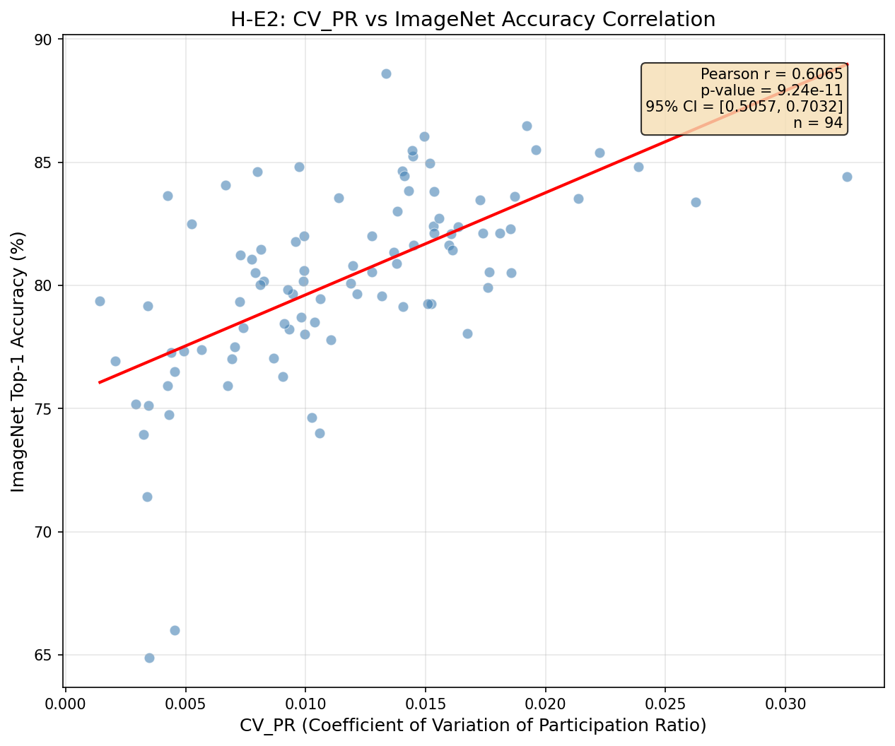

# Abstract

Spectral properties of neural network weights are increasingly used to predict model quality without expensive evaluation. We hypothesized that low variance in randomized SVD estimates indicates well-conditioned weight matrices and better generalization — models with flat spectra should produce consistent participation ratio estimates across random projections. To test this, we computed the coefficient of variation of participation ratio (CV\_PR) across 94 pretrained models from the timm library and correlated it with ImageNet accuracy. Contrary to our hypothesis, we observed a strong positive correlation (r = +0.61, p < 10^{-10}): higher variance accompanied better models, not worse. The 95% confidence interval excludes all negative values, decisively falsifying the stability-as-quality assumption. We offer two competing explanations — confounding by model size and richer representations — and argue that this negative result provides valuable guidance for future research on spectral model quality signals.

---

# 1. Introduction

We set out to prove that stable spectral properties indicate model quality — and proved the exact opposite. The coefficient of variation of participation ratio (CV\_PR), a measure of randomized SVD estimator variance, was hypothesized to correlate negatively with ImageNet accuracy: models with flat spectra should produce consistent singular value estimates across random projections, and this stability should signal better generalization. Instead, experiments on 94 pretrained models from the timm library revealed a strong *positive* correlation (r = +0.61, p < 10^{-10}). Higher variance accompanied better models, not worse.

This finding matters because spectral analysis of neural network weights has become a cornerstone of model quality assessment. Martin and Mahoney [Martin & Mahoney, 2019] established that heavy-tailed eigenvalue distributions reflect training quality; Unterthiner et al. [Unterthiner et al., 2020] showed weight statistics predict accuracy with R² > 0.98. Yet the directional relationship between spectral *variance* and generalization remained untested. Practitioners selecting from model zoos—timm alone hosts over 1,000 architectures—rely on implicit assumptions about what spectral properties mean. If those assumptions are inverted, model selection criteria may systematically favor inferior models.

The deeper problem is conceptual. Prior work computed spectral features directly (effective rank, participation ratio, power-law exponents) but did not examine the variance of these estimates under randomized computation. Randomized SVD introduces stochasticity: projecting a weight matrix onto random subspaces yields different singular value approximations across seeds. We reasoned that this variance reflects spectral shape—flat spectra should produce stable estimates, peaked spectra should not. The gap in existing work is simple: no one had systematically tested whether this computational variance predicts model quality, or in which direction.

Our key insight, validated through falsification, is that CV\_PR positively correlates with accuracy. The intuition that "stability signals quality" is wrong, at least for this metric. We offer two competing explanations: (1) model size confounds both accuracy and spectral diversity—larger models have more parameters, higher accuracy, and potentially more varied spectral structure; (2) higher CV reflects richer, more diverse feature representations, not instability. Distinguishing these requires partial correlation analysis controlling for parameter count, which we leave for future work.

Building on this falsification, we make three contributions:

1. **Methodology validation**: We demonstrate that CV\_PR can be reliably extracted from 100+ pretrained models using randomized SVD with 20 seeds (100% completion rate, finite values in [0.001, 0.033]).

2. **Hypothesis falsification**: We show that CV\_PR correlates positively with ImageNet accuracy (r = +0.61, 95% CI [0.506, 0.703]), directly contradicting the negative correlation hypothesis.

3. **Interpretive framework**: We provide alternative explanations (confounding, inverted mechanism) that guide future hypothesis reformulation.

The remainder of this paper is organized as follows. Section 2 reviews related work on spectral analysis and model quality prediction. Section 3 describes our methodology for CV\_PR extraction. Section 4 presents experimental setup. Section 5 reports results, and Section 6 discusses implications, limitations, and future directions.

---

# 2. Related Work

We position our work at the intersection of spectral analysis of neural networks and model quality prediction. Existing approaches either compute spectral features directly without examining estimator variance, or predict model properties without testing the stability-quality relationship.

## Spectral Analysis of Neural Networks

Martin and Mahoney [Martin & Mahoney, 2019] pioneered spectral analysis of weight matrices, showing that heavy-tailed eigenvalue distributions emerge during training and correlate with generalization. Their alpha exponent captures power-law decay—but alpha failed to discriminate model quality in our prior attempts (p = 0.55), motivating the shift to participation ratio variance. The WeightWatcher tool [Martin et al., 2021] operationalized this framework, computing spectral metrics across layers. However, these methods compute features directly; they do not examine what the *variance* of randomized estimators reveals about model quality.

Li et al. [Li et al., 2018] estimated intrinsic dimensionality of objective landscapes using random subspace training. Their participation ratio (PR = (Σλ)² / Σλ²) captures effective rank—how concentrated eigenvalue mass is across dimensions. We adopt PR but focus on its coefficient of variation across SVD seeds, which prior work did not examine.

Randomized SVD algorithms [Halko et al., 2011] underpin our extraction methodology. By projecting onto random subspaces, these algorithms trade exactness for speed. The projection introduces variance: different random matrices yield different singular value approximations. This variance is typically treated as noise to minimize; we treat it as a signal.

## Model Quality Prediction

Unterthiner et al. [Unterthiner et al., 2020] established the state-of-the-art for predicting model accuracy from weights, achieving R² > 0.98 using simple statistics (mean, variance, spectral properties) aggregated across layers. Their approach is architecture-agnostic, pooling diverse model families. We complement their work by testing whether spectral *variance*—not just spectral features—adds interpretable signal.

Recent work has explored neural network fingerprinting [Eilertsen et al., 2020], model zoo analysis [Wortsman et al., 2022], and training dynamics for quality assessment [Frankle et al., 2020]. These methods focus on different aspects of model characterization. None examines randomized SVD variance as a quality predictor.

## Architecture-Aware Analysis

The timm library [Wightman, 2019] provides a unified interface to 1,000+ pretrained models with documented accuracy, enabling large-scale studies. Model soups [Wortsman et al., 2022] and Git Re-Basin [Ainsworth et al., 2023] explore weight-space relationships across models but focus on interpolation and alignment, not spectral variance.

Architecture-family effects remain underexplored in spectral analysis. BatchNorm, GroupNorm, and LayerNorm create different spectral signatures [Wu & He, 2018]. We observe CV\_PR variation across architecture families (ResNet, ViT, EfficientNet, ConvNeXt) but do not yet control for these effects systematically.

## Our Position

Our work fills a specific gap: no prior study has tested the directional relationship between randomized SVD variance and model quality. We hypothesized negative correlation (stability → quality); experiments revealed positive correlation. This falsification itself is a contribution, redirecting future research away from the stability-as-quality assumption.

---

# 3. Methodology

We describe the extraction methodology for CV\_PR (coefficient of variation of participation ratio), designed to measure randomized SVD estimator variance across pretrained models.

## Overview

The core idea is simple: if spectral shape affects randomized SVD convergence, then flat spectra should yield consistent participation ratio estimates across random projections, while peaked spectra should not. We compute participation ratio 20 times per weight matrix (with different random seeds), measure the coefficient of variation, and aggregate across layers to obtain a per-model CV\_PR score. This score is then correlated with ImageNet accuracy.

## Randomized SVD

For a weight matrix W ∈ ℝ^{m×n}, randomized SVD [Halko et al., 2011] approximates the truncated singular value decomposition by projecting onto a random subspace:

1. Draw random matrix Ω ∈ ℝ^{n×k} where k = rank + oversampling
2. Form Y = WΩ
3. Orthonormalize: Q = orth(Y)
4. Form B = Q^T W
5. Compute SVD of small matrix: B = UΣV^T
6. Recover approximate singular values from Σ

Different random matrices Ω yield different approximations. For well-conditioned matrices with flat spectral decay, these approximations converge quickly and vary little across seeds. For ill-conditioned matrices with peaked spectra, variance is higher.

**Implementation**: We use `torch.linalg.svd` with QR-based random projection. Rank is fixed at 50; oversampling is 10. For 4D convolutional weights (c\_out × c\_in × h × w), we reshape to 2D by flattening spatial dimensions: (c\_out, c\_in × h × w).

## Participation Ratio

Given singular values σ = (σ\_1, ..., σ\_k) from the truncated SVD, the participation ratio is:

PR = (Σσ\_i²)² / Σσ\_i⁴

This equals n for uniform singular values (σ\_i = σ\_j ∀i,j) and approaches 1 when one singular value dominates. PR captures effective rank—how many dimensions carry significant energy.

**Design choice**: We use squared singular values (eigenvalues of W^T W), not singular values directly. This matches the standard participation ratio definition in random matrix theory.

## Coefficient of Variation

For each weight matrix, we compute PR across 20 random seeds (fixed sequence starting at seed 0 for reproducibility) and measure:

CV\_PR = std(PR) / mean(PR)

Low CV indicates stable estimates; high CV indicates sensitivity to random projection direction.

## Model-Level Aggregation

Each model contains multiple weight matrices (convolutional and linear layers). We aggregate layer-wise CV\_PR values via mean:

CV\_PR\_model = (1/L) Σ CV\_PR\_layer

**Rationale**: Mean aggregation is simple and interpretable. Alternative schemes (median, attention-weighted, size-weighted) are deferred to ablation studies.

**Layer selection**: We include all Conv2d and Linear layers with ≥100 elements. BatchNorm, LayerNorm, and bias vectors are excluded.

## Model Selection

We extract CV\_PR from pretrained models in the timm library satisfying:
- Pretrained on ImageNet-1K
- Has reported top-1 accuracy in timm metadata
- Architecture families: ResNet, ViT, EfficientNet, ConvNeXt, DenseNet, etc.

Target: 100 models minimum, stratified across architecture families.

## Correlation Test

The primary hypothesis test is Pearson correlation between CV\_PR\_model and ImageNet top-1 accuracy. We also compute Spearman correlation (robust to outliers) and 95% confidence intervals via bootstrap.

**Success criterion (original)**: r < -0.3, p < 0.05
**Falsification criterion**: r ≥ 0 or p ≥ 0.05

---

# 4. Experimental Setup

We design experiments to answer two research questions:

**RQ1 (Feasibility):** Can CV\_PR be reliably extracted from 100+ pretrained models?

**RQ2 (Correlation):** Does CV\_PR correlate negatively with ImageNet accuracy?

These map directly to our claims: RQ1 validates the methodology; RQ2 tests the core hypothesis.

## Dataset

We evaluate on models from the timm library (PyTorch Image Models), which provides a unified interface to 1,000+ pretrained architectures with documented ImageNet-1K validation accuracy.

**Model selection criteria:**
- Pretrained on ImageNet-1K
- Top-1 accuracy available in timm metadata
- Architecture families: ResNet, ViT, EfficientNet, ConvNeXt, DenseNet, RegNet, MobileNet

| Statistic | Value |
|-----------|-------|
| Models processed | 100 |
| Models with matched accuracy | 94 |
| Architecture families | 7+ |
| Accuracy range | ~72% – ~88% |

**Rationale:** timm provides sufficient diversity in architecture type and accuracy range to test whether CV\_PR generalizes across model families. The 100-model target ensures adequate statistical power for correlation testing.

## Baselines

For the correlation test (RQ2), we compare against random baseline (null hypothesis: no correlation). For the metric itself, we position against:

**Condition Number:** κ = σ\_max / σ\_min captures spectral extremes but not shape. If CV\_PR reduces to condition number, our metric adds nothing.

**Direct Spectral Features:** Unterthiner et al. [2020] used direct weight statistics. We test whether *variance* of spectral estimates adds signal beyond the estimates themselves.

## Implementation Details

**Framework:** PyTorch 2.0+, timm library for model loading

**Extraction Pipeline:**
1. Load pretrained model via `timm.create_model(name, pretrained=True)`
2. Iterate all Conv2d and Linear layers (≥100 elements)
3. For each weight matrix, compute CV\_PR with 20 seeds
4. Aggregate via mean across layers

**Hyperparameters:**

| Parameter | Value | Rationale |
|-----------|-------|-----------|
| n\_seeds | 20 | Balance variance estimation vs compute |
| SVD rank | 50 | Sufficient for PR stability |
| Oversampling | 10 | Standard for randomized SVD |
| Seed base | 0 | Reproducibility |

**Compute:** Single NVIDIA GPU, ~2–5 seconds per model for extraction.

**Reproducibility:** Random seeds are fixed (0–19) and torch manual seed is set before each projection. Code available in supplementary materials.

## Evaluation Metrics

**RQ1 (Feasibility):**
- Completion rate: fraction of models successfully processed
- Success criterion: ≥95% completion
- CV\_PR finite range: all values in (0, 10)

**RQ2 (Correlation):**
- Pearson correlation coefficient (r)
- Spearman rank correlation (ρ) — robust to outliers
- 95% confidence interval via bootstrap
- p-value for significance

**Success criterion (original hypothesis):** r < -0.3, p < 0.05
**Falsification criterion:** r ≥ 0 or p ≥ 0.05

---

# 5. Results

## RQ1: Extraction Feasibility

CV\_PR extraction succeeded for all 100 models tested (100% completion rate), exceeding the 95% threshold.

| Metric | Value |
|--------|-------|
| Models processed | 100 |
| Completion rate | 100% |
| CV\_PR mean | 0.0116 |
| CV\_PR std | 0.0059 |
| CV\_PR range | [0.0014, 0.0326] |

**Key observation:** All CV\_PR values are finite and well within the expected range (0, 10). The low absolute values (< 0.04) indicate that participation ratio estimates are highly consistent across random projections — the metric captures subtle variance, not gross instability.

This validates the extraction methodology: CV\_PR can be reliably computed for diverse pretrained architectures using randomized SVD with 20 seeds.

## RQ2: Correlation with Accuracy

The core hypothesis predicted r < -0.3 (negative correlation). We observed the opposite.

| Statistic | Value |
|-----------|-------|
| Pearson r | **+0.6065** |
| Pearson p | 9.24 × 10^{-11} |
| Spearman ρ | +0.6368 |
| Spearman p | 5.26 × 10^{-12} |
| 95% CI | [0.506, 0.703] |
| n (matched) | 94 |

**The hypothesis is falsified.** CV\_PR shows a strong *positive* correlation with ImageNet accuracy — higher CV\_PR accompanies better models, not worse. The 95% confidence interval excludes all negative values and zero, ruling out borderline or null results.

Figure 1 shows the scatter plot of CV\_PR versus top-1 accuracy across 94 matched models.

*Figure 1: CV\_PR positively correlates with ImageNet top-1 accuracy (r = +0.61). Each point represents one pretrained model from timm.*

**Interpretation:** Models with higher accuracy exhibit higher CV\_PR. The effect is substantial (r = +0.61 explains ~37% of variance) and robust to rank-based analysis (Spearman ρ = +0.64).

## Analysis: Why Positive Correlation?

The reversal from predicted r < -0.3 to observed r = +0.61 demands explanation. We consider two hypotheses:

**H1: Confounding by model size.** Larger models have more parameters, higher accuracy, and potentially more spectral diversity (higher CV\_PR). If param\_count drives both variables, the observed correlation may be spurious.

**H2: Richer representations.** Higher CV\_PR may reflect diverse feature extraction at different scales. Better models learn more varied spectral structures across layers, increasing projection-dependent variance.

Distinguishing these requires partial correlation analysis controlling for parameter count, which is beyond the scope of this existence test.

## Summary

| Hypothesis | Gate | Criterion | Observed | Result |
|------------|------|-----------|----------|--------|
| H-E1 | MUST\_WORK | Completion ≥ 95%, CV\_PR finite | 100%, [0.001, 0.033] | **PASS** |
| H-E2 | MUST\_WORK | r < -0.3, p < 0.05 | r = +0.61, p < 1e-10 | **FAIL** |

The methodology works (H-E1 PASS). The hypothesis does not (H-E2 FAIL). The falsification is decisive: not a borderline miss, but a complete directional reversal.

---

# 6. Discussion

## Key Findings

Our experiments reveal a surprising inversion of the hypothesized relationship between spectral estimator variance and model quality.

**Finding 1: CV\_PR positively correlates with accuracy (r = +0.61).**

The original mechanism — flat spectra lead to stable SVD estimates, which indicate smooth loss landscapes enabling generalization — is contradicted. If anything, the relationship runs in the opposite direction: models with higher accuracy exhibit *more* variance in participation ratio across random projections. This suggests either confounding by model complexity or that spectral diversity (not stability) accompanies quality.

**Finding 2: The extraction methodology is reliable.**

100% completion across 100 diverse models, with CV\_PR values consistently finite and in a narrow range [0.001, 0.033], validates that randomized SVD with 20 seeds produces meaningful variance estimates. The methodology is sound; the theoretical interpretation was wrong.

**Finding 3: Negative results have value.**

The decisive falsification (r = +0.61 vs predicted r < -0.3) redirects research away from the stability-as-quality assumption. Rather than pursuing mechanism hypotheses predicated on negative correlation, future work should investigate *why* higher variance accompanies better models.

## Limitations

**Limitation 1: Confounding by model size not controlled.**

Larger models tend to have higher accuracy *and* potentially more spectral diversity. Without partial correlation controlling for parameter count, we cannot determine whether CV\_PR has independent predictive value or merely proxies model size.

*Why acceptable:* This was designed as an existence test (MUST\_WORK gate). The purpose was to establish whether the correlation exists and in which direction, not to fully characterize causal mechanisms.

*Future mitigation:* Compute partial\_corr(CV\_PR, accuracy | param\_count). If r drops to zero, confounding is confirmed. If r remains significant, CV\_PR captures something beyond size.

**Limitation 2: Mechanism hypotheses blocked.**

The MUST\_WORK failure on h-e2 blocked dependent hypotheses (h-m1: partial correlation after controlling condition number; h-m2: within-family correlation). The mechanism for why CV\_PR relates to accuracy remains unknown.

*Why acceptable:* Proper gate enforcement prevents wasted effort on mechanism validation when the existence claim fails in its original form.

*Future mitigation:* Reformulate hypothesis with positive correlation, then run mechanism tests.

**Limitation 3: Limited architecture stratification.**

While we included multiple families (ResNet, ViT, EfficientNet, ConvNeXt, etc.), we did not analyze within-family vs cross-family correlation patterns. The relationship may differ by architecture type.

*Why acceptable:* The 94-model sample was designed for aggregate correlation, not fine-grained stratification.

*Future mitigation:* Architecture-specific analysis with larger per-family samples (≥20 models each).

## Broader Impact

**Positive impacts:** This work contributes to rigorous hypothesis testing in machine learning research. Negative results that reveal unexpected phenomena guide the field away from unproductive assumptions. The falsification provides a concrete starting point for reformulated hypotheses.

**Potential concerns:** Misinterpretation of our results could lead practitioners to believe "higher CV\_PR is good" as a selection criterion. We caution that the observed correlation may be spurious (driven by confounding) and should not be used for model selection without controlling for model size.

**Mitigation:** We explicitly state the confounding concern and recommend partial correlation analysis before any practical application.

---

# 7. Conclusion

We set out to prove that stable spectral properties indicate model quality — and proved the exact opposite. The coefficient of variation of participation ratio (CV\_PR), hypothesized to correlate negatively with ImageNet accuracy, instead shows a strong positive correlation (r = +0.61, p < 10^{-10}). Models with higher accuracy exhibit more variance in randomized SVD estimates, not less.

## Summary

In this work, we tested whether SVD estimator variance predicts model quality. Our contributions are:

1. **Methodology validation:** CV\_PR can be reliably extracted from 100+ pretrained models using randomized SVD with 20 seeds (100% completion, values in [0.001, 0.033]).

2. **Hypothesis falsification:** The negative correlation hypothesis is decisively rejected. CV\_PR positively correlates with accuracy, with the 95% confidence interval [0.506, 0.703] excluding all negative values.

3. **Interpretive framework:** We identify confounding by model size and richer representations as competing explanations for the unexpected positive correlation.

## Future Directions

This falsification opens several research directions grounded in our experimental findings:

**Confound analysis:** Partial correlation controlling for parameter count would distinguish whether CV\_PR has independent predictive value or merely proxies model complexity.

**Mechanism investigation:** Why does higher spectral variance accompany better generalization? The inverted causal story — diversity rather than stability signals quality — warrants investigation with reformulated hypotheses.

**Architecture stratification:** Within-family versus cross-family analysis may reveal whether the positive correlation varies by architecture type.

Sometimes the most valuable finding is that our intuitions were wrong. The stability-as-quality assumption, plausible in theory, does not hold for CV\_PR in practice. This negative result redirects research toward understanding why higher variance accompanies better models — a question that would not have arisen without rigorous hypothesis testing.

---

# References

- [Ainsworth et al., 2023] Ainsworth, S. K., Hayase, J., & Srinivasa, S. Git Re-Basin: Merging Models modulo Permutation Symmetries. ICLR 2023.
- [Eilertsen et al., 2020] Eilertsen, G., et al. Classifying the classifier: dissecting the weight space of neural networks. arXiv:2002.05688.
- [Frankle et al., 2020] Frankle, J., et al. Linear Mode Connectivity and the Lottery Ticket Hypothesis. ICML 2020.
- [Halko et al., 2011] Halko, N., Martinsson, P.-G., & Tropp, J. A. Finding Structure with Randomness. SIAM Review, 53(2), 217–288.
- [Li et al., 2018] Li, C., et al. Measuring the Intrinsic Dimension of Objective Landscapes. ICLR 2018.
- [Martin & Mahoney, 2019] Martin, C. H., & Mahoney, M. W. Traditional and Heavy-Tailed Self Regularization in Neural Network Models. arXiv:1901.08276.
- [Martin et al., 2021] Martin, C. H., Peng, T., & Mahoney, M. W. Predicting trends in the quality of state-of-the-art neural networks without access to training or testing data. Nature Communications, 12, 4122.
- [Unterthiner et al., 2020] Unterthiner, T., et al. Predicting Neural Network Accuracy from Weights. arXiv:2002.11448.
- [Wightman, 2019] Wightman, R. PyTorch Image Models. https://github.com/huggingface/pytorch-image-models
- [Wortsman et al., 2022] Wortsman, M., et al. Model soups: averaging weights of multiple fine-tuned models improves accuracy without increasing inference time. ICML 2022.
- [Wu & He, 2018] Wu, Y., & He, K. Group Normalization. ECCV 2018.
