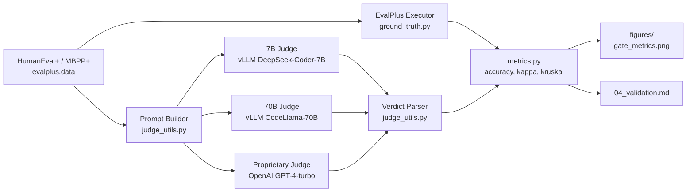

# Architecture: H-M1 Scale-Accuracy Ordering

**Type:** MECHANISM | **Tier:** FULL | **Applied:** EvalPlus ground-truth + multi-backend judge pattern (vLLM local, OpenAI API remote), per crupig/LLMs-as-a-judge-for-SE

## Codebase Analysis (Serena)

**Project Type:** green-field
**Status:** green-field - no existing code to analyze (no base_hypothesis folder, no src/ present)
**Analyzed Path:** N/A
**Findings:** New implementation from scratch

---

## Data Flow



---

## Modules

### GroundTruthExecutor (`ground_truth.py`)

**Dependencies**: evalplus

```python
def load_problems(dataset: str = "humaneval") -> dict: ...  # dataset in {"humaneval","mbpp"}
def execute_ground_truth(problems: dict) -> dict: ...        # -> {task_id: pass(bool)}
```

### JudgePromptBuilder (`judge_utils.py`)

**Dependencies**: None

```python
PROMPT_TEMPLATE: str

def build_prompt(code: str, spec: str) -> str: ...
def parse_verdict(raw_text: str) -> int: ...  # -> 1=correct, 0=incorrect
```

### VLLMJudge (`judge_backends.py`)

**Dependencies**: vllm, JudgePromptBuilder

```python
class VLLMJudge:
    def __init__(self, model_id: str, tensor_parallel_size: int = 1): ...
    def query_batch(self, prompts: list[str]) -> list[str]: ...
```

### OpenAIJudge (`judge_backends.py`)

**Dependencies**: openai, JudgePromptBuilder

```python
class OpenAIJudge:
    def __init__(self, model: str = "gpt-4-turbo"): ...
    def query_batch(self, prompts: list[str]) -> list[str]: ...  # sequential w/ retry+backoff
```

### JudgeRunner (`judge_utils.py`)

**Dependencies**: VLLMJudge, OpenAIJudge, JudgePromptBuilder, GroundTruthExecutor

```python
SCALE_CONFIG: dict  # {"7B": {...}, "70B": {...}, "proprietary": {...}}

def run_judge_scale(scale: str, problems: dict) -> dict: ...  # -> {task_id: verdict}
def run_all_scales(problems: dict) -> dict: ...                # -> {scale: {task_id: verdict}}
```

### Metrics (`metrics.py`)

**Dependencies**: scipy.stats, sklearn.metrics

```python
def compute_accuracy(verdicts: dict, ground_truth: dict) -> float: ...
def compute_kappa(verdicts: dict, ground_truth: dict) -> float: ...
def evaluate_scale_ordering(judge_verdicts: dict, ground_truth: dict) -> dict: ...
def verify_mechanism(results: dict) -> bool: ...  # asserts ordering, diminishing returns, p<0.05
```

### FigureGenerator (`figures.py`)

**Dependencies**: matplotlib, Metrics

```python
def plot_gate_metrics(results: dict, out_path: str) -> None: ...        # required bar chart
def plot_scale_curve(results: dict, out_path: str) -> None: ...
def plot_confusion_matrices(verdicts: dict, ground_truth: dict, out_dir: str) -> None: ...
def plot_error_distribution(verdicts: dict, ground_truth: dict, out_path: str) -> None: ...
```

### ExperimentRunner (`run_experiment.py`)

**Dependencies**: GroundTruthExecutor, JudgeRunner, Metrics, FigureGenerator

```python
def main(dataset: str = "humaneval", seed: int = 0) -> None: ...
```

---

## External Dependencies (PyPI/API)

| Component | Import Path | Purpose |
|-----------|-------------|---------|
| EvalPlus | `from evalplus.data import get_human_eval_plus, get_mbpp_plus` | Dataset + ground truth |
| vLLM | `from vllm import LLM, SamplingParams` | 7B/70B local inference |
| OpenAI API | `from openai import OpenAI` | GPT-4-turbo judge |
| scipy | `from scipy.stats import kruskal` | Kruskal-Wallis test |
| sklearn | `from sklearn.metrics import cohen_kappa_score, accuracy_score` | Agreement metrics |

---

## Epic Tasks

| ID | Task | Description | Complexity | Breakdown |
|----|------|-------------|------------|-----------|
| A-1 | Dataset loading | HumanEval+/MBPP+ via evalplus | 5 | 1+1+1+2 |
| A-2 | Ground truth execution | Run EvalPlus test execution, cache results | 8 | 2+2+2+2 |
| A-3 | Prompt builder + verdict parser | Template + robust binary parsing | 6 | 2+1+1+2 |
| A-4 | 7B judge backend (vLLM) | Load DeepSeek-Coder-7B, batch inference | 10 | 3+2+2+3 |
| A-5 | 70B judge backend (vLLM) | Load CodeLlama-70B (quantized fallback) | 13 | 3+3+3+4 |
| A-6 | Proprietary judge backend (OpenAI) | API client, rate-limit/retry handling | 9 | 2+2+2+3 |
| A-7 | JudgeRunner orchestration | Run all 3 scales, collect verdicts | 8 | 2+2+2+2 |
| A-8 | Metrics computation | Accuracy, Kappa, Kruskal-Wallis, mechanism verification | 11 | 3+2+3+3 |
| A-9 | Figure generation | Gate metrics + 3 additional required figures | 9 | 2+3+2+2 |
| A-10 | Experiment orchestration + report | run_experiment.py end-to-end, seed control | 7 | 2+2+1+2 |
| A-11 | MBPP+ replication support (P2) | Parameterize dataset switch, rerun pipeline | 4 | 1+1+1+1 |

**Distribution**: VeryHigh(18-20): [], High(14-17): [], Medium(9-13): [A-2, A-4, A-5, A-6, A-8, A-9], Low(4-8): [A-1, A-3, A-7, A-10, A-11]

---

## Self-Validation

- [x] No ASCII diagrams (mermaid used)
- [x] No KB search logs (1-line "Applied" summary only)
- [x] Interface-only module signatures
- [x] 11 Epic tasks with complexity (within 6-12 range)
- [x] Codebase Analysis (Serena) section included, green-field noted
- [x] External Dependencies section included
