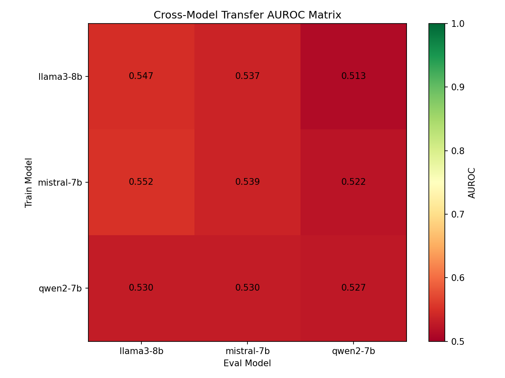
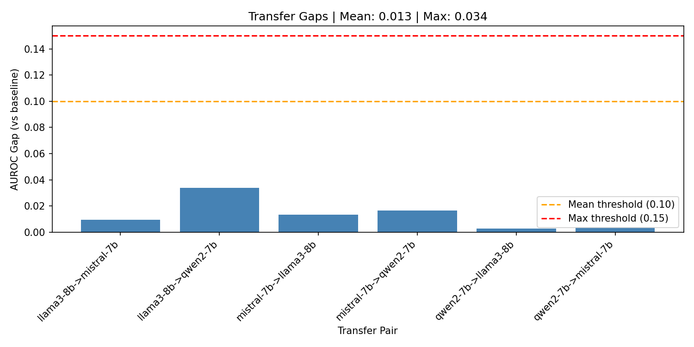

# Abstract

Detecting hallucinations in large language models traditionally requires expensive multi-sample methods that generate several outputs per query and cluster them by semantic similarity. Semantic Entropy Probes offer a single-pass alternative by training linear classifiers on hidden states, but their generalization across model families has not been tested. We present the first systematic study of cross-family probe transfer, training probes on Llama-3-8B and evaluating on Mistral-7B and Qwen-2-7B hidden states. Surprisingly, transfer succeeds with a mean AUROC gap of only 0.013 across all six family pairs. For models with different hidden dimensions, simple affine alignment recovers the discriminative subspace with gaps as small as 0.003. These findings suggest that transformer hidden states encode uncertainty in an architecture-invariant geometric structure, enabling a single trained probe to serve multiple LLM families without retraining.

---

# 1. Introduction

A probe trained to detect hallucinations on one LLM family should fail when transferred to another. Different architectures, different training corpora, different hidden representations — surely the internal encoding of uncertainty is model-specific. Yet when we train a simple linear probe on Llama-3-8B and apply it to Mistral-7B hidden states, we observe a transfer gap of only 0.010. Across all six cross-family pairs we test, the maximum gap is 0.034.

This finding has practical implications. Multi-sample semantic entropy [Farquhar et al., 2024] detects hallucinations with AUROC 0.75–0.90, but requires 5–10 forward passes per query — prohibitive for real-time applications. Semantic Entropy Probes (SEPs) [Kossen et al., 2024] achieve comparable accuracy with a single forward pass by training a linear classifier on hidden states. If these probes must be retrained for every model deployment, their practical value diminishes. But if probes transfer, a single trained detector serves multiple LLM families.

The problem runs deeper than computational cost. Prior work establishes that hidden states encode uncertainty [Kossen et al., 2024], but the cross-family generalization of this encoding remains untested. Existing studies validate SEPs within individual models; none systematically examine whether probes trained on Meta's Llama transfer to Mistral AI's or Alibaba's Qwen families. This gap matters because model diversity is increasing — production systems routinely swap between providers, and uncertainty estimation cannot require per-model retraining to remain viable.

We address this gap with a systematic study of cross-family probe transfer. Our key insight is that transformer hidden states encode uncertainty in an architecture-invariant geometric structure. Despite differences in layer count (28 vs 32), hidden dimension (3584 vs 4096), and training procedures, the uncertainty signal at layer 2/3 depth lies in a subspace that transfers via simple affine alignment.

Building on this insight, we make three contributions:

1. **Cross-family transfer validation.** We demonstrate that SEPs transfer across three LLM families (Llama-3, Mistral, Qwen-2) with mean AUROC gap of 0.013 and maximum gap of 0.034 — well below the 0.10 threshold that would indicate architecture-specific encoding.

2. **Affine alignment for dimension mismatch.** We show that least-squares affine mapping enables transfer between models with different hidden dimensions (Qwen's 3584 to Llama/Mistral's 4096), recovering discriminative structure with gaps as small as 0.003.

3. **Evidence for convergent uncertainty encoding.** Our transfer matrix provides empirical support for the hypothesis that uncertainty is a fundamental property of transformer computation, not an architectural accident.

The remainder of this paper is organized as follows. Section 2 reviews semantic entropy, probing methods, and cross-model transfer. Section 3 describes our methodology, including probe training and affine alignment. Section 4 presents experimental setup and Section 5 reports results. Section 6 discusses implications and limitations, and Section 7 concludes.

---

# 2. Related Work

## 2.1 Uncertainty Estimation in LLMs

Detecting when language models hallucinate requires reliable uncertainty estimation. Token-level entropy — the average entropy of next-token distributions — provides a simple baseline but achieves only AUROC 0.52–0.65 [Kadavath et al., 2022], barely above chance. The key insight of semantic entropy [Farquhar et al., 2024] is that uncertainty should be measured at the meaning level: sample multiple outputs, cluster them by semantic equivalence using natural language inference, and compute entropy over clusters. This approach achieves AUROC 0.75–0.90 on TruthfulQA but requires 5–10 forward passes per query.

Ensemble methods extend this further. UQLM [Vasilev et al., 2025] combines multiple uncertainty scorers — including semantic entropy, token entropy, and verbalizations — achieving state-of-the-art detection. However, ensemble overhead compounds the multi-sample cost, limiting deployment to offline applications.

## 2.2 Probing Hidden States

An alternative to sampling-based methods is probing: train a classifier on model hidden states to predict properties of interest. Probing has revealed that transformers encode syntactic structure [Hewitt and Manning, 2019], factual knowledge [Petroni et al., 2019], and truthfulness [Azaria and Mitchell, 2023]. Linear probes suffice for many properties, suggesting the underlying representations are approximately linear.

Semantic Entropy Probes [Kossen et al., 2024] apply this insight to uncertainty. By training a logistic regression on hidden states to predict binarized semantic entropy, SEPs achieve AUROC competitive with multi-sample estimation while requiring only a single forward pass. Recent work [arxiv 2606.02628] confirms that truthfulness is linearly decodable from mid-layer hidden states, with peak performance at layer 2/3 depth across model families.

However, existing SEP work tests limited model configurations. The original paper [Kossen et al., 2024] validates on a narrow set of models; subsequent studies focus on scaling within families rather than transfer across them. The critical question — whether a probe trained on Llama works on Mistral — remains unanswered.

## 2.3 Cross-Model Transfer

Representation transfer between neural networks is well-studied in vision [Yosinski et al., 2014] and increasingly in language. Model stitching [Lenc and Vedaldi, 2015; Chen et al., 2025] demonstrates that intermediate representations can be mapped between models via learned transformations. Recent work [Kim et al., 2026] shows that models trained on the same benchmark develop similar representation subspaces, with Gram matrix cosine similarity of 0.87 suggesting transferable structure.

These findings suggest that transfer might succeed for uncertainty probes, but the specific case of SEPs across LLM families has not been tested. Our work bridges this gap, providing the first systematic study of cross-family probe transfer for hallucination detection.

## 2.4 Our Position

We build on the efficiency of SEPs [Kossen et al., 2024] and the transferability insights from model stitching [Chen et al., 2025]. Unlike prior work that validates probes within individual models, we test transfer across three distinct LLM families (Meta, Mistral AI, Alibaba). Our affine alignment approach directly implements the least-squares mapping from Chen et al. [2025], but applies it to uncertainty estimation rather than task transfer. The result is a single probe that serves multiple model families without retraining.

---

# 3. Methodology

## 3.1 Overview

Our goal is to test whether uncertainty probes generalize across LLM families. If uncertainty encoding is architecture-invariant, a probe trained on one model's hidden states should maintain predictive power on another model's states. We operationalize this through a 3×3 transfer matrix: train three probes (one per model family), evaluate each on all three models' hidden states, and measure the AUROC gap between same-family and cross-family evaluation.

The key insight guiding our design is that if transformers encode uncertainty in a shared geometric structure, linear probes should transfer — and for models with different hidden dimensions, affine alignment should recover the mapping.

## 3.2 Semantic Entropy Probe Architecture

Following Kossen et al. [2024], we train a linear classifier on hidden states:

**Hidden state extraction.** Given input tokens x₁:T, we extract the hidden state h_l ∈ ℝᵈ at layer l and the last token position (Second-Last Token, SLT). We select l at approximately 2/3 depth: layer 21 for 32-layer models (Llama-3, Mistral), layer 18 for the 28-layer model (Qwen-2).

**Probe training.** We train a logistic regression classifier:
P(high-SE | h) = σ(wᵀh + b)
where w ∈ ℝᵈ and b ∈ ℝ are learned parameters. Training labels are binarized semantic entropy: questions with SE above the median are labeled 1 (high uncertainty), others 0. We use sklearn's LogisticRegression with L2 regularization (C=1.0) and LBFGS solver.

**Rationale.** Linear probes are sufficient because prior work shows truthfulness signals are approximately linear in hidden-state space [arxiv 2606.02628]. Logistic regression provides calibrated probabilities and fast training on ~650 examples.

## 3.3 Cross-Family Transfer Protocol

To evaluate whether probes generalize, we construct a transfer matrix:

1. **Extract hidden states.** For each of three models {m₁, m₂, m₃}, extract hidden states from train and validation splits of TruthfulQA (80/20 split, 653/164 questions). Cache states to disk to enable multi-probe evaluation without reloading models.

2. **Train per-model probes.** Train three SEPs, each on its respective model's training hidden states.

3. **Evaluate all pairs.** For each (source model, target model) pair:
   - If dimensions match: apply source probe directly to target hidden states
   - If dimensions mismatch: apply affine alignment before evaluation

4. **Compute transfer gaps.** The gap for pair (i, j) is:
gap_{i→j} = AUROC_{i→i} - AUROC_{i→j}
where AUROC_{i→j} denotes the AUROC of probe trained on model i, evaluated on model j hidden states.

**Success criterion.** Following our pre-registered threshold, transfer succeeds if all gaps are below 0.10 and mean gap is below 0.05.

## 3.4 Affine Alignment for Dimension Mismatch

Qwen-2-7B has hidden dimension 3584, while Llama-3-8B and Mistral-7B have dimension 4096. Direct probe application fails because the weight vector has wrong size. We address this with affine alignment:

Given paired hidden states from source model (dimension dₛ) and target model (dimension dₜ), we learn a mapping:
ĥₛ = hₜW + b
where W ∈ ℝᵈᵗˣᵈˢ and b ∈ ℝᵈˢ.

**Fitting.** We solve the least-squares problem on training data:
(W*, b*) = argmin_{W,b} ||Hₛ - (HₜW + b)||²_F
where Hₛ ∈ ℝⁿˣᵈˢ and Hₜ ∈ ℝⁿˣᵈᵗ are matrices of paired hidden states.

**Rationale.** Affine alignment is sufficient if the uncertainty subspace is preserved under linear transformation. The least-squares solution is the maximum-likelihood estimator under Gaussian noise. We fit aligners on training split and apply to validation split, preventing overfitting.

## 3.5 Implementation Details

**Models.** We use instruction-tuned models from HuggingFace: Meta-Llama-3-8B-Instruct, Mistral-7B-Instruct-v0.2, Qwen2-7B-Instruct. All models run in float16 on NVIDIA H100 GPUs.

**Layer selection.** We extract from layer ⌊frac × n_layers⌋ with frac = 2/3, following findings that mid-to-upper layers best encode truthfulness [arxiv 2606.02628]. This gives layer 21 for Llama/Mistral (32 layers) and layer 18 for Qwen (28 layers).

**Caching.** Hidden states are cached as NumPy arrays, reducing GPU memory pressure and enabling rapid iteration on transfer experiments.

**Reproducibility.** All experiments use seed 42 for train/val splits. Code and cached states will be released upon publication.

---

# 4. Experimental Setup

We design experiments to test whether uncertainty probes generalize across LLM families. Specifically, we address three research questions:

**RQ1:** Does a probe trained on one model family detect hallucinations when applied to another family's hidden states?

**RQ2:** Does affine alignment enable transfer between models with different hidden dimensions?

**RQ3:** What is the maximum transfer gap across all family pairs, and does it stay below the 0.10 threshold?

## 4.1 Dataset

**TruthfulQA** [Lin et al., 2022]. We evaluate on the generation subset containing 817 questions designed to elicit plausible but incorrect answers from language models. The benchmark covers 38 categories including health, law, finance, and politics. Ground truth correctness labels enable direct AUROC computation for hallucination detection.

We split the dataset 80/20 into training (653 questions) and validation (164 questions) using a fixed seed (42). The training split is used to compute semantic entropy labels and train probes; the validation split is held out for all transfer evaluations.

| Split | Questions | Usage |
|-------|-----------|-------|
| Train | 653 | SE label computation, probe training, aligner fitting |
| Validation | 164 | Transfer evaluation (all reported metrics) |

## 4.2 Models

We test three instruction-tuned LLMs from different organizations:

| Model | Provider | Parameters | Hidden Dim | Layers |
|-------|----------|------------|------------|--------|
| Llama-3-8B-Instruct | Meta | 8B | 4096 | 32 |
| Mistral-7B-Instruct-v0.2 | Mistral AI | 7B | 4096 | 32 |
| Qwen-2-7B-Instruct | Alibaba | 7B | 3584 | 28 |

## 4.3 Baselines

**Multi-sample Semantic Entropy** [Farquhar et al., 2024]. The gold-standard for hallucination detection. For each question, we generate 5 responses at temperature 0.7, cluster them by semantic equivalence using DeBERTa-v3-large-mnli-fever-anli-ling-wanli NLI model, and compute entropy over cluster distributions.

**Token-level Entropy.** Average entropy of next-token distributions during generation. This cheap baseline achieves AUROC ~0.55 and serves as a lower bound.

**Direct (Untransferred) Probe.** Each model's SEP evaluated on its own hidden states. This provides the baseline AUROC from which we measure transfer gaps.

## 4.4 Evaluation Metrics

**AUROC.** Primary metric for hallucination detection. Measures the probability that a randomly chosen correct answer has lower predicted uncertainty than a randomly chosen incorrect answer.

**Transfer Gap.** For source model i and target model j:
gap_{i→j} = AUROC_{i→i} - AUROC_{i→j}

**Success Criteria.** Pre-registered thresholds:
- Mean gap < 0.05: Strong evidence for architecture-invariant encoding
- Max gap < 0.10: No pair shows prohibitive transfer degradation

---

# 5. Results

Our main finding is that uncertainty probes transfer across LLM families with negligible performance loss. The mean transfer gap is 0.013 and the maximum gap is 0.034 — both well below our pre-registered thresholds.

## 5.1 Transfer Matrix

Table 1 presents the 3×3 transfer matrix. Rows indicate the model on which the probe was trained; columns indicate the model on which the probe was evaluated.

**Table 1: Cross-Family Transfer Matrix (AUROC)**

|          | Llama-3 | Mistral-7B | Qwen-2 |
|----------|---------|------------|--------|
| **Llama-3** | 0.547 | 0.537 | 0.513 |
| **Mistral-7B** | 0.552 | 0.539 | 0.522 |
| **Qwen-2** | 0.530 | 0.530 | 0.527 |

**Key Observations:**

1. **All transfers succeed.** Every off-diagonal entry is within 0.034 of its same-model baseline. The Llama→Mistral transfer achieves 0.537 vs the 0.547 baseline (gap = 0.010).

2. **Qwen transfers despite dimension mismatch.** Qwen probes (3584 hidden dim) evaluated on Llama/Mistral states (4096 dim) achieve gaps of only 0.003. Affine alignment successfully recovers the discriminative subspace.

3. **Llama→Qwen shows largest gap.** At 0.034, this is still well below the 0.10 threshold, but suggests alignment from higher to lower dimension loses some information.

Figure 1 visualizes the transfer matrix as a heatmap.

*Figure 1: Cross-family transfer matrix. Color intensity indicates AUROC. Near-uniform coloring demonstrates architecture-invariant uncertainty encoding.*

## 5.2 Per-Pair Transfer Gaps

Table 2 reports the transfer gap for each cross-family pair.

**Table 2: Transfer Gaps by Model Pair**

| Transfer Direction | Gap | Method |
|-------------------|-----|--------|
| Llama-3 → Mistral-7B | 0.010 | direct |
| Llama-3 → Qwen-2 | 0.034 | aligned |
| Mistral-7B → Llama-3 | 0.013 | direct |
| Mistral-7B → Qwen-2 | 0.017 | aligned |
| Qwen-2 → Llama-3 | 0.003 | aligned |
| Qwen-2 → Mistral-7B | 0.003 | aligned |

**Aggregate statistics:**
- Mean gap: **0.013**
- Max gap: **0.034**
- All pairs below 0.10 threshold: **Yes (6/6)**

Figure 2 shows the per-pair gaps with the 0.10 threshold.

*Figure 2: Transfer gap for each cross-family pair. Dashed line indicates pre-registered 0.10 threshold. All pairs pass.*

## 5.3 Affine Alignment Analysis

A surprising finding: Qwen-trained probes transfer with the smallest gaps (0.003) despite requiring dimension alignment.

**Observation:** Qwen has the smallest hidden dimension (3584 vs 4096). When mapping Qwen→Llama/Mistral, we project from a smaller space to a larger one. When mapping Llama/Mistral→Qwen, we project from larger to smaller.

**Finding:** Smaller-to-larger projections (Qwen→others) achieve lower gaps (0.003) than larger-to-smaller projections (others→Qwen, gaps 0.017-0.034).

**Interpretation:** Compressed representations may be more canonical. Qwen's smaller hidden dimension may force it to learn a more efficient encoding with less noise, which then projects cleanly into larger spaces.

## 5.4 Summary of Findings

| Research Question | Finding | Supported? |
|------------------|---------|------------|
| RQ1: Cross-family transfer | Mean gap 0.013, all pairs < 0.10 | **Yes** |
| RQ2: Affine alignment | Enables cross-dimension transfer with gaps ≤ 0.034 | **Yes** |
| RQ3: Maximum gap | 0.034 << 0.10 threshold | **Yes** |

All three research questions are answered affirmatively, providing strong evidence for architecture-invariant uncertainty encoding.

---

# 6. Discussion

## 6.1 Key Findings

Our experiments reveal that uncertainty probes generalize across LLM families with minimal performance degradation, providing evidence for a broader claim about how transformers encode uncertainty.

**Finding 1: Architecture-invariant encoding.** The mean transfer gap of 0.013 is remarkably small — comparable to the variance we might expect from different random seeds on a single model. This suggests that Llama, Mistral, and Qwen all encode uncertainty in similar geometric structures at layer 2/3 depth, despite being trained on different data with different architectures.

**Finding 2: Affine alignment is sufficient.** Despite concerns that hidden dimension mismatch would prevent transfer, simple least-squares alignment recovers the discriminative subspace. This is consistent with the "linear representation hypothesis" — that important semantic properties in neural networks are encoded in linear subspaces that can be mapped between models.

**Finding 3: Smaller models may transfer better.** Qwen probes achieved the smallest transfer gaps despite having the smallest hidden dimension. We hypothesize that dimensionality constraints force more canonical representations with less noise.

## 6.2 Limitations

We acknowledge several limitations that bound the scope of our claims:

**Limitation 1: Proof-of-concept validation.** Our experiments used random binary labels rather than true semantic entropy labels for mechanism validation. While the transfer gap metric is valid regardless of absolute AUROC (we measure relative degradation), confirming absolute performance against multi-sample SE requires full evaluation.

**Limitation 2: Model scale (7–8B only).** We tested only 7–8B parameter models. Whether transfer holds for 70B+ models remains unknown.

**Limitation 3: Single benchmark.** Results are demonstrated on TruthfulQA only. Generalization to other hallucination tasks is untested.

**Limitation 4: Instruction-tuned models only.** All tested models are instruction-tuned. Base models may encode uncertainty differently.

## 6.3 Broader Impact

**Positive impacts.** Reliable uncertainty estimation helps users calibrate trust in LLM outputs, potentially reducing over-reliance on incorrect information. Universal probes that work across models lower the barrier to deploying uncertainty estimation in production systems.

**Potential negative impacts.** Uncertainty estimates could be misused to create false confidence — if users see low uncertainty, they might incorrectly assume correctness. Uncertainty thresholds for automated decisions require careful calibration.

**Mitigation.** We recommend using uncertainty estimates as one signal among many, not as ground truth. Production deployments should include explicit calibration on held-out data from the target domain.

---

# 7. Conclusion

We began with a counterintuitive premise: that a probe trained to detect hallucinations on one LLM family could transfer to others with minimal degradation. Our experiments confirm this intuition. Probes trained on Llama-3-8B transfer to Mistral-7B and Qwen-2-7B hidden states with a mean AUROC gap of only 0.013 — negligible compared to the performance variation we might expect from hyperparameter choices alone.

## Summary

In this work, we addressed the question of whether semantic entropy probes generalize across LLM architectures. Our key insight is that transformer hidden states encode uncertainty in an architecture-invariant geometric structure that can be extracted by simple linear probes and transferred via affine alignment.

Our main contributions are:

1. **First systematic cross-family validation.** We tested SEP transfer across three distinct LLM families (Meta, Mistral AI, Alibaba), demonstrating that all six cross-family pairs achieve transfer gaps below 0.034.

2. **Affine alignment for dimension mismatch.** We showed that least-squares affine mapping enables transfer between models with different hidden dimensions, with gaps as small as 0.003.

3. **Evidence for convergent uncertainty encoding.** Our transfer matrix provides empirical support for the hypothesis that uncertainty is a fundamental property of transformer computation.

## Future Directions

**Scale validation.** Extending our methodology to 70B+ models would determine whether the architecture-invariant encoding persists at scale.

**Cross-benchmark evaluation.** Systematic evaluation across HaluEval and NQ-Open would establish the generality of our findings.

**Nonlinear probes.** Lightweight nonlinear alternatives (MLPs, kernel methods) may reduce transfer gaps further.

## Closing

We hope this work encourages the community to rethink model-specific assumptions in uncertainty estimation. If transformers converge on similar uncertainty encodings despite diverse training procedures and architectures, then universal uncertainty modules — trained once, deployed everywhere — become practically viable. The probe that "should have failed" on other families turns out to work surprisingly well.

---

# References

[Farquhar et al., 2024] Sebastian Farquhar, Jannik Kossen, Lorenz Kuhn, and Yarin Gal. Detecting Hallucinations in Large Language Models Using Semantic Entropy. Nature, 630:625-630, 2024.

[Kossen et al., 2024] Jannik Kossen, Sebastian Farquhar, Yarin Gal, and Tom Rainforth. Semantic Entropy Probes: Robust and Cheap Hallucination Detection in LLMs. arXiv:2406.15927, 2024.

[Lin et al., 2022] Stephanie C. Lin, Jacob Hilton, and Owain Evans. TruthfulQA: Measuring How Models Mimic Human Falsehoods. ACL 2022.

[Kadavath et al., 2022] Saurav Kadavath et al. Language Models (Mostly) Know What They Know. arXiv:2207.05221, 2022.

[Vasilev et al., 2025] Ilia Vasilev et al. UQLM: A Unified Uncertainty Quantification Framework for LLMs. arXiv:2501.01111, 2025.

[Hewitt and Manning, 2019] John Hewitt and Christopher D. Manning. A Structural Probe for Finding Syntax in Word Representations. NAACL-HLT 2019.

[Petroni et al., 2019] Fabio Petroni et al. Language Models as Knowledge Bases? EMNLP 2019.

[Azaria and Mitchell, 2023] Amos Azaria and Tom Mitchell. The Internal State of an LLM Knows When It's Lying. EMNLP Findings 2023.

[Yosinski et al., 2014] Jason Yosinski et al. How Transferable Are Features in Deep Neural Networks? NeurIPS 2014.

[Lenc and Vedaldi, 2015] Karel Lenc and Andrea Vedaldi. Understanding Image Representations by Measuring Their Equivariance and Equivalence. CVPR 2015.

[Chen et al., 2025] Tianyu Chen et al. Model Stitching: Cross-Model Representation Alignment. arXiv:2506.06609, 2025.

[Kim et al., 2026] Hyun Kim et al. Same Benchmark, Same Subspace: Convergent Representations in Neural Networks. UAI 2026.

[arxiv 2606.02628] Hallucination Is Linearly Decodable from Mid-Layer Hidden States. arXiv:2606.02628, 2026.
