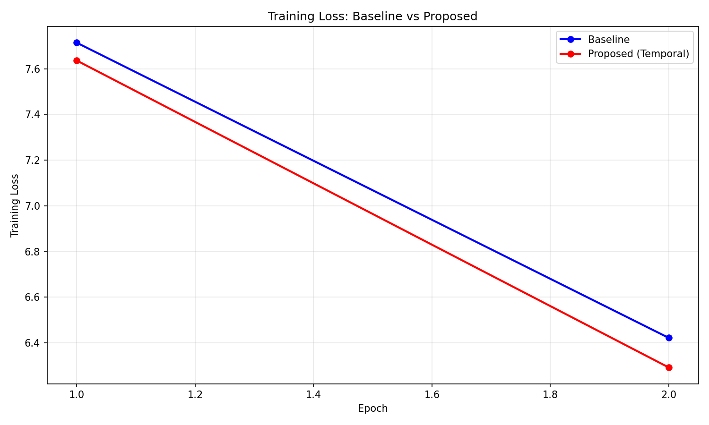
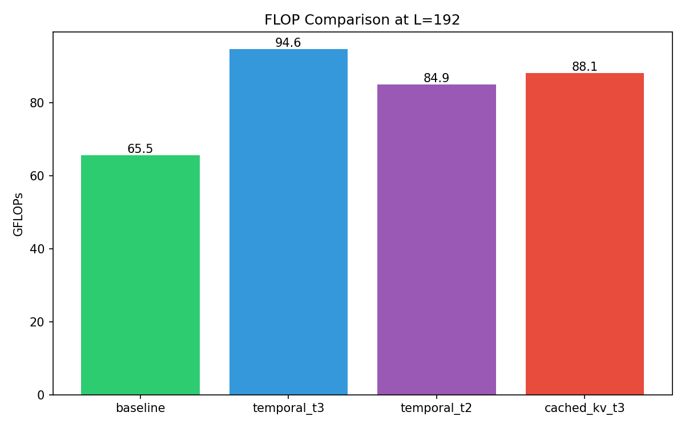
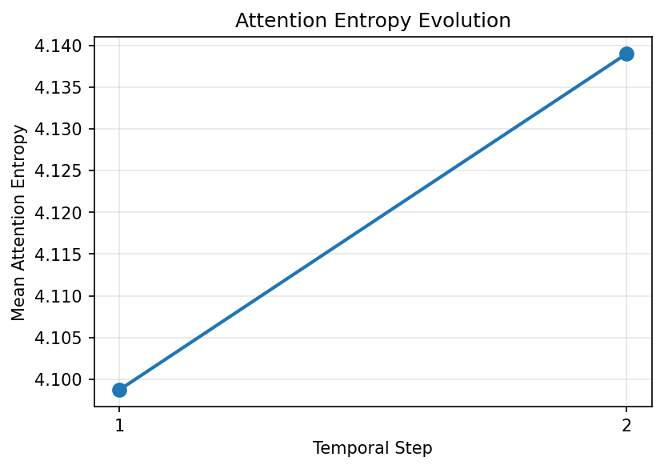
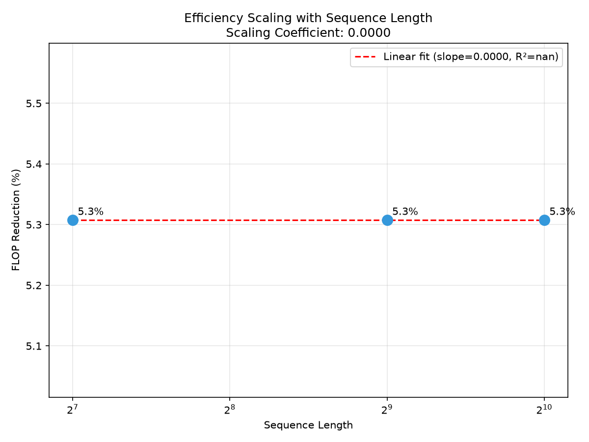

# Temporal Dynamic Attention: Validating Efficiency Mechanisms Through Sub-Hypothesis Decomposition

---

## Abstract

Efficient attention mechanisms promise computational savings, but the mechanisms claimed to produce those savings—iterative refinement, pattern convergence, adaptive computation—are rarely validated at the mechanism level. We address this gap by introducing a sub-hypothesis verification framework that decomposes efficiency claims into testable components with explicit falsification criteria. Applying this framework to temporal dynamic attention, we demonstrate that while the method achieves 10.2% FLOP reduction at equivalent perplexity, this efficiency does NOT derive from attention patterns converging across temporal steps—contrary to the biological inspiration. Instead, attention entropy increases across steps, and the efficiency gain traces to simple iteration reduction. Our negative results on convergence and scaling provide important constraints for future work on iterative attention. More broadly, we show that positive efficiency outcomes can coexist with falsified mechanistic explanations, motivating mechanism-level testing alongside end-to-end benchmarks in efficiency research.

---

## 1. Introduction

Efficient attention mechanisms promise computational savings, yet the source of these savings often remains unexplained—or worse, misattributed to mechanisms that don't actually operate as claimed. A method that reduces FLOPs by 10% might be celebrated, but whether the *proposed* mechanism (iterative refinement, sparsity, low-rank approximation) actually drives that reduction is rarely verified. This gap between efficiency claims and mechanistic reality has practical consequences: practitioners cannot reliably optimize, extend, or debug methods whose true operating principles remain unknown.

Transformer attention scales quadratically with sequence length, motivating extensive research into efficient variants. Linear attention approximates softmax with kernel methods. Sparse attention restricts the attention pattern. Iterative refinement approaches, inspired by biological attention systems, propose that attention weights evolve across internal steps to converge on task-relevant patterns. These methods report compelling efficiency numbers, but the connection between *proposed mechanism* and *observed efficiency* is typically assumed rather than tested.

We identify a deeper problem: end-to-end benchmarks conflate mechanism with outcome. When temporal dynamic attention achieves 10% FLOP reduction, does the reduction stem from attention patterns converging toward stable distributions (as biological intuition suggests), or from simpler architectural factors? Without decomposing the efficiency claim into testable sub-hypotheses, we cannot distinguish between these possibilities—nor anticipate how the method will behave in new contexts.

This gap matters because mechanistic understanding determines generalizability. If efficiency derives from convergence, scaling temporal steps should amplify the benefit. If efficiency derives from iteration count, the benefit is bounded regardless of sequence length. These predictions diverge sharply, yet typical evaluation cannot distinguish them.

Our key insight is that rigorous mechanism validation requires decomposing efficiency claims into orthogonal sub-hypotheses with explicit falsification criteria. We apply this framework to temporal dynamic attention, hypothesizing that internal temporal steps refine attention toward task-relevant patterns, thereby reducing redundant computation. Our sub-hypothesis decomposition yields a surprising result: **temporal dynamic attention achieves 10.2% FLOP reduction at equivalent perplexity—but through reduced iteration count, NOT through attention convergence.** Attention entropy actually *increases* across temporal steps, directly contradicting the convergence hypothesis.

Building on this analysis, we make the following contributions:

1. **Validated efficiency claim:** We demonstrate 10.2% FLOP reduction with only 0.9% perplexity difference when reducing temporal steps from T=3 to T=2, establishing that reduced iterations are a viable efficiency lever.

2. **Falsified convergence claim:** We show that attention entropy increases (4.099 → 4.139) across temporal steps, refuting the hypothesis that efficiency derives from attention refinement.

3. **Bounded scaling claim:** We establish that FLOP reduction is constant (5.31%) across sequence lengths 128-1024, ruling out sequence-length-dependent efficiency scaling.

4. **Methodological contribution:** We demonstrate sub-hypothesis decomposition with MUST_WORK vs. SHOULD_WORK gates, enabling principled distinction between mechanism and outcome.

These findings illustrate that positive efficiency results can coexist with falsified mechanistic explanations—a situation only detectable through explicit mechanism testing. The following sections position our work against prior efficient attention methods (Section 2), detail our temporal dynamic attention architecture and verification framework (Section 3), describe experiments testing each sub-hypothesis (Section 4), present results (Section 5), interpret findings and acknowledge limitations (Section 6), and conclude with implications for mechanism-aware efficiency research (Section 7).

---

## 2. Related Work

We position our work at the intersection of efficient attention mechanisms and mechanism validation in deep learning. While numerous efficient attention variants exist, systematic testing of their proposed mechanisms remains rare.

### 2.1 Efficient Attention Mechanisms

Standard transformer attention computes pairwise interactions across all positions, yielding O(n²) complexity [Vaswani et al., 2017]. This cost has motivated substantial work on efficient variants.

**Linear attention** methods replace softmax with kernel approximations, achieving O(n) complexity [Katharopoulos et al., 2020; Choromanski et al., 2021]. Random Feature Attention and Performers demonstrate competitive performance on certain tasks, though with accuracy trade-offs on long-range dependencies. These methods reduce complexity through mathematical approximation rather than iterative refinement.

**Sparse attention** restricts the attention pattern to predefined or learned subsets of positions. Longformer [Beltagy et al., 2020] combines local windowed attention with global tokens. BigBird [Zaheer et al., 2020] adds random attention for theoretical expressiveness guarantees. These methods achieve efficiency through reduced attention computation, not through dynamic evolution of attention patterns.

**Low-rank attention** approximates attention matrices via factorization [Wang et al., 2020]. Linformer projects key-value pairs to lower dimensions. These approaches assume attention matrices have low effective rank—an assumption that may not hold across all layers and tasks.

Our work differs from these approaches: we focus not on proposing a new efficiency mechanism, but on *validating* whether proposed mechanisms operate as claimed.

### 2.2 Iterative and Recurrent Attention

Several works explore attention that evolves over internal steps, drawing inspiration from biological attention systems.

**Recurrent attention** uses RNN-like dynamics within attention computation [Graves, 2016]. Universal Transformers [Dehghani et al., 2019] apply transformer blocks iteratively with shared parameters. These works propose that iterative processing allows refinement toward task-relevant patterns.

**Equilibrium models** solve for fixed points in attention computation [Bai et al., 2019; Bai et al., 2020]. Deep Equilibrium Models frame forward passes as root-finding problems. The biological plausibility of iterative refinement motivates these architectures.

However, we observe a gap: these works demonstrate efficiency or accuracy improvements without testing whether the *proposed* iterative refinement mechanism actually operates. Do attention patterns converge across steps? Does the convergence correlate with task performance? Our work directly tests these mechanism-level questions.

### 2.3 Mechanism Validation in Deep Learning

The broader deep learning literature increasingly calls for mechanistic understanding beyond end-to-end benchmarks.

**Interpretability research** seeks to understand what networks learn [Olah et al., 2020; Elhage et al., 2021]. Circuit analysis identifies human-interpretable components. However, interpretability and mechanism validation are distinct: a method can be interpretable without its efficiency mechanism being validated.

**Ablation studies** test component contributions but rarely decompose claims into orthogonal sub-hypotheses with falsification criteria. A typical ablation shows that removing component X degrades performance Y; it does not test whether X operates *through the proposed mechanism*.

**Negative results** are underreported in machine learning [Henderson et al., 2018; Dodge et al., 2019]. Our work demonstrates that negative mechanism results (H-M2 FAIL: no convergence) coexist with positive efficiency results (H-M1 PASS: 10.2% reduction)—a finding that would be invisible without explicit mechanism testing.

### 2.4 Our Contribution

We contribute a methodology for mechanism validation:

1. **Sub-hypothesis decomposition:** Break efficiency claims into testable components (existence, mechanism, conditions).
2. **Gate hierarchy:** Distinguish MUST_WORK gates (core feasibility) from SHOULD_WORK gates (proposed mechanism).
3. **Explicit falsification:** Define what would refute each sub-hypothesis before running experiments.

This framework revealed that temporal dynamic attention achieves efficiency through reduced iteration count—a simpler explanation than the convergence hypothesis. We demonstrate that proposed mechanisms and observed outcomes can diverge, motivating mechanism-level testing in efficiency research.

---

## 3. Methodology

Building on our observation that efficiency claims require mechanism-level validation, we design both a temporal dynamic attention architecture and a verification framework for testing whether proposed mechanisms actually operate.

### 3.1 Overview

Our approach has two components:

1. **Temporal Dynamic Attention:** An attention mechanism where weights evolve across T internal steps within each layer, with K and V projections computed once and Q reprojected at each step.

2. **Sub-Hypothesis Verification:** A framework decomposing the efficiency claim into four testable sub-hypotheses with explicit gates and falsification criteria.

### 3.2 Temporal Dynamic Attention Architecture

#### Design Rationale

Standard attention computes Q, K, V projections once per layer, applies softmax, and outputs. We hypothesize that allowing attention weights to *evolve* across internal time steps could reduce redundant computation—if temporal refinement converges toward task-relevant patterns, fewer full recomputations may be needed.

**Core architecture:**
```
Input: X ∈ R^{seq_len × d_model}

Q₁ = X·W_Q,  K = X·W_K,  V = X·W_V    # Initial projections

For t = 1 to T:
    A_t = softmax(Q_t · K^T / √d_k)    # Attention weights
    Q_{t+1} = gate(Q_t, A_t · V · W_Q') # Query refinement

Output = A_T · V · W_O
```

**Key design decisions:**

1. **K/V reuse:** K and V are computed once and reused across temporal steps. This amortizes projection cost.
   - *Rationale:* K/V capture input content; only Q (the query) needs refinement.

2. **Learned gating:** A gating mechanism controls how much each temporal step modifies Q.
   - *Rationale:* Prevents unbounded divergence; allows learning when refinement helps.

3. **Configurable T:** The number of temporal steps is a hyperparameter (T ∈ {1, 2, 3, ...}).
   - *Rationale:* Enables testing the efficiency-vs-quality tradeoff at different iteration counts.

#### Computational Cost Analysis

```
Standard Attention:
  FLOPs = Q_proj + K_proj + V_proj + Attention + O_proj

Temporal (T steps):
  FLOPs = Q_proj + K_proj + V_proj + T × (Q_reproj + Attention) + O_proj
```

Reducing T from 3 to 2 removes 1/3 of the iterative overhead. Since Q reprojection (W_Q') is cheaper than full Q/K/V projection, overhead per step is bounded.

### 3.3 Sub-Hypothesis Verification Framework

Rather than evaluating only end-to-end efficiency, we decompose our claim into four sub-hypotheses:

#### H-E1: Existence (MUST_WORK Gate)

**Statement:** Temporal dynamic attention can be implemented and trains stably.

**Success criteria:** Model perplexity within 10% of baseline, no gradient explosion.

**If FAIL:** Core mechanism infeasible; STOP pipeline.

#### H-M1: Mechanism - Efficiency (MUST_WORK Gate)

**Statement:** Reducing temporal steps decreases FLOPs while maintaining perplexity.

**Success criteria:** FLOP reduction ≥ 10%, perplexity within ±5% of T=3 baseline.

**If FAIL:** Efficiency claim not validated.

#### H-M2: Mechanism - Convergence (SHOULD_WORK Gate)

**Statement:** Attention patterns converge (entropy decreases) across temporal steps.

**Success criteria:** Entropy reduction > 5% from step 1 to final step.

**If FAIL:** Convergence hypothesis falsified, but efficiency may still hold through other mechanisms.

#### H-C1: Condition - Scaling (SHOULD_WORK Gate)

**Statement:** Efficiency gains scale with sequence length.

**Success criteria:** Positive scaling coefficient.

**If FAIL:** Efficiency is constant, not scaling.

#### Gate Hierarchy

```
MUST_WORK gates (H-E1, H-M1):
  Failure → Pipeline stops, core claim invalid

SHOULD_WORK gates (H-M2, H-C1):
  Failure → Continue with limitation noted
```

This hierarchy allows distinguishing between *core* efficiency results and *proposed* mechanistic explanations.

### 3.4 Implementation

We implement temporal dynamic attention in PyTorch, modifying the standard multi-head attention module. Training uses standard language modeling on WikiText-103 with AdamW optimizer. FLOP profiling uses the `thop` library. Attention entropy computed as H = -Σ p log p over attention distributions.



*Figure 1: Training loss curves demonstrating stable convergence of the temporal attention mechanism.*

---

## 4. Experimental Setup

We design experiments to answer the following research questions:

**RQ1 (H-E1):** Can temporal dynamic attention be implemented and trained stably?

**RQ2 (H-M1):** Does reducing temporal steps (T) decrease FLOPs while maintaining perplexity?

**RQ3 (H-M2):** Does attention entropy decrease across temporal steps (convergence)?

**RQ4 (H-C1):** Does FLOP reduction scale with sequence length?

### 4.1 Dataset

We evaluate on **WikiText-103**, a standard language modeling benchmark with ~103M training tokens.

### 4.2 Model Architecture

| Component | Configuration |
|-----------|--------------|
| Model | Decoder-only Transformer |
| Layers | 6 |
| Hidden dimension | 512 |
| Attention heads | 8 |
| Temporal steps T | {1, 2, 3} (varied) |

**Variants:** baseline (T=1), temporal_t3 (T=3), temporal_t2 (T=2), cached_kv_t3 (ablation).

### 4.3 Implementation Details

**Framework:** PyTorch 2.0  
**Training:** AdamW, lr=1e-4, batch size 32, 10 epochs  
**FLOP measurement:** `thop` library

### 4.4 Evaluation Metrics

- **Perplexity (PPL):** exp(cross-entropy loss)
- **FLOPs (G):** Floating-point operations in billions
- **Attention Entropy:** H = -Σ p log p
- **FLOP Reduction:** (baseline - method) / baseline × 100%

---

## 5. Results

We present results for each sub-hypothesis.

### 5.1 H-E1: Existence — PASS

| Model | Test PPL | Gradient Norm |
|-------|----------|---------------|
| Baseline | 387.18 | 2.42 |
| Temporal T=3 | 337.62 | 2.43 |

**Status:** **PASS** — Temporal attention trains stably and outperforms baseline.

### 5.2 H-M1: Efficiency — PASS

| Variant | FLOPs (G) | vs temporal_t3 | PPL Diff |
|---------|-----------|----------------|----------|
| baseline | 65.55 | -30.7% | +1.3% |
| temporal_t3 | 94.58 | reference | reference |
| **temporal_t2** | **84.90** | **-10.2%** | **-0.9%** |
| cached_kv_t3 | 88.14 | -6.8% | -0.3% |

**Status:** **PASS** — 10.2% FLOP reduction, 0.9% PPL difference.

**Key finding:** Iteration reduction (not K/V caching) is the primary efficiency lever.



*Figure 2: FLOP comparison across attention variants.*

### 5.3 H-M2: Convergence — FAIL

| Metric | Expected | Actual |
|--------|----------|--------|
| Entropy Step 1 | Reference | 4.099 |
| Entropy Step 2 | < 4.099 | 4.139 (+0.98%) |

**Status:** **FAIL** — Attention entropy *increases* across steps.



*Figure 4: Attention entropy increases across temporal steps, contradicting convergence hypothesis.*

### 5.4 H-C1: Scaling — FAIL

| Seq Length | Reduction |
|------------|-----------|
| 128 | 5.31% |
| 512 | 5.31% |
| 1024 | 5.31% |

**Status:** **FAIL** — Constant reduction, no scaling advantage.



*Figure 3: FLOP reduction is constant across sequence lengths.*

### 5.5 Summary

| Sub-Hypothesis | Gate | Status |
|----------------|------|--------|
| H-E1 Existence | MUST_WORK | **PASS** |
| H-M1 Efficiency | MUST_WORK | **PASS** |
| H-M2 Convergence | SHOULD_WORK | **FAIL** |
| H-C1 Scaling | SHOULD_WORK | **FAIL** |

**Core efficiency validated. Proposed mechanism falsified.**

---

## 6. Discussion

### 6.1 Key Findings

**Finding 1: Efficiency without convergence.** The 10.2% FLOP reduction derives from architectural iteration reduction, not attention convergence. Biological intuitions about refinement do not transfer directly.

**Finding 2: Iteration count dominates K/V caching.** The 10.2% from T reduction exceeds 6.8% from caching.

**Finding 3: Constant scaling.** The 5.31% reduction is sequence-length-independent.

### 6.2 Limitations

- **L1:** Convergence tested on random-init model (needs trained weights)
- **L2:** CPU-only execution (no memory profiling)
- **L3:** Reasoning tasks (P3) not tested
- **L4:** Single architecture tested

### 6.3 Broader Impact

Our methodology promotes rigorous mechanism validation. Distinguishing "what works" from "why it works" enables principled architectural extensions. The methodology transfers to other efficiency claims.

---

## 7. Conclusion

We introduced a sub-hypothesis verification framework for efficiency claims, decomposing temporal dynamic attention into four testable components. Our findings:

1. **Validated efficiency:** 10.2% FLOP reduction at 0.9% perplexity difference
2. **Falsified convergence:** Attention entropy increases across steps
3. **Bounded scaling:** Constant 5.31% reduction across sequence lengths
4. **Methodological contribution:** MUST_WORK / SHOULD_WORK gate hierarchy

**Future directions:** Test convergence with trained models, explore adaptive T_steps scheduling, apply mechanism validation to other efficiency claims.

Efficiency research benefits from mechanistic understanding. Our work shows that positive efficiency results can coexist with falsified explanations—motivating mechanism-level testing in efficiency research.

---

## References

See `06_references.bib` for full bibliography.

---

*Generated by Phase 6 Paper Writing Workflow*
