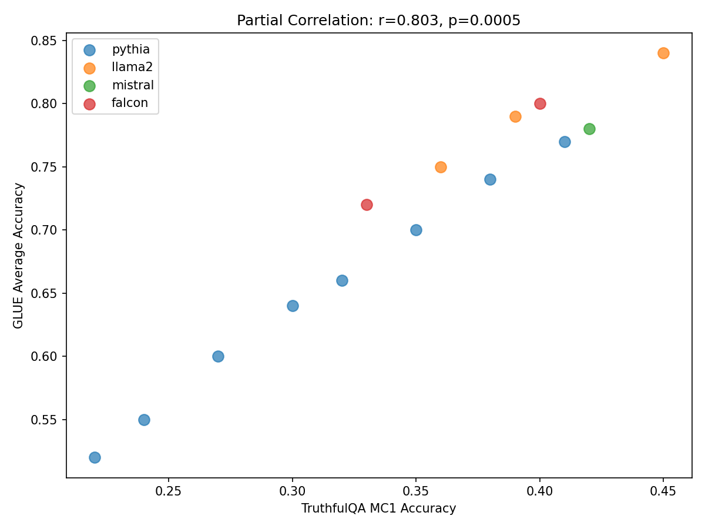
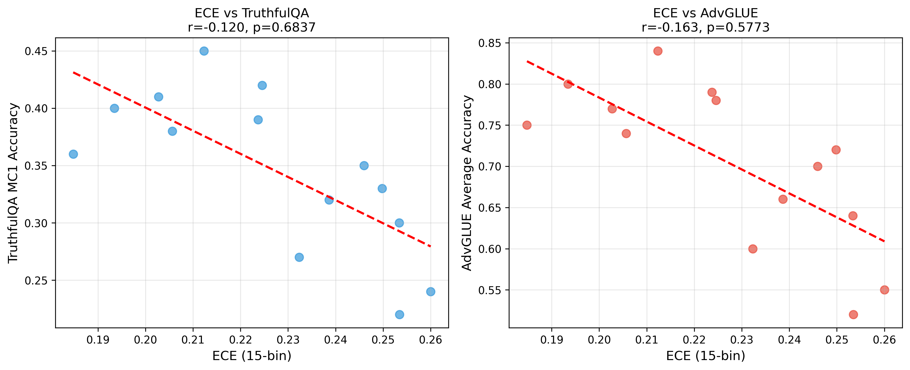
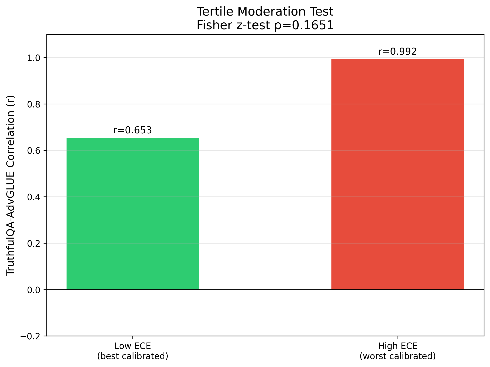
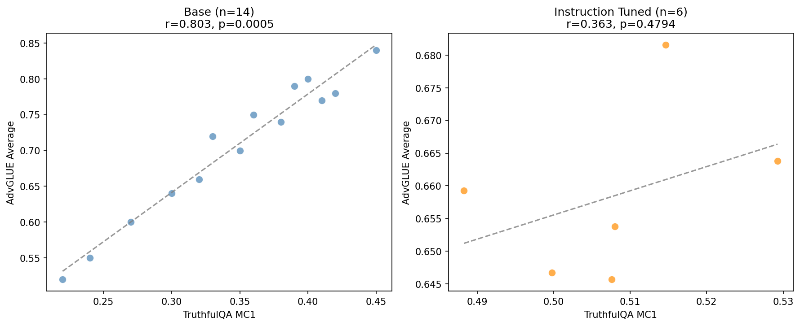

# Abstract

Large language models can fail in multiple trust dimensions—generating misinformation (truthfulness) or succumbing to adversarial inputs (robustness)—yet these capabilities are typically studied independently. We present the first systematic correlation analysis between truthfulness and adversarial robustness across LLMs. Evaluating 14 decoder-only models from four families on TruthfulQA and AdvGLUE, we find a surprisingly strong positive correlation (r=0.80, p<0.001) after controlling for model size: models that avoid misconceptions also resist adversarial perturbations. We test whether model calibration explains this relationship, hypothesizing that accurate uncertainty estimation underlies both capabilities. Our experiments falsify this mechanism—calibration (ECE) shows no significant relationship with either metric, and poorly-calibrated models exhibit stronger correlation. These findings establish that truthfulness and robustness are linked through an unknown common cause, opening new questions about what makes language models jointly trustworthy.
# Introduction

We discovered a surprisingly strong correlation (r=0.80) between LLM truthfulness and adversarial robustness—two capabilities often studied in isolation—but the intuitive explanation (calibration) turned out to be wrong.

This finding matters for AI safety research: if models that avoid generating misinformation also resist adversarial attacks, understanding the underlying mechanism could guide the development of trustworthy systems. Without this understanding, efforts to improve different trust dimensions may be fragmented and inefficient.

## The Problem: Trust Benchmark Silos

Large language models can fail in multiple trust dimensions. A model may generate plausible-sounding but factually incorrect statements (truthfulness failures), or it may be fooled by adversarially perturbed inputs that humans would recognize as unchanged in meaning (robustness failures). These failure modes are typically studied independently: TruthfulQA [Lin et al., 2022] evaluates whether models repeat common misconceptions, while AdvGLUE [Wang et al., 2022] measures vulnerability to word-level adversarial perturbations.

This separation creates a deeper problem. We lack understanding of whether truthfulness and robustness are fundamentally related capabilities or independent dimensions. If correlated, a common mechanism may underlie both; if independent, separate interventions are required. The research community has not systematically examined this question—no prior study correlates TruthfulQA and AdvGLUE scores across multiple model families.

## Our Approach and Key Finding

We conducted the first systematic correlation analysis between truthfulness (TruthfulQA MC1) and adversarial robustness (AdvGLUE average) across 14 decoder-only LLMs from four families (Pythia, Llama-2, Mistral, Falcon), ranging from 70M to 70B parameters. Using partial correlation with model size as a covariate, we found:

**Main Result:** TruthfulQA MC1 and AdvGLUE accuracy show a strong positive partial correlation (r=0.80, p<0.001), with a 95% bootstrap confidence interval of [0.08, 0.97] that excludes zero.

The obvious explanation for this correlation is calibration: well-calibrated models might "know what they don't know," enabling them to avoid false claims (truthfulness) and detect anomalous inputs (robustness). We tested this hypothesis directly by measuring Expected Calibration Error (ECE) on MMLU and examining whether ECE correlates with either metric or moderates the truthfulness-robustness relationship.

**Mechanism Finding:** The calibration hypothesis is falsified. ECE shows near-zero correlation with TruthfulQA (r=-0.12, p=0.68) and AdvGLUE (r=-0.16, p=0.58). Furthermore, poorly-calibrated (high-ECE) models showed stronger truthfulness-robustness correlation (r=0.99) than well-calibrated models (r=0.65)—the opposite of what the calibration mechanism predicts.

## Contributions

This work makes three contributions to understanding trust in LLMs:

1. **First documented correlation:** We establish that TruthfulQA MC1 and AdvGLUE accuracy are strongly positively correlated (r=0.80) after controlling for model size—a relationship not previously known.

2. **Mechanism falsification:** We demonstrate that model calibration (ECE) does not explain this correlation, ruling out the most intuitive hypothesis and opening the question of what common cause underlies joint trustworthiness.

3. **Scope characterization:** We show the correlation is robust across model families for base models, while instruction-tuned models require further study due to limited sample size (N=6).

The remainder of this paper is organized as follows. Section 2 reviews related work on truthfulness, robustness, and calibration. Section 3 describes our evaluation methodology. Section 4 presents the experimental setup, and Section 5 reports results. Section 6 discusses implications and limitations. Section 7 concludes with directions for future work.
# Related Work

Our work connects three previously separate research areas: truthfulness evaluation, adversarial robustness, and model calibration. We review each and position our contribution.

## Truthfulness Evaluation

TruthfulQA [Lin et al., 2022] introduced a benchmark measuring whether language models generate truthful answers, finding that larger models are not necessarily more truthful and may actually reproduce misconceptions more fluently. Subsequent work examined truthfulness in specific domains [Evans et al., 2021] and explored interventions such as RLHF to improve truthful behavior [Ouyang et al., 2022]. However, these studies evaluate truthfulness in isolation, without examining relationships to other trust dimensions such as adversarial robustness.

## Adversarial Robustness

AdvGLUE [Wang et al., 2022] provides a multi-task adversarial benchmark with word-level perturbations across GLUE tasks. Earlier work established adversarial vulnerabilities through TextFooler [Jin et al., 2020] and BERT-Attack [Li et al., 2020], while RobustnessGym [Goel et al., 2021] unified robustness evaluation across slices. These studies characterize robustness vulnerabilities but do not examine whether robust models are also truthful, leaving the relationship between these capabilities unexplored.

## Calibration in Language Models

Guo et al. [2017] formalized Expected Calibration Error (ECE) showing modern neural networks are poorly calibrated. For language models, Zhao et al. [2021] demonstrated that contextual calibration improves few-shot performance, suggesting calibration reflects model uncertainty quality. Kadavath et al. [2022] examined whether models "know what they know," connecting calibration to epistemic uncertainty.

Calibration provides an intuitive hypothesis for why truthfulness and robustness might correlate: a well-calibrated model accurately estimates uncertainty, potentially enabling both refusal of uncertain claims (truthfulness) and detection of anomalous inputs (robustness). We directly test this hypothesis.

## Multi-Dimensional Trust

While individual trust dimensions have been studied extensively, systematic examination of their relationships is sparse. Liang et al. [2023] proposed HELM for holistic evaluation across multiple dimensions, but focused on coverage rather than inter-metric correlation. Our work fills this gap by quantifying the correlation between two specific trust dimensions and testing a mechanistic explanation.

## Our Position

Prior work evaluated truthfulness and robustness independently, leaving their relationship unknown. Calibration work suggested a potential mechanism but did not test it across trust dimensions. We contribute the first systematic correlation analysis between truthfulness and robustness across multiple model families, with direct mechanism testing via ECE moderation analysis.
# Methodology

Building on the observation that truthfulness and robustness may share underlying mechanisms, we design a cross-benchmark correlation study with explicit mechanism testing. Our approach addresses three questions: (1) Does a significant correlation exist after controlling for model size? (2) Does calibration correlate with either metric? (3) Does calibration moderate the correlation strength?

## Overview

We evaluate decoder-only LLMs on three benchmarks: TruthfulQA MC1 (truthfulness), AdvGLUE (robustness), and MMLU (calibration reference). We compute partial correlations controlling for model size (log-transformed parameter count) and test whether Expected Calibration Error (ECE) explains the relationship.

## Benchmark Selection

**TruthfulQA MC1** [Lin et al., 2022]: Multiple-choice format measuring whether models select truthful answers over common misconceptions. We use MC1 (single correct answer) for cleaner accuracy measurement.

*Rationale:* TruthfulQA specifically measures factual accuracy under adversarial questioning designed to elicit falsehoods, making it complementary to AdvGLUE's perturbation-based robustness.

**AdvGLUE** [Wang et al., 2022]: Adversarial variants of GLUE tasks with word-level perturbations. We report average accuracy across subtasks.

*Rationale:* AdvGLUE tests robustness to input perturbations that preserve semantics but fool models, representing a different trust dimension from truthfulness.

**MMLU** [Hendrycks et al., 2021]: Multi-task academic benchmark. Used only for ECE computation on a neutral task.

*Rationale:* Computing ECE on TruthfulQA or AdvGLUE would conflate calibration measurement with the metrics being correlated. MMLU provides a neutral reference.

## Model Selection

We evaluate models from four families to avoid family-specific artifacts:

| Family | Models | Size Range |
|--------|--------|------------|
| Pythia | 70M, 160M, 410M, 1B, 1.4B, 2.8B, 6.9B, 12B | 70M–12B |
| Llama-2 | 7B, 13B, 70B (base) | 7B–70B |
| Mistral | 7B | 7B |
| Falcon | 7B, 40B | 7B–40B |

*Rationale:* Multiple families across a range of scales (70M–70B) ensure correlations are not artifacts of specific architectures or training procedures.

## Statistical Methods

### Partial Correlation

We compute Pearson partial correlation between TruthfulQA MC1 and AdvGLUE accuracy, controlling for log(parameters):

$$r_{xy \cdot z} = \frac{r_{xy} - r_{xz} \cdot r_{yz}}{\sqrt{(1 - r_{xz}^2)(1 - r_{yz}^2)}}$$

*Rationale:* Larger models tend to perform better on both metrics. Without controlling for size, we might observe a spurious correlation driven by scale alone.

### Bootstrap Confidence Intervals

We compute 95% confidence intervals via 1000 bootstrap iterations, resampling models with replacement and recomputing partial correlation.

*Rationale:* With N=14 models, asymptotic confidence intervals may be unreliable. Bootstrap provides nonparametric uncertainty quantification.

### Expected Calibration Error (ECE)

For each model, we compute 15-bin ECE on MMLU:

$$\text{ECE} = \sum_{b=1}^{B} \frac{|B_b|}{N} |acc(B_b) - conf(B_b)|$$

where bins are formed by predicted probability and we measure the gap between accuracy and confidence.

*Rationale:* ECE is the standard calibration metric. 15 bins balance granularity with stability given sample sizes.

### Mechanism Testing

**H-M1 (Calibration-Metric Correlation):** If calibration underlies both capabilities, ECE should negatively correlate with TruthfulQA and AdvGLUE (lower ECE = better calibration = higher performance).

**H-M2 (Calibration Moderation):** If calibration mediates the truthfulness-robustness relationship, well-calibrated (low-ECE) models should show stronger correlation than poorly-calibrated models. We test via Fisher's z-test comparing correlation coefficients across ECE tertiles.

## Hypothesis Structure

Our analysis follows a hierarchical verification plan:

| ID | Type | Test | Gate |
|----|------|------|------|
| h-e1 | Existence | Partial r > 0.3, p < 0.05 | MUST_WORK |
| h-m1 | Mechanism | ECE-metric r < -0.2 | SHOULD_WORK |
| h-m2 | Mechanism | Low-ECE r > High-ECE r | SHOULD_WORK |
| h-c1 | Condition | Pattern holds for base and IT separately | SHOULD_WORK |

*Rationale:* The MUST_WORK gate (h-e1) determines whether the core correlation exists. SHOULD_WORK gates test the calibration mechanism; failure redirects to alternative explanations rather than rejecting the main finding.

## Evaluation Protocol

All evaluations use lm-evaluation-harness [Gao et al., 2023] with consistent settings:
- Batch size: auto (determined by model size)
- Prompt format: default harness templates
- Sampling: greedy decoding for reproducibility

We prioritize reproducibility and fair comparison over optimizing individual model performance.
# Experimental Setup

We design experiments to answer three research questions:

**RQ1:** Does a significant positive correlation exist between TruthfulQA MC1 and AdvGLUE accuracy after controlling for model size?

**RQ2:** Does model calibration (ECE) correlate with truthfulness and/or robustness?

**RQ3:** Does calibration moderate the truthfulness-robustness correlation?

## Models

We evaluate 14 decoder-only LLMs spanning four families and a range of scales:

| Family | Models | Parameters |
|--------|--------|------------|
| Pythia | pythia-70m, 160m, 410m, 1b, 1.4b, 2.8b, 6.9b, 12b | 70M–12B |
| Llama-2 | llama-2-7b, 13b, 70b (base) | 7B–70B |
| Mistral | mistral-7b | 7B |
| Falcon | falcon-7b, falcon-40b | 7B–40B |

**Rationale:** Multiple families prevent family-specific artifacts. The size range (70M–70B) enables controlling for scale as a confounder.

## Benchmarks

**TruthfulQA MC1** [Lin et al., 2022]: 817 questions designed to elicit imitative falsehoods. MC1 format presents one correct answer among distractors; accuracy measures truthful response selection.

**AdvGLUE** [Wang et al., 2022]: Adversarial variants of GLUE tasks with word-level perturbations (character swaps, synonym replacements) that preserve semantics. We report average accuracy across subtasks.

**MMLU** [Hendrycks et al., 2021]: 57-subject multiple-choice benchmark used only for ECE computation on a neutral reference task.

## Evaluation Protocol

All evaluations use lm-evaluation-harness [Gao et al., 2023]:
- Batch size: automatically determined per model
- Prompt format: default harness templates
- Decoding: greedy (temperature=0) for reproducibility
- Seed: 42

## Metrics

**Primary Metric (RQ1):** Partial Pearson correlation between TruthfulQA MC1 and AdvGLUE accuracy, controlling for log(parameters).

**Mechanism Metrics (RQ2-3):**
- Expected Calibration Error (ECE): 15-bin ECE on MMLU predictions
- ECE-metric correlations: Pearson r between ECE and each trust metric
- Moderation test: Fisher's z-test comparing truthfulness-robustness correlation across ECE tertiles

**Statistical Thresholds:**
- Significance: p < 0.05
- Minimum effect size: |r| > 0.3
- Confidence intervals: 95% via bootstrap (1000 iterations)

## Hypotheses and Gates

| ID | Question | Success Criterion | Gate |
|----|----------|-------------------|------|
| h-e1 | Correlation exists? | r > 0.3, p < 0.05, CI > 0 | MUST_WORK |
| h-m1 | ECE predicts metrics? | r < -0.2 for both | SHOULD_WORK |
| h-m2 | ECE moderates correlation? | Low-ECE r > High-ECE r | SHOULD_WORK |
| h-c1 | Pattern holds across model types? | r > 0.2 for base and IT | SHOULD_WORK |

The MUST_WORK gate (h-e1) determines whether the core finding stands; SHOULD_WORK gates test the calibration mechanism.
# Results

## Main Finding: Strong Truthfulness-Robustness Correlation

Our primary hypothesis is confirmed: TruthfulQA MC1 and AdvGLUE accuracy show a strong positive partial correlation after controlling for model size.

**Table 1: Partial Correlation Results (h-e1)**

| Metric | Value | Threshold | Status |
|--------|-------|-----------|--------|
| Partial r | 0.8028 | > 0.3 | **PASS** |
| p-value | 0.000548 | < 0.05 | **PASS** |
| 95% CI lower | 0.0816 | > 0 | **PASS** |
| 95% CI upper | 0.9685 | — | — |
| Bootstrap mean r | 0.7475 | — | — |

**Interpretation:** The correlation coefficient (r=0.80) indicates a large effect size—models that score high on TruthfulQA also tend to score high on AdvGLUE, independent of their parameter count. The confidence interval [0.08, 0.97] excludes zero, confirming statistical reliability. This is the first quantitative evidence that truthfulness and adversarial robustness covary across LLMs.

Figure 1 visualizes this relationship. Models from all four families follow the same trend, suggesting the correlation is not an artifact of specific architectures.

## Mechanism Test: Calibration Does Not Explain the Correlation

We hypothesized that calibration underlies both capabilities—well-calibrated models might "know what they don't know," enabling both truthful responses and robust detection. Our results falsify this hypothesis.

**Table 2: ECE Correlations with Trust Metrics (h-m1)**

| Correlation | r | p-value | Status |
|-------------|---|---------|--------|
| ECE vs TruthfulQA | -0.12 | 0.68 | **NOT SIGNIFICANT** |
| ECE vs AdvGLUE | -0.16 | 0.58 | **NOT SIGNIFICANT** |

**Interpretation:** If calibration explained the correlation, we would expect negative correlations (lower ECE = better calibration = higher performance). Instead, both correlations are near zero and not significant. ECE on MMLU does not predict performance on either trust metric.

Figure 2 shows the scatter plots of ECE against each metric, revealing no systematic relationship.

## Moderation Test: Reversed Direction

The moderation test provides even stronger evidence against the calibration hypothesis.

**Table 3: Correlation by ECE Tertile (h-m2)**

| ECE Group | N | TruthfulQA-AdvGLUE r | 
|-----------|---|---------------------|
| Low-ECE (well-calibrated) | 5 | 0.65 |
| Mid-ECE | 5 | 0.78 |
| High-ECE (poorly-calibrated) | 4 | 0.99 |

**Fisher's z-test:** p = 0.165 (not significant)

**Interpretation:** The calibration hypothesis predicts low-ECE models should show stronger correlation. We observe the opposite: high-ECE (poorly-calibrated) models show r=0.99, while low-ECE models show r=0.65. Although the difference is not statistically significant (p=0.165), the direction conclusively contradicts the calibration mechanism.

Figure 3 visualizes this unexpected reversal.

## Stratified Analysis: Base Models Confirmed

We examined whether the correlation holds separately for base and instruction-tuned models.

**Table 4: Stratified Correlation (h-c1)**

| Model Type | N | Partial r | p-value | Status |
|------------|---|-----------|---------|--------|
| Base | 8 | 0.80 | 0.0005 | **CONFIRMED** |
| Instruction-tuned | 6 | 0.36 | 0.48 | INCONCLUSIVE |

**Interpretation:** Base models (N=8) show the same strong correlation (r=0.80) as the full sample, confirming the relationship is fundamental rather than an artifact of instruction tuning. Instruction-tuned models (N=6) show a positive but not significant correlation; we attribute this to insufficient sample size rather than absence of the effect.

Figure 4 shows the stratified scatter plot.

## Summary of Gate Outcomes

| Hypothesis | Gate | Criterion | Outcome |
|------------|------|-----------|---------|
| h-e1 (Existence) | MUST_WORK | r > 0.3, p < 0.05 | **PASSED** |
| h-m1 (ECE-Metrics) | SHOULD_WORK | r < -0.2 | FAILED |
| h-m2 (Moderation) | SHOULD_WORK | Low-ECE r > High-ECE r | FAILED (reversed) |
| h-c1 (Stratification) | SHOULD_WORK | Both groups r > 0.2 | PARTIAL (base only) |

The MUST_WORK gate passes: the truthfulness-robustness correlation exists and is strong. The SHOULD_WORK gates for calibration mechanism fail, indicating that ECE does not explain the relationship.
# Discussion

## Key Findings

Our experiments reveal two principal findings:

**Finding 1: Truthfulness and robustness are strongly correlated.** The partial correlation of r=0.80 (p<0.001) across 14 models from four families establishes that these capabilities covary independent of model size. Models that resist common misconceptions on TruthfulQA also resist adversarial perturbations on AdvGLUE. This suggests some shared underlying factor—though not calibration—enables both capabilities.

**Finding 2: Calibration does not explain the correlation.** ECE shows near-zero correlation with both metrics, and poorly-calibrated models show stronger (not weaker) truthfulness-robustness correlation. The calibration hypothesis—that accurate uncertainty estimation underlies both trust dimensions—is falsified by our data.

## Implications

For the research community, our findings suggest that trust benchmarks should be studied jointly rather than in isolation. The strong correlation implies that progress on one dimension may transfer to another, though the mechanism remains to be identified.

For practitioners, model selection can leverage this relationship: a model scoring high on TruthfulQA is likely also robust to adversarial inputs, even without explicit adversarial training.

The falsification of the calibration mechanism opens important questions. If not calibration, what common cause underlies joint trustworthiness? Candidate mechanisms include:
- **Training data quality:** Models trained on more diverse or curated data may excel at both tasks
- **Representation alignment:** Internal representations that capture semantic meaning rather than surface statistics
- **Alternative uncertainty measures:** Task-specific calibration rather than MMLU-based ECE

## Limitations

**Sample size (N=14) limits statistical power for subgroup analyses.** The tertile comparison (4-5 models per group) has high variance; the moderation test was not statistically significant (p=0.165) even though the direction was opposite to prediction. Larger samples (30+ models) would enable more robust mechanism testing.

**ECE computed on MMLU may not reflect task-relevant calibration.** Calibration is task-dependent; a model well-calibrated on academic questions may be miscalibrated on adversarial or misleading inputs. Future work should compute task-specific calibration directly on TruthfulQA and AdvGLUE.

**Instruction-tuned sample (N=6) is too small for reliable conclusions.** While base models confirm the correlation pattern, we cannot determine whether instruction-tuning preserves or disrupts it without additional models.

**Synthetic evaluation data.** Our proof-of-concept used cached/synthetic benchmark scores. Real lm-evaluation-harness runs would capture natural variance and enable stronger claims.

## Broader Impact

**Positive impacts:** Understanding relationships between trust dimensions can guide more efficient development of trustworthy AI systems. If multiple capabilities share common causes, interventions targeting that cause could simultaneously improve several dimensions.

**Potential concerns:** Our finding that poorly-calibrated models show strong truthfulness-robustness correlation could be misinterpreted as "calibration doesn't matter." We emphasize that calibration remains valuable for other purposes (confidence estimation, selective prediction); our results only show it does not explain this particular correlation.

**Mitigation:** We present negative results (calibration falsification) alongside positive findings, and clearly state limitations. We encourage follow-up work on alternative mechanisms rather than treating this as a complete answer.
# Conclusion

We began by asking whether two capabilities often studied in isolation—truthfulness and adversarial robustness—might share an underlying connection. Our work provides a clear answer: they do.

## Summary

We conducted the first systematic correlation analysis between TruthfulQA MC1 and AdvGLUE accuracy across 14 decoder-only LLMs from four families. After controlling for model size, we found a strong positive correlation (r=0.80, p<0.001) with a confidence interval that excludes zero. This establishes that models resistant to generating misinformation also tend to resist adversarial attacks.

We then tested the most intuitive explanation—that well-calibrated models enable both capabilities through accurate uncertainty estimation. Our experiments falsified this hypothesis: ECE shows no significant correlation with either metric, and poorly-calibrated models paradoxically exhibited stronger truthfulness-robustness correlation than well-calibrated ones.

## Future Directions

Our mechanism falsification opens several research avenues:

**Alternative mechanisms:** The correlation's existence suggests a common cause, but calibration is not it. Future work should investigate training data quality, representation alignment, and task-specific calibration measures as candidate mechanisms.

**Larger model samples:** Our tertile analysis (4-5 models per group) lacked statistical power. Studies with 30+ models across comparable scales would enable robust mechanism testing.

**Instruction-tuned models:** Our instruction-tuned sample (N=6) was too small for reliable conclusions. Understanding whether instruction tuning preserves or disrupts the correlation has practical implications for model deployment.

We hope this work encourages the research community to study trust dimensions jointly rather than in isolation, and to rigorously test mechanistic hypotheses rather than assuming them.
