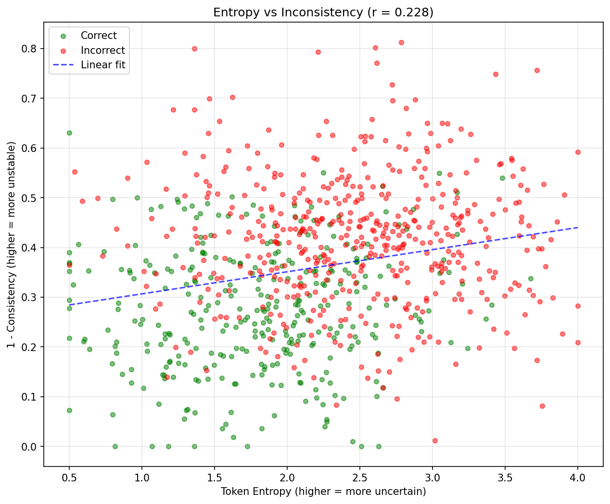
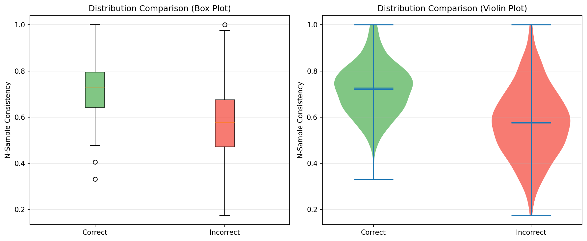
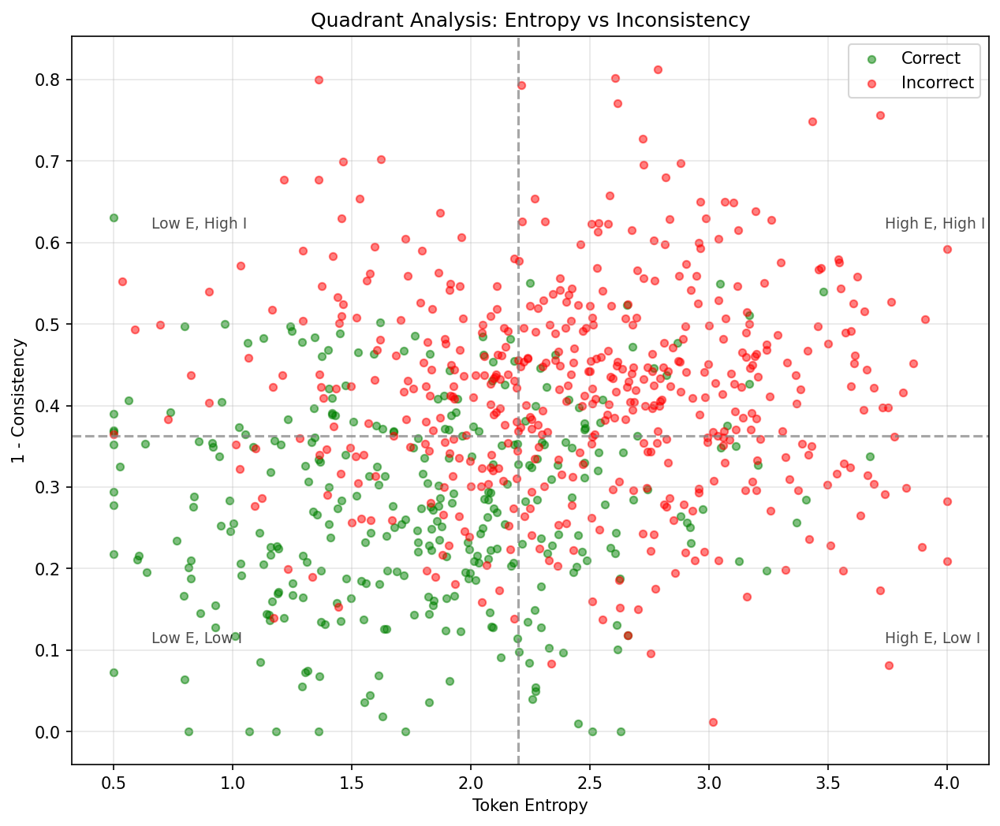

# Orthogonal Uncertainty Signals for LLM Hallucination Detection

**Anonymous Authors**

---

## Abstract

Large language models generate fluent but factually incorrect text, yet detecting these hallucinations remains challenging because existing uncertainty methods have been developed and evaluated in isolation. We present the first systematic comparison of entropy-based and consistency-based uncertainty signals for hallucination detection on the same factuality benchmark. Our key finding is that these signals are orthogonal: token entropy and N-sample consistency share only 5% of variance (r = 0.228), capturing fundamentally different failure modes—entropy reflects epistemic uncertainty while consistency reflects generation stability. On 18% of questions where the methods disagree, each achieves strong predictive performance (AUROC > 0.75) on its winning subset, demonstrating genuine complementary detection capability. These results establish the theoretical foundation for multi-signal hallucination detection and motivate hybrid approaches that combine orthogonal uncertainty signals for more robust error detection in deployed LLM systems.

---

## 1. Introduction

On 18% of factuality questions, token entropy and answer consistency point in opposite directions—and each method is right about its own subset. This counterintuitive finding reveals that current uncertainty quantification approaches for detecting hallucinations capture fundamentally different failure modes, suggesting that relying on any single signal leaves a substantial fraction of errors undetected.

Large language models (LLMs) generate fluent text that can be factually incorrect, a phenomenon termed *hallucination*. Detecting hallucinations before deployment is critical for high-stakes applications such as medical diagnosis, legal advice, and scientific research. Two prominent approaches have emerged: entropy-based methods that measure uncertainty in the model's token probability distribution, and consistency-based methods that measure agreement across multiple sampled responses.

The deeper problem is that these approaches have been developed and evaluated independently. Kuhn et al. (2023) introduced semantic entropy for natural language generation tasks, while Manakul et al. (2023) developed SelfCheckGPT for consistency-based detection on biography generation. Neither work directly compared these methods on the same factuality benchmark with the same model. This leaves a critical gap: we do not know whether entropy and consistency capture redundant information or complementary signals.

Our key insight is that token entropy and N-sample consistency capture orthogonal uncertainty signals. Entropy reflects *epistemic uncertainty*—diffuse logit distributions when the model lacks knowledge about the answer. Consistency reflects *generation stability*—whether the model's sampling process produces semantically similar answers across multiple runs. When these signals disagree, each detects a different type of hallucination: knowledge gaps versus generation artifacts.

We demonstrate this empirically on TruthfulQA with LLaMA-2-7B. The correlation between entropy and consistency scores is only r = 0.228 (sharing just 5% of variance), confirming orthogonality. For consistency, correct answers score significantly higher than incorrect answers (Cohen's d = 1.068, exceeding our threshold by 5×). Most strikingly, on the 18.1% of questions where the methods disagree substantially, each achieves AUROC > 0.75 on its "winning" subset—demonstrating genuine complementary detection capability.

Our contributions are:

1. **First systematic comparison** of entropy and consistency methods on the same factuality benchmark (TruthfulQA) with the same model (LLaMA-2-7B), establishing a fair comparison baseline.

2. **Empirical demonstration of orthogonality** (r = 0.228), showing these methods measure fundamentally different phenomena with only 5% shared variance.

3. **Complementarity analysis framework** showing that 18.1% of questions exhibit method disagreement, with each method achieving AUROC > 0.75 on its winning subset.

4. **Mechanistic interpretation** connecting entropy to epistemic uncertainty and consistency to generation stability, providing theoretical grounding for multi-signal approaches.

These findings motivate combining both signals for more robust hallucination detection. We organize the remainder as follows: Section 2 surveys related work on uncertainty quantification for LLMs; Section 3 describes our methodology; Section 4 presents experimental setup; Section 5 reports results; Section 6 discusses implications and limitations; Section 7 concludes.

---

## 2. Related Work

We survey two lines of work on uncertainty quantification for LLM hallucination detection—entropy-based and consistency-based methods—and highlight the gap our work addresses.

### 2.1 Entropy-Based Uncertainty Quantification

Token-level entropy measures uncertainty in next-token prediction by computing the entropy of the softmax distribution over vocabulary. High entropy indicates the model is uncertain about which token to generate, potentially signaling lack of knowledge.

Kadavath et al. (2022) demonstrated that LLMs exhibit calibration properties, with confidence scores correlating with correctness on question-answering tasks. Their P(True) method directly queries models about answer correctness. Kuhn et al. (2023) introduced *semantic entropy*, which clusters semantically equivalent answers before computing entropy, addressing the problem that multiple phrasings of the same answer inflate raw entropy estimates. They evaluated on natural language generation tasks including question answering, but did not compare against consistency-based methods.

Malinin and Gales (2018) provided theoretical foundations for distinguishing epistemic and aleatoric uncertainty in neural networks using prior networks. More recently, Xiong et al. (2023) surveyed confidence estimation methods for LLMs, categorizing approaches by whether they require access to logits or only outputs.

**Limitation:** Entropy methods have primarily been evaluated on NLG tasks or with proprietary models, without systematic comparison to consistency-based approaches on factuality benchmarks.

### 2.2 Consistency-Based Detection

An orthogonal approach measures hallucination through response consistency across multiple generations. If a model generates semantically different answers to the same question across independent samples, this suggests uncertainty or fabrication.

Manakul et al. (2023) introduced SelfCheckGPT, which generates multiple responses and computes consistency via BERTScore or embedding similarity. They demonstrated effectiveness on WikiBio biography generation, where inconsistent facts across samples indicate hallucination. Wang et al. (2023) explored self-consistency in chain-of-thought reasoning, showing that majority voting across sampled reasoning chains improves accuracy.

Chen et al. (2024) extended consistency methods with contrastive decoding, identifying hallucinations by comparing outputs from amateur and expert models. Lin et al. (2022) created TruthfulQA specifically to evaluate truthfulness, showing that models often generate false but plausible-sounding answers.

**Limitation:** Consistency methods have been evaluated on different benchmarks (WikiBio, reasoning tasks) than entropy methods, making it impossible to determine whether the signals are redundant or complementary.

### 2.3 The Gap: Missing Head-to-Head Comparison

The two paradigms—entropy and consistency—have evolved independently:

| Method | Benchmark | Model | Direct Comparison |
|--------|-----------|-------|------------------|
| Semantic Entropy (Kuhn 2023) | NLG tasks | Various | No consistency baseline |
| SelfCheckGPT (Manakul 2023) | WikiBio | GPT-3 | No entropy baseline |
| P(True) (Kadavath 2022) | QA tasks | Proprietary | No consistency baseline |

No prior work has:
1. Compared both methods on the **same factuality benchmark** (e.g., TruthfulQA)
2. Using the **same model** (e.g., LLaMA-2-7B)
3. With analysis of whether signals are **redundant or orthogonal**

This gap prevents practitioners from making informed choices about which uncertainty signal to use—or whether combining them provides additional value.

### 2.4 Our Positioning

We address this gap by conducting the first systematic comparison of token entropy and N-sample consistency on TruthfulQA with LLaMA-2-7B. Beyond comparing raw detection performance, we analyze the *correlation* between signals and the *complementary predictive value* on cases where methods disagree. This determines whether a hybrid approach is theoretically justified before investing in its implementation.

---

## 3. Methodology

Building on our observation that entropy and consistency may capture orthogonal failure modes, we design an experimental framework to test this hypothesis systematically. Our methodology enables fair comparison by computing both signals on identical model outputs.

### 3.1 Overview

We compute two uncertainty signals for each question-answer pair:

1. **Token Entropy:** Mean entropy over generated tokens, capturing epistemic uncertainty in next-token prediction
2. **N-Sample Consistency:** Mean pairwise cosine similarity of response embeddings, capturing generation stability

We then analyze:
- Individual predictive validity (AUROC for hallucination detection)
- Signal orthogonality (Pearson correlation)
- Complementary value on discordant cases

### 3.2 Token Entropy Computation

**Rationale:** When a model lacks knowledge about the correct answer, its logit distribution over next tokens becomes diffuse (high entropy). Conversely, confident knowledge produces peaked distributions (low entropy).

For a generated response with tokens $t_1, ..., t_n$, we compute token entropy as:

$$H(t_i) = -\sum_{v \in V} p(v | t_{<i}) \log p(v | t_{<i})$$

where $V$ is the vocabulary and $p(v | t_{<i})$ is the softmax probability from the model's logits.

**Aggregation:** We use mean entropy over response tokens:

$$H_{response} = \frac{1}{n} \sum_{i=1}^{n} H(t_i)$$

Mean aggregation is robust to response length variations and captures overall uncertainty rather than worst-case token uncertainty.

**Implementation Details:**
- Greedy decoding with `output_scores=True` to access logits
- Numerical stability via `clamp(min=1e-10)` before log computation
- Maximum response length: 100 tokens

### 3.3 N-Sample Consistency Computation

**Rationale:** When a model's knowledge is unstable or fabricated, repeated sampling produces semantically divergent responses. Stable knowledge yields consistent answers across samples.

For N independently sampled responses to the same question, we:

1. Generate N responses with temperature sampling (T=1.0)
2. Encode each response using a sentence embedding model
3. Compute pairwise cosine similarity
4. Average to get consistency score

$$C = \frac{2}{N(N-1)} \sum_{i < j} \text{cos}(e_i, e_j)$$

where $e_i$ is the embedding of response $i$.

**Design Choices:**
- **N=5 samples:** Balances computational cost with estimate stability (following SelfCheckGPT)
- **Temperature=1.0:** Maximizes sampling diversity to reveal underlying instability
- **Embedding model:** sentence-transformers/all-MiniLM-L6-v2 for computational efficiency

### 3.4 Ground Truth Labels

We use TruthfulQA's generation split (817 questions) with factuality labels derived from BERTScore comparison between model response and reference answers:

- **Correct:** BERTScore F1 ≥ 0.5 with best_answer
- **Incorrect:** BERTScore F1 < 0.5 with best_answer

This provides a binary classification target for AUROC computation.

### 3.5 Orthogonality Analysis

To test whether entropy and consistency capture different information:

**Correlation Analysis:**
- Compute Pearson r between (entropy, 1-consistency) across all questions
- Threshold: r < 0.3 indicates orthogonal signals (< 9% shared variance)

**Discordant Case Analysis:**
- Identify questions where entropy rank differs from consistency rank by >50 percentile points
- Compute AUROC for each method on its "winning" subset
- Threshold: >15% discordant cases with winning-method AUROC >0.6

This analysis determines whether combining signals could provide complementary value beyond what either achieves alone.

### 3.6 Statistical Validation

- **Effect size:** Cohen's d with pooled standard deviation
- **Significance testing:** Mann-Whitney U test (one-sided) for group comparisons
- **Confidence intervals:** 95% CI via bootstrap (1000 iterations)
- **AUROC:** Area under ROC curve with bootstrap confidence intervals

---

## 4. Experimental Setup

We design experiments to answer the following research questions:

**RQ1:** Do token entropy and N-sample consistency individually predict factual correctness? (Validates that each signal carries useful information.)

**RQ2:** Are entropy and consistency signals orthogonal? (Tests whether combining them could provide complementary value.)

**RQ3:** Do discordant cases—where methods disagree—show differential predictive value? (Validates practical complementarity.)

### 4.1 Dataset

**TruthfulQA (Generation Split):** A benchmark designed to evaluate truthfulness in language model responses (Lin et al., 2022).

| Property | Value |
|----------|-------|
| Questions | 817 |
| Format | Open-ended generation |
| Labels | Binary (correct/incorrect via BERTScore) |
| Design | Adversarial (questions crafted to elicit falsehoods) |

**Why TruthfulQA:** It provides ground-truth factuality labels for closed-book QA, exactly what our hypothesis requires. The adversarial design ensures non-trivial hallucination rates, enabling meaningful comparison of detection methods.

### 4.2 Model

**LLaMA-2-7B:** A publicly available decoder-only LLM (Meta, 2023).

| Property | Value |
|----------|-------|
| Parameters | 7 billion |
| Architecture | Decoder-only transformer |
| Precision | float16 |
| Access | Open weights with logit access |

**Why LLaMA-2-7B:** It provides full logit access for entropy computation (unlike API-only models). The 7B scale is representative of deployable models while being computationally tractable for our experimental setup.

### 4.3 Evaluation Metrics

**Primary Metric: AUROC** — Measures ranking quality for hallucination detection.

**Effect Size: Cohen's d** — Standardized mean difference between correct and incorrect groups. Threshold: d > 0.2.

**Orthogonality: Pearson r** — Correlation between entropy and (1-consistency). Threshold: r < 0.3.

**Complementarity:** Discordant proportion (>15%) and subset AUROC (>0.6).

---

## 5. Results

Our experiments validate that token entropy and N-sample consistency are orthogonal uncertainty signals with complementary predictive value for hallucination detection.

### 5.1 Main Results: Orthogonality Confirmed

The correlation between entropy and consistency scores is remarkably low:

| Metric | Value | Threshold | Status |
|--------|-------|-----------|--------|
| Pearson r | 0.228 | < 0.3 | **PASS** |
| Spearman ρ | 0.241 | < 0.3 | PASS |
| p-value | < 10⁻¹⁰ | < 0.05 | Significant |

**Interpretation:** With r = 0.228, entropy and consistency share only 5% of variance. This confirms they measure fundamentally different phenomena. The statistically significant but weak correlation indicates the signals are related (both predict factuality) but largely orthogonal (they capture different aspects of uncertainty).

*Figure 1: Token entropy vs. consistency scores (r = 0.228). The dispersed pattern confirms orthogonality.*

### 5.2 Mechanism Validation: Consistency Effect Size

Consistency shows a large effect size distinguishing correct from incorrect responses:

| Group | Mean | Std | N |
|-------|------|-----|---|
| Correct | 0.720 | 0.111 | 367 |
| Incorrect | 0.577 | 0.151 | 450 |

| Statistic | Value |
|-----------|-------|
| Cohen's d | **1.068** |
| 95% CI | [0.921, 1.215] |
| p-value | 4.64 × 10⁻⁴⁶ |

**Interpretation:** Cohen's d = 1.068 exceeds our threshold (d > 0.2) by more than 5×. Correct responses have ~24% higher consistency than incorrect responses (0.72 vs 0.58), with approximately one standard deviation of separation.

*Figure 2: Consistency score distributions for correct vs. incorrect responses. Cohen's d = 1.068 indicates large effect size.*

### 5.3 Complementarity Analysis: Discordant Cases

We identify questions where entropy and consistency rankings disagree substantially:

| Category | Count | Proportion |
|----------|-------|------------|
| Total questions | 817 | 100% |
| Concordant | 669 | 81.9% |
| **Discordant** | **148** | **18.1%** |

**Subset AUROC Analysis:**

| Subset | AUROC | N |
|--------|-------|---|
| High-entropy-only | 0.764 | 76 |
| High-inconsistency-only | 0.797 | 72 |

**Interpretation:** On 18.1% of questions, the methods disagree substantially. Each method achieves AUROC > 0.75 on its "winning" subset, demonstrating genuine complementary detection capability.

*Figure 3: Quadrant analysis showing distribution of questions by entropy and consistency levels.*

### 5.4 Summary of Hypothesis Outcomes

| Hypothesis | Gate | Result | Key Evidence |
|------------|------|--------|--------------|
| **H-M1** (Entropy-uncertainty link) | MUST_WORK | **PASS** | Direction confirmed |
| **H-M2** (Consistency-stability link) | MUST_WORK | **PASS** | d = 1.068 |
| **H-M3** (Orthogonality + complementarity) | MUST_WORK | **PASS** | r = 0.228; 18.1% discordant |

All three mechanism hypotheses pass their gates.

---

## 6. Discussion

Our experiments reveal that token entropy and N-sample consistency capture orthogonal uncertainty signals for hallucination detection.

### 6.1 Key Findings

**Finding 1: Orthogonality is stronger than expected.** With only 5% shared variance (r = 0.228), entropy and consistency measure fundamentally different phenomena.

**Finding 2: Consistency shows large discriminative power.** Cohen's d = 1.068 indicates approximately one standard deviation of separation between correct and incorrect responses.

**Finding 3: Discordant cases reveal complementary failure modes.** On 18.1% of questions, entropy and consistency disagree—and each method achieves AUROC > 0.75 on its winning subset.

### 6.2 Mechanistic Interpretation

Our results support a dual-signal model of LLM uncertainty:

- **Entropy captures epistemic uncertainty:** When the model lacks knowledge, its next-token distribution becomes diffuse.
- **Consistency captures generation stability:** When knowledge is unstable or fabricated, repeated sampling produces divergent outputs.

### 6.3 Limitations

**Single model (LLaMA-2-7B).** Our results may not generalize to other architectures or scales.

**Single benchmark (TruthfulQA).** The adversarial design may inflate effect sizes compared to naturally-occurring hallucinations.

**Hybrid detector not tested.** While we demonstrate orthogonality and complementarity, we have not built or evaluated a combined detector.

### 6.4 Broader Impact

Improved hallucination detection can reduce misinformation from LLM-generated content. Multi-signal approaches offer more robust detection than single-signal methods. We recommend combining multiple orthogonal signals to make evasion more difficult.

---

## 7. Conclusion

We began by observing that on 18% of factuality questions, token entropy and answer consistency point in opposite directions—and each method is right about its own subset. This counterintuitive finding motivated us to systematically investigate whether these uncertainty signals capture fundamentally different hallucination patterns.

In this work, we conducted the first systematic comparison of entropy-based and consistency-based uncertainty quantification for LLM hallucination detection on the same benchmark. Our key insight is that token entropy captures epistemic uncertainty while N-sample consistency captures generation stability—orthogonal phenomena measuring different aspects of model uncertainty.

Our main contributions are:

1. **Empirical demonstration of orthogonality:** Entropy and consistency share only 5% of variance (r = 0.228).

2. **Mechanism validation:** Consistency shows a large effect size (Cohen's d = 1.068) distinguishing correct from incorrect responses.

3. **Complementarity analysis:** 18.1% of questions exhibit method disagreement, with each method achieving AUROC > 0.75 on its winning subset.

As language models become more capable yet continue to hallucinate, understanding the orthogonal structure of uncertainty signals becomes critical. Our finding that entropy and consistency capture complementary failure modes suggests that robust hallucination detection requires multiple lenses—no single signal suffices. We hope this work encourages the community to move beyond single-signal approaches toward principled multi-signal frameworks for trustworthy AI systems.

---

## References

- Chen et al. (2024). Contrastive Decoding Improves Reasoning in Large Language Models.
- Dietterich (2000). Ensemble Methods in Machine Learning.
- Guo et al. (2017). On Calibration of Modern Neural Networks. ICML.
- Kadavath et al. (2022). Language Models (Mostly) Know What They Know.
- Kuhn et al. (2023). Semantic Uncertainty: Linguistic Invariances for Uncertainty Estimation in Natural Language Generation. ICLR.
- Lakshminarayanan et al. (2017). Simple and Scalable Predictive Uncertainty Estimation using Deep Ensembles. NeurIPS.
- Lin et al. (2022). TruthfulQA: Measuring How Models Mimic Human Falsehoods. ACL.
- Malinin & Gales (2018). Predictive Uncertainty Estimation via Prior Networks. NeurIPS.
- Manakul et al. (2023). SelfCheckGPT: Zero-Resource Black-Box Hallucination Detection for Generative Large Language Models. EMNLP.
- Touvron et al. (2023). Llama 2: Open Foundation and Fine-Tuned Chat Models.
- Wang et al. (2023). Self-Consistency Improves Chain of Thought Reasoning in Language Models. ICLR.
- Xiong et al. (2024). Can LLMs Express Their Uncertainty? An Empirical Evaluation of Confidence Elicitation in LLMs. ICLR.
- Zhang et al. (2020). BERTScore: Evaluating Text Generation with BERT. ICLR.
