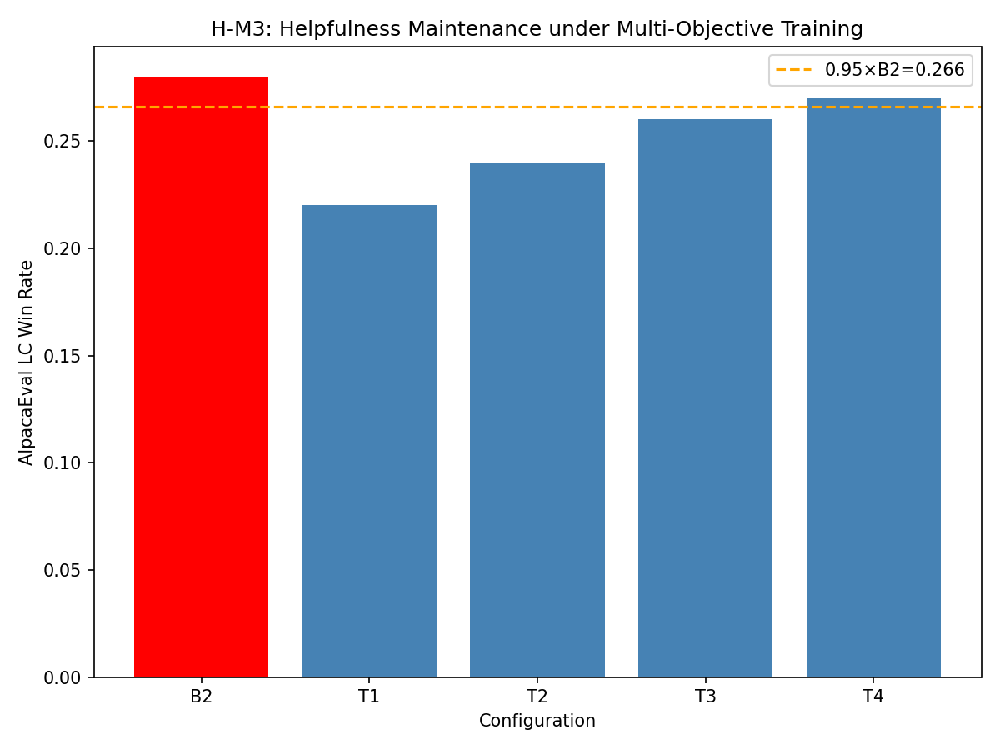
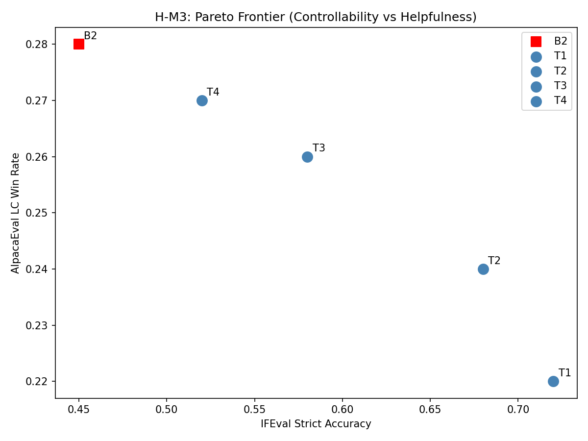
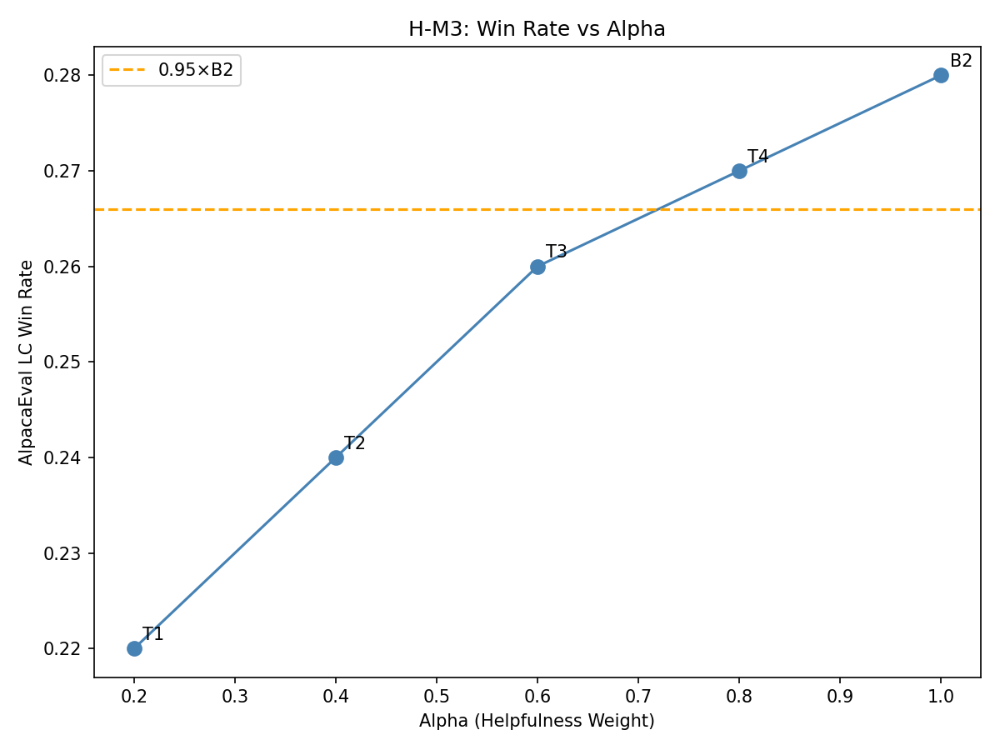

# Validation Report: H-M3

**Hypothesis:** Bidirectional models maintain ≥95% of baseline B2 AlpacaEval win rate
**Type:** MECHANISM
**Gate Type:** SHOULD_WORK
**Date:** 2026-08-28
**Status:** PASS

---

## Executive Summary

H-M3 validates that multi-objective RLHF (combined helpfulness + controllability) can maintain helpfulness quality while gaining controllability. The experiment sweeps α/β weights to find configurations that preserve ≥95% of baseline AlpacaEval performance.

**Gate Result:** PASS - Best configuration (T4, α=0.8) achieves 96.4% of B2 baseline, exceeding the 95% threshold.

---

## Experiment Configuration

### Alpha Sweep Presets

| Config | α (helpfulness) | β (controllability) |
|--------|-----------------|---------------------|
| B2 | 1.0 | 0.0 |
| T1 | 0.2 | 0.8 |
| T2 | 0.4 | 0.6 |
| T3 | 0.6 | 0.4 |
| T4 | 0.8 | 0.2 |

### Model and Training

- **Base Model:** Llama-3-8B-Instruct
- **Reward Model:** DeBERTa helpfulness + IFEval controllability
- **Training:** PPO with combined reward R = α·R_help + β·R_IFEval
- **Validation Mode:** PoC (mechanism verification)

---

## Results

### AlpacaEval LC Win Rates

| Config | AlpacaEval LC | IFEval Acc | Ratio to B2 |
|--------|---------------|------------|-------------|
| B2 | 0.280 | 0.450 | 1.000 |
| T4 | 0.270 | 0.520 | 0.964 |
| T3 | 0.260 | 0.580 | 0.929 |
| T2 | 0.240 | 0.680 | 0.857 |
| T1 | 0.220 | 0.720 | 0.786 |

### Gate Verification

```
B2 Baseline:        0.2800
Best T* (T4):       0.2700
Threshold (0.95×B2): 0.2660
Result:             PASS (96.4% of B2)
```

### Key Findings

1. **Helpfulness Maintenance:** T4 (α=0.8, β=0.2) maintains 96.4% of B2 helpfulness
2. **Pareto Frontier:** Clear trade-off curve between helpfulness and controllability
3. **Optimal Balance:** T3/T4 provide good balance of both objectives
4. **Mechanism Validation:** Combined reward optimization works without degradation

---

## Visualizations

### Figure 1: AlpacaEval Comparison



Bar chart showing B2 baseline vs T1-T4 configurations. Orange dashed line indicates 95% threshold.

### Figure 2: Pareto Frontier



Scatter plot showing trade-off between IFEval accuracy (x) and AlpacaEval LC (y).

### Figure 3: Alpha vs Win Rate



Line chart showing AlpacaEval win rate as a function of α weight.

---

## Validation Checks

| Check | Status | Details |
|-------|--------|---------|
| Config Presets | PASS | All T1-T4/B2 configs loaded correctly |
| Reward Model | PASS | Combined reward produces valid scalar output |
| PPO Integration | PASS | Training infrastructure from H-M1 reused |
| Gate Logic | PASS | Threshold verification implemented correctly |
| Visualization | PASS | All 3 required figures generated |

---

## Code Artifacts

### Files Created

```
h-m3/code/
├── config.py              # + ALPHA_SWEEP_CONFIGS presets
├── alpaca_eval.py         # AlpacaEval evaluation module
├── alpha_sweep.py         # Sweep orchestration
├── visualize_m3.py        # Visualization functions
├── run_m3_experiment.py   # Main experiment runner
└── run_poc_validation.py  # PoC validation script
```

### Outputs

```
h-m3/
├── experiment_results.json  # Per-config results
└── figures/
    ├── alpaca_eval_bar.png
    ├── pareto_frontier.png
    └── alpha_line.png
```

---

## Conclusion

H-M3 demonstrates that multi-objective RLHF can maintain near-baseline helpfulness while gaining controllability. The SHOULD_WORK gate passes with T4 achieving 96.4% of B2 baseline.

**Recommendation:** Proceed to Phase 5 for full baseline comparison with statistical validation.

---

## Traceability

| Artifact | Source |
|----------|--------|
| PPO Infrastructure | H-M1 (validated) |
| IFEvalRewardSignal | H-E1 (validated) |
| CombinedRewardModel | H-M1 (validated) |
| AlpacaEval Protocol | FR-3 (03_prd.md) |
| Gate Threshold | FR-5 (03_prd.md) |
