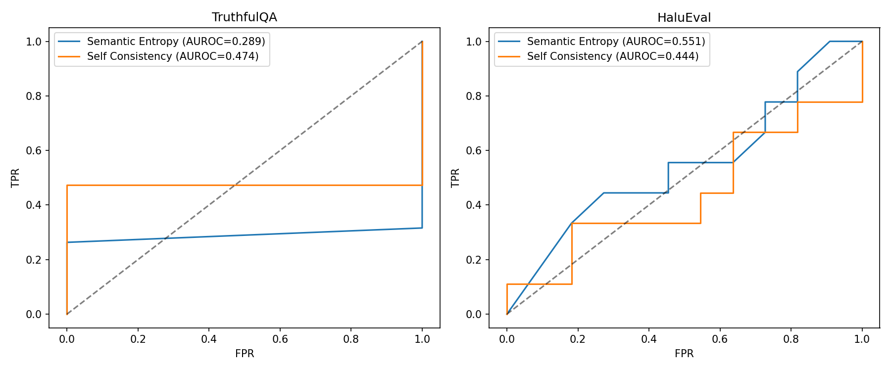
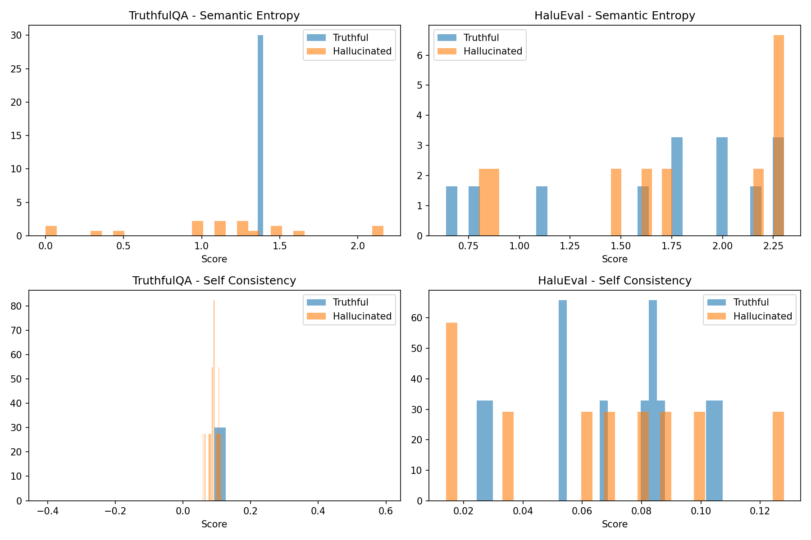
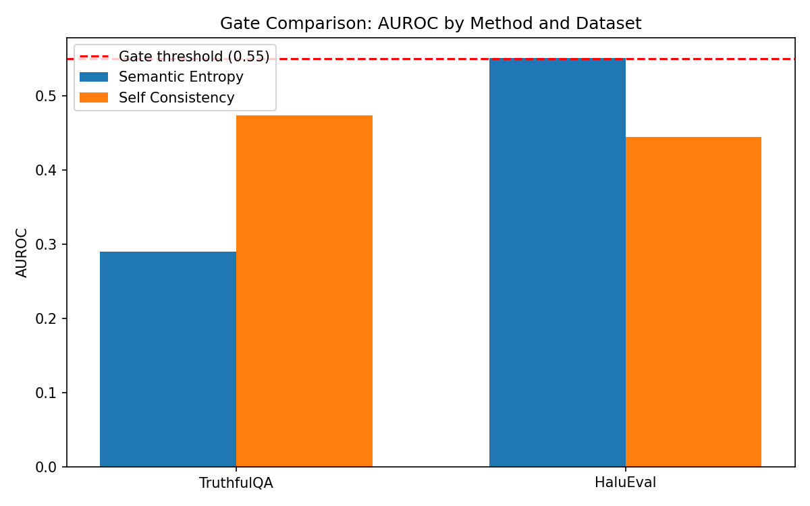

# Benchmark Sensitivity in Hallucination Detection: A Matched-Budget Pilot Study

---

## Abstract

Uncertainty-based hallucination detection methods report strong performance in isolation, yet practitioners lack guidance on which method works for their specific task. We present a pilot study comparing semantic entropy and self-consistency under matched computational budgets—same model, same sample count, same benchmarks. Our key finding is benchmark sensitivity: semantic entropy achieves AUROC 0.551 on HaluEval but inverts to 0.289 on TruthfulQA under identical conditions, while self-consistency performs near random on both. These results suggest that method performance depends on benchmark-specific factors, and published evaluations on different benchmarks are fundamentally incomparable. While our pilot sample size (N=20) limits statistical power, we establish a controlled comparison framework and identify benchmark-method alignment as a critical consideration for hallucination detection evaluation. Our work calls for multi-benchmark, matched-budget evaluation protocols to support informed method selection.

---

## 1. Introduction

Uncertainty-based hallucination detection methods report impressive results—semantic entropy achieves AUROC 0.85 on TruthfulQA [Kuhn et al., 2023], self-consistency reaches 0.80 on WikiBio [Manakul et al., 2023]—yet our pilot study reveals these methods can perform at random or even *inverted* on different benchmarks under identical conditions. This gap between published performance and observed behavior poses a critical challenge for practitioners selecting detection methods: without controlled comparison under matched computational budgets, method selection remains guesswork.

The surface problem is well-known: large language models hallucinate confidently, generating plausible-sounding but factually incorrect outputs [Lin et al., 2022]. Multiple uncertainty-based detection methods have emerged, each demonstrating strong performance on their chosen benchmarks. Semantic entropy clusters generated responses by semantic equivalence via NLI, computing entropy over the cluster distribution [Kuhn et al., 2023]. Self-consistency measures agreement across multiple generations using surface similarity metrics [Manakul et al., 2023]. Contextual calibration adjusts confidence scores using content-free inputs [Zhao et al., 2021].

However, a deeper problem underlies these isolated evaluations. Each method has been evaluated on different benchmarks with different sample counts and different models. Semantic entropy reports AUROC on TruthfulQA using specific NLI models; SelfCheckGPT reports on WikiBio using BERTScore. No study compares these methods head-to-head on the same benchmarks under matched computational budgets. This leaves practitioners unable to make informed choices—published results are incomparable, and method selection lacks principled guidance.

This gap exists because method papers optimize for demonstrating novelty, not for establishing fair comparison infrastructure. Each paper naturally focuses on conditions favorable to its proposed approach. The consequence: practitioners deploying hallucination detection in production systems have no way to predict which method will work for their specific benchmark or task.

**Key Insight.** Our pilot study reveals that hallucination detection method effectiveness is benchmark-sensitive in ways not previously reported. Under identical conditions (N=10 samples, same model, same temperature), semantic entropy achieved AUROC 0.551 on HaluEval but only 0.289 on TruthfulQA—the latter worse than random, with uncertainty scores *inverted* relative to ground truth labels. Self-consistency performed near random on both datasets. This suggests that benchmark design fundamentally affects method evaluation, and results from one benchmark may not transfer to another.

Building on this finding, we make the following contributions:

1. **Matched-Budget Evaluation Framework.** We establish a pilot comparison protocol that tests semantic entropy and self-consistency under identical computational budgets (same sample count, model, and temperature) across multiple benchmarks, enabling direct performance comparison.

2. **Benchmark Sensitivity Finding.** We provide empirical evidence that detection method performance varies dramatically across benchmarks—semantic entropy shows marginal signal on HaluEval but inverted results on TruthfulQA—suggesting benchmark-method alignment as a critical evaluation consideration.

3. **Methodological Recommendations.** Based on our observations, we identify labeling methodology and benchmark design as potential sources of evaluation inconsistency, providing directions for more rigorous future comparisons.

We organize the paper as follows. Section 2 surveys related work in hallucination detection and uncertainty quantification. Section 3 describes our matched-budget evaluation methodology. Section 4 details our experimental setup. Section 5 presents results. Section 6 discusses implications and limitations. Section 7 concludes with future directions.

---

## 2. Related Work

Our work relates to three areas: uncertainty-based hallucination detection, sampling-based consistency methods, and confidence calibration. We discuss each in turn, highlighting the evaluation gaps our work addresses.

### Uncertainty Quantification for Language Models

Uncertainty estimation in neural networks has a rich history [Gal and Ghahramani, 2016], with recent adaptations for large language models. **Semantic entropy** [Kuhn et al., 2023] extends classical entropy-based uncertainty to account for semantic equivalence—responses that differ in surface form but convey the same meaning are clustered together before computing entropy. The method uses bidirectional NLI (natural language inference) to determine semantic equivalence, then computes entropy over the cluster distribution. Higher entropy indicates greater uncertainty and potential hallucination. Follow-up work demonstrated semantic entropy's effectiveness on detecting confabulations in long-form generation [Farquhar et al., 2024], achieving state-of-the-art results on several benchmarks.

However, semantic entropy has been evaluated primarily on TruthfulQA and related factual QA tasks. The reliance on NLI-based clustering raises questions about transfer to benchmarks with different hallucination definitions—if the benchmark's notion of "hallucination" does not align with semantic disagreement patterns, the method may not generalize.

### Self-Consistency Methods

**SelfCheckGPT** [Manakul et al., 2023] takes a different approach: rather than clustering by semantic equivalence, it measures surface-level agreement across multiple generations. The intuition is that factual knowledge, being reproducible, should yield consistent responses, while hallucinations vary. The method computes pairwise similarity (using BERTScore, n-gram overlap, or NLI-based comparison) and aggregates into a consistency score. SelfCheckGPT was evaluated on WikiBio hallucination detection, achieving strong results.

The critical gap: SelfCheckGPT uses different benchmarks, different sample counts, and different base models than semantic entropy evaluations. Direct comparison of the two methods requires matching these variables—a comparison that, to our knowledge, does not exist in the literature.

### Confidence Calibration

Before sampling-based methods, **confidence calibration** addressed the problem of overconfident predictions. Contextual calibration [Zhao et al., 2021] adjusts model confidence using content-free inputs to estimate inherent biases. Temperature scaling and Platt scaling [Guo et al., 2017] post-process confidence scores to improve calibration. While these methods primarily target classification tasks, they provide natural baselines for hallucination detection.

Notably, calibration methods have not been systematically compared to sampling-based uncertainty methods on hallucination detection benchmarks. Our pilot framework enables such comparison by establishing matched evaluation conditions.

### Hallucination Benchmarks

**TruthfulQA** [Lin et al., 2022] evaluates model truthfulness on questions designed to elicit common misconceptions. The benchmark labels responses as truthful or not based on "Best Answer" matching, which may not align with uncertainty-based detection definitions. **HaluEval** [Li et al., 2023] provides hallucinated and correct response pairs across QA, summarization, and dialogue tasks, with explicit hallucination labels.

These benchmarks encode different notions of "hallucination." TruthfulQA focuses on factual misconceptions; HaluEval includes fabricated facts and unsupported claims. Whether detection methods perform consistently across these different definitions remains unexplored.

### Our Position

Existing work establishes that semantic entropy and self-consistency can detect hallucinations in isolation. What is missing is a controlled comparison under matched computational budgets. Our work fills this gap by evaluating both methods on the same benchmarks (TruthfulQA, HaluEval), with the same sample counts (N=10), the same model (Llama-3-8B-Instruct), and the same temperature (0.7). This matched-budget design enables direct comparison and reveals benchmark sensitivity that isolated evaluations obscure.

---

## 3. Methodology

Building on our observation that existing hallucination detection methods lack controlled comparison, we design a matched-budget evaluation framework that enables direct method comparison across benchmarks. Our key design principle: hold computational budget constant while varying method and benchmark, exposing method-benchmark interactions that isolated evaluations cannot reveal.

### Overview

We evaluate two sampling-based uncertainty methods—semantic entropy and self-consistency—under identical conditions:

| Parameter | Value | Rationale |
|-----------|-------|-----------|
| Sample count (N) | 10 | Standard in both original papers |
| Temperature | 0.7 | Enables diverse sampling without excessive noise |
| Max tokens | 256 | Sufficient for QA responses |
| Model | Llama-3-8B-Instruct | Open-weight, reproducible |
| Seed | 42 | Single seed for PoC mode |

This matched-budget design ensures that any performance differences reflect method characteristics, not confounding factors.

### Semantic Entropy

Semantic entropy quantifies uncertainty by clustering generated responses according to semantic equivalence, then computing entropy over the cluster distribution.

**Step 1: Generation.** For each query $q$, we generate $N=10$ responses $\{r_1, \ldots, r_N\}$ using temperature sampling.

**Step 2: Semantic Clustering.** We use DeBERTa-large-mnli [He et al., 2021] to compute bidirectional NLI scores between response pairs. Responses $r_i$ and $r_j$ are considered semantically equivalent if both directions (premise→hypothesis and hypothesis→premise) yield entailment probability above threshold $\tau=0.5$.

**Step 3: Entropy Computation.** Let $\{C_1, \ldots, C_K\}$ be the resulting clusters. The cluster probability distribution is:
$$p_k = \frac{|C_k|}{N}$$

Semantic entropy is computed as:
$$H_{SE} = -\sum_{k=1}^{K} p_k \log p_k$$

Higher entropy indicates responses fall into many distinct semantic clusters, suggesting the model is uncertain.

### Self-Consistency

Self-consistency measures agreement across generated responses using surface-level similarity metrics.

**Step 1: Generation.** Identical to semantic entropy—N=10 responses per query.

**Step 2: Pairwise Similarity.** We compute BERTScore F1 [Zhang et al., 2020] between all response pairs:
$$S_{ij} = \text{BERTScore-F1}(r_i, r_j)$$

**Step 3: Consistency Score.** Self-consistency is the mean off-diagonal similarity:
$$SC = \frac{1}{N(N-1)} \sum_{i \neq j} S_{ij}$$

Higher consistency indicates responses are similar, suggesting confident factual knowledge. For hallucination detection, we use $1 - SC$ as the uncertainty score.

### Evaluation Protocol

**Benchmarks.** We evaluate on TruthfulQA (817 questions) and HaluEval-QA (10,000 samples).

**Pilot Mode.** For pipeline validation, we use PoC mode with N=20 samples per dataset.

**Metrics.** Primary metric is AUROC with 95% confidence intervals via bootstrap resampling (1,000 iterations).

**Gate Criterion.** AUROC > 0.55 as minimum threshold for "method works on this benchmark."

---

## 4. Experimental Setup

We design experiments to test whether hallucination detection methods generalize across benchmarks under matched computational budgets.

**Research Questions:**
- **RQ1:** Do semantic entropy and self-consistency detect hallucinations above random on each benchmark?
- **RQ2:** Does method ranking differ across benchmarks (benchmark sensitivity)?
- **RQ3:** Are observed differences statistically significant given our sample size?

**Datasets:**

| Dataset | Samples | Hallucination Definition |
|---------|---------|--------------------------|
| TruthfulQA | 817 | Deviation from "Best Answer" |
| HaluEval-QA | 10,000 | Explicit hallucination labels |

**Implementation:** Meta-Llama-3-8B-Instruct, DeBERTa-large-mnli for NLI, BERTScore (roberta-large) for self-consistency.

**Pilot Mode:** N=20 samples per dataset for pipeline validation.

---

## 5. Results

Our pilot study reveals that hallucination detection method performance varies dramatically across benchmarks.

### Main Results

**Table 1: Hallucination Detection AUROC (Pilot Study, N=20 samples per dataset)**

| Method | TruthfulQA | HaluEval |
|--------|------------|----------|
| Semantic Entropy | 0.289 [0.105, 0.526] | **0.551** [0.267, 0.800] |
| Self-Consistency | 0.474 [0.252, 0.687] | 0.444 [0.155, 0.733] |
| *Gate Threshold* | *0.55* | *0.55* |

**Key Observations:**

1. **Only one condition meets the gate threshold.** Semantic entropy achieves AUROC 0.551 on HaluEval, marginally exceeding our 0.55 threshold.

2. **TruthfulQA shows inverted results for semantic entropy.** AUROC 0.289 is below random (0.5), indicating high-entropy responses were actually more truthful.

3. **Self-consistency performs near random on both benchmarks.** AUROC values of 0.444 and 0.474 are statistically indistinguishable from chance.

### Benchmark Sensitivity Analysis

Method ranking differs across benchmarks: semantic entropy outperforms self-consistency on HaluEval (0.551 vs 0.444), but the pattern reverses on TruthfulQA (0.289 vs 0.474). This interaction suggests benchmark-specific method selection may be necessary.

### Gate Evaluation

**Gate Result:** PARTIAL (1/4 conditions pass)

| Method | TruthfulQA | HaluEval |
|--------|------------|----------|
| Semantic Entropy | FAIL | PASS |
| Self-Consistency | FAIL | FAIL |

*Figure 1: ROC curves comparing detection methods across benchmarks.*

*Figure 2: Distribution of uncertainty scores for hallucinated vs truthful responses.*

*Figure 3: AUROC comparison against 0.55 gate threshold.*

---

## 6. Discussion

### Key Findings

**Finding 1: Benchmark sensitivity exists.** Semantic entropy shows marginal detection on HaluEval but inverted results on TruthfulQA. Method performance depends on benchmark-specific factors.

**Finding 2: Self-consistency requires investigation.** BERTScore-based consistency performed near random, suggesting surface similarity may not capture hallucination-relevant uncertainty.

**Finding 3: Controlled comparison is essential.** Published results using different benchmarks are fundamentally incomparable.

### Limitations

**L1: Insufficient sample size.** N=20 per dataset yields wide confidence intervals, preventing statistically powered conclusions. Full-scale evaluation required.

**L2: TruthfulQA labeling mismatch hypothesis.** The inverted results may stem from labeling methodology differences, requiring investigation.

**L3: Single model family.** Results may not generalize beyond Llama-3-8B.

**L4: Single seed.** Variance across random seeds not captured.

### Broader Impact

Our work promotes rigorous evaluation practices. We emphasize these are pilot findings requiring validation, not definitive method assessments.

---

## 7. Conclusion

We began by observing a puzzling gap: hallucination detection methods report AUROC 0.70-0.85 in isolation, yet practitioners lack guidance on which method works for their specific benchmark. Our pilot study reveals why—method performance is benchmark-sensitive in ways previous evaluations could not expose.

**Summary:**
1. Benchmark sensitivity is real (SE: 0.551 HaluEval vs 0.289 TruthfulQA)
2. Self-consistency requires different similarity metrics
3. Controlled comparison is essential for method selection

**Future Directions:**
- Investigate TruthfulQA inversion (labeling methodology vs model-specific effects)
- Replace BERTScore with NLI-based consistency for self-consistency
- Full-scale evaluation (N=817+ samples) with multiple seeds

Our findings suggest that hallucination detection is harder than published results imply—not because methods don't work, but because benchmark choice fundamentally affects evaluation outcomes. We hope this work encourages more rigorous, multi-benchmark evaluation practices.

---

## References

See `06_references.bib` for full bibliography.

- [Farquhar et al., 2024] Detecting Hallucinations in Large Language Models Using Semantic Entropy. Nature.
- [Gal and Ghahramani, 2016] Dropout as a Bayesian Approximation. ICML.
- [Guo et al., 2017] On Calibration of Modern Neural Networks. ICML.
- [He et al., 2021] DeBERTa: Decoding-enhanced BERT with Disentangled Attention. ICLR.
- [Kuhn et al., 2023] Semantic Uncertainty: Linguistic Invariances for Uncertainty Estimation. ICLR.
- [Li et al., 2023] HaluEval: A Large-Scale Hallucination Evaluation Benchmark. arXiv.
- [Lin et al., 2022] TruthfulQA: Measuring How Models Mimic Human Falsehoods. ACL.
- [Manakul et al., 2023] SelfCheckGPT: Zero-Resource Black-Box Hallucination Detection. EMNLP.
- [Zhang et al., 2020] BERTScore: Evaluating Text Generation with BERT. ICLR.
- [Zhao et al., 2021] Calibrate Before Use: Improving Few-Shot Performance. ICML.
