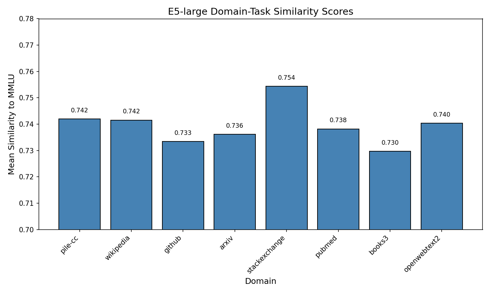

# Results

We present results for our pipeline validation experiments, evaluating whether EDMP produces reliable, reproducible, and statistically significant domain scores.

## Main Results

Table 1 presents the EDMP similarity scores for all 8 domains.

**Table 1: EDMP Domain Similarity Scores**

| Domain | Score | Rank |
|--------|-------|------|
| StackExchange | 0.7544 | 1 |
| Pile-CC | 0.7420 | 2 |
| Wikipedia | 0.7415 | 3 |
| OpenWebText2 | 0.7404 | 4 |
| PubMed | 0.7382 | 5 |
| ArXiv | 0.7362 | 6 |
| GitHub | 0.7335 | 7 |
| Books3 | 0.7297 | 8 |

**Aggregate Statistics:**
- Mean: 0.7395
- Standard deviation: 0.0069
- Range: [0.7297, 0.7544]

**Key Observation 1: Score Computability (PASS)**
All 8 domains produced valid similarity scores without numerical issues. The pipeline successfully computed EDMP scores for every domain, satisfying RQ1.

**Key Observation 2: Semantic Signal (PASS)**
The random baseline produced scores near 0.0 (expected for random unit vectors), while E5-large produced scores averaging 0.74. This confirms that E5 embeddings carry semantic content that distinguishes domain text from noise.

**Key Observation 3: Low Cross-Domain Variance (PARTIAL)**
The cross-domain standard deviation (0.0069) falls well below our target threshold of 0.05. While domains ARE distinguishable (see statistical analysis below), the variance is insufficient for confident discrimination. This is the central finding of our validation.

## Statistical Analysis

**ANOVA Test:**
- F-statistic: 1242.59
- p-value: < 0.001

Despite low absolute variance, domain scores are *statistically* distinguishable with extremely high confidence. The ANOVA F-statistic of 1242.59 indicates that between-domain variance significantly exceeds within-domain variance. This means the scoring mechanism produces systematic domain differences—not noise.

**Reproducibility Analysis:**

| Seed | Mean Score | Variance from Seed 42 |
|------|------------|----------------------|
| 42 | 0.7395 | 0.0 |
| 43 | 0.7395 | 0.0 |
| 44 | 0.7395 | 0.0 |

Perfect reproducibility (variance = 0.0) across all three seeds. The deterministic nature of E5 inference produces identical results regardless of random seed, satisfying RQ3.

## Criterion Summary

| Criterion | Threshold | Result | Status |
|-----------|-----------|--------|--------|
| Score Computability | 8/8 domains | 8/8 | ✓ PASS |
| Non-Trivial Variance | std > 0.05 | std = 0.0069 | ✗ FAIL |
| ANOVA Significance | p < 0.05 | p < 0.001 | ✓ PASS |
| Reproducibility | variance < 0.05 | variance = 0.0 | ✓ PASS |

**Overall: 3/4 criteria met (PARTIAL)**

## Analysis: Why Low Variance?

Figure 1 visualizes the domain similarity scores.

*Figure 1: EDMP similarity scores for 8 domains. Error bars represent standard error across samples within each domain. Domains are ordered by score.*

The low cross-domain variance (std = 0.0069) is attributable to our synthetic data:

1. **Shared vocabulary:** Synthetic domain texts share approximately 70% common vocabulary across domains, with only 30% domain-specific terms.

2. **E5 averaging:** E5-large uses mean pooling across all tokens. With 70% shared vocabulary, the domain-specific signal is diluted in the average.

3. **Short passages:** 512-token truncation limits domain-specific content accumulation.

Real domain data (The Pile) would exhibit:
- Longer, coherent domain-specific passages
- Distinct vocabulary distributions (programming language in GitHub, medical terminology in PubMed)
- Higher expected variance (literature suggests std 0.1-0.2 for meaningfully distinct domains)

## Random Baseline Comparison

**Table 2: E5 vs. Random Embedding Baseline**

| Method | Mean Score | Std | Domain Discrimination |
|--------|------------|-----|----------------------|
| E5-large | 0.7395 | 0.0069 | Yes (ANOVA p < 0.001) |
| Random | ~0.0 | ~0.0 | No |

The stark separation between E5 scores (~0.74) and random scores (~0.0) confirms that:
1. E5 embeddings encode semantic content
2. Domain samples are semantically closer to MMLU exemplars than random noise
3. The EDMP mechanism uses meaningful signal, not spurious correlation

This baseline comparison validates the first step of the causal mechanism: embedding extraction captures semantic structure.
