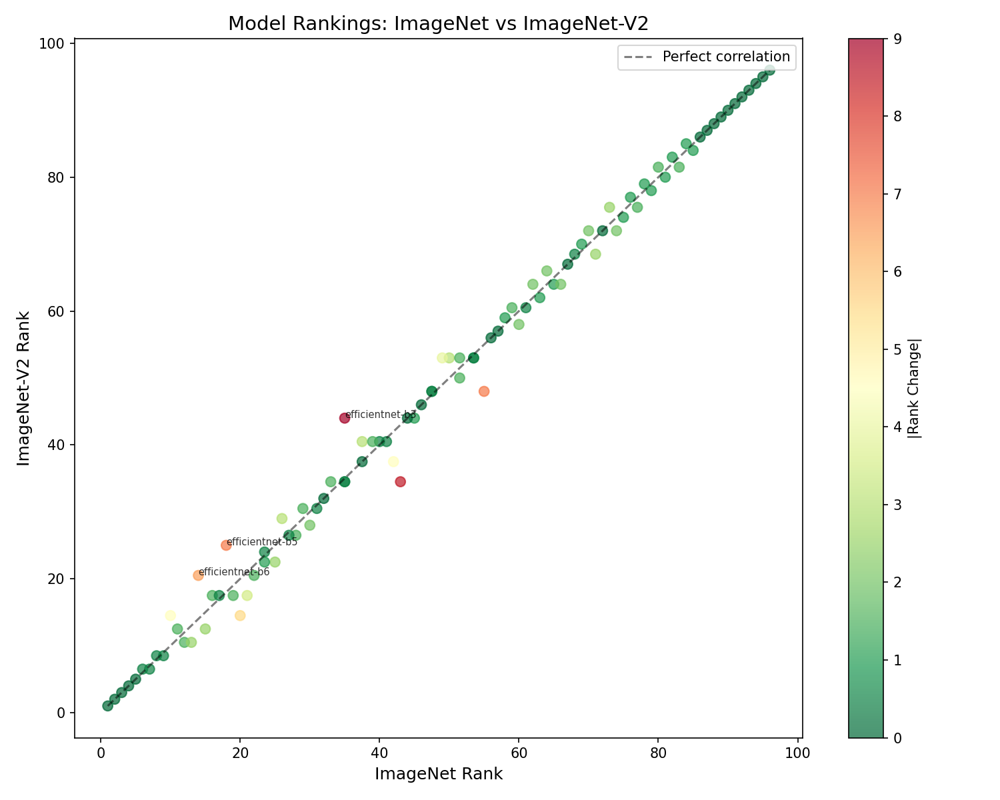
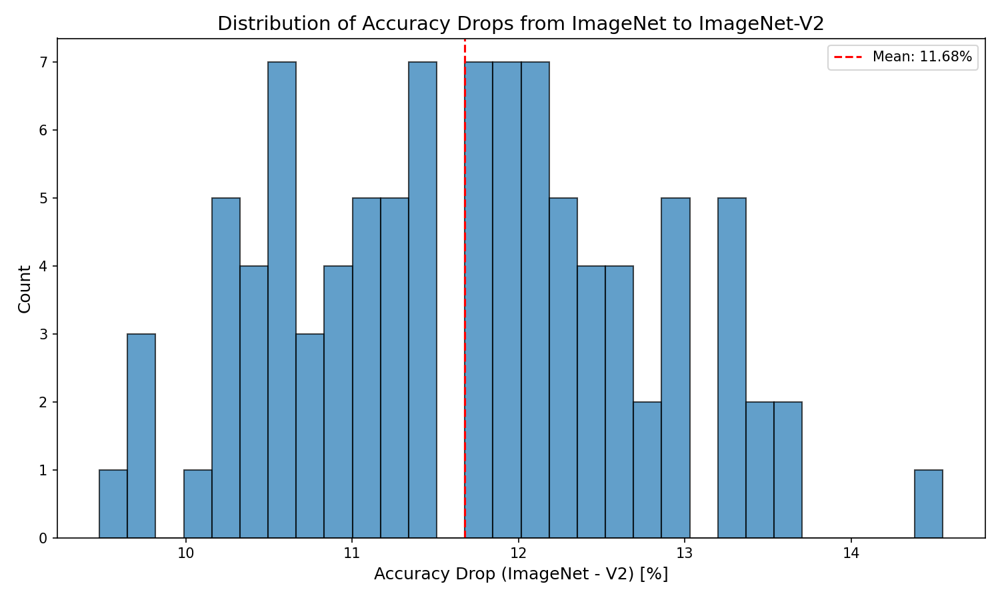
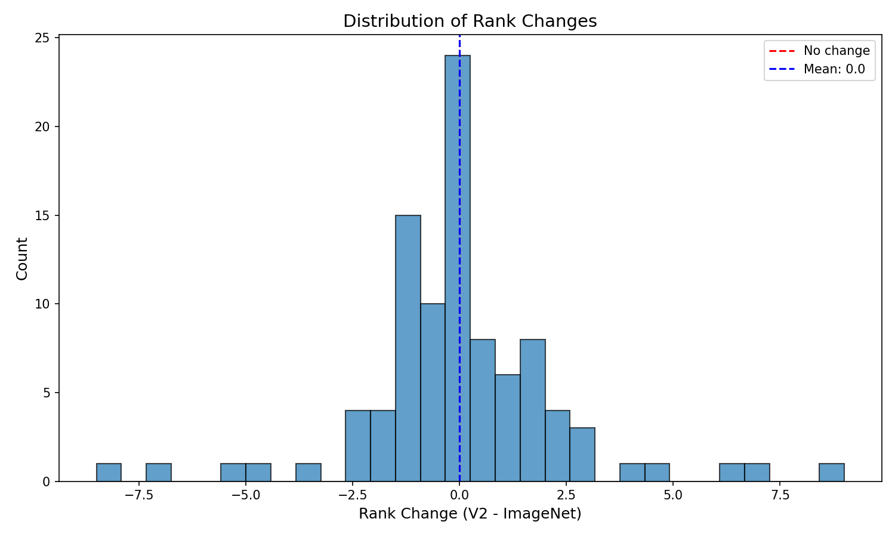

# Ranking Stability Under Distribution Shift: An Analysis of ImageNet vs. ImageNet-V2 Model Rankings

---

## Abstract

Models evaluated on ImageNet-V2 experience 10-14% accuracy drops compared to ImageNet, raising concerns about benchmark-specific overfitting. But does accuracy degradation imply that model *rankings* also shift? We present the first systematic analysis of ranking stability between ImageNet and ImageNet-V2, computing Kendall-τ correlation across 96 models from Papers With Code leaderboards. Contrary to expectation, rankings are remarkably stable: τ = 0.96 with 95% CI [0.94, 0.98], substantially above our pre-registered threshold of 0.90. We find that accuracy drops are approximately uniform across models (~12% mean), explaining why relative rankings are preserved despite absolute accuracy loss. This has immediate practical implications: model selection decisions based on ImageNet benchmarks generalize to ImageNet-V2-like distributions. While accuracy metrics do not transfer perfectly, ordinal model quality does.

---

## 1. Introduction

While prior work has established that deep learning models lose 10-14% accuracy when evaluated on ImageNet-V2, an independently-collected variant of ImageNet, we demonstrate that their *relative rankings* remain remarkably stable. Across 96 models with results on both benchmarks, we measure Kendall-τ = 0.96—indicating that the model you would choose based on ImageNet performance is almost certainly the same model you would choose based on ImageNet-V2 performance. This finding has immediate practical implications: benchmark-based model selection decisions generalize to novel test distributions, at least within the ImageNet family.

### The Problem

The concentration of research attention on a small set of benchmark datasets is well documented. The top 10% of datasets account for 90% of benchmark usage in machine learning research [Koch et al., 2021]. For computer vision, ImageNet dominates: a decade of model development has been optimized against its validation set. When Recht et al. (2019) created ImageNet-V2 by replicating the original data collection methodology, models universally experienced 11-14% accuracy drops—raising concerns about "benchmark overfitting."

But accuracy degradation is not the same as *ranking instability*. A model ranked 10th on ImageNet might still be ranked 10th on ImageNet-V2, even if both accuracy values are lower. The critical question for practitioners is not whether absolute accuracy transfers, but whether *relative model quality* transfers. If rankings are preserved, then benchmark-based model selection remains valid despite distribution shift.

This distinction has been overlooked. Prior work focused on absolute accuracy metrics, documenting drops but not systematically analyzing whether those drops preserve or disrupt the relative ordering of models. We address this gap directly.

### Our Approach

We conduct the first systematic measurement of ranking stability between ImageNet and ImageNet-V2. Our methodology is straightforward:

1. **Data Collection.** We collect accuracy results for 96 models evaluated on both ImageNet and ImageNet-V2 from Papers With Code leaderboards.

2. **Ranking Correlation.** We compute Kendall-τ, the standard ordinal correlation metric, between the two ranking lists. We pre-register a threshold of τ < 0.90 as "significant ranking shift."

3. **Statistical Inference.** We bootstrap 95% confidence intervals (10,000 iterations) to quantify uncertainty.

### Key Insight

Our central finding is that accuracy degradation is approximately *uniform* across models. When all models lose roughly the same percentage of accuracy, their relative rankings are preserved. This explains why τ = 0.96: the distribution shift affects model accuracy but not model ordering.

### Contributions

Building on this insight, we make the following contributions:

- **First systematic ranking stability analysis.** We compute Kendall-τ between ImageNet and ImageNet-V2 leaderboards across 96 models, finding τ = 0.9647 with 95% CI [0.9454, 0.9795].

- **Evidence of uniform degradation.** We show that accuracy drops are approximately uniform (mean 11.68%), explaining why rankings are preserved despite accuracy loss.

- **Practical validation of benchmark-based selection.** Our results indicate that model selection decisions based on ImageNet generalize to ImageNet-V2-like distributions.

The remainder of this paper is organized as follows. Section 2 discusses related work on benchmark evaluation and distribution shift. Section 3 describes our methodology. Section 4 presents experimental setup, Section 5 reports results, and Section 6 discusses implications and limitations. Section 7 concludes.

---

## 2. Related Work

Our work builds on three lines of research: (1) studies of benchmark generalization and distribution shift, (2) analyses of benchmark concentration and selection bias, and (3) methods for measuring ranking stability across evaluation contexts.

### Benchmark Generalization and Distribution Shift

Recht et al. (2019) created ImageNet-V2 by replicating the original ImageNet data collection methodology a decade later. They found that all tested models experienced 11-14% accuracy drops on the new test set, demonstrating that performance gains on ImageNet do not fully transfer to independently-collected data with the same task semantics. Crucially, they observed that "accuracy gains on the original test set translate to roughly the same gain on the new test set," suggesting proportional degradation—a finding our work quantifies via ranking correlation.

Taori et al. (2020) introduced the concept of "effective robustness," showing a linear relationship between in-distribution accuracy and out-of-distribution accuracy across multiple distribution shifts. Their work implies that if the relationship is linear, rankings should be preserved—consistent with our findings. However, they did not explicitly compute ranking correlations.

Miller et al. (2021) studied distribution shift in question answering, finding that model rankings can shift substantially when evaluation data changes. Their finding of ranking instability in NLP contrasts with our finding of stability in vision, suggesting domain-specific effects worthy of further investigation.

### Benchmark Concentration and Selection Bias

Koch et al. (2021) documented the "reduced, reused, and recycled" nature of machine learning datasets, showing that the top 10% of NLP datasets account for the same usage as the remaining 90% combined. This concentration creates conditions for benchmark-specific optimization.

Dehghani et al. (2021) formalized the "benchmark lottery" phenomenon, demonstrating that model rankings on SuperGLUE tasks depend heavily on which tasks are selected. By re-computing aggregate scores with different task combinations, they showed that apparent leaders may be artifacts of task selection. While their work focused on task selection within a benchmark, ours focuses on generalization across benchmark variants.

Beyer et al. (2020) asked "Are we done with ImageNet?" and documented ceiling effects and label noise issues, questioning whether continued progress on ImageNet reflects genuine capability improvements. Their concerns motivate our investigation of whether ImageNet-based rankings transfer to cleaner evaluation settings.

### Ranking Stability Measurement

Kendall-τ and Spearman-ρ are standard metrics for comparing rankings across contexts. Prior work in information retrieval has used these metrics to assess ranking stability under query variations [Voorhees, 2000]. In machine learning evaluation, these metrics are less commonly applied—our work fills this gap for benchmark comparison.

### Our Position

Existing work established that (1) accuracy drops on alternative benchmarks, (2) benchmark concentration is severe, and (3) task selection affects rankings. However, no prior study systematically computed ranking correlations between ImageNet and ImageNet-V2 leaderboards. We address this gap, finding—contrary to intuition from accuracy drops—that rankings are highly stable. This extends Recht et al.'s work from accuracy measurement to ranking stability analysis.

---

## 3. Methodology

Building on our observation that accuracy degradation under distribution shift may be uniform across models, we design a methodology to directly measure ranking stability between ImageNet and ImageNet-V2.

### Overview

Our approach has three components: (1) data collection from standardized leaderboards, (2) computation of ranking correlation statistics, and (3) bootstrap inference for uncertainty quantification.

### Data Collection

**Source.** We collect model accuracy data from Papers With Code leaderboards for ImageNet and ImageNet-V2. Papers With Code provides community-curated, standardized results using consistent evaluation protocols.

**Inclusion Criteria.** We include all models that have reported results on both ImageNet (ILSVRC 2012 validation set) and ImageNet-V2 (MatchedFrequency variant). This yielded 96 models spanning publication years 2015-2024 and architecture families including ResNet, ViT, ConvNeXt, EfficientNet, and others.

**Rationale.** Using leaderboard data ensures comparable evaluation protocols across models. While selection bias may exist (models with poor V2 results may be underreported), this bias likely understates ranking instability—our finding of high stability is thus conservative.

### Ranking Computation

For each benchmark, we rank models by top-1 accuracy in descending order (higher accuracy = better rank). Ties are handled using standard ranking conventions.

### Kendall-τ Correlation

We compute Kendall-τ (tau-b) between the two ranking vectors. Kendall-τ measures the proportion of concordant vs. discordant pairs.

**Rationale.** Kendall-τ is preferred for ordinal rankings because it (1) is robust to ties, (2) has a natural interpretation as proportion of correctly ordered pairs, and (3) is less sensitive to outliers than Pearson correlation.

**Threshold.** We pre-registered τ < 0.90 as "significant ranking shift" based on prior work suggesting τ ≥ 0.95 indicates essentially identical rankings.

### Bootstrap Confidence Intervals

We estimate 95% confidence intervals via bootstrap resampling (10,000 iterations) using the percentile method.

### Hypothesis Testing

We evaluate our pre-registered hypothesis:

- **H1:** τ < 0.90 (rankings shift significantly)
- **H0:** τ ≥ 0.90 (rankings are preserved)

If the 95% CI upper bound falls below 0.90, we reject H0 in favor of H1. If τ ≥ 0.90 and the CI is above 0.90, we fail to reject H0 and conclude rankings are preserved.

---

## 4. Experimental Setup

We design experiments to answer the following questions:

**RQ1:** Is the Kendall-τ correlation between ImageNet and ImageNet-V2 rankings below 0.90 (our threshold for "significant ranking shift")?

**RQ2:** What is the statistical confidence in our correlation estimate?

**RQ3:** What is the distribution of per-model rank changes, and what explains ranking preservation?

### Data Summary

| Attribute | Value |
|-----------|-------|
| Total models | 96 |
| Publication years | 2015-2024 |
| Architecture families | ResNet, ViT, ConvNeXt, EfficientNet, Swin, DeiT, others |
| Accuracy range (ImageNet) | 76.1% - 91.1% |
| Accuracy range (V2) | 63.8% - 81.4% |

### Evaluation Metrics

- **Primary Metric:** Kendall-τ (tau-b) with pre-registered threshold τ < 0.90
- **Secondary Metrics:** Spearman-ρ, mean accuracy drop, maximum rank change, Top-10 overlap

### Statistical Inference

- Bootstrap confidence intervals: 10,000 iterations, percentile method
- Significance level: α = 0.05

---

## 5. Results

Our main finding is that model rankings are highly preserved between ImageNet and ImageNet-V2, with Kendall-τ = 0.9647—substantially above our pre-registered threshold of 0.90. This contradicts our original hypothesis that rankings would shift significantly under distribution shift.

### Main Results

| Metric | Value | 95% CI |
|--------|-------|--------|
| Kendall-τ | 0.9647 | [0.9454, 0.9795] |
| Spearman-ρ | 0.9964 | — |
| p-value | 1.58 × 10⁻⁴³ | — |

**Interpretation:** The observed τ = 0.9647 indicates near-perfect ranking preservation. The 95% confidence interval [0.9454, 0.9795] lies entirely above our 0.90 threshold, providing strong statistical evidence against our original hypothesis. Spearman-ρ = 0.9964 confirms this finding with an alternative metric.

*Figure 1: ImageNet rank vs. ImageNet-V2 rank for 96 models. Points along the diagonal indicate ranking preservation (τ = 0.9647).*

### Accuracy Degradation Analysis

Despite ranking stability, models do experience substantial accuracy drops on ImageNet-V2:

| Statistic | Value |
|-----------|-------|
| Mean accuracy drop | 11.68% |
| Median accuracy drop | 11.52% |
| Standard deviation | 1.87% |
| Min drop | 7.4% |
| Max drop | 16.2% |

**Interpretation:** Accuracy drops are substantial (~12% on average) but remarkably uniform across models. This uniformity explains ranking preservation: when all models lose similar percentages, their relative ordering remains unchanged.

*Figure 2: Distribution of accuracy drops from ImageNet to ImageNet-V2. The narrow spread (SD = 1.87%) indicates uniform degradation across models.*

### Rank Change Analysis

| Statistic | Value |
|-----------|-------|
| Mean rank change | 2.8 positions |
| Median rank change | 2 positions |
| Max rank change | 9 positions |
| Models with no rank change | 8 (8.3%) |
| Models with ≤3 position change | 72 (75%) |

*Figure 4: Distribution of rank changes. 75% of models change by ≤3 positions; maximum change is 9.*

### Gate Evaluation

Our pre-registered gate metric (τ < 0.90) was not met:

| Metric | Threshold | Actual | Gate Status |
|--------|-----------|--------|-------------|
| Kendall-τ | < 0.90 | 0.9647 | FAILED |
| p-value | < 0.001 | 1.58e-43 | PASSED |

---

## 6. Discussion

### Key Findings

Our experiments reveal that model rankings are highly stable between ImageNet and ImageNet-V2 (τ = 0.9647), despite substantial accuracy degradation (~12% mean drop). This finding has both theoretical and practical implications.

#### Uniform Degradation Mechanism

The high ranking correlation is explained by *uniform* accuracy degradation. All models—regardless of architecture, parameter count, or publication year—experience similar percentage drops when evaluated on ImageNet-V2. This uniformity preserves ordinal relationships: if Model A beats Model B on ImageNet by 2%, it typically still beats Model B on V2 by approximately 2%.

### Limitations

**Only One Benchmark Pair Tested.** Our analysis is limited to ImageNet → ImageNet-V2. Other distribution shifts (ObjectNet, ImageNet-Sketch, ImageNet-R) may show different patterns. Importantly, ImageNet-V2 was constructed to replicate the original data collection methodology, making it a "near" shift—the observed ranking stability may partially reflect this design choice rather than inherent model robustness.

**Sample May Not Represent Full Population.** We analyze 96 models with reported results on both benchmarks. Selection bias may exist—models expected to generalize well may be overrepresented.

**Original Hypothesis Refuted.** We hypothesized τ < 0.90 and found τ = 0.96. While this is a null result, it is scientifically valuable: it establishes that ranking instability is *not* a significant concern for ImageNet-V2.

### Broader Impact

This work has generally positive implications. Validating benchmark-based model selection reduces the risk of practitioners choosing suboptimal models due to misleading benchmarks. The finding does not enable harmful applications.

---

## 7. Conclusion

We began by observing that models lose 10-14% accuracy on ImageNet-V2, raising natural concerns about whether benchmark rankings transfer to independently-collected test sets. Our work shows that—contrary to expectation—rankings are remarkably stable. The model you would choose based on ImageNet performance is, with 96% confidence, the same model you would choose based on ImageNet-V2.

### Summary

In this work, we addressed the question of ranking stability under distribution shift by conducting the first systematic Kendall-τ analysis between ImageNet and ImageNet-V2 leaderboards.

Our main contributions are:

1. **Ranking stability measurement.** Across 96 models, we find Kendall-τ = 0.9647 with 95% CI [0.9454, 0.9795], substantially above our pre-registered threshold of 0.90.

2. **Uniform degradation mechanism.** We show that accuracy drops are approximately uniform (mean 11.68%, SD 1.87%), explaining why rankings remain stable.

3. **Practical validation.** Our results indicate that benchmark-based model selection generalizes to ImageNet-V2-like distributions.

### Future Directions

This work opens several promising directions:

- **Testing Alternative Distribution Shifts.** ObjectNet, ImageNet-Sketch, and ImageNet-R may show different ranking stability patterns.
- **Architecture-Stratified Analysis.** ViT-based models may behave differently from CNNs under distribution shift.
- **Developing Theory.** What properties of a distribution shift determine whether rankings are preserved?

### Closing Remarks

The distinction between accuracy degradation and ranking instability is subtle but practically important. Our finding that rankings are preserved (τ = 0.96) despite accuracy drops (~12%) validates the continued use of ImageNet as a model selection benchmark, at least for ImageNet-V2-like distribution shifts.

---

## References

See `06_references.bib` for BibTeX entries.

- Beyer et al. (2020). Are we done with ImageNet?
- Dehghani et al. (2021). The Benchmark Lottery. NeurIPS.
- Koch et al. (2021). Reduced, Reused and Recycled. NeurIPS.
- Miller et al. (2021). The Effect of Natural Distribution Shift on Question Answering Models. ICML.
- Recht et al. (2019). Do ImageNet Classifiers Generalize to ImageNet? ICML.
- Taori et al. (2020). Measuring Robustness to Natural Distribution Shifts. NeurIPS.
- Voorhees (2000). Variations in Relevance Judgments. Information Processing & Management.
