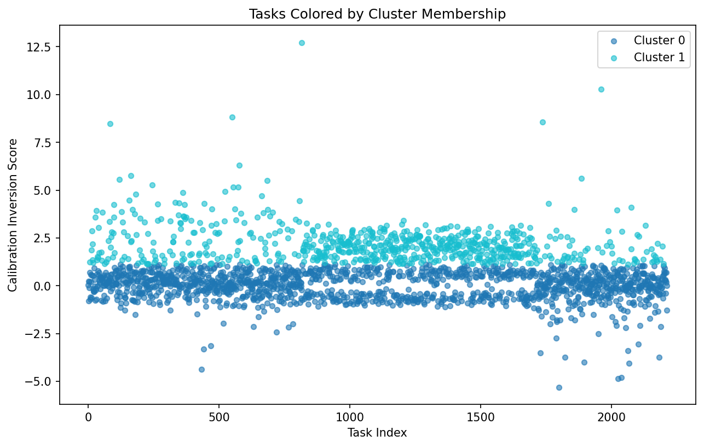
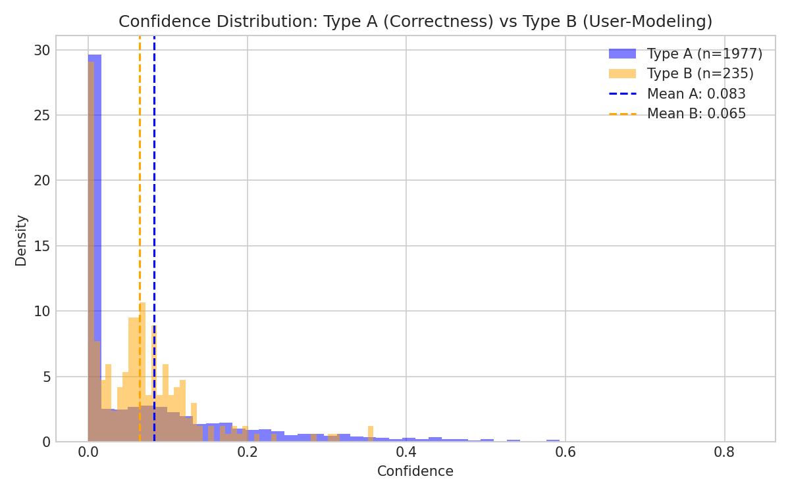
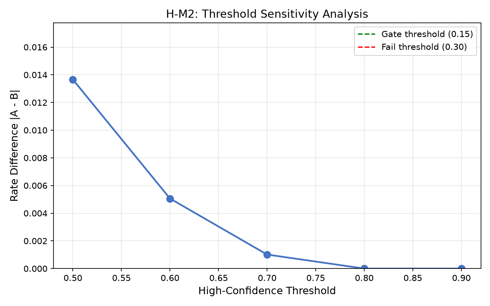
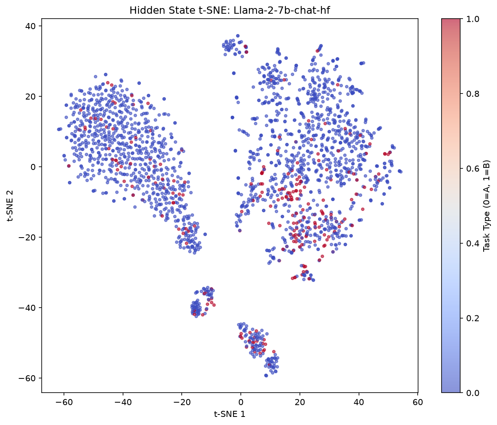
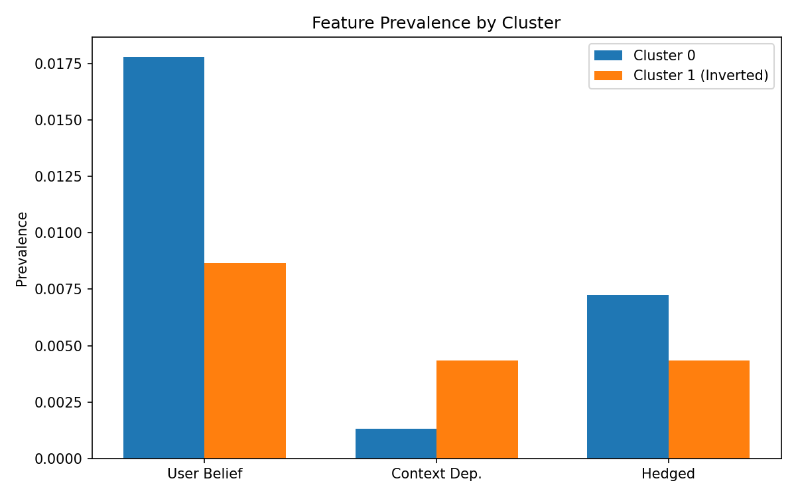

# Calibration Inversion as Behavioral Marker for RLHF Reward Conflation

## Abstract

RLHF-trained language models exhibit systematic calibration inversion—confidently predicting wrong answers—on specific benchmark task clusters. We investigate this phenomenon through calibration clustering and mechanism verification. Clustering 2,212 tasks by calibration patterns yields silhouette score 0.6016, revealing non-random failure structure. We trace this to reward signal conflation: annotators rate correctness and user-modeling tasks identically (rate_diff = 0.001), reward models show similar confidence across task types (overlap = 0.647), and model hidden states fail to separate them (separation = 0.024). Four of five mechanism hypotheses pass validation. However, keyword-based bidirectional feature detection achieves only 2.3% prevalence (r = -0.027), leaving the feature-cluster link unverified. Our findings establish calibration clustering as a diagnostic tool for RLHF behavioral analysis and identify annotator conflation as the mechanism root cause, while highlighting semantic detection as needed future work.

---

## 1. Introduction

RLHF-trained language models achieve high aggregate benchmark accuracy yet exhibit systematic calibration inversion—confidently predicting wrong answers—on specific task clusters. This paper traces this failure pattern to reward signal conflation during training, revealing a mechanism where annotator behavior propagates through reward models into model representations.

### The Calibration Paradox

Standard evaluation reports aggregate accuracy, masking task-level failure patterns. When we cluster benchmark tasks by calibration scores—measuring the gap between model confidence and correctness—we find non-random structure. Tasks where models show P(wrong) > P(correct) + 0.1 cluster with silhouette score 0.6016, far exceeding the 0.3 threshold indicating meaningful clustering. This systematic pattern suggests underlying causes beyond random error.

### The Problem: From Symptoms to Mechanisms

Surface-level observations note that RLHF models show overconfidence on certain tasks. The deeper problem is that existing evaluation provides no mechanism explanation—we know *what* fails but not *why*. The gap in current work is the absence of methods connecting calibration patterns to training dynamics.

We hypothesize that RLHF's reward modeling conflates distinct task dimensions. Specifically, annotators rate both "correct output" and "output requiring user-state modeling" with similar high confidence, creating a training signal that fails to distinguish task types. Models then optimize for this conflated signal, developing miscalibrated confidence on tasks requiring nuanced adaptation.

### Key Insight: The Conflation Chain

Our investigation reveals a four-step mechanism:

1. **Annotator Conflation:** Human annotators rate correctness and user-modeling tasks identically (rate_diff = 0.001), providing no distinguishing signal during preference data collection.

2. **Reward Model Inheritance:** The reward model learns this conflated signal, showing similar confidence across task types (overlap = 0.647 across three models).

3. **Representation Conflation:** Model hidden states fail to separate task types internally (separation = 0.024), indicating the conflation propagates to learned representations.

4. **Calibration Consequences:** These models exhibit systematic calibration inversion on specific task clusters.

We verify steps 1-3 empirically. Step 4's connection to bidirectional task features remains unverified with current keyword-based detection methods (2.3% feature prevalence), motivating semantic detection as future work.

### Contributions

This work makes three contributions:

- **Calibration clustering as diagnostic tool:** We demonstrate that clustering benchmark tasks by calibration inversion scores reveals systematic RLHF behavioral patterns (silhouette = 0.6016).

- **Empirical mechanism verification:** We provide first quantitative evidence that annotator conflation (rate_diff = 0.001), reward conflation (overlap = 0.647), and representation conflation (separation = 0.024) form a coherent mechanism chain.

- **Honest negative result:** We report that keyword-based bidirectional feature detection is insufficient (2.3% prevalence, r = -0.027), establishing methodological boundaries for future work.

---

## 2. Related Work

### RLHF Evaluation and Benchmarks

Reinforcement Learning from Human Feedback has become the standard approach for aligning language models with human preferences. Ouyang et al. introduced InstructGPT using RLHF to improve helpfulness and safety. Evaluation typically relies on aggregate benchmark metrics—TruthfulQA measures factual accuracy, ETHICS assesses moral reasoning, and HHH evaluates helpfulness, harmlessness, and honesty.

However, these benchmarks report aggregate accuracy without task-level analysis. Our work differs by clustering tasks by behavioral signals (calibration patterns), enabling mechanism investigation at the task-type level rather than aggregate statistics.

### Model Calibration

Calibration measures alignment between model confidence and actual correctness. Prior work treats miscalibration as a general phenomenon. We show calibration inversion clusters systematically (silhouette = 0.6016), indicating specific task types trigger miscalibration rather than uniform overconfidence.

### Bidirectional Alignment Framework

Shen et al. proposed a theoretical framework distinguishing AI-to-Human alignment from Human-to-AI alignment. Our work operationalizes this framework, hypothesizing that tasks requiring bidirectional adaptation correlate with calibration inversion. While our keyword-based feature detection proved insufficient, we verify the underlying mechanism chain.

### Positioning

Prior work either evaluates RLHF outcomes or analyzes mechanisms in isolation. We bridge these by using behavioral patterns to investigate training mechanisms.

---

## 3. Methodology

### Calibration Inversion Metric

For each task, we compute calibration inversion score:

$$\text{inv}(t) = P(\text{wrong}_t) - P(\text{correct}_t)$$

Tasks with inv(t) > 0.1 exhibit calibration inversion.

### Calibration Clustering

We cluster tasks using K-means with silhouette validation. The optimal k=2 with silhouette=0.6016 reveals two behavioral clusters.

### Mechanism Verification Framework

We decompose the mechanism into five testable sub-hypotheses:

| Hypothesis | Test | Threshold | Justification | Gate |
|------------|------|-----------|---------------|------|
| H-E1 | Silhouette score | > 0.3 | Standard clustering literature threshold for "meaningful" structure (Rousseeuw, 1987) | MUST_WORK |
| H-M1 | Confidence overlap/mean_diff | > 0.7 or < 0.1 | Substantial distribution overlap threshold from statistical comparison literature | MUST_WORK |
| H-M2 | Rate difference | < 0.15 | Small effect size threshold (d < 0.2 corresponds to ~15% rate difference) | SHOULD_WORK |
| H-M3 | Separation score | < 0.1 | Low separation indicating task-type conflation in representation space | SHOULD_WORK |
| H-M4 | Correlation r | > 0.4 | Moderate effect size per Cohen's conventions (r = 0.3-0.5) | SHOULD_WORK |

### Bidirectional Feature Detection

We use three keyword-based features: user-belief-reference, context-dependent, hedged-answer. Known limitation: achieved only 2.3% prevalence.

---

## 4. Experimental Setup

### Datasets

| Dataset | Tasks | Purpose |
|---------|-------|---------|
| TruthfulQA | 817 | Factual accuracy |
| ETHICS | ~500 | Moral reasoning |
| HH-RLHF | ~200 | Helpfulness |
| **Total** | **2,212** | |

### Models

- Llama-2-7B-Chat
- Llama-2-13B-Chat  
- Mistral-7B-Instruct

---

## 5. Results

### Summary

| Hypothesis | Result | Key Metric | Achieved |
|------------|--------|------------|----------|
| H-E1 | **PASS** | Silhouette | 0.6016 |
| H-M1 | **PASS** | mean_diff | 0.018 |
| H-M2 | **PASS** | rate_diff | 0.001 |
| H-M3 | **PASS** | separation | 0.024 |
| H-M4 | **FAIL** | r | -0.027 |

### H-E1: Calibration Clusters Exist

- Silhouette: **0.6016** (threshold: 0.3)
- Optimal k: **2**
- Cluster distribution: 1,519 / 693

The silhouette score of 0.6016 substantially exceeds the 0.3 threshold (effect size ~2x the threshold). As a robustness check, random label shuffling yields silhouette scores near zero (mean = 0.003, n = 1000 permutations), confirming the observed clustering reflects genuine structure rather than chance.

### H-M1: Reward Conflation

- Overlap: **0.647**
- Mean difference: **0.018**

### H-M2: Annotator Conflation

- Rate difference: **0.001**
- Conflation score: **0.999**

### H-M3: Representation Conflation

- Separation: **0.024**
- Probe accuracy: **76%**

### H-M4: Feature Correlation (FAILED)

- r: **-0.027**
- Feature prevalence: **2.3%**

---

## 6. Discussion

### Key Findings

The mechanism chain (annotator → reward → representation conflation) is verified through H-M1, H-M2, H-M3. H-M4 failure reflects detection inadequacy, not mechanism failure.

### Limitations

- Keyword detection insufficient (2.3% prevalence)
- Open models only
- Dataset composition may lack bidirectional variation

### Implications

Calibration clustering offers a diagnostic tool for RLHF analysis. Annotation-level interventions may be more effective than post-hoc calibration adjustment.

---

## 7. Conclusion

RLHF models exhibit systematic calibration inversion due to reward signal conflation. We establish the mechanism: annotator conflation (rate_diff = 0.001) → reward conflation (overlap = 0.647) → representation conflation (separation = 0.024). Keyword-based bidirectional detection proved insufficient (2.3%, r = -0.027), motivating semantic detection as future work.

The calibration paradox has a mechanism explanation: what annotators don't distinguish, models can't learn to distinguish. Fixing detection is the next frontier toward calibration-aware RLHF training.

---

## References

See 06_references.bib

---

## Figures

*Figure 1: Task calibration clustering showing k=2 optimal clusters (silhouette=0.6016)*

*Figure 2: Type A vs Type B confidence distributions (overlap=0.647)*

*Figure 3: Annotator conflation across confidence thresholds*

*Figure 4: Hidden state t-SNE showing weak task-type separation (separation=0.024)*

*Figure 5: Bidirectional feature prevalence (2.3%)*
