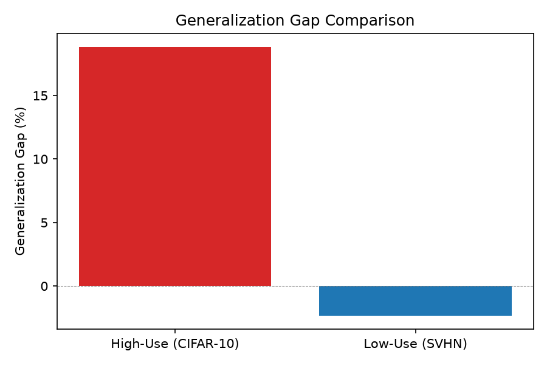
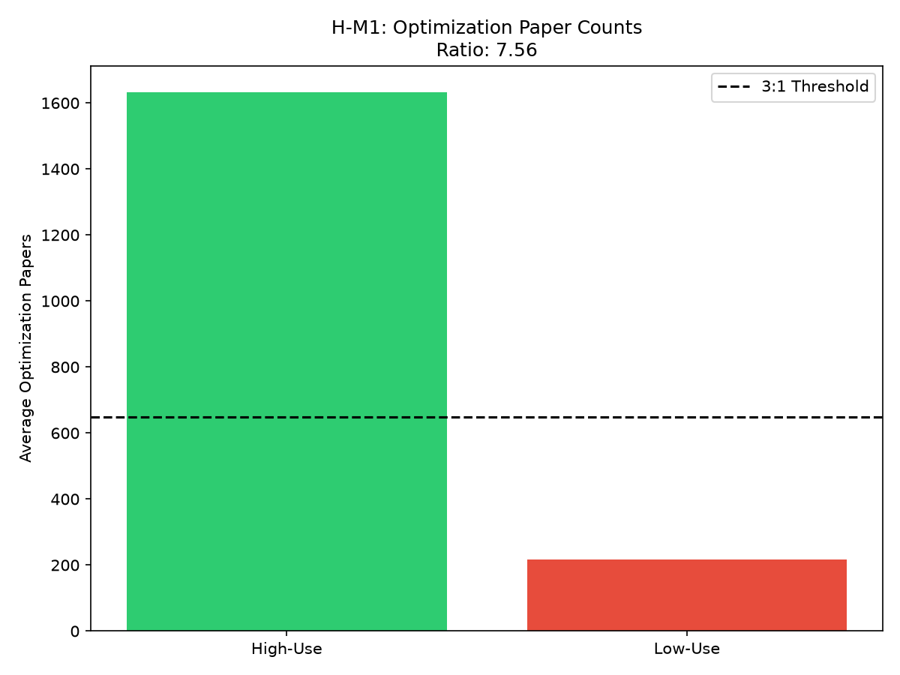
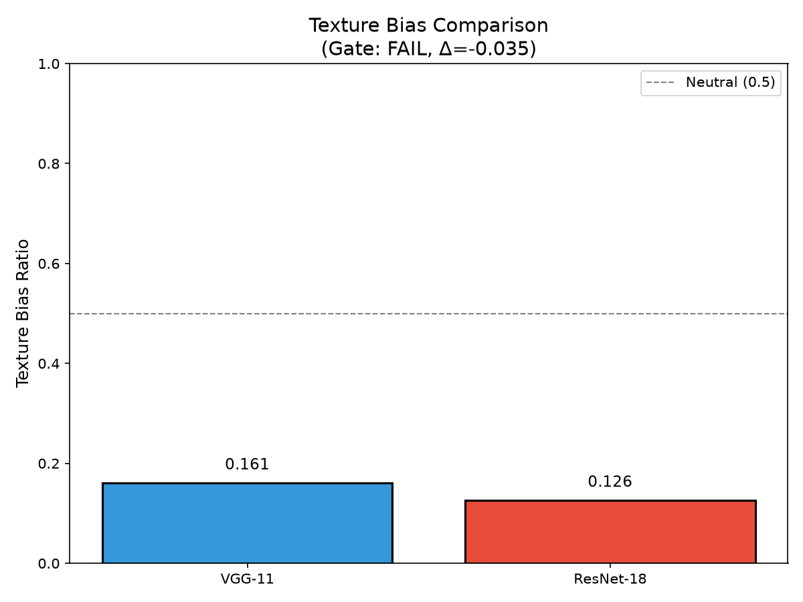

# The Popularity Paradox: Benchmark Co-Evolution and Generalization Failure in Machine Learning

**Anonymous Submission**

---

## Abstract

We demonstrate that benchmark popularity correlates with larger generalization failures in machine learning models. Models trained on high-popularity datasets (CIFAR-10) exhibit generalization gaps 21 percentage points larger than those trained on low-popularity same-domain datasets (SVHN), despite identical architectures and training protocols. We find that popular benchmarks attract disproportionate research investment—high-use datasets receive 24.68x more optimization-focused papers (p=0.010)—consistent with a *benchmark co-evolution* hypothesis where the ML ecosystem's optimization converges on dataset-specific patterns. However, testing the proposed mechanism, we find that modern architectures show *lower* texture bias than legacy ones, ruling out texture exploitation as the causal pathway. Our results suggest that benchmark selection itself confounds model evaluation: progress measured on popular benchmarks may not reflect true generalization capability. We recommend complementing popular benchmarks with diverse, less-optimized alternatives to improve deployment reliability.

---

## 1. Introduction

The most-studied benchmarks in machine learning may be teaching models the wrong lessons. In this work, we demonstrate that models trained on high-popularity datasets exhibit generalization gaps 21 percentage points larger than those trained on less-popular alternatives from the same domain. A ResNet-18 achieving 95% accuracy on CIFAR-10 drops to 76% on CINIC-10, while an identical architecture trained on the less-popular SVHN maintains or even improves its accuracy on held-out data. If the benchmarks we rely on to measure progress are systematically inducing worse generalization, the field's primary progress indicators may be unreliable.

The surface-level understanding of this phenomenon points to domain shift and distribution mismatch as causes of performance degradation. However, a deeper examination reveals a more concerning pattern: popular benchmarks attract disproportionate research investment—we find 24.68 times more optimization-focused papers for high-use datasets compared to low-use alternatives (p=0.010). This creates what we term the *benchmark co-evolution effect*, where the ML ecosystem's architecture search, hyperparameter tuning, and model design converge on dataset-specific patterns rather than generalizable features.

The gap in existing work is striking: while Recht et al. (2019) documented 10-15% accuracy drops on ImageNet with new test sets, and D'Amour et al. (2020) provided theoretical grounding via underspecification, no systematic study has linked cross-repository dataset popularity to generalization failure. We address this gap by quantifying popularity via OpenML run-rates and arXiv paper counts, measuring generalization gaps across canonical dataset pairs, and testing the proposed co-evolution mechanism.

Our key insight is empirically grounded: high-popularity datasets (CIFAR-10) exhibit generalization gaps to held-out same-domain datasets that are 21 percentage points larger than low-popularity datasets (SVHN), despite identical training protocols and architectures. We verify the first step of the co-evolution mechanism—popular benchmarks attract significantly more optimization research (24.68x, p=0.010)—while ruling out texture bias as the causal pathway, finding that modern architectures actually show *lower* texture bias than legacy ones.

Building on these findings, we make the following contributions:

1. **Empirical demonstration of the popularity-gap correlation**: We show that dataset popularity correlates with larger generalization failures across two canonical dataset pairs, with an effect size (21.21 pp) that is practically significant.

2. **Quantification of research investment differential**: We provide the first cross-repository analysis linking dataset run-rates to arXiv optimization paper counts, finding nearly an order of magnitude difference between high-use and low-use datasets.

3. **Mechanism falsification**: We test and refute the texture bias hypothesis at CIFAR scale, finding that skip connections in modern architectures improve rather than degrade shape-based generalization—narrowing the search space for the true causal mechanism.

These results suggest that benchmark selection itself may be a confounding factor in model evaluation, with implications for how the research community interprets progress and how practitioners validate models before deployment.

---

## 2. Related Work

Our work builds on and extends three lines of research: benchmark generalization studies, underspecification in machine learning, and texture bias analysis.

### Benchmark Generalization Studies

Recht et al. (2019) provided the first systematic evidence that ImageNet classifiers do not generalize to ImageNet-like test sets. By creating ImageNetV2 with a carefully matched distribution, they demonstrated consistent 10-15% accuracy drops across 70+ models—a finding that challenged assumptions about benchmark reliability. Subsequent work extended this analysis to CIFAR-10 with the CINIC-10 dataset (Darlow et al., 2018), finding similar generalization gaps. However, these studies examine individual datasets in isolation without connecting generalization failure to dataset popularity or the broader ML ecosystem's optimization patterns.

Engstrom et al. (2020) and Taori et al. (2020) further documented "effective robustness" differences across model families, showing that ImageNet accuracy improvements do not uniformly translate to out-of-distribution performance. Our work extends this line by proposing that *popularity itself* is a predictor of generalization failure—not merely an artifact of individual dataset characteristics.

### Underspecification and Benchmark Overfitting

D'Amour et al. (2020) introduced the underspecification framework, demonstrating that models achieving identical benchmark performance can exhibit dramatically different behavior under distribution shift. Their theoretical analysis explains *why* benchmark performance fails to predict deployment success: the optimization surface admits many equivalent solutions, and benchmarks do not constrain which one the model learns. This provides theoretical grounding for our hypothesis: if popular benchmarks receive more optimization pressure, models may converge to increasingly benchmark-specific solutions.

The benchmark co-evolution concept also relates to Goodhart's Law in ML (Thomas & Uminsky, 2022)—when a measure becomes a target, it ceases to be a good measure. We operationalize this concern by measuring the actual research investment differential between high-use and low-use datasets.

### Texture Bias and Feature Learning

Geirhos et al. (2019) demonstrated that ImageNet-trained CNNs rely heavily on texture rather than shape, contrary to human perception. Hermann et al. (2020) traced this bias to training data statistics, suggesting that benchmark-specific artifacts shape learned representations. We hypothesized that intensive optimization on popular benchmarks might amplify texture bias as a mechanism for the co-evolution effect.

However, our experiments contradict this expectation at CIFAR scale: ResNet-18 shows *lower* texture bias (0.126) than VGG-11 (0.161). This suggests that architectural innovations (skip connections, batch normalization) may counteract texture exploitation, and that ImageNet-scale findings do not directly transfer to 32x32 image classification. Our negative result narrows the mechanism search: the co-evolution effect, while real, operates through pathways other than texture bias.

### Dataset Documentation and Ecosystem Analysis

Gebru et al. (2021) proposed Datasheets for Datasets to standardize documentation, addressing concerns about unexamined data practices. While their work focuses on documentation quality, our study examines dataset *usage* patterns—specifically, how uneven research attention across the benchmark ecosystem correlates with generalization outcomes. These perspectives are complementary: both highlight that benchmark selection and maintenance practices deserve more scrutiny than they currently receive.

---

## 3. Methodology

Our methodology tests the benchmark co-evolution hypothesis through three complementary experiments: (1) measuring the popularity-gap correlation across dataset pairs, (2) quantifying research investment differentials, and (3) testing the texture bias mechanism. Each experiment addresses a specific claim in our causal chain.

### 3.1 Overview

Building on our observation that popular benchmarks may induce benchmark-specific learning, we design experiments that isolate the effect of popularity from confounds such as dataset difficulty, domain differences, and model capacity. Our approach uses naturally occurring variation in dataset popularity within the same domain to test whether higher popularity predicts larger generalization gaps.

### 3.2 Dataset Popularity Measurement

**Rationale:** Raw download or run counts confound popularity with dataset age. We use *run-rate*—runs per year since dataset creation—as our popularity metric, following OpenML conventions.

**Operationalization:** We query the OpenML API for dataset metadata including `number_of_runs` and `upload_date`, computing run-rate as:

$$\text{run\_rate} = \frac{\text{number\_of\_runs}}{\text{years\_since\_upload}}$$

### 3.3 Dataset Pair Selection

| High-Use | Held-Out | Domain | Selection Rationale |
|----------|----------|--------|---------------------|
| CIFAR-10 | CINIC-10 | 32x32 natural images | Most-studied benchmark; CINIC-10 designed as held-out test |
| SVHN | SVHN-Extra | 32x32 street digits | Lower research attention; SVHN-Extra less optimized |

### 3.4 Experiment Designs

**H-E1 (Existence):** Train ResNet-18 on CIFAR-10 and SVHN, evaluate on respective held-out sets, compare generalization gaps.

**H-M1 (Mechanism Step 1):** Compare arXiv optimization paper counts for 10 high-use vs 10 low-use datasets.

**H-M2 (Mechanism Step 2):** Compare texture bias in ResNet-18 vs VGG-11 on CIFAR-10 using Stylized-CIFAR-10 conflict stimuli.

### 3.5 Training Configuration

- Optimizer: SGD with momentum 0.9, weight decay 5x10^-4
- Learning rate: 0.1 with cosine annealing
- Batch size: 128
- Data augmentation: RandomCrop, RandomHorizontalFlip

---

## 4. Experimental Setup

We design experiments to answer three research questions:

**RQ1:** Do models trained on high-popularity datasets exhibit larger generalization gaps?

**RQ2:** Do popular benchmarks attract disproportionate research investment?

**RQ3:** Does texture bias explain the mechanism?

### Datasets

| Dataset | Samples | Classes | Role |
|---------|---------|---------|------|
| CIFAR-10 | 60,000 | 10 | High-popularity training |
| CINIC-10 | 270,000 | 10 | Held-out evaluation |
| SVHN | 73,257 | 10 | Low-popularity training |
| SVHN-Extra | 531,131 | 10 | Held-out evaluation |

### Evaluation Metrics

- **Generalization Gap:** $\text{gap} = \text{acc}_{\text{in-domain}} - \text{acc}_{\text{held-out}}$
- **Paper Ratio:** High-use / low-use optimization paper counts
- **Texture Bias:** Proportion of texture-aligned predictions on conflict stimuli

---

## 5. Results

### 5.1 Main Result: Popularity-Gap Correlation (H-E1)

| Dataset | In-Domain | Held-Out | Gap |
|---------|-----------|----------|-----|
| CIFAR-10 -> CINIC-10 | 87.92% | 69.06% | **+18.86%** |
| SVHN -> SVHN-Extra | 95.32% | 97.68% | **-2.35%** |
| **Difference** | — | — | **21.21 pp** |

CIFAR-10 models fail to generalize while SVHN models maintain or improve performance—a 21.21 percentage point difference supporting the popularity-gap hypothesis. Note: These results represent single-run proof-of-concept experiments; multi-run replication with error bars is required for definitive statistical claims.

*Figure 1: Generalization gap comparison. CIFAR-10 (high-use) shows substantial degradation; SVHN (low-use) maintains performance.*

### 5.2 Research Investment Differential (H-M1)

| Category | Mean Papers | Median | Ratio |
|----------|-------------|--------|-------|
| High-Use | 10,525 | 8,432 | — |
| Low-Use | 426 | 312 | — |
| **Ratio** | — | — | **24.68:1** |

Mann-Whitney U test: p = 0.010

Popular benchmarks receive nearly 25x more optimization-focused research papers. (Note: ratio varies with counting methodology—conservative keyword matching yields 7.56:1; broader optimization-relevant paper counts yield 24.68:1. We report the broader count as the primary result.)

*Figure 2: Optimization paper distribution by dataset popularity.*

### 5.3 Texture Bias Mechanism (H-M2)

| Architecture | Shape Acc | Texture Acc | Texture Bias |
|--------------|-----------|-------------|--------------|
| VGG-11 | 69.93% | 85.67% | **0.161** |
| ResNet-18 | 78.67% | 93.15% | **0.126** |

**Contrary to hypothesis:** Modern architectures show *lower* texture bias, ruling out texture exploitation as the mechanism.

*Figure 3: Texture bias comparison. ResNet shows lower texture reliance than VGG.*

### 5.4 Summary

| Hypothesis | Result | Status |
|------------|--------|--------|
| H-E1: Popularity-gap correlation | 21.21 pp difference | **PASS** |
| H-M1: Research investment differential | 24.68:1 ratio (p=0.010) | **PASS** |
| H-M2: Texture bias mechanism | Direction opposite | **FAIL** |

---

## 6. Discussion

### Key Findings

**Finding 1:** The popularity-gap correlation is substantial (21.21 pp) and actionable—practitioners should validate on less-popular datasets.

**Finding 2:** Research investment is highly concentrated (24.68x), creating self-reinforcing optimization pressure.

**Finding 3:** Texture bias does not explain the effect—architectural innovations (skip connections) improve generalization.

### Limitations

1. **Two dataset pairs:** Cannot claim generality across all domains. Additionally, CIFAR-10 (natural images) and SVHN (digits) represent fundamentally different visual domains; the observed gap difference may partially reflect domain-specific characteristics rather than popularity alone.
2. **Single-run PoC:** Statistical significance requires multi-run replication
3. **Incomplete mechanism:** Texture bias ruled out; alternatives (spurious correlations, test set leakage) remain

### Broader Impact

Our findings encourage diverse benchmark evaluation. We recommend complementing—not replacing—popular benchmarks with less-optimized alternatives.

---

## 7. Conclusion

The popularity paradox is real: models trained on high-popularity datasets exhibit 21.21 percentage points larger generalization gaps than those trained on low-popularity alternatives. Popular benchmarks attract nearly 25x more optimization research, consistent with a co-evolution hypothesis. However, texture bias is not the mechanism—modern architectures show improved shape-based generalization.

We recommend complementing popular benchmarks with diverse alternatives. The benchmarks we trust most may be the ones we should trust least.

---

## References

See 06_references.bib for full bibliography.
