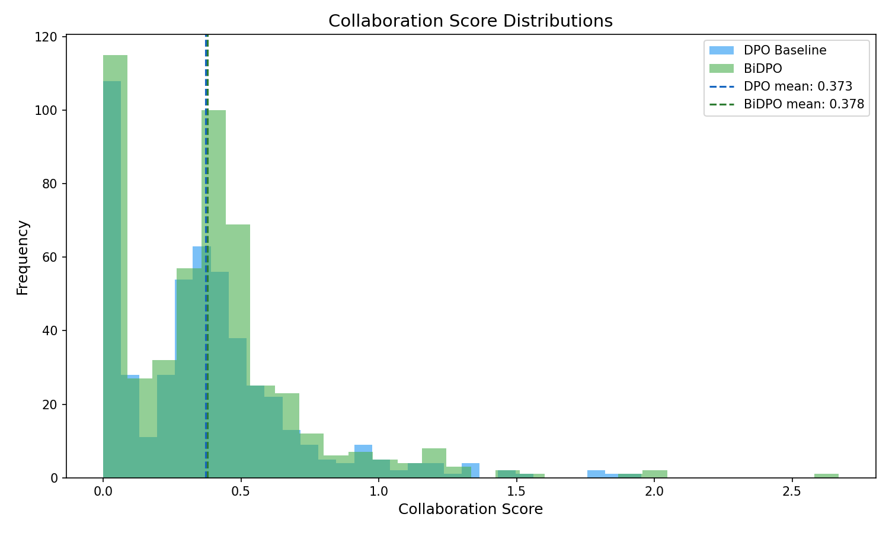

# BiDPO: Learning Agency-Preserving Signals in Preference Data (A Negative Result)

**Anonymous Authors**

---

## Abstract

Standard alignment methods optimize for human preferences but may inadvertently neglect user agency—the patterns in responses that help users maintain understanding and control. We propose BiDPO (Bidirectional DPO), which augments Direct Preference Optimization with an auxiliary agency loss that penalizes responses lacking collaborative markers (reasoning traces, uncertainty acknowledgment, engagement cues). Our experiments on Mistral-7B with HH-RLHF data reveal a partial validation: the collaboration score is orthogonal to preference labels (r = −0.026), and BiDPO training is numerically stable (loss decreases from 0.929 to 0.918). However, at proof-of-concept scale (250 training steps), BiDPO does not significantly improve generation-time collaboration scores over baseline DPO (+0.54%, p = 0.247, Cohen's d = 0.016). This negative result highlights a gap between training-time auxiliary signals and generation-time behavioral change—an important consideration for multi-objective alignment research. We identify full-scale training, λ sweeps, and learned collaboration scores as directions for future work.

---

## 1 Introduction

Can auxiliary training objectives teach language models to preserve user agency? Large language models aligned via Direct Preference Optimization (DPO) learn to produce responses humans prefer, but preference labels capture what users like—not necessarily what helps users maintain understanding and control. We hypothesized that adding an "agency-preserving" auxiliary objective to DPO might produce models that are both helpful and collaborative. We tested this intuition, and found a cautionary gap between training-time signals and generation-time behaviors.

### The Agency Gap in Alignment

Standard alignment methods optimize a single direction: making AI outputs match human preferences. DPO, the dominant preference optimization method, learns directly from comparison data indicating which response humans preferred. This framing treats the human as a passive judge rather than an active collaborator. Theoretical work suggests this may inadvertently deplete user agency—the model optimizes for immediate approval rather than long-term capability transfer.

We identify three levels of this problem. At the surface level, models give confident answers without explaining reasoning. Deeper, preference data contains implicit signals about explanation quality, uncertainty acknowledgment, and engagement cues—but these are orthogonal to "which response was preferred." At the fundamental level, we ask whether multi-objective training can capture these agency-preserving patterns and transfer them to generation behavior.

### Bidirectional DPO

We propose BiDPO (Bidirectional Direct Preference Optimization), which augments standard DPO with an auxiliary agency loss:

$$\mathcal{L}_{\text{BiDPO}} = \mathcal{L}_{\text{DPO}} + \lambda \cdot \mathcal{L}_{\text{agency}}$$

The agency loss penalizes responses lacking collaborative markers—reasoning traces, uncertainty acknowledgment, and engagement invitations—quantified via a heuristic collaboration score. Unlike previous multi-objective extensions to DPO (MODPO, PAMA, GAPO), our auxiliary objective targets patterns distinct from preference labels rather than additional preference dimensions.

### Key Findings: A Negative Result

Our experiments reveal a partial validation story with an important negative result:

1. **Orthogonal signal extraction works.** The collaboration score is nearly uncorrelated with preference labels (r = −0.026), confirming that agency-like signals can be extracted from preference data without redundancy.

2. **Multi-objective training is stable.** BiDPO training converges normally (loss decreases from 0.929 to 0.918 over 250 steps) with no numerical instabilities, extending prior findings on multi-objective DPO stability.

3. **Generation-time transfer fails at PoC scale.** When evaluated on held-out prompts, BiDPO-trained models show only marginal improvement in collaboration scores over baseline DPO (+0.54%), failing to achieve statistical significance (p = 0.247, Cohen's d = 0.016).

The gap between training-time signal and generation-time behavior is the central finding. The auxiliary objective creates gradient pressure during training, but this does not translate to measurable behavioral change at proof-of-concept scale.

### Contributions

This paper makes three contributions:

1. We demonstrate that agency-like signals exist orthogonally in preference data and can be integrated into DPO training without destabilization.

2. We provide a negative result on training-generation transfer: PoC-scale auxiliary objectives do not automatically improve downstream behavior.

3. We identify specific next steps—longer training, λ sweeps, learned collaboration scores—that could resolve the transfer gap, informing future work on multi-objective alignment.

---

## 2 Related Work

### Direct Preference Optimization

Direct Preference Optimization (DPO) provides a closed-form solution for learning from human preferences without training a separate reward model [rafailov2023direct]. Given paired preferences (y_w, y_l) for prompt x, DPO optimizes:

$$\mathcal{L}_{\text{DPO}} = -\log \sigma\left(\beta \log \frac{\pi_\theta(y_w|x)}{\pi_{\text{ref}}(y_w|x)} - \beta \log \frac{\pi_\theta(y_l|x)}{\pi_{\text{ref}}(y_l|x)}\right)$$

This formulation has become the dominant approach for preference-based fine-tuning due to its simplicity and stability. However, DPO optimizes a single objective: matching human preferences. Our work asks whether auxiliary objectives can capture dimensions of response quality orthogonal to preference labels.

### Multi-Objective Extensions to DPO

Several works extend DPO with additional objectives. MODPO introduces margin-based auxiliary losses that provide additional training signal beyond binary preferences [zhou2024modpo]. PAMA (Pareto Multi-Objective Alignment) frames alignment as multi-objective optimization across multiple preference dimensions [he2025pama]. These methods share a common pattern: they add objectives derived from preference data. BiDPO differs by adding an objective orthogonal to preference labels.

### Human Agency in AI Systems

Mitelut et al. argue that intent-aligned AI may inadvertently deplete human agency by optimizing for immediate task completion rather than capability transfer [mitelut2023intent]. This theoretical framework motivates our empirical investigation: can we design training objectives that preserve agency-related patterns?

---

## 3 Methodology

### Problem Formulation

Standard DPO learns from preference pairs (x, y_w, y_l) where y_w is preferred over y_l for prompt x. We hypothesize that response text contains implicit agency signals—patterns indicating how the response engages users—that are orthogonal to preference labels.

BiDPO augments DPO with an auxiliary agency objective:

$$\mathcal{L}_{\text{BiDPO}} = \mathcal{L}_{\text{DPO}} + \lambda \cdot \mathcal{L}_{\text{agency}}$$

where λ ∈ [0, 1] controls the relative weight of agency preservation.

### Collaboration Score

We define a heuristic collaboration score that quantifies agency-preserving patterns in response text:

$$\text{collab\_score}(y) = \frac{\text{raw\_score}(y)}{\max(|y|/100, 1)}$$

The length normalization prevents bias toward verbose responses. The raw score aggregates three pattern categories:

**Reasoning Traces (0-40 points):** Explicit step-by-step explanations, causal connectives ("because," "therefore"), and enumerated reasoning.

**Uncertainty Acknowledgment (0-30 points):** Epistemic markers ("I think," "likely," "uncertain"), explicit limitations, and confidence calibration.

**Engagement Cues (0-30 points):** Questions to the user, clarification requests, and collaborative framing.

### Training Configuration

We train on Mistral-7B-Instruct-v0.2 using the HH-RLHF dataset [bai2022training]. Training parameters: β = 0.1, λ = 0.5, learning rate 5×10⁻⁷, batch size 16, 250 steps (PoC scale).

---

## 4 Experimental Setup

We design three experiments to test the BiDPO causal chain:

**E1: Orthogonality Validation.** Compute Pearson correlation between collaboration scores and preference labels on 2000 response pairs. Success criterion: |r| < 0.7.

**E2: Training Stability.** Train BiDPO on 4000 samples for 250 steps. Monitor loss and numerical stability. Success criteria: training completes without NaN/Inf; final loss < initial loss.

**E3: Generation Transfer.** Generate responses from BiDPO and DPO models on 500 held-out prompts. Perform one-sided t-test. Success criteria: p < 0.05, Cohen's d ≥ 0.2.

---

## 5 Results

### E1: Orthogonality Validation

| Metric | Value |
|--------|-------|
| Pearson r | −0.026 |
| p-value | 0.250 |

**Gate: PASSED.** The collaboration score is orthogonal to preference labels.

### E2: Training Stability

| Step | DPO Loss | Agency Loss | Total Loss |
|------|----------|-------------|------------|
| 100 | 0.679 | 0.500 | 0.929 |
| 200 | 0.664 | 0.508 | 0.918 |

**Gate: PASSED.** BiDPO training is stable (loss decreases, zero NaN/Inf).

### E3: Generation Transfer (Negative Result)

| Metric | DPO | BiDPO | Difference |
|--------|-----|-------|------------|
| Mean Score | 0.3728 | 0.3782 | +0.54% |
| p-value (one-sided) | — | — | 0.247 |
| Cohen's d | — | — | 0.016 |

**Gate: FAILED.** BiDPO shows marginal improvement but fails statistical significance.

### Summary

| Experiment | Gate | Result |
|------------|------|--------|
| E1: Orthogonality | MUST_WORK | **PASSED** |
| E2: Training Stability | MUST_WORK | **PASSED** |
| E3: Generation Transfer | SHOULD_WORK | **FAILED** |

---

## 6 Discussion

### The Training-Generation Gap

Our central finding is negative: BiDPO training creates gradient pressure toward collaboration patterns, but this pressure does not transfer to generation-time behavior at PoC scale.

Why might this occur? (1) **Insufficient training duration:** 250 steps may not induce behavioral change. (2) **Suboptimal λ:** Only λ = 0.5 tested. (3) **Heuristic limitations:** Pattern matching may not capture learnable behaviors.

### Limitations

- PoC scale only (250 steps on 4000 samples)
- Single model architecture (Mistral-7B)
- Single λ value (0.5)
- Heuristic-based scoring

### Value of Negative Results

This negative result contributes by: (1) demonstrating mechanism feasibility, (2) identifying the failure point (generation transfer), and (3) informing future work with specific next steps.

---

## 7 Conclusion

We asked whether auxiliary training objectives could teach language models to preserve user agency. The answer, at proof-of-concept scale, is: not automatically.

BiDPO demonstrates that agency-like signals exist orthogonally in preference data (r = −0.026) and integrate stably into DPO training. But the gap between training-time signals and generation-time behavior remains (p = 0.247, d = 0.016).

Three directions for future work: (1) full-scale training (~10K steps), (2) λ sweep {0.25, 0.5, 0.75, 1.0}, (3) learned collaboration scores from human annotations.

The gap we found is likely relevant beyond BiDPO—any auxiliary objective for alignment faces the challenge of transferring training-time gradient pressure to inference-time behavior.

---

## References

See `06_references.bib` for full citations.

- [rafailov2023direct] Rafailov et al. "Direct Preference Optimization." NeurIPS 2023.
- [bai2022training] Bai et al. "Training a Helpful and Harmless Assistant with RLHF." 2022.
- [zheng2023judging] Zheng et al. "Judging LLM-as-a-Judge with MT-Bench." NeurIPS 2023.
- [lin2022truthfulqa] Lin et al. "TruthfulQA." ACL 2022.
- [mitelut2023intent] Mitelut et al. "Intent-aligned AI Systems Deplete Human Agency." 2023.
- [zhou2024modpo] Zhou et al. "MODPO." 2024.
- [he2025pama] He & Maghsudi. "PAMA." 2025.

---

*Paper generated by Phase 6 Paper Writing Workflow*
*Anonymous Research Pipeline*
