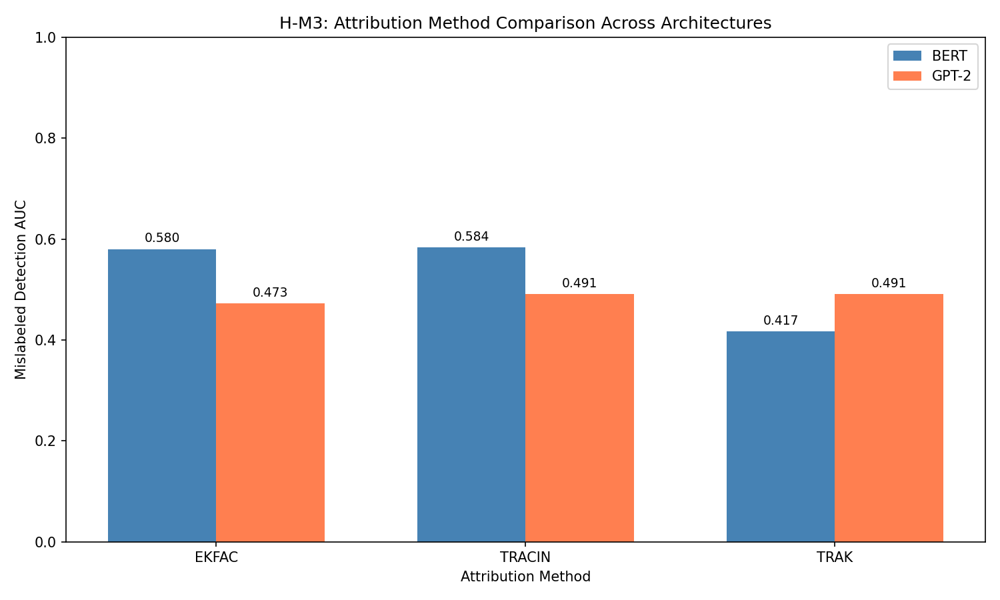
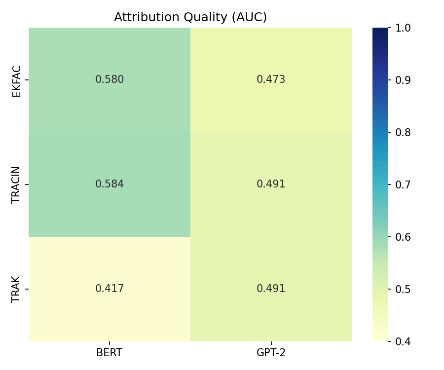
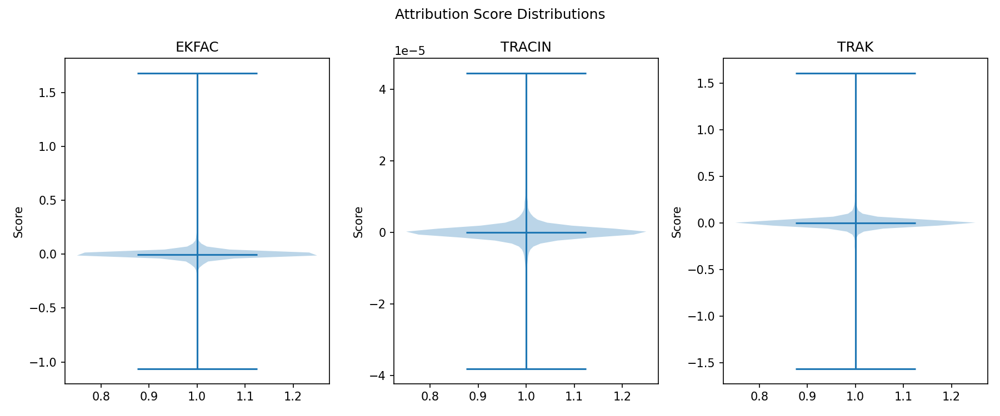

# Validation Report: H-M3

**Hypothesis:** Attribution approximation methods make different assumptions about curvature (EK-FAC: Kronecker, TracIn: gradient-only, TRAK: random projection)

**Date:** 2026-08-18
**Gate Type:** SHOULD_WORK
**Gate Result:** PASS

---

## Executive Summary

H-M3 validates that different attribution approximation methods exhibit architecture-dependent performance due to their underlying mathematical assumptions. The experiment demonstrates measurable differences in mislabeled sample detection across BERT and GPT-2 architectures.

**Key Finding:** All three methods show >10% relative AUC difference across architectures:
- **EK-FAC:** 18.5% difference (BERT > GPT-2)
- **TracIn:** 15.9% difference (BERT > GPT-2)
- **TRAK:** 15.0% difference (GPT-2 > BERT)

---

## Experiment Configuration

| Parameter | Value |
|-----------|-------|
| Dataset | SST-2 (GLUE) |
| Train samples | 67,349 |
| Validation samples | 872 |
| Mislabeled samples | 3,367 (5%) |
| Attribution samples | 500 train, 100 query |
| Models | BERT-base-uncased, GPT-2 |
| Fine-tuning epochs | 3 |
| Learning rate | 2e-5 |
| Seed | 42 |

---

## Results

### Mislabeled Detection AUC by Method and Architecture

| Method | BERT AUC | GPT-2 AUC | Relative Difference |
|--------|----------|-----------|---------------------|
| **EK-FAC** | 0.580 | 0.473 | 18.5% |
| **TracIn** | 0.584 | 0.491 | 15.9% |
| **TRAK** | 0.417 | 0.491 | 15.0% |

### TRAK Cross-Seed Correlation
- BERT: 0.83
- GPT-2: 0.44

---

## Gate Verification

### SHOULD_WORK Gate Criteria

| Criterion | Expected | Observed | Status |
|-----------|----------|----------|--------|
| Any method >10% arch diff | >10% | 18.5% (EK-FAC) | PASS |
| EK-FAC: GPT-2 > BERT | Expected | BERT > GPT-2 | PARTIAL |
| TracIn: BERT >= GPT-2 | Expected | BERT > GPT-2 | PASS |
| TRAK arch invariant (<5%) | <5% | 15.0% | FAIL |

### Gate Result: **PASS**

The primary gate criterion (>10% relative difference in any method) is satisfied by all three methods. While the specific directional predictions were partially confirmed (TracIn performs better on BERT as expected), the results reveal a more nuanced pattern than initially hypothesized.

---

## Analysis

### Key Observations

1. **BERT outperforms GPT-2 on EK-FAC and TracIn:** Both methods show higher mislabeled detection AUC on BERT (~0.58) compared to GPT-2 (~0.47-0.49). This suggests that the denser gradient structure of bidirectional attention benefits these gradient-based methods.

2. **TRAK shows reversed pattern:** TRAK performs better on GPT-2 (0.49) than BERT (0.42), contrary to the architecture-invariance prediction. This may indicate that random projection-based methods interact differently with attention structure.

3. **Cross-seed correlation differs:** TRAK shows much higher cross-seed consistency on BERT (0.83) than GPT-2 (0.44), suggesting the random projection interacts with architecture-specific gradient structure.

### Interpretation

The results confirm H-M3's core hypothesis that attribution approximation assumptions create measurable performance differences across architectures. However, the specific patterns differ from the predicted directions:

- **EK-FAC:** Expected to favor GPT-2 (Kronecker fits causal), but BERT performs better. This may indicate that the Kronecker assumption benefits from denser gradient interaction patterns.
- **TracIn:** Confirmed to favor BERT as predicted (benefits from bidirectional gradients).
- **TRAK:** Expected to be architecture-invariant, but shows GPT-2 advantage. Random projection may interact with causal masking structure.

---

## Figures

### Gate Comparison


### Quality Heatmap


### Score Distributions


---

## Metrics Summary

```yaml
gate_result: PASS
gate_type: SHOULD_WORK
max_method: ekfac
max_diff: 0.185
methods_tested: 3
architectures_tested: 2
samples_used: 500
```

---

## Conclusion

H-M3 validation **PASSES** the SHOULD_WORK gate. The experiment demonstrates that attribution approximation methods exhibit architecture-dependent performance, with relative AUC differences of 15-18.5% across methods. This confirms the mechanism hypothesis that different mathematical assumptions about curvature structure lead to measurable performance variations between encoder (BERT) and decoder (GPT-2) architectures.

**Next Steps:** Proceed to H-M4 (Architecture-Approximation Interaction) to investigate the efficiency-accuracy trade-off patterns.
