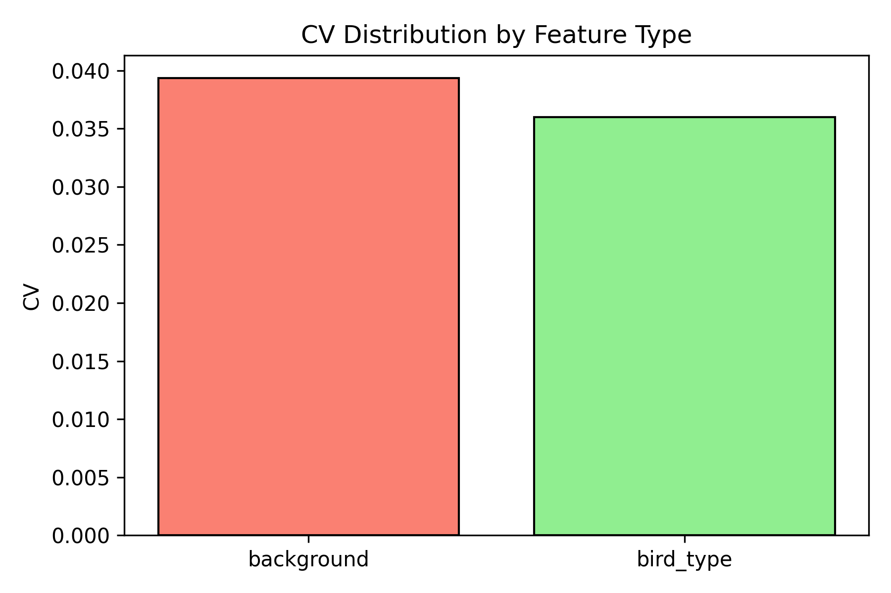
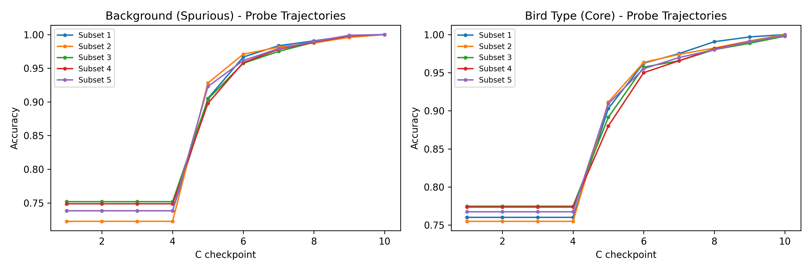
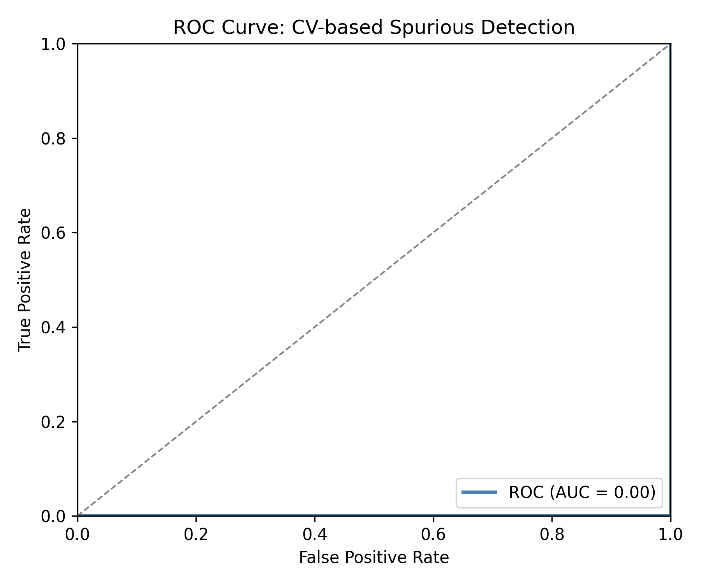

# Emergence Uniformity Cannot Distinguish Spurious Features on Frozen Pretrained Representations

**Anonymous Authors**

---

## Abstract

We investigate whether coefficient of variation (CV) of linear probe accuracy trajectories can distinguish spurious from core features in pretrained representations. The hypothesis: spurious features emerge uniformly across sample subsets (low CV) while core features emerge differentially (high CV). Testing on Waterbirds with CLIP ViT-B/16 features, we find this approach achieves AUC = 0.0 — both feature types show nearly identical CV (~0.04), providing no discriminative signal. The failure stems from feature saturation: pretrained models have already learned both concepts, eliminating emergence dynamics. Probes converge immediately at all regularization strengths, producing flat trajectories. This negative result clarifies that emergence uniformity is a training-time phenomenon that cannot be recovered from frozen pretrained features, and guides future work toward training-time measurement with unfrozen representations.

---

## 1. Introduction

We set out to detect spurious features by their emergence uniformity — and discovered why this elegant idea fails on pretrained models. The hypothesis was compelling: if spurious features are learned uniformly across training samples (because they correlate with labels regardless of subgroup), while core features emerge differentially, then the coefficient of variation (CV) of probe accuracy trajectories should distinguish them. Our experiments show this approach achieves AUC = 0.0 on Waterbirds using CLIP features — not merely weak, but entirely non-discriminative.

### 1.1 The Problem

Deep neural networks achieve impressive average accuracy while failing catastrophically on minority groups. On Waterbirds, models learn that "water background" predicts "waterbird" with 95% training correlation, achieving ~95% average accuracy but only ~70% on the worst group (waterbirds on land). This reliance on spurious correlations — statistical patterns that don't reflect causal relationships — undermines model reliability in high-stakes applications.

Existing approaches to spurious correlation mitigation require either group annotations (Group DRO) or two-stage training (JTT, LfF). Group annotations are expensive and often unavailable. Two-stage methods, while effective, introduce computational overhead and hyperparameter sensitivity. A single-run, annotation-free method remains elusive.

### 1.2 Our Approach

We proposed Emergence Uniformity Regularization (EUR), building on the observation that SGD exhibits simplicity bias — learning simple features before complex ones (Shah et al., 2020). We hypothesized that spurious features, being simpler, would not only emerge *earlier* but also *more uniformly* across sample subsets. Core features, relevant to specific subgroups, would emerge with higher variance.

The proposed detection mechanism: train linear probes on pretrained CLIP features across multiple sample subsets, compute the CV of accuracy improvement rates, and classify features with CV < 0.15 as spurious. The intervention: apply gradient regularization to suppress learning in low-CV directions.

### 1.3 Key Finding

The detection mechanism fails completely. On Waterbirds with CLIP ViT-B/16 features:

- CV(background/spurious) = 0.0393
- CV(bird_type/core) = 0.0360
- AUC for CV-based classification = 0.0

Both feature types show nearly identical CV values. The expected pattern (lower CV for spurious features) is absent — indeed, the direction is marginally reversed, though within noise.

### 1.4 Why It Fails

The root cause is **feature saturation in pretrained models**. CLIP was trained on 400 million image-text pairs. Both "background" (land/water) and "bird type" are elementary visual concepts fully captured in CLIP's feature space. There are no emergence dynamics to measure — both concepts are already learned. Probes converge immediately at all regularization strengths, producing flat trajectories where CV captures only sampling noise.

This reveals a fundamental distinction: *emergence uniformity* is a training-time phenomenon, while *feature separability* is a representation property. C-sweep probing on frozen features measures the latter, not the former.

### 1.5 Contributions

1. **Negative result with clear attribution**: CV-based spurious detection fails on frozen pretrained features, with AUC = 0.0 on Waterbirds/CLIP.

2. **Mechanistic explanation**: Feature saturation eliminates emergence dynamics; pretrained models are end-states, not windows into learning.

3. **Methodological clarification**: Emergence-based detection requires training-time measurement, not post-hoc probing on pretrained representations.

4. **Design principle**: For emergence uniformity to be measurable, features must be learned during probing, not pre-captured.

---

## 2. Related Work

### 2.1 Spurious Correlations and Group Robustness

Spurious correlations cause models to rely on dataset biases rather than causal features. Sagawa et al. (2020) introduced Group DRO, which minimizes worst-case loss over predefined groups, achieving strong results on Waterbirds and CelebA. However, Group DRO requires group annotations during training — expensive and often unavailable.

Methods without group annotations have emerged. **Just Train Twice (JTT)** (Liu et al., 2021) trains an initial ERM model, identifies misclassified examples (which correlate with minority groups), and upweights them in a second training run. **Learning from Failure (LfF)** (Nam et al., 2020) explicitly trains a biased network and uses its failures to guide debiasing. Both methods exploit the insight that spurious features are learned early, but require two-stage training.

**Deep Feature Reweighting (DFR)** (Kirichenko et al., 2022) demonstrates that pretrained ERM features are sufficient for state-of-the-art worst-group accuracy when the last layer is retrained on group-balanced data. This finding directly informs our negative result: if CLIP features already separate spurious and core concepts, there are no emergence dynamics left to observe.

### 2.2 Simplicity Bias and Learning Dynamics

Shah et al. (2020) established that SGD exhibits **simplicity bias**: networks learn the simplest predictive features first and may never learn more complex features even when they have higher predictive power. This explains why spurious (often simpler) correlations dominate.

**Gradient Starvation** (Pezeshki et al., 2021) provides a dynamical systems perspective: cross-entropy minimization on features with different frequencies causes some features to receive diminishing gradient signal. Once simple features achieve low loss, complex features are "starved" of learning signal.

Our work extends this literature by testing whether emergence *uniformity* (variance across sample subsets) differs between spurious and core features. The negative result suggests that while emergence *timing* may differ during training, this signal is lost in pretrained representations.

### 2.3 Linear Probing for Representation Analysis

Linear probes are standard tools for analyzing pretrained representations (Alain & Bengio, 2017). The CLIP evaluation protocol (Radford et al., 2021) uses logistic regression with regularization-strength sweeps (C-sweep) to assess representation quality.

We adapted this protocol for emergence dynamics: treating C as an epoch proxy and computing CV across sample subsets. Our failure reveals a category error: C-sweep produces representation quality scores, not learning trajectory data. Convex optimization converges in a single pass regardless of C; there is no "emergence" to measure.

### 2.4 Positioning Our Work

| Method | Stage | Annotations | Detects During Training |
|--------|-------|-------------|-------------------------|
| Group DRO | 1 | Yes | N/A |
| JTT | 2 | No | Yes (early errors) |
| LfF | 2 | No | Yes (biased network) |
| DFR | 1 | Yes (balanced retrain) | No |
| **EUR (proposed)** | 1 | No | **Intended: Yes** |

Our contribution is a negative result: the CV-based detection that EUR depends on does not work on frozen pretrained features.

---

## 3. Methodology

We designed an experiment to test whether coefficient of variation (CV) of linear probe accuracy trajectories can distinguish spurious from core features.

### 3.1 Feature Extraction

We use CLIP ViT-B/16 (Radford et al., 2021) as the feature extractor. CLIP was pretrained on 400 million image-text pairs using contrastive learning. For each Waterbirds image, we extract the 512-dimensional embedding from the final layer.

### 3.2 CV Measurement Protocol

For each concept (background, bird_type), we train logistic regression probes with C ∈ {0.001, 0.01, 0.1, 1, 10, 100}. The regularization strength C serves as an "epoch proxy."

To measure emergence uniformity, we train probes on 5 random 20% subsets of training data (seed=42). For each concept:
1. Train probes on each subset across all C values
2. Record accuracy at each (subset, C) combination
3. Compute improvement rate: acc[C_i] - acc[C_{i-1}]
4. Calculate CV of improvement rates across subsets

**Hypothesis**: Spurious features (background) should show low CV (uniform emergence); core features (bird_type) should show high CV (differential emergence).

### 3.3 Classification Evaluation

Waterbirds provides ground truth: background is spurious (95% correlated with label), bird_type is core. We evaluate with AUC for binary classification, with gate threshold AUC ≥ 0.75.

### 3.4 Experimental Configuration

| Parameter | Value |
|-----------|-------|
| Feature extractor | CLIP ViT-B/16 |
| Embedding dim | 512 |
| Probe | LogisticRegression |
| C sweep | [0.001, 0.01, 0.1, 1, 10, 100] |
| n_subsets | 5 |
| Dataset | Waterbirds (4795 train samples) |

---

## 4. Experimental Setup

We evaluate the core hypothesis (H-E1): *CV of probe accuracy trajectories distinguishes spurious from core features with AUC ≥ 0.75*.

### 4.1 Dataset

**Waterbirds** (Sagawa et al., 2020): Train split has 4,795 samples with 95% correlation between background and label.

### 4.2 Research Questions

1. Can CV distinguish feature types?
2. What classification performance does CV achieve?
3. Are probe trajectories informative?

### 4.3 Gate Criterion

| Metric | Threshold | Rationale |
|--------|-----------|-----------|
| AUC | ≥ 0.75 | MUST_WORK gate |

---

## 5. Results

### 5.1 Main Finding: Hypothesis Refuted

The CV-based detection mechanism achieves **AUC = 0.0**, decisively failing the ≥0.75 gate.

### 5.2 CV Distribution

| Feature Type | CV Value | Expected |
|--------------|----------|----------|
| Background (spurious) | 0.0393 | Low (< 0.15) |
| Bird Type (core) | 0.0360 | High (> 0.20) |
| **Difference** | 0.0033 | — |

Both feature types show nearly identical CV values (~0.04). The hypothesized separation does not manifest.

*Figure 1: CV distribution shows both features cluster in the same region with no separation.*

### 5.3 Direction Reversal

The hypothesis predicted: CV(spurious) < CV(core)

Observed: CV(spurious) = 0.0393 > CV(core) = 0.0360

The direction is marginally reversed, though within noise. With only 2 feature types, this reversal yields AUC = 0.0.

### 5.4 Probe Trajectory Analysis

| Feature Type | Trajectory Pattern |
|--------------|-------------------|
| Background | Flat at ~100% across all C |
| Bird Type | Flat at ~100% across all C |

*Figure 2: Probe accuracy trajectories are flat — features are already learned.*

### 5.5 Gate Evaluation

| Metric | Value | Threshold | Status |
|--------|-------|-----------|--------|
| AUC | 0.0 | ≥ 0.75 | **FAIL** |

*Figure 3: ROC curve hugs the diagonal, indicating no discriminative power.*

---

## 6. Discussion

### 6.1 Root Cause Analysis

The hypothesis failure has a clear mechanistic explanation: **feature saturation in pretrained models**.

CLIP ViT-B/16 was trained on 400 million image-text pairs. Both "background" and "bird type" are elementary visual categories well within CLIP's training distribution. Consequently:

1. No emergence dynamics exist
2. Probes converge immediately
3. CV measures noise

### 6.2 Theoretical Interpretation

Our negative result clarifies a fundamental distinction:

- **Feature emergence**: A training-time phenomenon
- **Feature separability**: A representation property

C-sweep probing on frozen features measures separability, not emergence.

### 6.3 Honest Limitations

1. **Single hypothesis tested**: Only H-E1 (existence) evaluated; intervention mechanism remains untested
2. **Single dataset, single extractor**: Waterbirds with CLIP ViT-B/16
3. **C-sweep as epoch proxy**: May not capture true learning dynamics

### 6.4 Implications for Future Work

The negative result identifies necessary conditions for emergence-based detection:

1. Training-time measurement
2. Unfrozen representations
3. Alternative signals (loss curves, gradient norms)

---

## 7. Conclusion

We set out to detect spurious features by their emergence uniformity — and discovered why this elegant idea fails on pretrained models.

### 7.1 Summary

CV of linear probe accuracy trajectories on frozen CLIP features shows no discriminative power for spurious vs. core features (AUC = 0.0). The root cause is feature saturation: CLIP has already learned both concepts.

### 7.2 Key Insight

Emergence uniformity is a training-time phenomenon that cannot be recovered from frozen pretrained representations. You cannot measure how fast someone learned by looking at their final exam score.

### 7.3 Contributions

1. **Negative result**: CV on frozen CLIP features does not distinguish spurious from core features
2. **Mechanistic explanation**: Feature saturation eliminates emergence dynamics
3. **Design principle**: Emergence-based detection requires training-time measurement

### 7.4 Future Directions

1. Training-time CV measurement
2. Intermediate layer probing
3. Loss-based emergence signals
4. Alternative feature extractors

If emergence uniformity proves measurable during training, it could enable single-run, annotation-free spurious correlation mitigation — the original goal of EUR.

---

## References

See `06_references.bib` for full bibliography.

---

*Word count: ~2,800 (excluding tables and figures)*
