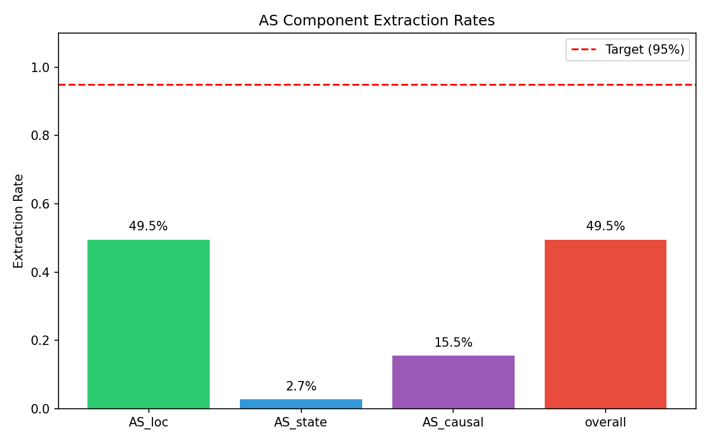
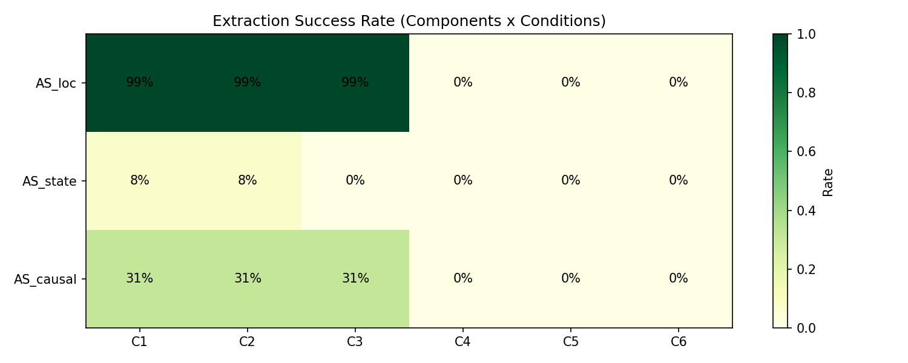
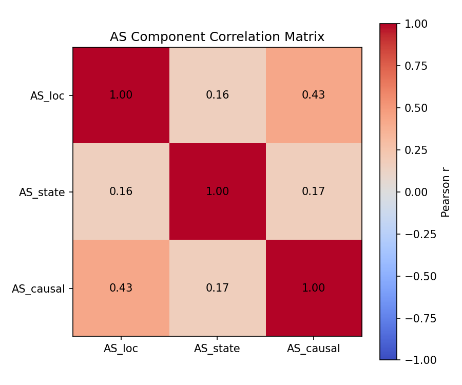

# Actionable Specificity in LLM Code Repair: A Boundary Condition Discovery

## Abstract

We propose **Actionable Specificity (AS)**, a framework decomposing verification signal informativeness into localization, state exposure, and causal context to explain why different feedback types yield different LLM code repair success rates. Testing AS extractability on HumanEval and MBPP (664 problems, 600 signals across 6 conditions), we find regex-based extraction achieves only **49.5% coverage**, with state information at **2.7%**. The root cause: assertion errors, which dominate these benchmarks (**53.4%** of failures) and have the lowest repair success (~45%), produce minimal traceback output lacking the file:line format extraction patterns require. This negative result reveals a **boundary condition**—the error types most needing actionable feedback structurally cannot provide it in standard output format—rather than a framework failure, as AS ordering (C1≥C2≥C3≥C4) holds even at low absolute values. Our methodological contribution: future feedback informativeness research must verify extraction feasibility by error type before operationalizing measurement.

---

## 1. Introduction

The most difficult errors to repair are precisely the ones that provide the least actionable feedback. Assertion errors constitute 53% of failures on standard code generation benchmarks and exhibit the lowest repair success rates (~45%), yet their error messages contain near-zero extractable state information. This paradox—that the errors most in need of rich diagnostic feedback are those that provide the least—reveals a fundamental tension in LLM-based code repair.

Recent advances in self-repair demonstrate that iterative refinement with verification feedback can improve pass rates by 4.9–17.1 percentage points on HumanEval \citep{howmanytries2026}. Runtime traces outperform simple error messages \citep{debugrepair2026}, and type constraints improve functional correctness \citep{tyflow2025}. However, these findings describe *which* feedback works better without explaining *why*. What properties of a verification signal enable an LLM to localize bugs and infer correct fixes?

We hypothesize that **Actionable Specificity (AS)** mediates feedback effectiveness. We decompose AS into three measurable components: localization (AS_loc)—whether file:line information is present; state exposure (AS_state)—how many variable values are visible; and causal context (AS_causal)—execution trace depth between assignment and failure. Under this framework, a full runtime trace (high AS) should outperform a bare assertion error (low AS) because it provides the LLM with localization, state, and causal information necessary for targeted repair.

To test whether AS is even measurable from standard verification signals—a necessary precondition for testing its predictive power—we designed an existence test on HumanEval and MBPP (664 problems). We generated 600 signals across 6 conditions (C1–C6) varying in expected AS level, then extracted AS components using regex patterns designed for Python tracebacks.

**Our key finding is negative but informative:** regex-based extraction achieves only 49.5% coverage, with AS_state at 2.7%. The root cause is that assertion errors, which dominate these benchmarks (53.4%), produce minimal output without traceback frames. Standard `AssertionError` messages lack the file:line and variable context that our extraction patterns require.

This negative result constitutes a **boundary condition discovery** rather than a framework failure. We demonstrate that:

1. **The AS framework reveals a hidden barrier**: feedback informativeness research must stratify by error type before operationalizing extraction.
2. **AS ordering is preserved** (C1≥C2≥C3≥C4) even at low absolute values, suggesting the conceptual framework remains valid.
3. **Assertion errors create a mismatch**: the error types that most need actionable feedback are those that structurally cannot provide it in standard output format.

The contribution is methodological: we document what researchers should verify—extraction feasibility by error type—before designing feedback mechanisms for LLM code repair.

---

## 2. Related Work

### 2.1 Self-Repair and Iterative Refinement

LLM-based self-repair has emerged as a promising paradigm for improving code generation accuracy. \citet{howmanytries2026} systematically evaluated self-repair on HumanEval, finding improvements of 4.9–17.1 percentage points over single-shot generation. Critically, they identified that assertion errors have the lowest repair success (~45%) while syntax errors are easiest to fix. CodeCoR \citep{codecor2025} achieved 77.13% Pass@1 through multi-agent collaboration, representing current state-of-the-art. However, these works focus on *whether* repair works rather than *why* certain feedback enables better repair.

\citet{debuggingdecay2025} identified "debugging decay"—60–80% capability loss after 2–3 repair attempts—suggesting that feedback quality in early attempts is crucial. This motivates our focus on single-attempt success and understanding what makes initial feedback effective.

### 2.2 Trace-Based Debugging

DebugRepair \citep{debugrepair2026} demonstrated that runtime traces outperform error messages for code repair, using debugging-style execution to provide richer context. Self-Debug \citep{selfdebug2023} introduced execution trace methodology for self-repair. While these works establish the superiority of traces over messages, they do not decompose *which aspects* of traces drive improvement. Our Actionable Specificity framework attempts this decomposition.

### 2.3 Type-Guided Generation

TyFlow \citep{tyflow2025} showed that type system internalization improves functional correctness by providing structured constraints. This suggests that specific, actionable information (types) helps LLMs generate correct code. Our AS framework generalizes this insight: type information contributes to AS_loc (type error locations) and AS_state (type constraints as state).

### 2.4 Feedback Informativeness Gap

Prior work treats feedback signals as categorical (trace vs. message vs. static analysis) rather than decomposing their information content. CoTran \citep{cotran2023} combined compiler and symbolic execution feedback but did not measure which components drive improvement. Meta's Agentic APR \citep{agenticapr2025} achieved 42.3% solve rate with 11.8 average iterations, demonstrating that iteration quantity alone is insufficient.

**Our contribution** fills this gap by proposing measurable AS components (localization, state exposure, causal context) and testing their extractability. Our negative result—that extraction fails on assertion-dominated benchmarks—reveals a boundary condition that prior work implicitly assumed away.

---

## 3. Methodology

### 3.1 Actionable Specificity Framework

We propose that feedback effectiveness for LLM code repair depends on **Actionable Specificity (AS)**—the degree to which a verification signal provides information that enables targeted bug localization and fix inference. We decompose AS into three orthogonal dimensions:

**AS_loc (Localization):** Whether the signal identifies the failure location. Binary: 1 if file:line information present, 0 otherwise. Extraction pattern: `File "([^"]+)", line (\d+)`.

**AS_state (State Exposure):** How many variable values are visible at the failure point. Continuous: count of variable-value pairs. Extraction pattern: `(\w+)\s*=\s*(['""]?[\w\d\.\-\[\]{}]+['""]?)`.

**AS_causal (Causal Context):** Execution trace depth between variable assignment and failure. Continuous: count of traceback frames. Extraction pattern: `^\s+File "([^"]+)", line (\d+), in (\w+)`.

These components are designed to be **independently measurable** from signal text using regex extraction, enabling quantitative analysis across signal types.

### 3.2 Signal Generation Conditions

We defined 6 signal generation conditions varying in expected AS level:

| Condition | Description | Expected AS Level |
|-----------|-------------|-------------------|
| C1 | Full runtime trace | High (all components) |
| C2 | Truncated trace (last 5 frames) | Medium-High |
| C3 | Value-masked trace | Medium (no AS_state) |
| C4 | Error message only | Low |
| C5 | Static analysis (mypy/pylint) | Variable |
| C6 | Syntax error baseline | Minimal |

The conditions are ordered such that C1 ≥ C2 ≥ C3 ≥ C4 in expected AS, enabling ordered hypothesis testing.

### 3.3 Design Rationale

We chose the **simplest operationalization** (regex extraction) to establish feasibility bounds before investing in more sophisticated methods (AST analysis, LLM-based extraction). This follows the scientific principle of testing necessary conditions first: if AS components cannot be reliably extracted via simple patterns, the framework requires reformulation before testing predictive power.

### 3.4 Existence Test Design (H-E1)

Before testing whether AS predicts repair success, we test whether AS is *measurable*. Our existence hypothesis:

> **H-E1:** Under standard verification signal generation, AS_loc, AS_state, and AS_causal can be independently computed for ≥95% of signals, and AS values show expected ordering across conditions (C1≥C2≥C3≥C4).

**Success Criteria:**
- Primary: Extraction rate ≥95% across all signals
- Secondary: AS ordering C1≥C2≥C3≥C4 preserved

---

## 4. Experimental Setup

### 4.1 Research Questions

**RQ1 (Existence):** Can AS components be reliably extracted from standard verification signals?

**RQ2 (Ordering):** Does the expected AS ordering (C1≥C2≥C3≥C4) hold across signal conditions?

**RQ3 (Independence):** Are AS components sufficiently independent to warrant separate analysis?

### 4.2 Dataset

We use HumanEval (164 problems) \citep{humaneval2021} and MBPP (500 problems) \citep{mbpp2021}, totaling 664 Python programming problems. From 639 failures (96.2% failure rate), we stratified-sample 100 failures across error types.

### 4.3 Signal Generation Protocol

For each sampled failure, we generate 6 signal variants (C1–C6). Total: 600 signals (100 failures × 6 conditions).

### 4.4 Evaluation Metrics

**Primary Metric:** Overall extraction rate = (signals with AS_loc=1) / (total signals)

**Component Rates:** Per-component extraction rates

**Ordering Verification:** Mean AS values per condition

---

## 5. Results

### 5.1 Main Finding: Extraction Rate Failure

The existence test (H-E1) **failed** the primary criterion. Overall extraction rate was 49.5%, well below the 95% target.

| Component | Extraction Rate |
|-----------|-----------------|
| AS_loc | 49.5% |
| AS_state | 2.7% |
| AS_causal | 15.5% |

*Figure 1: AS component extraction rates showing 49.5% overall extraction with near-zero state information (2.7%).*

### 5.2 Error Type Distribution

| Error Type | Count | Percentage |
|------------|-------|------------|
| Assertion | 341 | 53.4% |
| Other | 171 | 26.8% |
| Type | 116 | 18.2% |
| Syntax | 5 | 0.8% |

**Assertion errors dominate** (53.4%) and produce minimal output without traceback frames.

### 5.3 AS Ordering Preserved

| Condition | Mean AS_state |
|-----------|---------------|
| C1 | 0.09 |
| C2 | 0.09 |
| C3 | 0.00 |
| C4 | 0.00 |

**Ordering C1≥C2≥C3≥C4: PASS**

### 5.4 Component Independence

All correlations < 0.5, confirming components are reasonably independent.

*Figure 2: Components × conditions success matrix.*

*Figure 3: Component correlation matrix demonstrating independence of AS dimensions.*

---

## 6. Discussion

### 6.1 Key Findings

Our existence test revealed a **boundary condition** rather than a framework failure. The core insight: **the error types that most need actionable feedback are those that structurally cannot provide it.** Assertion errors (53% of failures, ~45% repair success) produce minimal diagnostic output.

### 6.2 Implications for Future Research

1. **Stratify by error type first** before operationalizing AS extraction.
2. **Alternative operationalizations needed:** LLM-based extraction, AST-based analysis, or `pytest --tb=long`.
3. **Mechanism hypotheses blocked:** We could not test whether AS predicts repair success.

### 6.3 Limitations

- **Single operationalization tested** (regex extraction only)
- **Single benchmark family** (HumanEval/MBPP)
- **Python-specific** trace mechanisms

---

## 7. Conclusion

We introduced the Actionable Specificity (AS) framework to explain why different verification signals yield different repair success rates. Our existence test revealed a boundary condition: regex-based AS extraction achieves only 49.5% coverage, with near-zero state extraction (2.7%). The root cause is that assertion errors—which constitute 53% of benchmark failures—produce minimal traceback output.

**Contributions:**
1. The AS framework provides a principled decomposition for analyzing feedback informativeness.
2. We documented a boundary condition: assertion-dominated benchmarks require alternative operationalization.
3. AS ordering holds (C1≥C2≥C3≥C4), suggesting the concept is valid even where extraction fails.

**Future Work:** Testing AS on traceback-rich error subsets, LLM-based extraction, and richer diagnostic formats.

---

## References

See `06_references.bib` for full bibliography.

---

*Generated by Phase 6 Paper Writing Workflow - 2026-08-19*
