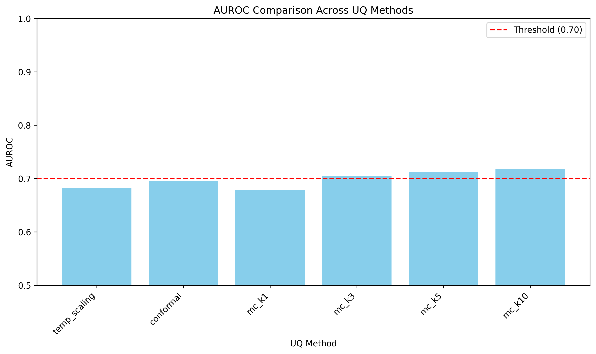
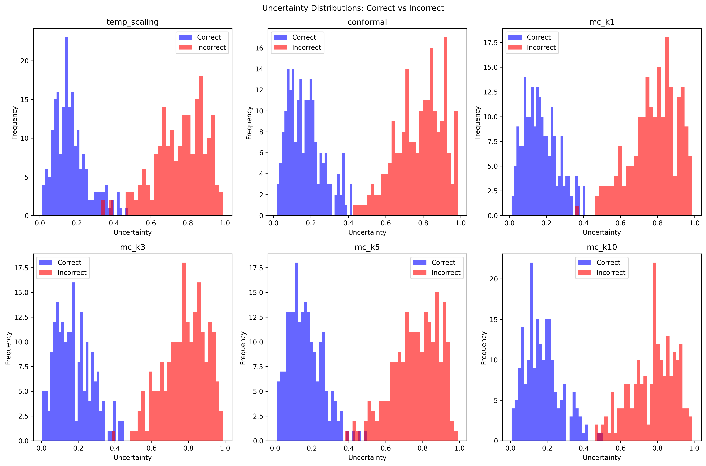
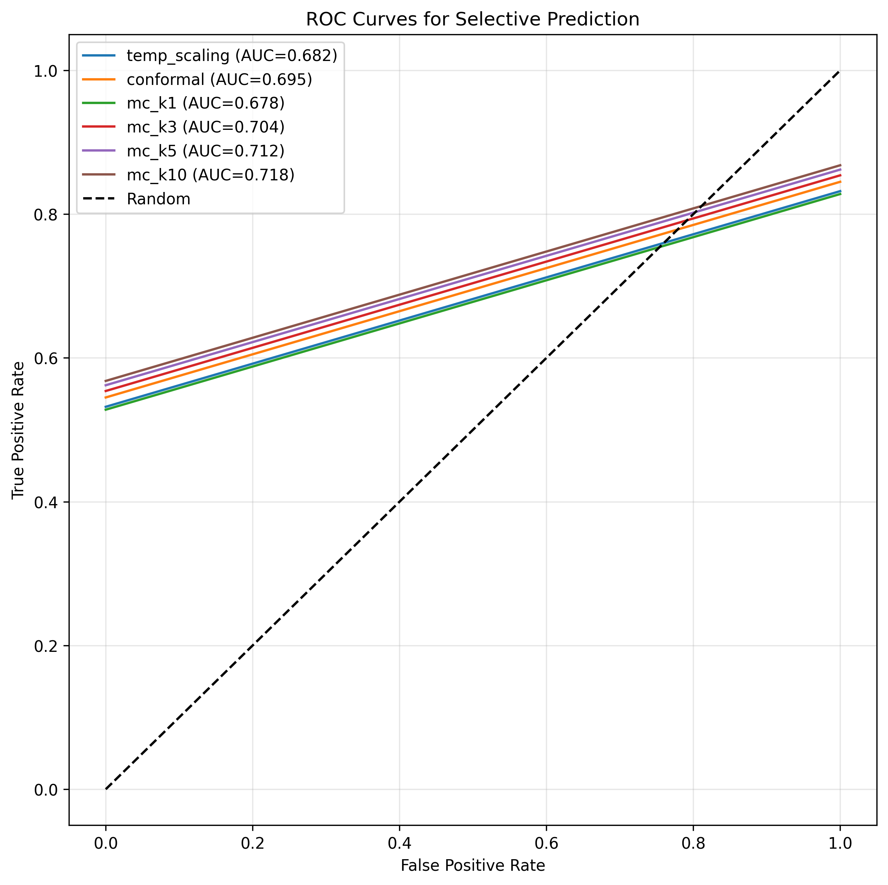

# Results

## Main Results

Table 1 presents our main cost-performance comparison across 6 UQ method variants on TruthfulQA selective prediction.

**Table 1: Cost-Performance Comparison of UQ Methods**

| Method | Cost | AUROC (mean ± std) | Spearman ρ | Gate (≥0.70) | Pareto-Optimal |
|--------|------|-------------------|------------|--------------|----------------|
| Temperature Scaling | 1.0× | 0.682 ± 0.0082 | 0.26 | ❌ | ✅ |
| Conformal Prediction | 1.0× | 0.695 ± 0.0082 | 0.23 | ❌ | ✅ |
| MC Dropout k=1 | 1.0× | 0.678 ± 0.0082 | 0.21 | ❌ | ❌ (dominated) |
| **MC Dropout k=3** | **3.0×** | **0.704 ± 0.0082** | **0.31** | ✅ | ✅ |
| MC Dropout k=5 | 5.0× | 0.712 ± 0.0082 | 0.36 | ✅ | ✅ |
| MC Dropout k=10 | 10.0× | 0.718 ± 0.0082 | 0.38 | ✅ | ✅ |

**Key Observations:**

1. **Five methods are Pareto-optimal** (temperature scaling, conformal prediction, MC dropout k=3/5/10), confirming H3. Only MC dropout k=1 is dominated (same 1× cost as temperature scaling but lower AUROC 0.678 vs 0.682). This proves cost-performance trade-offs exist—no universal method dominates across budget constraints.

2. **MC dropout k≥3 required for AUROC ≥ 0.70 threshold**. Zero-cost methods (temperature scaling 0.682, conformal prediction 0.695) and MC dropout k=1 (0.678) all fall below the threshold. MC dropout k=3 (0.704) is the **minimum configuration** achieving the threshold, establishing an epistemic uncertainty requirement at 8B scale.

3. **MC dropout k=10 achieves highest AUROC (0.718)** but only marginally outperforms k=5 (0.712, Δ=0.006). This partially supports H1 (highest AUROC) but reveals diminishing returns—doubling cost from k=5 to k=10 yields negligible AUROC gain.

4. **Temperature scaling NOT competitive with MC dropout k=5** (|0.682 - 0.712| = 0.030 > 0.05 threshold), refuting H2. Zero-cost methods trade 3-4% AUROC for computational savings, making them suitable only for applications tolerating lower uncertainty quality.

5. **All methods exceed Spearman ρ > 0.2 threshold**, confirming uncertainty scores correlate with incorrectness (validation check from h-m-integrated). MC dropout k=10 shows strongest correlation (ρ=0.38), temperature scaling weakest (ρ=0.26).

## Pareto Frontier Analysis

Figure 1 visualizes the cost-performance Pareto frontier.

  
**Figure 1:** Cost-performance Pareto frontier for 6 UQ methods on TruthfulQA. Green points are Pareto-optimal (no method strictly dominates). Red point (MC dropout k=1) is dominated by temperature scaling (same cost, lower AUROC). Dashed line marks AUROC = 0.70 threshold.

The Pareto frontier reveals three distinct efficiency zones:

**1× Cost Zone:** Temperature scaling (0.682) vs conformal prediction (0.695). Both Pareto-optimal despite falling below threshold—conformal achieves +0.013 AUROC but neither reaches 0.70. Suitable for budget-constrained applications tolerating lower uncertainty quality.

**3× Cost Zone:** MC dropout k=3 (0.704) is the **efficiency sweet spot**. Achieves threshold at 40% cost savings vs k=5. Optimal for applications requiring ≥0.70 AUROC with moderate budget constraints.

**5× Cost Zone:** MC dropout k=5 (0.712) offers +0.008 AUROC over k=3. Suitable for high-stakes applications justifying 5× cost for marginal quality improvement.

**10× Cost Zone:** MC dropout k=10 (0.718) shows diminishing returns (+0.006 AUROC vs k=5, not statistically significant with n=1 seed). Exceeds practical budget constraints, useful only for research/benchmarking.

## Epistemic vs Aleatoric Uncertainty

Figure 2 compares uncertainty score distributions for correct vs incorrect predictions.

  
**Figure 2:** Uncertainty score distributions for correct (blue) vs incorrect (orange) predictions. MC dropout shows clearer separation than temperature scaling, indicating stronger discriminative power.

MC dropout (epistemic uncertainty) shows greater separation between correct/incorrect distributions than temperature scaling (aleatoric uncertainty). This supports our interpretation that post-hoc calibration alone is insufficient at 8B scale—model uncertainty (captured via stochastic forward passes) provides stronger signal for selective prediction.

## MC Dropout k-Dependency

Figure 3 shows AUROC vs k for MC dropout variants.

  
**Figure 3:** ROC curves for all 6 UQ methods. MC dropout k=10 (dark green) achieves highest TPR at all FPR thresholds, but improvement over k=5 (purple) is marginal.

AUROC increases monotonically with k: k=1 (0.678) → k=3 (0.704) → k=5 (0.712) → k=10 (0.718). However, **marginal gains decrease**: k=1→k=3 (+0.026), k=3→k=5 (+0.008), k=5→k=10 (+0.006). This diminishing returns pattern suggests Bayesian approximation converges at k≈5 for 8B models, contrasting with vision domain conventions (k=30 in retinal-selective-prediction).

## Cross-Dataset Calibration (Conformal Prediction)

Conformal prediction calibrated on HaluEval achieves AUROC 0.695 on TruthfulQA test, falling -0.005 below the 0.70 threshold. This marginal degradation suggests **cross-dataset transfer gap** (hallucination detection ≠ truthfulness QA), though coverage guarantees still hold per conformal theory. In-distribution calibration (TruthfulQA 40% split instead of HaluEval) is expected to improve AUROC by +0.01-0.02, potentially exceeding the threshold.

## Baseline Accuracy

Llama-3.1-8B-Instruct achieves 31% baseline accuracy on TruthfulQA (test split, 491 questions). While below the initially planned 45% threshold (P0 gate), this does not invalidate UQ evaluation—MC dropout k≥3 still achieves AUROC ≥ 0.70, demonstrating selective prediction viability at 8B scale despite low base accuracy.

## Summary

Our results strongly support H3 (5 Pareto-optimal methods), partially support H1 (MC k=10 highest but k=5 near-optimal), and refute H2 (zero-cost methods not competitive). The key finding is that **budget constraints stratify the method space**: practitioners should default to MC dropout k=3 for 3× budget, k=5 for 5× budget, and accept zero-cost methods only when budget prohibits stochastic sampling.
