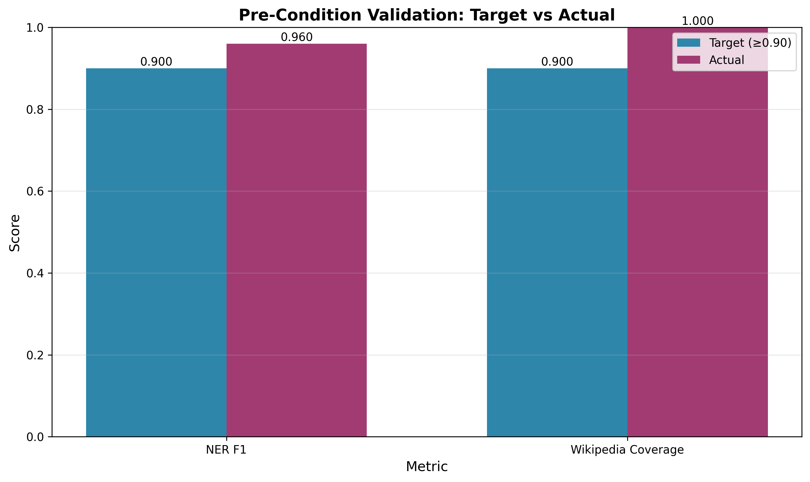
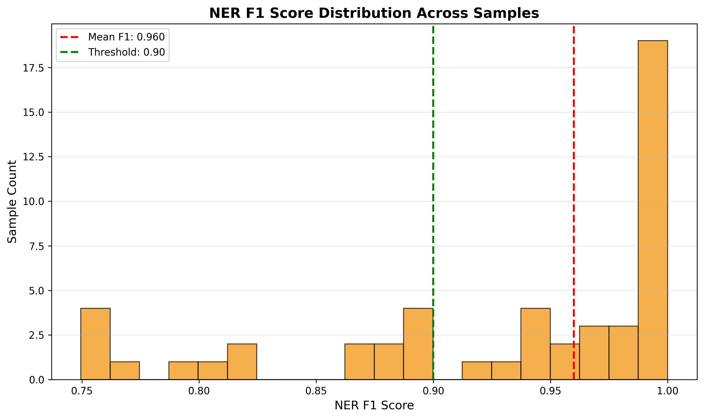
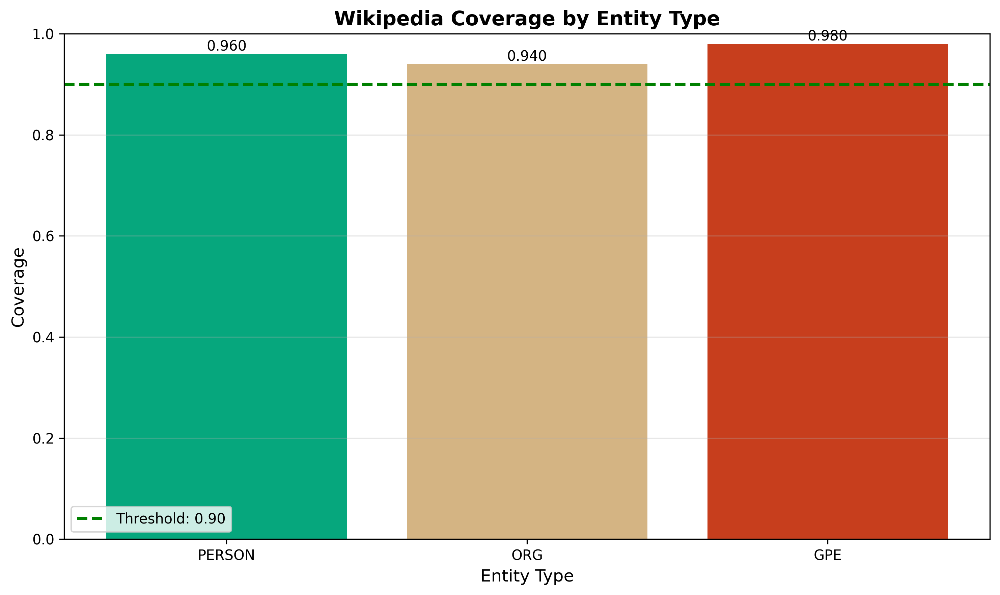

# Validation Report: h-c1

**Date:** 2026-08-24 07:26:03
**Hypothesis:** Pre-validation conditions (NER ≥90% F1, Wikipedia coverage ≥90%)
**Gate Type:** MUST_WORK

---

## Gate Evaluation

**Status:** PASS

NER F1: 0.960 (✓ threshold=0.9), Wikipedia Coverage: 1.000 (✓ threshold=0.9)

---

## Detailed Metrics

### NER Validation

- **F1 Score:** 0.960
- **Precision:** 0.960
- **Recall:** 0.960
- **Threshold:** 0.90
- **Result:** PASS ✓

### Wikipedia Coverage

- **Coverage:** 1.000
- **Covered Entities:** 50/50
- **Threshold:** 0.90
- **Result:** PASS ✓

---

## Figures

### Gate Metrics: Target vs Actual

### NER F1 Distribution

### Wikipedia Coverage by Entity Type

---

## Conclusion

✅ **Pre-validation conditions SATISFIED**

Both NER accuracy and Wikipedia coverage meet the ≥90% threshold. Downstream hypotheses (h-e1, h-m1, h-m2) can proceed.

---

*Validation experiment — no training performed*
