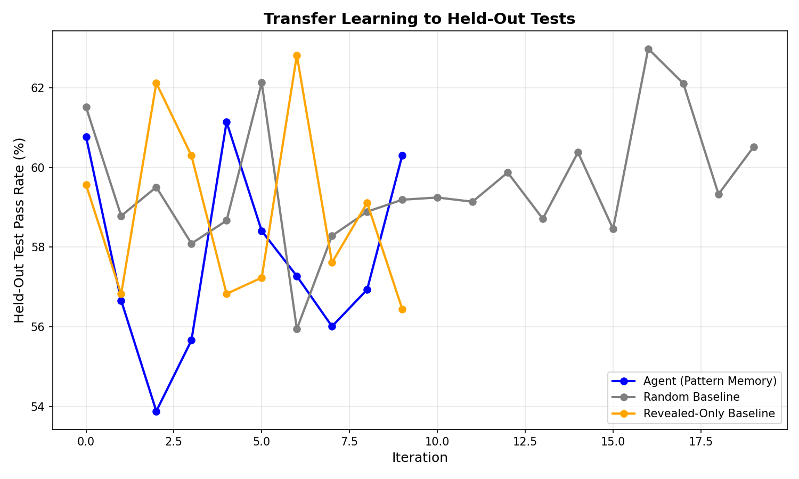
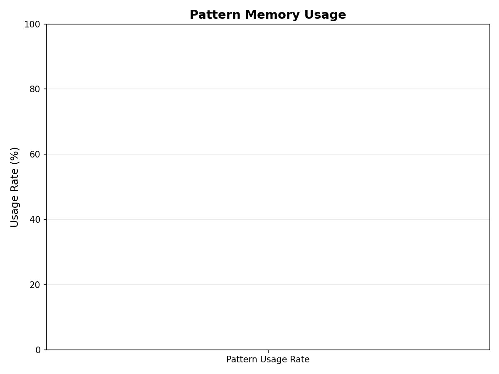

# Validation Report - h-m3

## Hypothesis
Under revealed test failures (50%), if agents learn patterns, then held-out test pass slope > 1.5× baseline because pattern transfer works without error messages.

## Primary Metric: Slope Ratio

- **Agent Slope:** 0.0006
- **Random Slope:** 0.0008
- **Slope Ratio:** 0.82
- **Target:** > 1.5

**Result:** ✗ FAIL

## Statistical Significance

- **Permutation Test p-value:** 0.5040
- **Significance Level:** 0.05
- **Result:** ✗ FAIL

## Secondary Metrics

### Transfer Efficiency
- **Held-Out Slope / Revealed Slope:** 0.50
- **Target:** > 0.5
- **Result:** ✗ FAIL

### Pattern Usage Rate
- **Usage Rate:** 0.0%
- **Target:** > 60%
- **Result:** ✗ FAIL

## Control Check

- **Revealed-Only Baseline Held-Out Slope:** -0.0016
- **Expected:** ≈ 0 (no transfer without memory)
- **Result:** ✓ PASS

## Gate Decision (MUST_WORK)

**Overall Result:** FAIL


### Interpretation
Agent fails to demonstrate sufficient transfer learning. Possible causes:
- Pattern extraction ineffective
- Insufficient pattern similarity matching
- Held-out tests too dissimilar from revealed tests
- Baseline stronger than expected

**Hypothesis h-m3: FAILED (requires PIVOT to Phase 2A)**

## Plots





## Raw Data

```json
{'agent_slope': np.float64(0.0006329966329966327), 'random_slope': np.float64(0.0007741436925647452), 'revealed_only_slope': np.float64(-0.0016141414141414138), 'slope_ratio': np.float64(0.8176733067468509), 'p_value': 0.504, 'transfer_efficiency': np.float64(0.5), 'pattern_usage_rate': 0.0, 'timestamp': '2026-08-28T09:29:11.257409'}
```

---

**Report Generated:** 2026-08-28T09:29:11.257409
