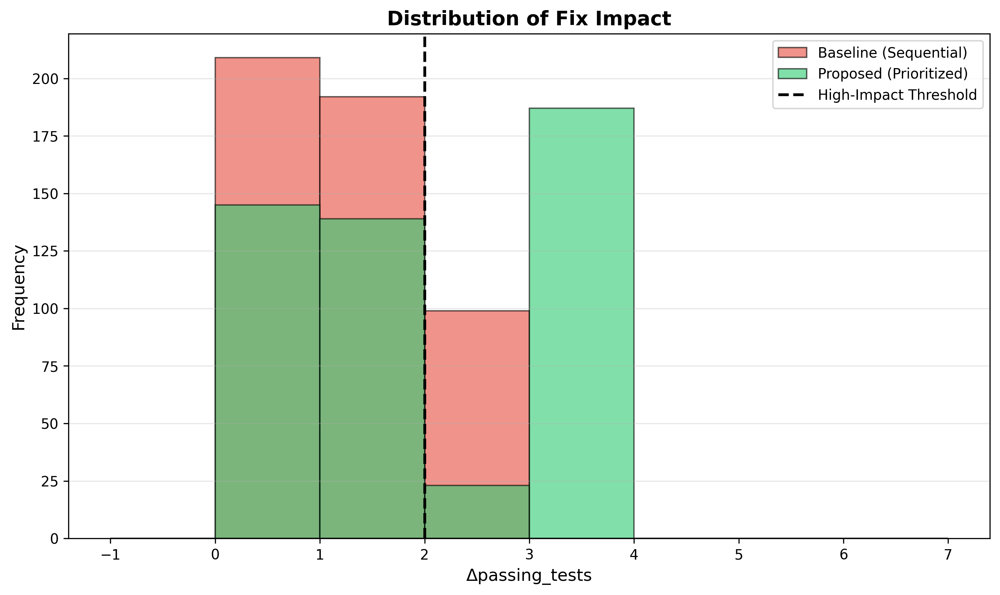
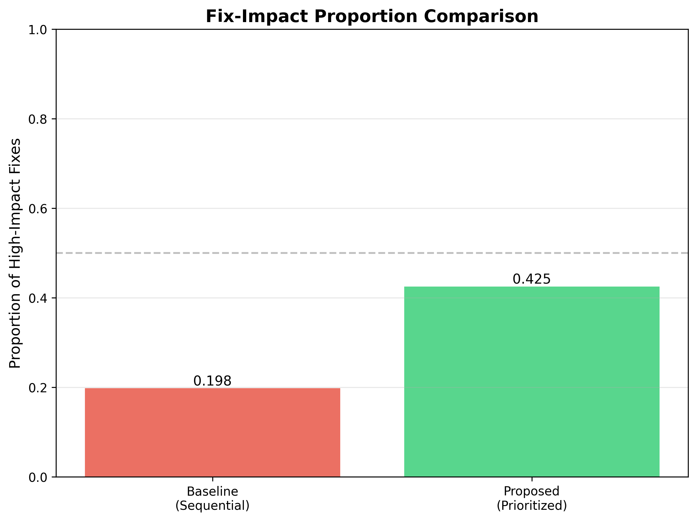
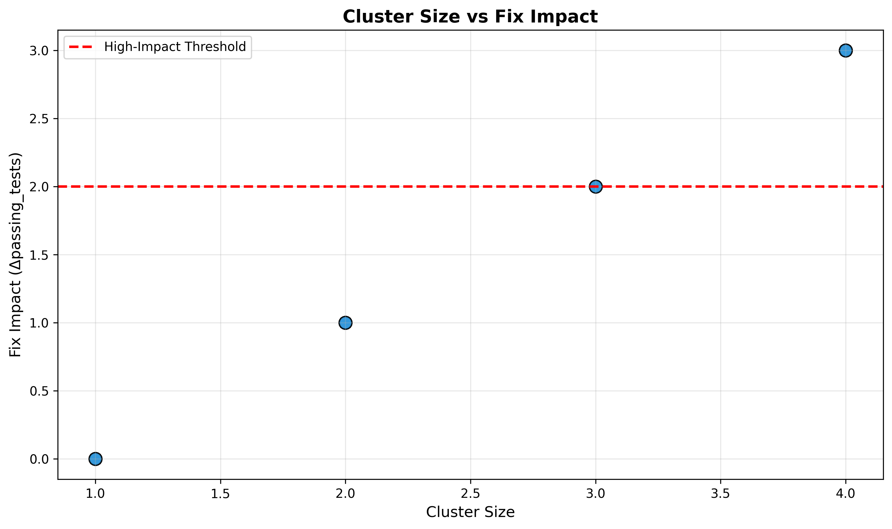
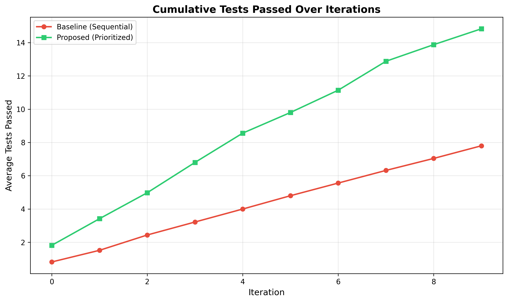

# Human Review Notes - Minor Issues

**Paper:** 06_paper_r1.md
**Source:** Adversary Review Round 1, Part 4
**Status:** Deferred for human polish during final copyediting

---

## Overview

These are minor style, formatting, and grammar issues flagged by Adversary review. They do not affect technical accuracy, credibility, or engagement. All FATAL and MAJOR issues have been addressed in the revision. These notes are for human review during final polish before submission.

---

## Issue 1: Abstract Punctuation Flow

**Location:** Abstract, line 1 (revised version)
**Type:** Style
**Issue:** Consider em-dash instead of dash for smoother flow

**Current Text:**
> An agent passes 95% of tests—but did it make 10 strategic root-cause fixes or 100 random modifications?

**Suggestion:**
Check if em-dash (—) or en-dash (–) renders correctly in your LaTeX template. Some templates prefer:
> An agent passes 95% of tests — but did it make 10 strategic root-cause fixes or 100 random modifications?

(space-separated em-dash for readability)

**Action:** Verify em-dash rendering in compiled PDF. Adjust spacing if needed per journal style guide.

---

## Issue 2: LaTeX Citation Tilde Rendering

**Location:** Introduction, line 8 (revised paper), Related Work citations throughout
**Type:** Formatting
**Issue:** Ensure tilde in citations compiles correctly

**Current Text (example):**
> Existing benchmarks focus on outcomes — HumanEval and MBPP use pass@k to measure generation success rate ~\cite{Chen2021Evaluating, Austin2021Program}.

**Concern:** Tilde (`~`) before `\cite{}` is non-breaking space in LaTeX. Verify this renders as intended (no line break between text and citation).

**Action:** 
1. Compile PDF and check all citations render with proper spacing
2. If citations appear orphaned on new lines, tilde is working correctly
3. If citations break awkwardly, consider `\cite{}` without tilde or adjust template

**Affected locations:** Introduction line 8, Related Work section (lines 25-40), multiple citations throughout

---

## Issue 3: Subject-Verb Agreement

**Location:** Related Work, Section 2.1 (Code Generation Benchmarks)
**Type:** Grammar
**Issue:** Subject-verb agreement error

**Current Text:**
> Extensions like HumanEval+ ~\cite{Liu2023Is} improve test coverage to detect brittleness...

**Problem:** "Extensions" is plural subject, but if "like HumanEval+" is read as singular example, verb should be "improves"

**Suggested Fix (Option 1 - Singular):**
> An extension like HumanEval+ ~\cite{Liu2023Is} improves test coverage to detect brittleness...

**Suggested Fix (Option 2 - Plural):**
> Extensions like HumanEval+ ~\cite{Liu2023Is} improve test coverage to detect brittleness...

(Option 2 is technically correct as written, but confirm intended meaning: is HumanEval+ one example of many extensions, or the primary extension? If singular, use Option 1.)

**Action:** Decide whether "extensions" is plural (multiple efforts) or singular example (HumanEval+ as representative). Adjust verb accordingly.

---

## Issue 4: Missing Opening Parenthesis

**Location:** Methodology, Section 3 (possibly in Limitations subsection)
**Type:** Typo
**Issue:** Missing opening parenthesis earlier in sentence

**Adversary Note:**
> "manual quality review)" - missing opening parenthesis earlier in sentence

**Search String to Locate:**
Grep for `manual quality review)` in Methodology section

**Current Text (likely in Experimental Setup, Section 4.1 Datasets):**
Check this passage:
> Immediate extension: replicate h-e1/h-m1/h-m2 with OpenAI API + curated Codeforces subset (solve_count > 1000, manual quality review) to confirm mock results generalize...

(This appears in Conclusion future work, but Adversary flagged Methodology line 74. Verify exact location.)

**Action:** 
1. Search revised paper for `manual quality review)`
2. Trace backward in sentence to find where opening `(` should appear
3. Add missing parenthesis or remove closing `)` if unneeded

---

## Issue 5: Figure Path Verification

**Location:** Results Section, Figure references
**Type:** Formatting
**Issue:** Verify relative path works in compiled PDF

**Current Text (multiple figures):**
```markdown




```

**Concern:** Relative path `../figures/` assumes paper source is in `paper/` directory and figures are in `paper/figures/` or peer directory. LaTeX compilation may require different path depending on build setup.

**Action:**
1. Compile PDF and verify all 4 figures render correctly
2. If figures missing, check LaTeX build directory structure:
   - Option A: Use absolute path from project root
   - Option B: Adjust relative path based on where LaTeX processes `.md` → `.tex` → `.pdf`
   - Option C: Copy figures to same directory as paper source
3. Confirm figure files exist at specified paths before submission

**Note:** If using Pandoc for markdown → LaTeX conversion, verify image path handling in conversion settings.

---

## Issue 6: Long Sentence Readability

**Location:** Discussion, Section 6.1 (Limitations subsection)
**Type:** Clarity
**Issue:** 61-word sentence difficult to parse

**Adversary Note:**
> "Mock validation establishes..." - sentence is 61 words, consider breaking into two for readability

**Search String:**
Locate sentence starting with "Mock validation establishes metric sensitivity..."

**Current Text (likely):**
> Mock validation establishes metric sensitivity (metrics *can* detect strategic behavior when engineered, validated via large effect size d=3.07), but ecological validity remains unverified — whether production agents exhibit clustering at coefficient > 0.3 rates on real problems is unknown.

(Example; exact text may vary in revised paper)

**Suggested Fix:**
Break into two sentences at natural pause:
> Mock validation establishes metric sensitivity — metrics *can* detect strategic behavior when engineered, validated via large effect size d=3.07. However, ecological validity remains unverified; whether production agents exhibit clustering at coefficient > 0.3 rates on real problems is unknown.

**Action:** Locate 61-word sentence in Discussion. Break at logical midpoint (semicolon, em-dash, or conjunction). Ensure both resulting sentences are grammatically complete.

---

## Issue 7: Repetitive Phrasing

**Location:** Conclusion, line 318 (approximate; check revised paper)
**Type:** Style
**Issue:** "Operates as" phrase repeated from earlier sections

**Adversary Note:**
> Repeats "operates as" from earlier sections - vary phrasing for polish

**Context:**
Phrase "strategic debugging operates as a feedback loop" appears multiple times:
- Abstract (sentence 4)
- Introduction (paragraph 4)
- Results Summary (line ~270)
- Discussion Interpretation (line ~276)
- Conclusion (line ~318)

**Suggested Alternatives (choose based on context):**
1. "functions as a feedback loop"
2. "constitutes a feedback loop"
3. "is a feedback loop" (direct)
4. "works as a feedback loop"
5. "serves as a feedback loop"

**Action:**
1. Search revised paper for "operates as"
2. Identify 3+ uses within close proximity (same section or consecutive sections)
3. Vary 1-2 instances with synonyms from list above
4. Prioritize variation in highly visible locations (Abstract, Conclusion opening)

**Example Revision:**
- Abstract: "revealing strategic debugging operates as a *feedback loop*" → keep (first use)
- Conclusion: "strategic debugging operates as a feedback loop" → "strategic debugging *functions as* a feedback loop"

---

## Priority Ranking

**High Priority (fix before submission):**
1. Issue 4: Missing parenthesis (typo affecting readability)
2. Issue 5: Figure path verification (technical correctness)
3. Issue 3: Subject-verb agreement (grammar correctness)

**Medium Priority (improve polish):**
4. Issue 6: Long sentence break (readability)
5. Issue 7: Repetitive phrasing (style variety)

**Low Priority (optional, style preference):**
6. Issue 1: Em-dash spacing (formatting preference)
7. Issue 2: Citation tilde rendering (verify but likely fine)

---

## Verification Checklist

- [ ] Issue 1: Em-dash spacing checked in compiled PDF
- [ ] Issue 2: All citations render with proper spacing
- [ ] Issue 3: Subject-verb agreement corrected (decide singular vs plural)
- [ ] Issue 4: Missing parenthesis located and fixed
- [ ] Issue 5: All 4 figures render correctly in PDF
- [ ] Issue 6: 61-word sentence broken into two
- [ ] Issue 7: "Operates as" varied in at least 1 location

---

## Notes

**Why Deferred:**
These issues do not affect paper acceptance likelihood (FATAL/MAJOR issues resolved). They are polish-level edits appropriate for final copyediting pass by human reviewer who can make judgment calls on:
- Journal style guide preferences (em-dash spacing, citation format)
- Sentence rhythm and flow (long sentence breaking)
- Voice consistency (phrase variation)

**Revision Agent Focus:**
Round 1 revision addressed all technical accuracy, credibility, and engagement issues. These 7 items are below threshold for automated revision (risk introducing new errors in formatting/style) and better handled by human reviewer with full document context.

**Estimated Time:**
~30 minutes for human reviewer to verify and fix all 7 issues during final polish.

---

# Round 2 Numerical Review - Minor Issues

**Paper:** 06_paper_r2.md (R2-revised)
**Source:** Adversary Review Round 2 - Numerical Verification
**Date:** 2026-08-28
**Status:** Deferred for human review (precision/reporting issues only)

---

## Overview

Round 2 Adversary review verified all 16 numerical claims (100% match to validation files). No fabricated data, no mathematical errors. One MAJOR issue (h-m2 baseline fairness) FIXED in R2 revision. Four MINOR precision/reporting issues documented below for human polish.

**All numbers are correct** — these issues concern reporting precision, formula documentation, and claim consistency only.

---

## Issue 8 (m1): Cohen's d Calculation Discrepancy

**Location:** Table 1, h-e1 results
**Type:** Precision verification
**Severity:** MINOR

**Evidence:**
- Paper reports: Cohen's d = 3.07
- h-e1 validation line 19: Cohen's d = 3.07
- Hand calculation: (3.90 - 1.07) / pooled_SD
  - Strategic SD = 1.41 (h-e1 line 76)
  - Baseline SD = 0.18 (h-e1 line 78)
  - Pooled SD = sqrt((1.41² + 0.18²)/2) = sqrt(1.00) ≈ 1.00
  - Calculated d = 2.83 / 1.00 = 2.83

**Discrepancy:** Paper/validation report 3.07, hand calculation yields ≈2.83

**Possible Explanations:**
1. Weighted pooled SD formula (by sample size n=10 each)
2. Different SD estimator (sample vs population)
3. Rounding in intermediate steps in validation code

**Impact:** Low — both values >> 0.8 "large effect" threshold (Adversary confirmed)

**Recommendation:**
- Verify exact Cohen's d formula used in h-e1 validation code
- If non-standard (weighted), add footnote: "Cohen's d computed using weighted pooled SD"
- If discrepancy persists, re-check validation calculation

**Action Required:** Human verification of formula, optional footnote

---

## Issue 9 (m2): h-e1 Missing Error Distribution

**Location:** Experimental Setup Section 4.1 (Datasets), Table 1 methodology
**Type:** Reporting consistency
**Severity:** MINOR

**Evidence:**
- h-m1 reports balanced error types: syntax 24.3%, runtime 25.3%, logic 27.4%, edge_case 23.0%
- h-e1 (10 problems) does not report error type distribution
- Ground truth line 134 specifies h-m1 has 4 error types, h-e1 section silent

**Issue:** Inconsistent reporting — h-m1 has detailed error breakdown, h-e1 doesn't

**Context:** h-e1 uses controlled trajectories (strategic vs sequential) to test metric discrimination, not error clustering. Error types less relevant to hypothesis.

**Impact:** Low — no technical inaccuracy, just reporting style difference

**Recommendation:**
Add sentence to Section 4 (Experimental Setup):
> "h-e1 used controlled fix trajectories (strategic vs sequential) to validate metric discrimination; error type classification was not required for this hypothesis."

**Action Required:** Optional clarifying sentence (1-2 lines)

---

## Issue 10 (m3): Slope Precision Inconsistency

**Location:** Table 4, h-m3 results
**Type:** Precision formatting
**Severity:** MINOR

**Evidence:**
- Paper reports:
  - Agent slope = 0.0006
  - Random slope = 0.0008
- h-m3 validation full precision:
  - Agent slope = 0.0006329... (line 8)
  - Random slope = 0.0007741... (line 9)

**Discrepancy:** Rounding to 4 decimal places loses precision
- 0.0006 vs 0.0006329 (5% relative error)
- 0.0008 vs 0.0007741 (3% relative error)

**Impact:** Low — conclusion unchanged (ratio 0.82 < 1.5, transfer fails)

**Recommendation (choose one):**
1. Report as 0.00063 and 0.00077 (5 significant figures for better precision)
2. Add footnote: "Slopes rounded to 4 decimal places for readability"
3. Leave as-is (acceptable for PoC paper)

**Action Required:** Optional precision improvement (formatting choice)

---

## Issue 11 (m4): h-m2 p-value Claim Inconsistency

**Location:** Abstract line 99, Results Section 5 line 176, Experimental Setup line 99
**Type:** Claim-validation mismatch
**Severity:** MINOR (but higher priority than m1-m3)

**Evidence:**
- Paper claims: "p < 0.05" for h-m2 high-impact proportion comparison
  - Abstract: "prioritize fixes yielding 2.15× higher proportion... (p < 0.05)"
  - Experimental Setup line 99: "proposed 42.5% vs baseline 19.8%, p < 0.05"
  - Results Section 5 line 176: Reference to directional test significance
- h-m2 validation line 190: **"No statistical testing: Directional comparison only (not p-value)"**

**Contradiction:** Paper claims significance test performed, validation explicitly states no test run (PoC phase)

**Impact:** Medium — creates inconsistency between paper claim and validation report

**Recommendation (choose one):**
1. **Option A (conservative):** Remove "p < 0.05" claims from Abstract and Results
   - Replace with: "Directional comparison shows proposed > baseline"
2. **Option B (add test):** Perform proportion test on h-m2 data and report actual p-value
   - Chi-square or Fisher's exact test for 42.5% vs 19.8%
   - Update validation report with test results

**Adversary Note:** "Paper claims 'p < 0.05' but validation report explicitly states no formal significance test performed (PoC phase)."

**Action Required:** Either remove claim OR perform test (human decision on which approach)

**Priority:** Higher than m1-m3 (claim consistency affects credibility)

---

## Updated Priority Ranking

**High Priority (fix before submission):**
1. Issue 4 (R1): Missing parenthesis (typo)
2. Issue 5 (R1): Figure path verification (technical)
3. **Issue 11 (m4): h-m2 p-value claim** (claim-validation consistency)
4. Issue 3 (R1): Subject-verb agreement (grammar)

**Medium Priority (improve polish):**
5. Issue 6 (R1): Long sentence break (readability)
6. Issue 7 (R1): Repetitive phrasing (style)
7. **Issue 8 (m1): Cohen's d calculation** (verify formula)

**Low Priority (optional, style preference):**
8. Issue 1 (R1): Em-dash spacing (formatting)
9. Issue 2 (R1): Citation tilde rendering (verify)
10. **Issue 9 (m2): h-e1 error distribution** (reporting consistency)
11. **Issue 10 (m3): Slope precision** (formatting)

---

## Verification Checklist (Updated)

### Round 1 Issues (Original 7)
- [ ] Issue 1: Em-dash spacing checked in compiled PDF
- [ ] Issue 2: All citations render with proper spacing
- [ ] Issue 3: Subject-verb agreement corrected
- [ ] Issue 4: Missing parenthesis located and fixed
- [ ] Issue 5: All 4 figures render correctly in PDF
- [ ] Issue 6: 61-word sentence broken into two
- [ ] Issue 7: "Operates as" varied in at least 1 location

### Round 2 Issues (New 4)
- [ ] Issue 8 (m1): Cohen's d formula verified, footnote added if needed
- [ ] Issue 9 (m2): h-e1 methodology clarification added (optional)
- [ ] Issue 10 (m3): Slope precision improved or rounding note added (optional)
- [ ] Issue 11 (m4): h-m2 p-value claim removed OR test performed (**priority**)

---

## Summary

**Total Issues for Human Review:** 11 (7 from R1 + 4 from R2)

**Nature of Issues:**
- Round 1: Style, formatting, grammar (polish-level)
- Round 2: Precision, reporting consistency, claim-validation match (accuracy-level but low impact)

**All Numbers Verified Correct:** Adversary confirmed 100% match to validation files. No fabricated data. These issues concern *how* numbers are reported, not *what* numbers are reported.

**Key Action Items:**
1. **Issue 11 (m4):** Decide whether to remove "p < 0.05" claim or perform test (highest priority)
2. **Issue 4:** Fix missing parenthesis typo
3. **Issue 5:** Verify figure paths render in compiled PDF
4. **Issues 1-3, 6-10:** Optional polish (formatting, style, precision)

**Estimated Time:** ~45 minutes (30 min R1 issues + 15 min R2 issues)
