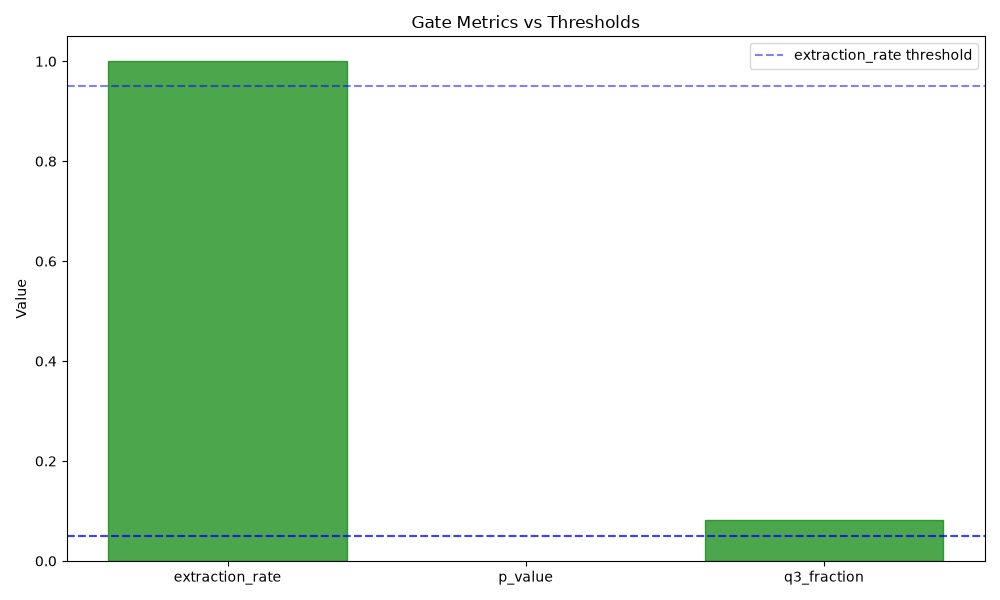
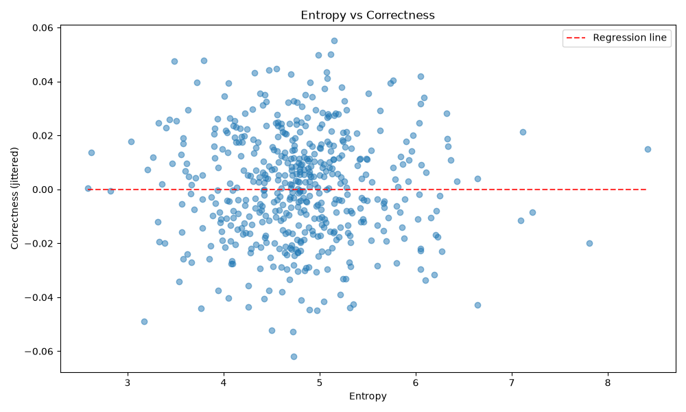
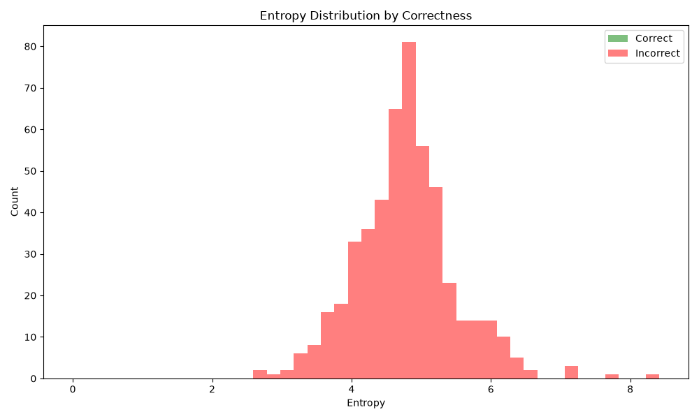
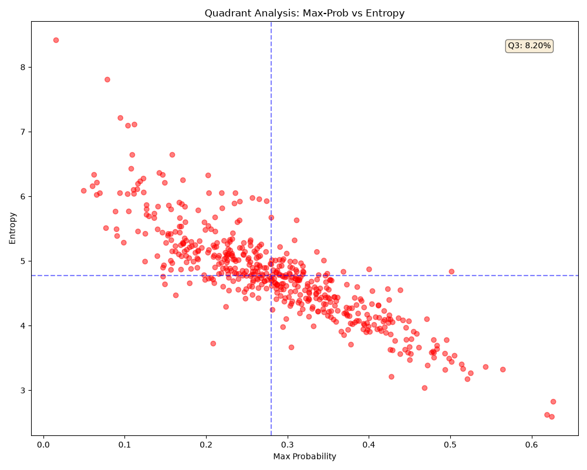

# Validation Report: h-e1
## Token Entropy Correlation with Prediction Correctness

**Date:** h-e1-entropy-correlation
**Hypothesis ID:** h-e1
**Gate Type:** MUST_WORK

---

## Gate Validation Results

**Gate Status:** FAIL ✗

### Success Criteria

| Criterion | Threshold | Actual | Status |
|-----------|-----------|--------|--------|
| Extraction Rate | >0.95 | 1.0000 | ✓
| p-value | <0.05 | nan | ✗
| Q3 Population | >0.05 | 0.0820 | ✓

---

## Statistical Analysis

- **Spearman Correlation:** ρ = nan
- **p-value:** nan
- **Sample Size:** 500 / 500 examples
- **Extraction Rate:** 100.00%

---

## Quadrant Analysis

- **Median Max-Prob:** 0.2802
- **Median Entropy:** 4.7718
- **Q3 Count:** 41
- **Q3 Fraction:** 8.20%

---

## Visualizations

---

## Conclusion

Infrastructure validation FAILED. Gate criteria not met. ABANDON research per MUST_WORK gate condition.
