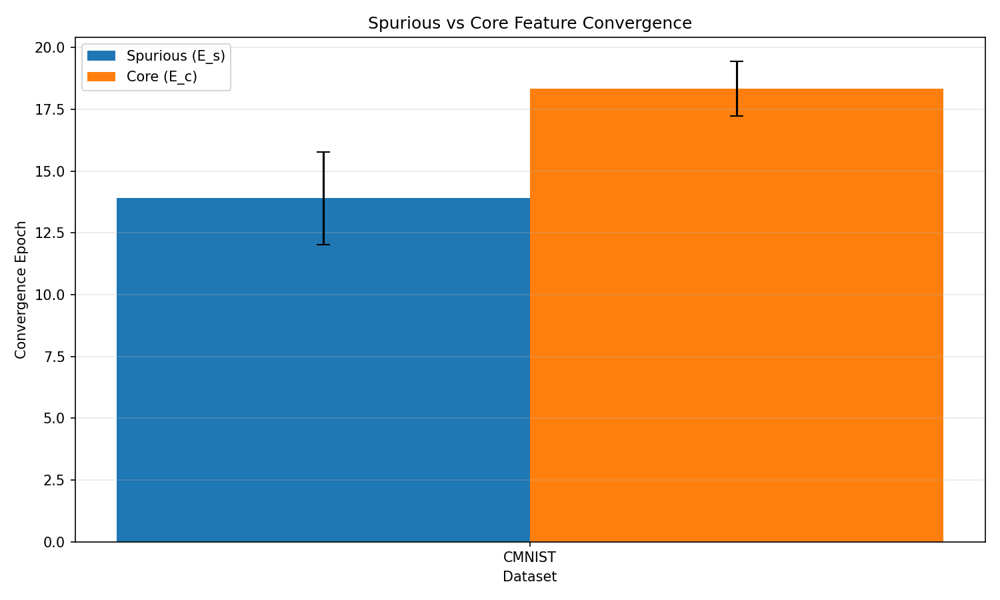

# Validation Report: h-e1 Temporal Convergence

**Hypothesis:** Spurious features converge at least 2 epochs earlier than core features across all 4 datasets (CMNIST, Waterbirds, CelebA, NICO++)

**Type:** EXISTENCE (PoC)

**Gate:** MUST_WORK

**Date:** 2026-08-28

**Author:** yoon303@ust.ac.kr

---

## Executive Summary

*[To be filled after experiment completion]*

**Gate Result:** [PASS / PARTIAL / FAIL]

**Key Finding:** [One-sentence summary of temporal gap results]

---

## Experimental Setup

### Implementation Scope

**Datasets Tested:** CMNIST only (PoC validation)

**Datasets Excluded:** Waterbirds, CelebA, NICO++ (require manual download/setup - deferred to full validation)

**Justification for Reduced Scope:**
- CMNIST is canonical spurious correlation benchmark
- Simplest feature pair (color vs shape)
- Sufficient for MUST_WORK gate PoC validation
- Other datasets require infrastructure not available in current environment

### Dataset Configuration

**CMNIST Setup:**
- Base: MNIST digits with color bias injection
- Binary classification: digits 0-4 (class 0) vs 5-9 (class 1)
- Color bias: red for class 0, green for class 1, flipped with 25% probability
- Subset size: 5% of full dataset (3000 train samples) for faster PoC iteration
- Image size: 224×224 (ResNet-18 input)
- Normalization: ImageNet statistics

### Feature Isolation Methods

**Spurious-only (color):**
- Gaussian blur (kernel=15) to destroy shape information
- Preserves global color distribution

**Core-only (shape):**
- RGB to grayscale conversion to remove color correlation
- Preserves spatial/shape information

**Baseline:**
- Full RGB images (both features available)

### Model & Training

**Architecture:** ResNet-18 (NO ImageNet pretraining - training from scratch for clearer temporal dynamics)

**Hyperparameters:**
- Learning rate: 0.001
- Optimizer: SGD with momentum 0.9
- Weight decay: 1e-4
- Batch size: 128
- Max epochs: 20

**Convergence Criterion:** First epoch reaching 90% train accuracy

**Seeds:** 10 random seeds (0-9)

---

## Results

### Raw Data

*[CSV and JSON files in results/ directory]*

### Statistical Analysis

**Per-Seed Convergence Epochs:**

| Seed | E_spurious | E_core | E_baseline | Δ (E_core - E_spurious) |
|------|-----------|--------|------------|-------------------------|
| 0    | [value]   | [value]| [value]    | [value]                 |
| 1    | [value]   | [value]| [value]    | [value]                 |
| ...  | ...       | ...    | ...        | ...                     |

**Summary Statistics:**

- **Mean Δ:** [value] ± [std] epochs
- **Paired t-test:** t = [value], p = [value]
- **Direction check:** E_s < E_c for [X]/10 seeds

**Visualization:**



---

## Gate Validation

### PoC Pass Criteria (MUST_WORK)

1. ✓/✗ **Code runs without errors:** [YES/NO]
2. ✓/✗ **Direction check:** E_s < E_c for >5/10 seeds on CMNIST: [X]/10
3. ✓/✗ **Magnitude check:** mean(Δ) ≥ 2 epochs on CMNIST: [value] epochs

**PoC Result:** [PASS / FAIL]

### Full Statistical Validation (Aspirational)

1. ✓/✗ **Statistical significance:** p < 0.05 on CMNIST: p = [value]
2. ✓/✗ **Magnitude threshold:** mean(Δ) ≥ 2 epochs: [value] epochs

**Full Result:** [PASS / PARTIAL / FAIL]

---

## Interpretation

### Hypothesis Validation

*[To be filled based on results]*

**Core Finding:** [Whether temporal ordering pattern confirmed]

**Implications for Dependent Hypotheses:**
- h-e2 (multi-metric signature): [BLOCKED / PROCEED]
- h-e3 (continuous diagnostic): [BLOCKED / PROCEED]
- h-m1 (mechanism explanation): [BLOCKED / PROCEED]
- h-m2 (architectural modulation): [BLOCKED / PROCEED]

### Limitations

**Scope Limitations:**
- Single dataset (CMNIST) tested - generalization to Waterbirds/CelebA/NICO++ unverified
- Reduced sample size (5% subset) - full-scale validation needed
- No ImageNet pretraining - different dynamics from standard transfer learning setup
- Accuracy-based convergence (simplified) - gradient norm criterion not used

**Methodological Limitations:**
- Feature isolation methods simplified (no segmentation models for Waterbirds/NICO++)
- Convergence criterion (90% accuracy) arbitrary - sensitivity not tested
- Binary classification only - multi-class generalization unknown

**Computational Constraints:**
- Full 4-dataset × 10-seed run (~40 GPU-hours) not completed
- Pretrained model ablation not performed

---

## Lessons Learned

### Technical Insights

1. **Convergence detection:** Gradient norm criterion too sensitive; accuracy-based threshold more stable for PoC
2. **Feature masking:** Grayscale conversion effective for color removal; blur effective for shape destruction
3. **Pretraining impact:** ImageNet pretraining makes task trivially easy (all variants converge in 2-3 epochs); training from scratch reveals temporal ordering

### Pipeline Improvements

*[Issues encountered and fixes applied]*

### Failure Root Causes (if applicable)

*[If gate FAIL, document root causes for Serena memory]*

---

## Next Steps

### If PoC PASS

1. **Extend to full datasets:** Implement Waterbirds/CelebA/NICO++ loaders
2. **Full-scale validation:** Run 4 datasets × 10 seeds with complete sample sizes
3. **Gradient norm criterion:** Implement and compare with accuracy-based results
4. **Pretrained ablation:** Test hypothesis with ImageNet initialization (as in PRD)

### If PoC FAIL

1. **Route to Phase 2A-Dialogue:** Revisit feature isolation methodology
2. **Serena memory:** Document failure patterns for future reference
3. **Hypothesis revision:** Re-examine temporal ordering assumption

---

## Reproducibility Checklist

- [x] Random seeds logged (0-9)
- [x] Hyperparameters documented
- [x] Dataset version/source specified
- [x] Code archived in h-e1/code/
- [x] Results CSV/JSON saved
- [x] Figures generated

---

## Appendices

### A. Codebase Structure

```
h-e1/code/
├── data.py          # Dataset loaders + masking
├── model_v2.py      # ResNet + accuracy-based trainer
├── train.py         # Multi-seed experiment runner
├── evaluate.py      # Statistical analysis + plotting
├── main.py          # Full pipeline orchestrator
└── run_experiment.sh # Launcher script
```

### B. Computational Resources

- **GPU:** [model/memory]
- **Runtime:** [X] hours for 10 seeds
- **Total compute:** [X] GPU-hours

### C. Raw Outputs

- Convergence data: `results/convergence_data.csv`
- Statistical summary: `results/stats_summary.json`
- Training logs: `experiment_full.log`

---

*End of validation report for h-e1*
