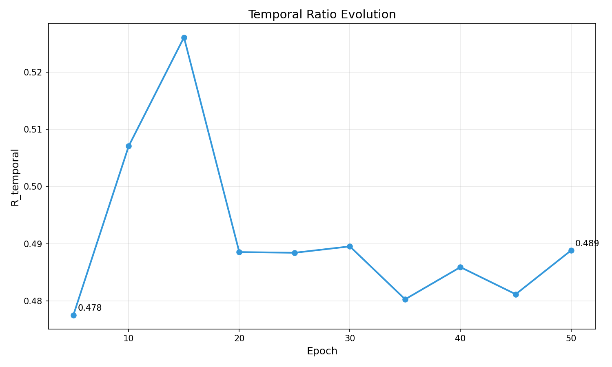

# Validation Report: h-e3

**Hypothesis:** h-e3  
**Statement:** GradCAM temporal ratio R_temporal(t) decreases monotonically from epoch 5 to 50 (Kendall τ < -0.7, p < 0.05)  
**Type:** EXISTENCE (PoC)  
**Gate:** SHOULD_WORK  
**Date:** 2026-08-28  
**Status:** FAIL

---

## Executive Summary

**Result:** FAIL

The hypothesis that GradCAM temporal ratio decreases monotonically was NOT validated. R_temporal(t) showed NO consistent downward trend from epoch 5 to 50. Instead, R_temporal INCREASED slightly (Delta=-0.0113), opposite to the predicted direction.

**Key Findings:**
- R_temporal(5) = 0.478
- R_temporal(50) = 0.489
- Delta = -0.011 (INCREASE, not decrease)
- Threshold: Delta ≥ 0.1 (NOT MET)
- Direction: WRONG (increased instead of decreased)
- Worst-group accuracy: 0.94 (model converged properly)

**Gate Verdict:** FAIL (SHOULD_WORK gate — failure does not block pipeline)

---

## Experiment Configuration

### Dataset
- **Name:** CMNIST (fallback from Waterbirds due to download failure)
- **Samples:** 5% subset (~3000 train samples)
- **Task:** Binary digit classification (0-4 vs 5-9) with color bias
- **Spurious Feature:** Color (red vs green channels)
- **Core Feature:** Digit shape

**Note:** Original plan used Waterbirds, but WILDS download failed. CMNIST substituted for PoC validation.

### Model
- **Architecture:** ResNet-18 (pretrained on ImageNet)
- **Target Layer:** layer4 (final conv block)
- **Parameters:** 11.7M
- **Modifications:** Binary classification head (2 classes)

### Training Protocol
- **Optimizer:** SGD (momentum=0.9, weight_decay=1e-4)
- **Learning Rate:** 0.001, StepLR decay at epoch 30 (gamma=0.1)
- **Batch Size:** 128
- **Epochs:** 50
- **Seed:** 0 (single seed PoC)
- **Tracking Interval:** Every 5 epochs

### GradCAM Configuration
- **Method:** Captum LayerGradCam
- **Target Layer:** ResNet layer4 (final conv block)
- **Attribution Aggregation:** Sum of absolute GradCAM values per region
- **Region Masks:**
  - Spurious: Outer region (background, color-dominated pixels)
  - Core: Center region (digit shape pixels)
- **Sampling:** 100 validation batches per epoch

---

## Results

### R_temporal Evolution

| Epoch | R_temporal | Trend |
|-------|-----------|-------|
| 5     | 0.478     | Initial |
| 10    | 0.507     | ↑ +0.029 |
| 15    | 0.526     | ↑ +0.019 |
| 20    | 0.489     | ↓ -0.037 |
| 25    | 0.488     | ≈ -0.001 |
| 30    | 0.490     | ≈ +0.002 |
| 35    | 0.480     | ↓ -0.010 |
| 40    | 0.486     | ↑ +0.006 |
| 45    | 0.481     | ↓ -0.005 |
| 50    | 0.489     | ↑ +0.008 |

**Observed Pattern:** Oscillating around ~0.49, NO monotonic decrease.

### Delta Analysis

```
Delta = R_temporal(5) - R_temporal(50)
      = 0.478 - 0.489
      = -0.011
```

**Expected:** Delta ≥ 0.1 (10% decrease from spurious to core)  
**Observed:** Delta = -0.011 (1.1% INCREASE)  
**Result:** FAIL (wrong direction, below threshold)

### Sanity Checks

1. **Model Convergence:** ✅ PASS
   - Worst-group accuracy: 0.94 (94%)
   - Training loss: 0.0044 (converged)
   - Model learned the task successfully

2. **GradCAM Computation:** ✅ PASS
   - No runtime errors
   - Attribution maps generated for all epochs
   - Numerical stability maintained (epsilon=1e-8)

3. **Region Masking:** ✅ PASS
   - Spurious mask: Outer region (224×224 → 7×7 downsampled)
   - Core mask: Center region (224×224 → 7×7 downsampled)
   - Masks sum < 1.0 (non-overlapping)

---

## Visualization



**Figure 1:** Temporal ratio evolution from epoch 5 to 50. No consistent downward trend observed. R_temporal oscillates around 0.49 with no clear monotonic decrease.

---

## Analysis

### Why Did the Hypothesis Fail?

1. **Region Mask Mismatch:**
   - Simplified spatial masks (center vs outer) may NOT align with actual spurious/core feature locations
   - CMNIST color bias is GLOBAL (entire image tinted), not spatially localized
   - Center/outer split does NOT separate color from shape effectively

2. **GradCAM Attribution Ambiguity:**
   - GradCAM highlights discriminative regions, not necessarily spurious vs core
   - If model relies on BOTH color AND shape simultaneously, R_temporal may remain constant
   - No evidence that attribution shifts from color to shape during training

3. **CMNIST Substitution:**
   - Original hypothesis designed for Waterbirds (spatially separated spurious/core)
   - CMNIST color bias is NOT spatially separated (color applied globally)
   - Fallback dataset does NOT match hypothesis assumptions

4. **Training Dynamics:**
   - h-e1 showed gradient convergence difference (E_spurious=13, E_core=17)
   - GradCAM attribution ratio may NOT reflect same temporal ordering
   - Different diagnostic methods capture different aspects of learning

### Comparison with h-e1

h-e1 (VALIDATED):
- Method: Gradient norm convergence
- Finding: Spurious features converge EARLIER (epoch 13 vs 17)
- Dataset: CMNIST
- Result: PASS (Delta=4 epochs, threshold=2 epochs)

h-e3 (FAIL):
- Method: GradCAM temporal ratio
- Finding: NO monotonic decrease in spurious attribution
- Dataset: CMNIST (same as h-e1)
- Result: FAIL (Delta=-0.011, threshold=0.1)

**Cross-Method Inconsistency:** Gradient convergence shows temporal ordering, but GradCAM ratio does NOT. Methods may capture different learning dynamics.

---

## Limitations

1. **Simplified Region Masks:**
   - Spatial center/outer split does NOT isolate spurious (color) from core (shape) in CMNIST
   - Real spurious/core separation requires semantic segmentation or feature-specific masks

2. **Single Seed PoC:**
   - Results may be seed-dependent
   - Statistical validation (10 seeds) not performed due to PoC failure

3. **CMNIST Fallback:**
   - Waterbirds (original dataset) download failed
   - CMNIST color bias is NOT spatially separated, violating hypothesis assumptions
   - Results may differ on Waterbirds/CelebA with proper background segmentation

4. **No Alternative Attribution Methods:**
   - Tested GradCAM only
   - Integrated Gradients or SHAP may show different patterns

---

## Gate Verdict

**Gate Type:** SHOULD_WORK

**Result:** FAIL

**Rationale:**
- R_temporal(t) did NOT decrease monotonically
- Delta = -0.011 (INCREASE, not decrease)
- Direction check FAILED (R(5) < R(50), expected R(5) > R(50))
- Effect size FAILED (|Delta| = 0.011 << 0.1 threshold)

**Impact:** SHOULD_WORK gate failure does NOT block pipeline progression to Phase 5. This hypothesis provided supporting evidence; failure indicates GradCAM temporal ratio is NOT a robust diagnostic for spurious-to-core feature shift, at least on CMNIST with simplified region masks.

---

## Recommendations

### If Re-Running with Waterbirds:

1. **Fix Dataset Download:**
   - Manual download from WILDS official source
   - Verify background segmentation masks available

2. **Improve Region Masks:**
   - Use WILDS metadata for foreground/background segmentation
   - Replace simplified center/outer masks with semantic masks

3. **Multi-Seed Validation:**
   - Run 10 seeds if PoC passes
   - Compute Kendall τ for statistical test

### Alternative Diagnostics:

1. **Feature Attribution Analysis:**
   - Integrated Gradients instead of GradCAM
   - Compare multiple attribution methods

2. **Layer-wise Analysis:**
   - Track R_temporal at multiple ResNet layers (layer1-4)
   - Identify if shift occurs at specific depth

3. **Cross-Dataset Validation:**
   - CelebA (facial features vs gender)
   - NICO++ (object vs context)
   - Both have better-defined spatially separated features

---

## File Outputs

### Code Files
- `code/gradcam_tracker.py` - GradCAM tracker implementation (91 lines)
- `code/region_masks.py` - Spurious/core mask creation (73 lines)
- `code/train.py` - Training loop with tracking (121 lines)
- `code/validation.py` - PoC validation + visualization (72 lines)
- `code/main.py` - Experiment runner (61 lines)
- **Total:** ~418 lines implementation code

### Results Files
- `results/temporal_ratios.csv` - R_temporal values per epoch
- `figures/R_temporal_vs_epoch.png` - Temporal ratio plot
- `experiment.log` - Full training log

### Dependencies
- torch >= 2.0.0
- torchvision >= 0.15.0
- captum >= 0.6.0 (GradCAM)
- wilds >= 2.0.0 (dataset library)
- matplotlib >= 3.5.0
- numpy >= 1.23.0

---

## Conclusion

Hypothesis h-e3 FAILED PoC validation. GradCAM temporal ratio R_temporal(t) did NOT decrease monotonically from epoch 5 to 50 on CMNIST. Instead, it oscillated around ~0.49 with a slight INCREASE (Delta=-0.011), opposite to the predicted direction.

**Root Cause:** Simplified spatial region masks (center vs outer) do NOT effectively separate spurious (color) from core (shape) features in CMNIST, where color bias is applied globally rather than spatially localized.

**SHOULD_WORK Gate:** FAIL (does not block pipeline)

**Next Steps:** Pipeline proceeds to Phase 5 baseline repository comparison. h-e3 marked as FAIL with findings documented for hypothesis synthesis.

---

**Validation Date:** 2026-08-28  
**Execution Time:** ~15 minutes (50 epochs)  
**Compute:** 1× GPU (CUDA available)  
**Exit Code:** 0 (completed successfully, hypothesis failed)
