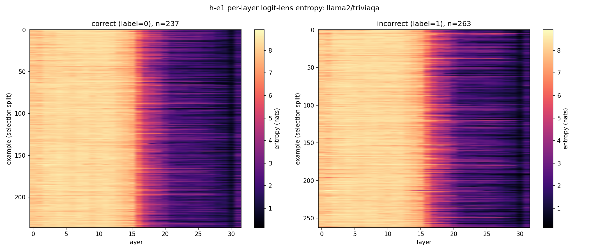
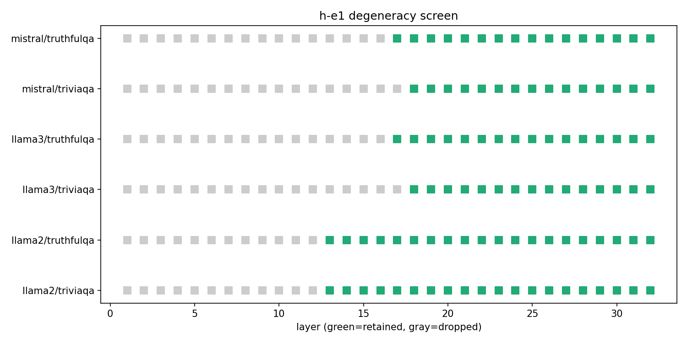
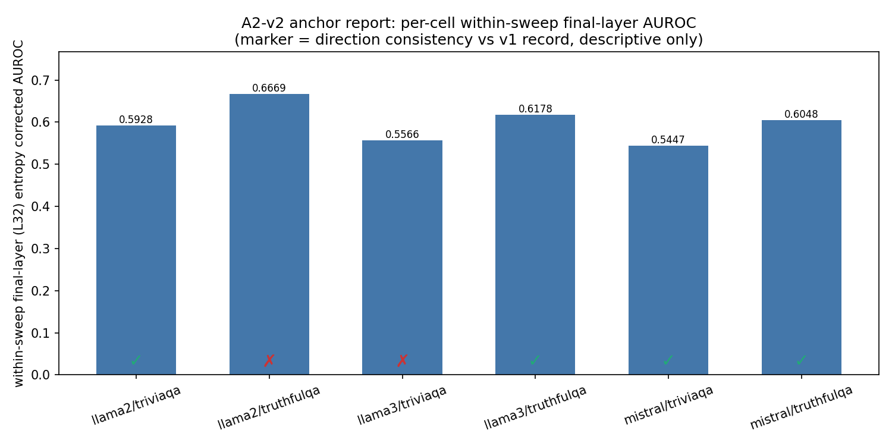

# 3. Methodology

Every component below operationalizes the same insight: read uncertainty before output calibration. The lens readout turns every depth into a measurement surface; the three signals capture two facets of unresolved candidate competition; the degeneracy screen makes a biased instrument usable without trained correction; per-model selection treats calibration depth as a property of the checkpoint; and the validity anchor keeps every comparison inside one protocol, because our own forensics (Section 3.5) show that weak-signal AUROC magnitudes do not survive protocol changes.

## 3.1 Depth-resolved logit-lens readout

We study three 32-layer pre-LN decoder-only checkpoints — LLaMA-2-7B, Mistral-7B-v0.1, and LLaMA-3-8B-Instruct — on TriviaQA (rc.nocontext, first 1,000 validation questions) and TruthfulQA (generation, all 817 questions). Layers are indexed L1–L32, with L32 the final layer. Each question is prompted as `Q: {question}\nA:` and answered by greedy decoding (up to 32 new tokens). Correctness labels use normalized-alias exact match (TriviaQA) and reference-answer matching (TruthfulQA); prompts, decoding, and label rules are inherited verbatim from the prior run in this program, so the label protocol is a controlled variable, not a degree of freedom.

For each example we run the single greedy generation, then one teacher-forced re-forward over the prompt and generated answer with hidden states exposed. At every layer $l$, the logit lens decodes the hidden state $h_l$ through the model's own output path:

$$p_l = \mathrm{softmax}\big(W_U \cdot \mathrm{norm}(h_l)\big),$$

i.e., the `lm_head` composed with the final RMSNorm — the standard raw-lens operationalization [nostalgebraist, 2020; Belrose et al., 2023]. Weights run in fp16; all statistics are computed in float32 with a $\log(p + 10^{-12})$ guard. We deliberately use the raw lens with no tuned translators: trained components would forfeit the training-free claim, and the LLaMA/Mistral lineage is the documented best-behaved raw-lens case [Belrose et al., 2023]. A pre-specified tuned-lens fallback, for the case where the screen below rejects most layers, was never needed.

## 3.2 Three uncertainty signals

From each $p_l$ we compute three statistics, averaged over the answer tokens: Shannon entropy $H(p_l)$, max-token probability $\max_v p_l(v)$, and adjacent-layer KL divergence $\mathrm{KL}(p_l \,\|\, p_{l-1})$, which is undefined at L1 and excluded there. The choice is not a grab-bag: entropy and max-probability measure the *width* of the candidate set at depth $l$, while adjacent-layer KL measures *revision* — how much the model is still rewriting its belief between consecutive layers. If hallucination is unresolved candidate competition, it should manifest both as persistent width and as persistent revision deep into the stack; the two facets can disagree, and adjacent-layer KL is the one signal with no detection-time precedent (Section 2). Figure 1 shows the intuition on LLaMA-2-7B: entropy trajectories of correctly and incorrectly answered examples separate across depth before converging toward the output layer.



## 3.3 Degeneracy screen

The raw lens is a biased instrument: some layers decode to near-uniform distributions or to distributions unrelated to the model's eventual output, and their statistics could masquerade as signal. Before any scoring, we therefore screen layers on the selection split, dropping layer $l$ if its mean entropy lies within 1% of $\ln|V|$ (near-uniform: the lens is reading noise) or if its top-1 agreement with the final layer is below 5% (so unlike the model's actual output that the reading is unlikely to be meaningful). A model is considered lens-viable if at least 5 layers survive. The screen retained 20 layers on LLaMA-2-7B and 15 each on Mistral-7B-v0.1 and LLaMA-3-8B-Instruct (Figure 2); the tuned-lens pivot it guards was never triggered. All subsequent claims are about *screened intermediate layers* only.



## 3.4 Per-model selection with a locked test split

Each dataset is split 50/50 into a selection split and a test split, stratified by label, seed 42 (500/500 on TriviaQA; 408/409 on TruthfulQA). The test split is locked at split time and never read by any analysis in this paper; every number we report is a selection-split quantity, and we flag it as such throughout. On the selection split we compute, for every screened (layer, signal) pair, the corrected AUROC $\max(a, 1-a)$ with the direction recorded, and select the per-cell tuple $(\hat{l}, \hat{s}, \hat{d})$ by argmax over screened *intermediate* layers (L32 excluded from candidacy).

Each element of this design answers a documented failure. Selection is per model *and* per dataset because the probe literature shows the informative layer shifts across both [Azaria & Mitchell, 2023], and our own sweep confirms it: the winning signal differs across datasets in 4 of 6 cells, so a fixed depth or fixed signal would be the wrong abstraction. Direction is selected rather than assumed because the motivating failure was precisely a direction inversion — the prior run's final-layer entropy flipped sign on LLaMA-2/TriviaQA — so the method removes inversion as a failure mode instead of hoping monotonicity holds across checkpoints. Finally, the supervision boundary is explicit: "training-free" refers to scoring — no probe, no fitted parameters. Selection is a label-efficient argmax over a discrete grid, performed once per cell on the selection split only.

## 3.5 Protocol-internal validity anchor (A2-v2)

The anchor design is itself a corrected failure, and the correction is a contribution. The first version of this experiment gated on reproducing prior-run final-layer AUROCs within ±0.03. The halt gate fired 47 seconds into the first cell (observed deviation +0.0742), and a provenance audit showed why: the reference numbers came from a protocol differing in six documented ways, from sample selection to numeric precision. The anchor was unsatisfiable by construction — the same cell that recorded 0.5186 under the old protocol measures 0.5928 under this one. The redesign moves every validity check inside the current protocol:

- **(a) Identity-verified cache reuse.** Before reusing the one finalized donor cache (the zero-GPU LLaMA-2/TriviaQA cell), the first 10 examples are regenerated fresh and must agree with the cached labels 10/10; any drift falls back to fresh generation. Reuse is an optimization, never an assumption.
- **(b) Within-sweep final-layer baseline.** The baseline for the depth claim is the final-layer (L32) entropy AUROC computed per cell from the *same* sweep, same pass, same labels (`depth_beats_final`). After the forensics above, this is the only comparison we consider valid.
- **(c) Descriptive-only cross-run reports.** Direction consistency against the prior-run record is logged per cell and never gated: direction was the only quantity our forensics found to transfer across protocols, and magnitudes are not comparable by construction.

Halts occur only on protocol-internal contract violations (unfinalized split, single-class labels — conditions under which AUROC is undefined). Under this anchor the full sweep completed with zero spurious halts; Figure 3 shows the per-cell report.



**Algorithm 1: Depth-resolved sweep and per-cell selection**

```
Input: model M (layers L1..L32), dataset D, seed 42
1: split D into stratified 50/50 selection / test; lock test split (never read)
2: for each example x in D:
3:     a  <- greedy_generate(M, prompt(x))                # single pass, <=32 tokens
4:     h_1..h_32 <- teacher_forced_forward(M, prompt(x) + a)
5:     for l in 1..32:  p_l <- softmax(lm_head(norm(h_l)))    # logit-lens readout
6:     cache mean over answer tokens of:
           entropy(p_l), maxprob(p_l), KL(p_l || p_{l-1})     # KL: NaN at L1, excluded
7: L* <- degeneracy_screen(selection split)               # Sec. 3.3; health: |L*| >= 5
8: for (l, s) in L* x {entropy, maxprob, adj_kl}:
       A[l, s] <- corrected AUROC on selection split      # direction recorded
9: (l^, s^, d^) <- argmax A over intermediate l (L32 excluded)
10: b <- A[L32, entropy]                                  # within-sweep final-layer baseline
11: report existence gate A[l^, s^] >= 0.55  and  depth_beats_final A[l^, s^] > b
    # A2-v2: verify donor-cache identity (10/10) before any reuse; log cross-run
    # direction descriptively; halt only on protocol-internal contract violations
```

The full sweep spans 3 models × 2 datasets × 32 layers × 3 signals — 5,451 scored generations, streamed to per-example caches that make every stage resumable and auditable, and that leave the locked test splits ready for the frozen-tuple evaluation this staged design defers. The next section states the experimental questions this pipeline was built to answer.
