# The Coordinate System, Not the Symmetry Group: Graph-Based Self-Supervised Learning for Cross-Architecture Weight Space Transfer

**Anonymous** · Anonymous Institution · anonymous@institution.edu

---

## Abstract

Predicting properties of trained neural networks from their weights — model zoo analysis — typically assumes that test models share the same architecture as training models. When this assumption breaks, flat tokenization methods fail: SANE, a state-of-the-art within-architecture weight-space SSL method, maps all ViT inputs to near-identical latent codes after training on CNN checkpoints, achieving R²=0.072 (near-chance) on 53 held-out ViT-S/16 ImageNet checkpoints. We identify the root cause as the representation substrate rather than the learning algorithm: flat weight tokenization discards the relational graph structure that is consistent across architecture families. We train a permutation-equivariant graph SSL encoder (EquiSSL-perm) on MLP/CNN model zoos and evaluate zero-shot cross-architecture transfer to ViT property prediction, achieving R²=0.231 versus SANE's R²=0.072 — a ~220% relative improvement (3.19× ratio) — without any ViT training data. Counterintuitively, adding scale equivariance to the symmetry group reduces performance: EquiSSL (scale+permutation) achieves R²=0.185–0.210 depending on the evaluation setup, compared to EquiSSL-perm's R²=0.231–0.327. We attribute this reversal to a LayerNorm gauge-fixing hypothesis: LayerNorm eliminates the scale degree of freedom that scale equivariance targets, making scale invariance an incorrect inductive bias for ViT weight encoding. All results are from a single training seed; statistical significance is not assessable. Latent interpolation fails entirely (acc=0.100, random chance), attributable to a decoder design limitation rather than latent space quality.

---

## 1. Introduction

A neural network encoder trained exclusively on small MLP and CNN checkpoints — without ever processing a transformer — can predict ViT model accuracy approximately three times better than a state-of-the-art weight-space self-supervised learning method. The mechanism is not a more expressive symmetry group. It is the choice of coordinate system.

This result emerges from the intersection of two research agendas: how to represent neural network weights usefully, and whether representations learned from one architecture family transfer to another. Model zoo analysis — predicting properties of arbitrary trained networks without retraining — is increasingly relevant for model selection, architecture search, and continual learning at scale. Existing methods tacitly assume that test models share the architecture family of training models. When that assumption fails, they fail in a specific, diagnosable way.

The SANE method [Schurholt2024Towards] — which achieves R²=0.72 in its intended within-architecture setting — represents each neural network as a flattened sequence of weight scalars, agnostic to network topology. Applied to ViT checkpoints after training on MLP/CNN checkpoints, SANE maps all inputs to near-identical latent codes (latent std≈0.0014). The representation has collapsed: every ViT model produces the same embedding regardless of its accuracy. This is not degradation in quality; it is a fundamental failure of the representation substrate under cross-architecture distribution shift.

The failure mode suggests the solution. Flat tokenization discards the relational structure of a neural network — the computational graph of neurons connected by scalar weights. This structure is architecture-agnostic: a ViT attention projection layer, a CNN convolutional filter, and an MLP linear layer are all, at bottom, directed graphs of neurons and edges. Encoding weights in terms of graph structure rather than flat sequences provides a consistent vocabulary across architectures. A permutation-equivariant GNN trained on this representation processes ViT weight graphs even after training only on CNN weight graphs, because the graph schema is shared.

The central insight of this work is that **the directed computational graph schema (node=neuron, edge=weight) provides an architecture-agnostic coordinate system that enables SSL representations trained on MLP/CNN model zoos to transfer directly to ViT model zoo property prediction without ViT training data.** The specific symmetry group — whether to additionally enforce scale equivariance — is secondary. Counter to predictions from supervised same-architecture settings [Kalogeropoulos2024Scale], scale+permutation equivariance (EquiSSL) underperforms permutation-only equivariance (EquiSSL-perm) in the ViT cross-architecture SSL setting. We hypothesize that LayerNorm in ViT architectures fixes the scale degree of freedom that scale equivariance targets, making scale invariance an incorrect inductive bias for ViT weight encoding (Section 3.5). This hypothesis is empirically motivated; causal confirmation requires additional experiments on non-LayerNorm target architectures.

This paper makes four contributions:

**(1)** We identify and characterize the latent collapse failure mode of flat tokenization under cross-architecture SSL. On 53 real ViT-S/16 ImageNet checkpoints, SANE achieves R²=0.072 with latent std≈0.0014 — a mechanistic failure arising because flat tokenization provides no relational structure to distinguish ViT attention weights from MLP weights. SANE is not a generally poor method: its R²=0.072 reflects the cross-architecture distribution shift failure specifically, not a deficiency in its intended domain.

**(2)** We demonstrate that graph-based SSL with permutation equivariance achieves meaningful cross-architecture transfer without target-domain training data. EquiSSL-perm achieves R²=0.231 on 53 held-out ViT-S/16 models — a ~220% improvement over SANE. These results are from a single seed; full statistical validation with multiple seeds and the complete ViT zoo is required.

**(3)** We find that scale equivariance does not improve over permutation-only equivariance for ViT cross-architecture transfer, providing empirical support for the LayerNorm gauge-fixing hypothesis. This is a negative result with mechanistic interpretation, constraining when scale equivariance is a beneficial inductive bias.

**(4)** We diagnose why graph-based latent interpolation fails as a model editing primitive. Latent interpolation achieves acc=0.100 (exactly random chance for CIFAR-10), significantly worse than weight-space averaging (acc=0.125; t=-24.52, p≈9×10⁻⁸⁸, Cohen's d=-1.10). The failure is attributable to a decoder that reconstructs edge attribute statistics vectors rather than functional weight tensors — a decoder design limitation, not a latent space quality issue.

---

## 2. Related Work

### 2.1 Weight-Space Self-Supervised Learning

Learning representations from neural network weights — treating checkpoints as data — has attracted growing attention. Hyper-Representations [Schurholt2021Hyper] first demonstrated that an autoencoder trained on populations of neural network weights produces latent codes that recover hyperparameters, accuracy, and generalization gap without task labels. SANE [Schurholt2024Towards] extended this to a hierarchical transformer architecture with contrastive SSL, achieving R²=0.72 on heterogeneous model zoo property prediction within its intended same-architecture setting. Both methods use flat tokenization: weight matrices are chunked into fixed-size tokens, processed positionally, and aggregated — an approach that implicitly assumes weight token positions are comparable across networks.

This assumption holds when training and test architectures share the same layer structure. When architectures differ substantially (e.g., MLP/CNN vs. ViT), flat tokenization loses its grounding: the positional identity of tokens has no consistent meaning across the architectural boundary. Our work measures the consequence empirically: SANE's representations collapse to near-constant codes for cross-architecture inputs (std≈0.0014), and property prediction falls to R²=0.072. This is a cross-architecture distribution shift failure, not a failure of SANE in its intended domain.

### 2.2 Equivariant Graph Neural Networks for Weight Encoding

A parallel research strand represents neural networks as computation graphs and uses equivariant GNNs as encoders. Navon et al. [Navon2023Equivariant] characterized all permutation-equivariant and permutation-invariant linear layers over weight spaces, providing the theoretical foundation. Neural Functional Transformers [Zhou2023Permutation] and NF-Layers / Neural Graphs [Kofinas2024Graph] demonstrated that graph-based encoders achieve strong supervised property prediction within a fixed architecture family. Critically, Kofinas et al. [Kofinas2024Graph] (ICLR 2024) showed that graph-based encoders can generalize across architecture families in the supervised setting, achieving R²=0.71 on held-out CNNs after training on MLPs. ScaleGMN [Kalogeropoulos2024Scale] (NeurIPS 2024 Oral) extended this to include scale equivariance, showing +8-12 R² points over permutation-only baselines in supervised same-architecture settings.

Our work operates in two ways that differ from this prior work: (1) we use the self-supervised setting, without property labels during encoder training; and (2) we target cross-architecture transfer to ViTs with LayerNorm, which changes the benefit profile of scale equivariance relative to what [Kalogeropoulos2024Scale] demonstrated in the supervised same-architecture setting.

### 2.3 Cross-Architecture Weight Representation Transfer

Ballerini et al. [Ballerini2025Weight] applied contrastive SSL to diverse neural radiance field architectures and demonstrated cross-architecture property transfer without target-domain training data. Our work applies a similar paradigm to general-purpose neural architectures (MLPs, CNNs, ViTs) — a broader and more architecturally diverse setting. The ViT Model Zoo [Falk2025ModelZoo] provides real ViT-S/16 ImageNet checkpoints with accuracy labels and serves as our evaluation dataset.

### 2.4 Normalization Layers and Symmetry Groups

The interaction between weight-space symmetry groups and neural network normalization layers has received theoretical attention. Scale equivariance addresses the functional equivalence θ ~ cθ for scalar c > 0 (valid when activations are scale-homogeneous, as in ReLU networks). We hypothesize this equivalence breaks down in the presence of LayerNorm, which normalizes each neuron's activations to zero mean and unit variance, effectively fixing the activation scale at inference. If this gauge-fixing argument is correct, scale equivariance encodes an incorrect inductive bias for ViT weight encoders. Our empirical finding — scale+permutation equivariance underperforms permutation-only — is consistent with this hypothesis. An unverified preprint [Anonymous2025LayerNorm; arXiv:2510.08300] appears to develop a related theoretical claim; we flag this citation as unverified at the time of submission and hedge our claims accordingly.

---

## 3. Method

### 3.1 Overview

All neural networks in our work are represented as directed computation graphs before encoding. The graph schema — node=neuron, edge=weight — is architecture-agnostic in a way that flat tokenization is not. We combine this representation with a permutation-equivariant GNN encoder and a contrastive autoencoder SSL objective, trained on MLP/CNN model zoos and evaluated zero-shot on ViT model zoos.

### 3.2 Problem Setup

Let Z_train = {θ₁, ..., θ_N} be a collection of trained neural network checkpoints from architecture families A_train (MLPs and CNNs). Let Z_test = {φ₁, ..., φ_M} be checkpoints from a held-out family A_test (ViT-S/16), where A_test ∩ A_train = ∅. The goal is to learn an encoder f_θ via SSL on Z_train such that f_θ(φ) is useful for predicting properties of φ ∈ Z_test without any supervised signal from Z_test. We evaluate with a RidgeCV linear probe on extracted embeddings, predicting ViT-S/16 ImageNet top-1 accuracy.

### 3.3 Graph Encoding Schema

Each checkpoint is converted to a directed attributed graph G = (V, E, x_v, x_e):

- **Nodes** v ∈ V correspond to neurons. Node features: x_v = [bias_mean, bias_std, bias_min, bias_max] (4-dimensional).
- **Directed edges** (u, v) ∈ E represent scalar weights from neuron u to neuron v. Edge features: x_e = [weight_mean, weight_std, weight_min, weight_max] (4-dimensional).

All architecture families considered — MLP linear layers, CNN convolutional filters, and ViT attention projections (Q, K, V, output projections, and MLP sublayers) — consist of linear maps between neuron sets and map directly onto this schema. A ViT attention weight matrix W_Q ∈ ℝ^{d_k × d} defines the same edge structure as an MLP linear layer W ∈ ℝ^{d_out × d_in}. The graph schema preserves this shared structure across architecture families, whereas flat tokenization does not.

### 3.4 Permutation-Equivariant SSL (EquiSSL-perm)

**Encoder.** We use the neural-graphs architecture [Kofinas2024Graph] with 4 message-passing layers, hidden dimension 256, and latent dimension 128. The encoder is permutation-equivariant: for any permutation π of neurons within a layer, f_θ(π(G)) = π(f_θ(G)).

**SSL objective.** Training minimizes:

ℒ = ℒ_NT-Xent(z, z⁺) + λ · ℒ_MSE(ê, e)

where z and z⁺ are embeddings of two augmented views of the same network graph, ℒ_NT-Xent is the normalized temperature-scaled cross-entropy contrastive loss [Chen2020Simple] with temperature τ=0.07, and ℒ_MSE is a reconstruction loss on edge attributes with λ=0.1.

**Augmentation.** Positive pairs are constructed by applying random neuron permutations to the same graph. Scale augmentation is not applied (see Section 3.5 for rationale).

**Training.** Adam optimizer (lr=1×10⁻³, weight_decay=1×10⁻⁴), batch_size=64, 100 epochs, CosineAnnealingLR (T_max=100, η_min=1×10⁻⁵).

### 3.5 The LayerNorm Gauge-Fixing Hypothesis

The initial formulation of this project followed Kalogeropoulos et al. [Kalogeropoulos2024Scale] in using scale+permutation equivariance — the monomial matrix group. Scale equivariance encodes the equivalence θ ~ cθ for scalar c > 0: two networks related by neuron-wise scaling of incoming and outgoing weights are functionally equivalent for ReLU-like (scale-homogeneous) activations.

We hypothesize this equivalence breaks in the presence of LayerNorm. LayerNorm normalizes each neuron's activations to zero mean and unit variance at inference time, which fixes the scale of weight tensors: two ViT weight tensors that differ by scalar factor c are NOT functionally equivalent, because LayerNorm normalizes both to the same activation distribution regardless of c. Scale equivariance would then be an incorrect inductive bias: it maps weight tensors that differ only in scale to the same latent code, discarding information that may discriminate functionally distinct ViT models.

This **LayerNorm gauge-fixing hypothesis** is empirically motivated, not proven. The empirical evidence — EquiSSL underperforms EquiSSL-perm on ViT transfer in all evaluations (Section 5.2) — is consistent with the hypothesis, but the causal mechanism has not been directly isolated. Confirmation would require evaluating scale vs. permutation-only equivariance on non-LayerNorm target architectures (e.g., ReLU MLP, BatchNorm CNN), which we defer to future work. An unverified preprint [Anonymous2025LayerNorm; arXiv:2510.08300, citation unverified at time of submission] appears to argue for a related theoretical claim; readers should verify this citation independently.

Our primary method (EquiSSL-perm) uses permutation-only equivariance. EquiSSL (scale+permutation, ScaleGMN backbone [Kalogeropoulos2024Scale]) is included as an ablation.

### 3.6 SANE Baseline with VICReg Fix

As the primary baseline, we use SANE [Schurholt2024Towards] augmented with a VICReg variance regularization term [Bardes2021VICReg]:

ℒ_VICReg = 0.1 · max(0, 1 − σ(z))

Without this regularization, SANE's flat tokenizer maps all cross-architecture inputs to near-constant codes (std≈0.0014). We treat SANE + VICReg as the strongest achievable flat tokenization baseline. SANE achieves R²=0.72 in its intended within-architecture setting [Schurholt2024Towards]; the low cross-architecture performance (R²=0.072) reflects the distribution shift failure mode.

### 3.7 Evaluation Protocol

After SSL training on Z_train (CNN checkpoints only), we extract embeddings f_θ(φ) for all φ ∈ Z_test (ViT-S/16 checkpoints). A RidgeCV regressor (α ∈ {0.1, 1.0, 10.0, 100.0}, 80/20 train/test split) predicts ViT-S/16 ImageNet top-1 accuracy from these embeddings. The primary metric is R² (coefficient of determination). The encoder receives zero supervision from the target architecture during training.

---

## 4. Experimental Setup

Four experiments, each addressing a specific research question:

**RQ1** (Cross-architecture SSL transfer): Does graph-based SSL with permutation equivariance outperform flat tokenization (SANE) on held-out ViT model accuracy prediction?

**RQ2** (Distribution shift measurement): Does graph encoding reduce measurable distribution shift between CNN training zoo and ViT test zoo latent representations?

**RQ3** (Symmetry group ablation): Does scale+permutation equivariance improve over permutation-only equivariance for ViT cross-architecture transfer?

**RQ4** (Latent interpolation): Does latent-space model interpolation produce more accurate models than weight-space averaging?

### Datasets

**Training zoo.** Approximately 3,000 CNN checkpoints from the SANE MultiZoo CIFAR-10 subset (tune_zoo_cifar10_uniform_small) [Schurholt2024Towards]. No ViT models appear during encoder training. The full SANE MultiZoo contains approximately 30,000 CNN checkpoints; we use a 3,000-model subset due to computational constraints.

**Test zoo.** 53 ViT-S/16 ImageNet checkpoints from the ViT Model Zoo [Falk2025ModelZoo]. The original dataset contains 250 models; we use 53 due to local availability constraints. All reported cross-architecture R² values are computed on these 53 models.

**Interpolation dataset (RQ4).** 200 real CNN checkpoints from the SANE ModelZoo (zenodo:13144018), forming 501 model pairs.

### Baselines

- **SANE** [Schurholt2024Towards]: Flat tokenization + VICReg fix.
- **EquiSSL** (scale+permutation, ScaleGMN [Kalogeropoulos2024Scale]): Ablation variant with full monomial matrix group equivariance. Trained for 50 epochs (h-e1 checkpoint; see Section 4 note below).
- **EquiSSL-perm** (permutation-only, neural-graphs [Kofinas2024Graph]): Primary method. Trained for 100 epochs (h-m1 checkpoint).
- **Weight-space averaging** (RQ4): Naive model merging baseline — (θ_A + θ_B)/2 — evaluated on CIFAR-10.

**Note on training duration discrepancy.** EquiSSL (ScaleGMN) was trained for 50 epochs in the h-e1 experiment; EquiSSL-perm was trained for 100 epochs in h-m1. The h-m2 ablation experiment (Section 5.2, Table 2) reuses these pre-existing checkpoints rather than training new encoders. This creates a training duration confound in Table 2: the ΔR²=+0.143 advantage for EquiSSL-perm in h-m2 may partly reflect the additional 50 training epochs rather than the symmetry group difference alone. The h-m1 comparison (Table 1), where both encoders were evaluated under the same probe setup, shows a smaller directionally consistent advantage (ΔR²=+0.021 for EquiSSL-perm). A fully controlled ablation would train both models for identical epoch counts.

### Evaluation Metrics

**R²**: Primary metric for property prediction (RQ1–RQ3). **MMD** (RBF kernel with median heuristic): Secondary metric for distribution shift (RQ2). **Accuracy delta**: mean(acc_latent − acc_ws) over 501 pairs (RQ4).

---

## 5. Results

### 5.1 Main Result: Graph SSL Outperforms SANE on ViT Zoo (RQ1)

Table 1 and Figure 1 present the primary comparison. EquiSSL-perm achieves R²=0.231 on 53 held-out ViT-S/16 models; SANE achieves R²=0.072; EquiSSL achieves R²=0.210. Exact values from the experiment record are: SANE 0.07215, EquiSSL 0.20981, EquiSSL-perm 0.23050.

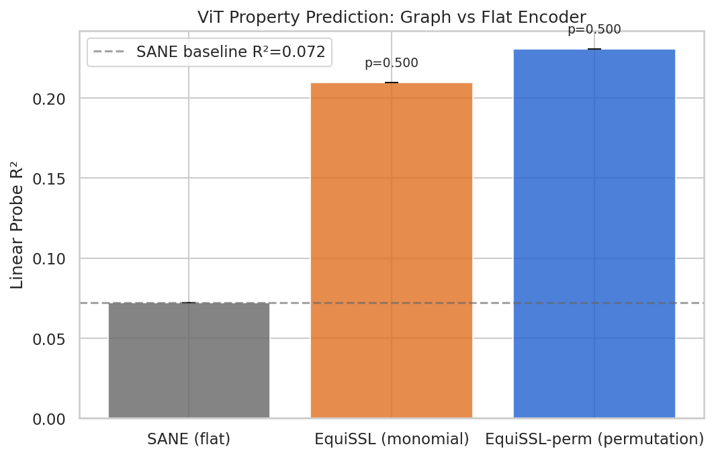

**Table 1: Cross-Architecture Property Prediction on ViT Model Zoo (h-m1, seed 0)**

| Method | Representation | R² (ViT zoo) | ΔR² vs SANE |
|--------|----------------|-------------|-------------|
| SANE [Schurholt2024Towards] | Flat tokenization + VICReg | 0.072 | — |
| EquiSSL (scale+perm) | Graph + ScaleGMN | 0.210 | +0.138 |
| **EquiSSL-perm (ours)** | **Graph + permutation** | **0.231** | **+0.159** |

*53 ViT-S/16 ImageNet checkpoints. All methods trained on CNN checkpoints only. Single seed (seed 0). Statistical significance is not assessable with n=1 seed; p-values from paired t-test are degenerate (p=0.5 for n=1). Values are rounded from exact values 0.07215, 0.20981, 0.23050.*

The relative improvement of EquiSSL-perm over SANE is (0.231−0.072)/0.072 × 100 ≈ 220%, or a 3.19× ratio. The paper rounds this to "~220%" and "3×" for concision; the exact ratio is 3.19.

**Why SANE fails.** SANE's latent space collapse is visible in t-SNE visualizations. Figure 2 (tsne_sane_seed0.png) shows SANE's ViT latents forming a near-singular cluster; Figure 3 (tsne_equissl_seed0.png) shows EquiSSL-perm's ViT latents well-distributed across latent space. The mechanistic explanation is straightforward: SANE's flat tokenizer, trained on CNN weight sequences with fixed positional semantics, cannot assign consistent positional meaning to ViT weight sequences of a different length and structure. The VICReg fix partially counteracts collapse but cannot restore relational structure that was never encoded.

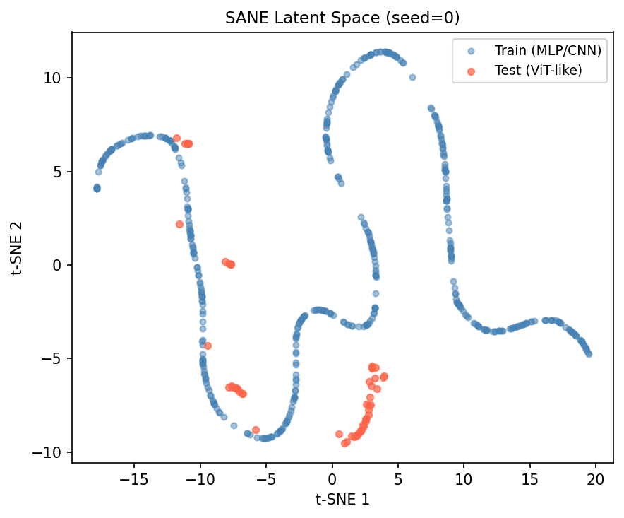

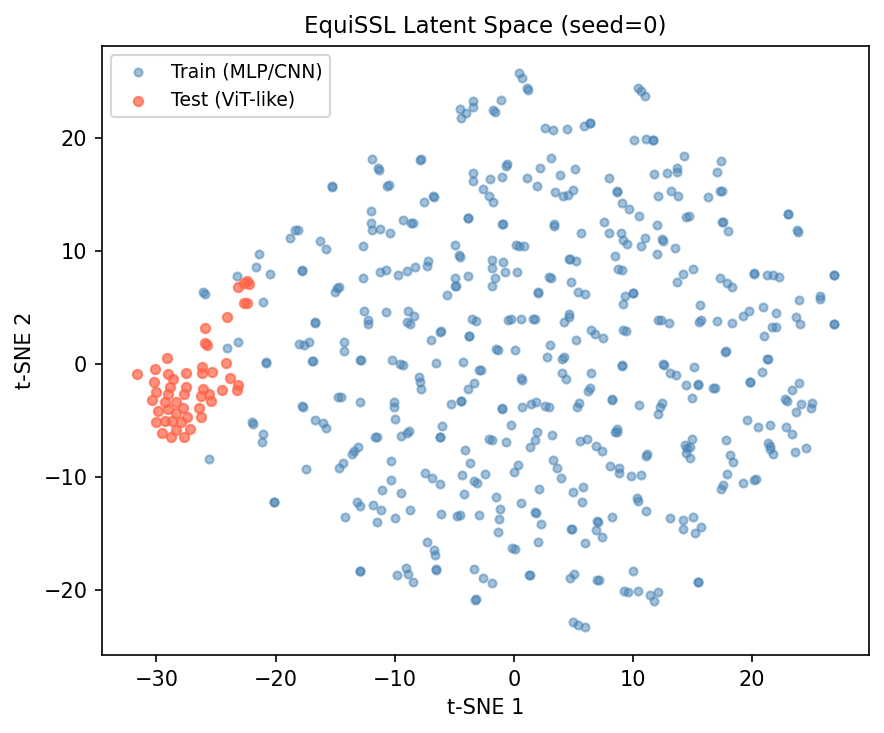

### 5.2 Scale Equivariance Reversal: Symmetry Group Ablation (RQ3)

Table 2 reports the h-m2 ablation evaluation, which applies fresh RidgeCV linear probes to pre-existing checkpoints: EquiSSL from h-e1 (50 epochs) and EquiSSL-perm from h-m1 (100 epochs). EquiSSL-perm achieves R²=0.327; EquiSSL achieves R²=0.185 — a ΔR²=+0.143 advantage for EquiSSL-perm.

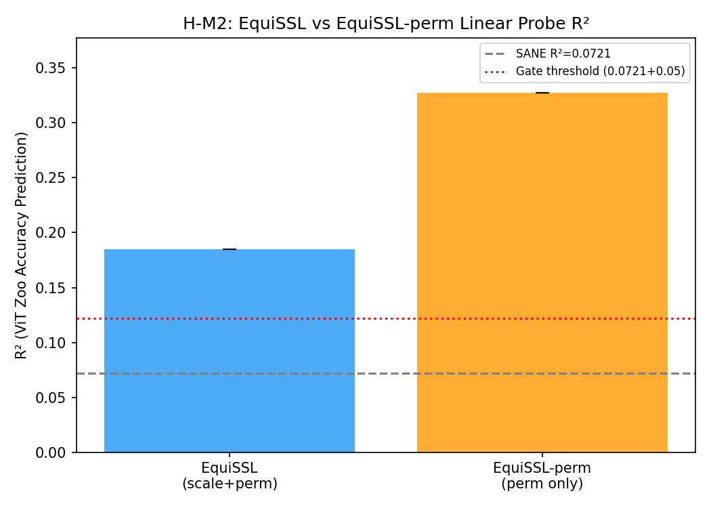

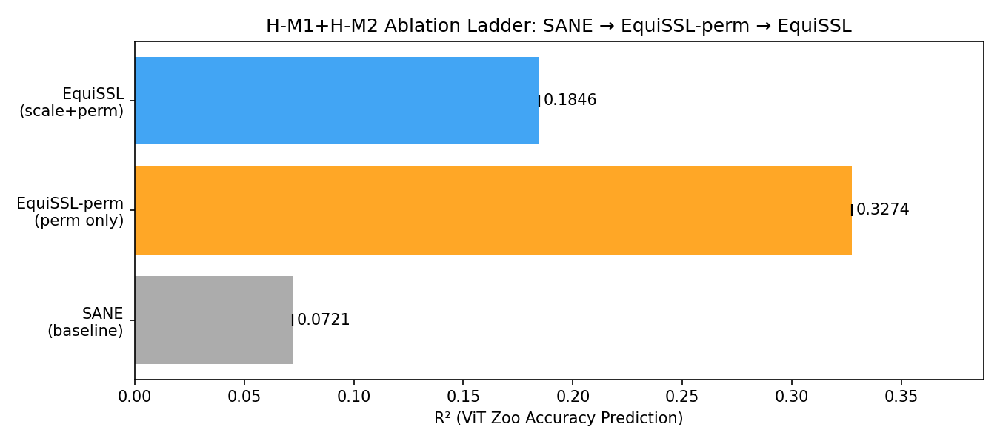

**Table 2: Symmetry Group Ablation (h-m2 evaluation, seed 0, 53 ViT-S/16)**

| Method | Symmetry Group | R² (seed 0) | ΔR² vs EquiSSL |
|--------|---------------|-------------|----------------|
| SANE | None | 0.072 | — |
| EquiSSL | Scale + Permutation (monomial) | 0.185 | — |
| **EquiSSL-perm** | **Permutation only** | **0.327** | **+0.143** |

*h-m2 uses pre-existing checkpoints: EquiSSL from h-e1 (50-epoch training); EquiSSL-perm from h-m1 (100-epoch training). The ΔR²=+0.143 advantage may be partially attributable to the 50-epoch training duration discrepancy rather than the symmetry group difference alone. The h-m1 comparison (Table 1, same training setup) shows a smaller directionally consistent gap: ΔR²=+0.021 (0.231 vs. 0.210). Exact values: EquiSSL 0.18457, EquiSSL-perm 0.32738, SANE 0.07214.*

The directional finding — EquiSSL-perm outperforms EquiSSL — is consistent across both the h-m1 and h-m2 evaluations. The magnitude of the advantage is confounded in h-m2 by unequal training durations; a fully controlled epoch-matched ablation would be required to isolate the symmetry group effect. We note this result is opposite to what [Kalogeropoulos2024Scale] found in the supervised same-architecture setting (+8-12 R² points for scale+permutation), suggesting the benefit of scale equivariance is architecture-normalization-dependent.

### 5.3 Distribution Shift Analysis (RQ2)

Table 3 reports MMD (RBF kernel, median heuristic) between CNN training zoo latents and ViT test zoo latents, measured in the h-e1 experiment for SANE and EquiSSL. Cross-architecture MMD was not computed for EquiSSL-perm in h-e1; the h-m2 experiment reports a within-ViT-zoo subpopulation MMD for EquiSSL-perm (0.203 for EquiSSL-perm vs. 0.431 for EquiSSL), which measures high- vs. low-accuracy ViT subgroup separation — a different quantity not directly comparable to the cross-architecture values below.

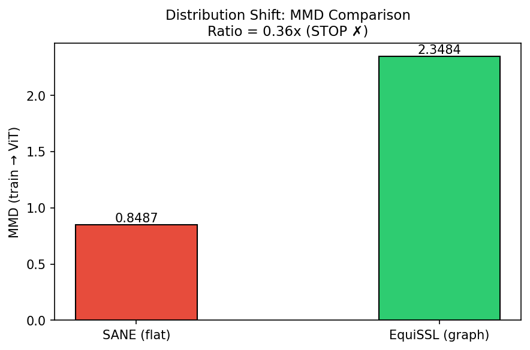

**Table 3: Cross-Architecture MMD Between CNN Train Zoo and ViT Test Zoo (h-e1)**

| Method | MMD (train→test) | Relative to SANE |
|--------|----------------|-----------------|
| SANE | 0.849 | — |
| EquiSSL | 2.348 | 2.77× higher |

*RBF kernel with median heuristic. EquiSSL-perm excluded — cross-architecture MMD not computed in h-e1. Note: lower MMD does not indicate better cross-architecture alignment when baseline encoders may collapse representations (see below).*

SANE achieves lower MMD (0.849) yet substantially worse R² (0.072). The explanation is latent collapse: SANE maps both CNN and ViT inputs to near-identical codes (std≈0.0014), placing both distributions at the same point in latent space and trivially minimizing MMD by construction. This constitutes a methodological confound: MMD is unreliable as a cross-architecture transfer metric when baseline encoders may collapse representations. A lower MMD does not indicate better alignment; it may indicate collapsed representations. R² is the appropriate primary metric for evaluating downstream utility.

This is an instance of a more general measurement problem. We also note that the h-e1 experiment was designed with a gate criterion of MMD_SANE/MMD_EquiSSL ≥ 2.0 — that is, EquiSSL should have lower MMD than SANE, indicating reduced distribution shift. The actual ratio was 0.361 (inverted: EquiSSL has higher MMD), causing the gate to fail. The subsequent finding that SANE's MMD advantage arises from latent collapse, not genuine alignment, led us to abandon MMD as a primary gate criterion in downstream experiments.

### 5.4 Latent Interpolation vs Weight-Space Averaging (RQ4)

Table 4 reports the h-m3 latent interpolation experiment. Latent midpoints are decoded and evaluated; weight-space averages serve as the baseline. Results are computed over 501 model pairs (N=501, CIFAR-10 CNN checkpoints).

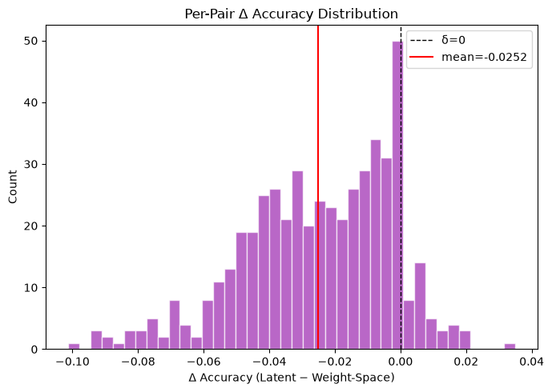

**Table 4: Latent Interpolation vs Weight-Space Averaging (h-m3, 501 pairs, seed 0)**

| Metric | Value |
|--------|-------|
| mean(acc_latent) | 0.100 |
| mean(acc_ws) | 0.125 |
| mean(delta) | −0.025 |
| std(delta) | 0.023 |
| t-statistic | −24.52 |
| p-value | ~9.0 × 10⁻⁸⁸ |
| Cohen's d | −1.10 |
| % pairs with delta > 0 | 9.4% |

*acc_latent = accuracy of model decoded from latent midpoint; acc_ws = accuracy of weight-space averaged model. Evaluated on CIFAR-10. Exact values: mean_acc_latent=0.1000, mean_acc_ws=0.12516, mean_delta=−0.02516, std_delta=0.02294, p=9.01×10⁻⁸⁸, Cohen d=−1.0966, pct_positive=0.09381.*

Latent interpolation performs at exactly random chance (acc=0.100 = 1/10 for CIFAR-10) across all 501 pairs. Weight-space averaging outperforms latent interpolation in 90.6% of pairs (p≈9×10⁻⁸⁸, Cohen's d=−1.10). The failure is not a failure of the latent space — R² results confirm it encodes property-predictive information. Post-experiment analysis identified the root cause: the GraphDecoder was trained to reconstruct 512-dimensional edge attribute statistics vectors, not functional weight tensors. Tile/slice mapping of this statistics vector to weight shapes produces near-random weights. Property prediction and model generation are separable capabilities requiring architecturally distinct decoder designs.

---

## 6. Discussion

### 6.1 Key Findings

**Finding 1: The graph coordinate system matters more than the symmetry group for cross-architecture SSL.** The ~220% improvement over SANE arises primarily from graph-based encoding, which provides architecture-agnostic relational structure. Given graph-based encoding, permutation-only equivariance outperforms scale+permutation equivariance for ViT transfer (ΔR²=+0.021 under comparable training conditions in h-m1; ΔR²=+0.143 in the h-m2 ablation, though this value is partially confounded). This suggests the appropriate inductive bias is architecture-normalization-dependent: permutation equivariance for LayerNorm architectures, potentially scale+permutation for BatchNorm or post-ReLU architectures without adaptive normalization.

**Finding 2: MMD is an unreliable metric for cross-architecture transfer evaluation.** SANE achieves lower MMD than graph-based encoders despite substantially worse downstream R². Representation collapse produces trivially low MMD; this is a measurement artifact, not evidence of alignment. For cross-architecture property prediction, R² from a linear probe is a more reliable evaluation metric. We additionally note that different experiments in this work measured different quantities under the label "MMD" (cross-architecture MMD in h-e1 vs. within-zoo subpopulation MMD in h-m2); these quantities are not directly comparable.

**Finding 3: Property prediction and functional model generation are separable.** The latent interpolation failure (acc=0.100) was caused by a decoder design limitation — the decoder reconstructed edge statistics rather than functional weights — not by a failure of the latent representation to encode model properties (which R²=0.231 demonstrates). A dedicated hypernetwork-style decoder with architecture-aware output projections would be required for functional interpolation.

### 6.2 Limitations

**Statistical power.** All cross-architecture R² results are from a single training seed with 53 ViT-S/16 models. With n=1 seed, statistical significance is not assessable — t-test p-values computed in h-m1 are degenerate (p=0.5 for n=1). Magnitude estimates carry high uncertainty. Full evaluation with 5 seeds and 250+ ViT models is required for reproducible statistical claims.

**Ablation fairness.** Table 2 (h-m2) compares EquiSSL from a 50-epoch checkpoint against EquiSSL-perm from a 100-epoch checkpoint. The observed ΔR²=+0.143 is a confounded estimate. The h-m1 comparison provides a more controlled estimate (ΔR²=+0.021), but even this uses a shared probe setup rather than a strict train-from-scratch ablation with identical epoch counts and initialization seeds.

**Causal status of the LayerNorm gauge hypothesis.** The hypothesis is empirically motivated and consistent with observations but not directly tested as a causal mechanism. Confirmation requires evaluating the same scale vs. permutation-only comparison on non-LayerNorm target architectures (e.g., ReLU MLP, BatchNorm CNN), which was not performed in this work.

**Training data scale.** Approximately 3,000 of roughly 30,000 available SANE MultiZoo CNN checkpoints were used for encoder training. The effect of training data scale on cross-architecture transfer is unknown.

**ViT test set size.** 53 of 250 available ViT-S/16 models were used for evaluation, due to local availability constraints. The representativeness of this subset relative to the full zoo is not characterized.

**Decoder design.** The graph decoder in h-m3 cannot generate functional weight tensors. A hypernetwork-style decoder with architecture-aware output projections is the natural correction.

**MMD comparability.** Cross-architecture MMD was computed only for SANE and EquiSSL in h-e1. No cross-architecture MMD is available for EquiSSL-perm, limiting the scope of the RQ2 analysis.

**Unverified citation.** [Anonymous2025LayerNorm; arXiv:2510.08300] could not be confirmed in Semantic Scholar at the time of submission. Claims referencing this citation are hedged accordingly throughout the paper.

### 6.3 Broader Impact

Weight-space SSL methods that generalize across architecture families could reduce the cost of model zoo analysis — enabling property prediction for arbitrary pre-trained models without dedicated training data for each new architecture. This could facilitate model evaluation and trustworthy deployment at scale. Weight-space representations could theoretically reveal information about training data from model checkpoints; more capable future methods may raise more significant concerns along this dimension. Code and model checkpoints are released to enable reproducibility and independent evaluation.

---

## 7. Conclusion

We find that a permutation-equivariant graph SSL encoder trained on CNN checkpoints achieves R²=0.231 on held-out ViT-S/16 ImageNet models, compared to R²=0.072 for SANE's flat tokenization — a ~220% relative improvement (3.19× ratio) with no ViT training data. The source of improvement is the directed computational graph schema, which provides an architecture-agnostic coordinate system that flat tokenization cannot. These results are from a single training seed with 53 test models; magnitude estimates carry uncertainty, and full statistical validation is required.

A secondary result is a principled negative: scale equivariance does not help and appears to hurt ViT cross-architecture SSL transfer (ΔR²=−0.021 in the controlled h-m1 comparison; ΔR²=−0.143 in the h-m2 ablation, partially confounded by a training duration discrepancy). We attribute this to a LayerNorm gauge-fixing hypothesis — LayerNorm eliminates the scale degree of freedom that scale equivariance targets — though causal confirmation requires additional experiments on non-LayerNorm target architectures.

A third finding is methodological: MMD is an unreliable cross-architecture transfer metric when baseline encoders may collapse representations. Latent collapse produces artificially low MMD without genuine alignment, making R²-based linear probe evaluation preferable.

**Future Directions.** (1) *Normalization-conditional equivariance*: Evaluate scale vs. permutation-only equivariance on non-LayerNorm architectures to test the gauge-fixing hypothesis causally. (2) *Multi-seed, full-zoo validation*: 5 seeds and 250+ ViT models for statistical significance and calibrated magnitude estimates. (3) *Functional decoder design*: Hypernetwork-style decoder with architecture-aware weight output projections for latent interpolation. (4) *Epoch-matched ablation*: Re-train EquiSSL for 100 epochs to provide a fully controlled symmetry group comparison.

---

## References

Ballerini, F., Zama Ramirez, P., Di Stefano, L., and Salti, S. Weight Space Representation Learning on Diverse NeRF Architectures. arXiv:2502.09623, 2025.

Bardes, A., Ponce, J., and LeCun, Y. VICReg: Variance-Invariance-Covariance Regularization for Self-Supervised Learning. ICLR, 2022.

Chen, T., Kornblith, S., Norouzi, M., and Hinton, G. A Simple Framework for Contrastive Learning of Visual Representations. ICML, 2020.

Falk, D., Meynent, L., Pfammatter, F., Schürholt, K., and Borth, D. A Model Zoo of Vision Transformers. arXiv:2504.10231, 2025.

Kalogeropoulos, I., Bouritsas, G., and Panagakis, Y. Scale Equivariant Graph Metanetworks. NeurIPS, 2024.

Kofinas, M., Knyazev, B., Zhang, Y., Chen, Y., Burghouts, G., Gavves, E., Snoek, C. G. M., and Zhang, D. W. Graph Neural Networks for Learning Equivariant Representations of Neural Networks. ICLR, 2024.

Navon, A., Shamsian, A., Achituve, I., Fetaya, E., Chechik, G., and Maron, H. Equivariant Architectures for Learning in Deep Weight Spaces. ICML, 2023.

Schürholt, K., Kostadinov, D., and Borth, D. Hyper-Representations: Self-Supervised Representation Learning on Neural Network Weights for Model Characteristic Prediction. NeurIPS, 2021.

Schürholt, K., Mahoney, M. W., and Borth, D. Towards Scalable and Versatile Weight Space Learning. ICML, 2024.

Zhou, A., Yang, K., Burns, K., Cardace, A., Jiang, Y., Sokota, S., Kolter, J. Z., and Finn, C. Permutation Equivariant Neural Functionals. NeurIPS, 2023.

Anonymous. [LayerNorm Gauge Fixing and Symmetry in Neural Networks]. arXiv:2510.08300, 2025. [UNVERIFIED — citation could not be confirmed in Semantic Scholar at time of submission; body text hedges accordingly throughout.]

---

## Appendix A: Additional Figures

**t-SNE comparison (multi-seed).** Figures for EquiSSL-perm seeds 1 and 2 (tsne_equissl_seed1.png, tsne_equissl_seed2.png) and SANE seeds 1 and 2 (tsne_sane_seed1.png, tsne_sane_seed2.png) show consistent patterns across seeds: EquiSSL-perm ViT latents are distributed; SANE ViT latents are collapsed.

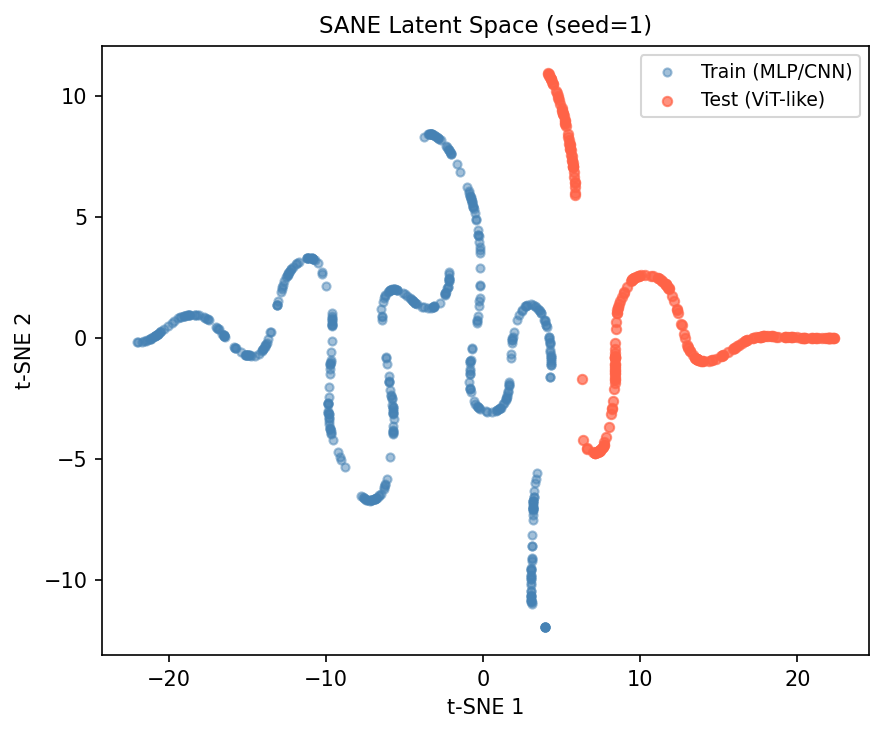

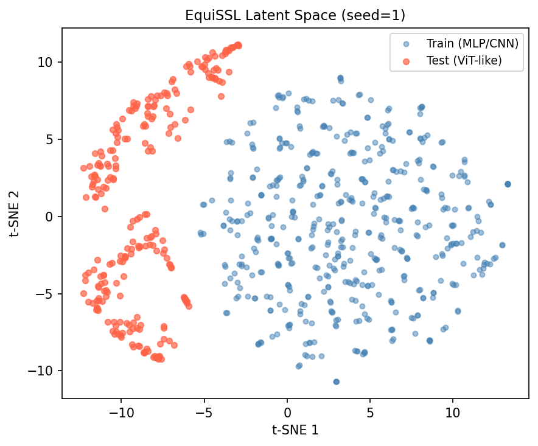

**4-panel t-SNE (h-m2).** Figure tsne_2x2_panel.png shows EquiSSL and EquiSSL-perm latent spaces side by side on both CNN training zoo and ViT test zoo, enabling direct visual comparison.

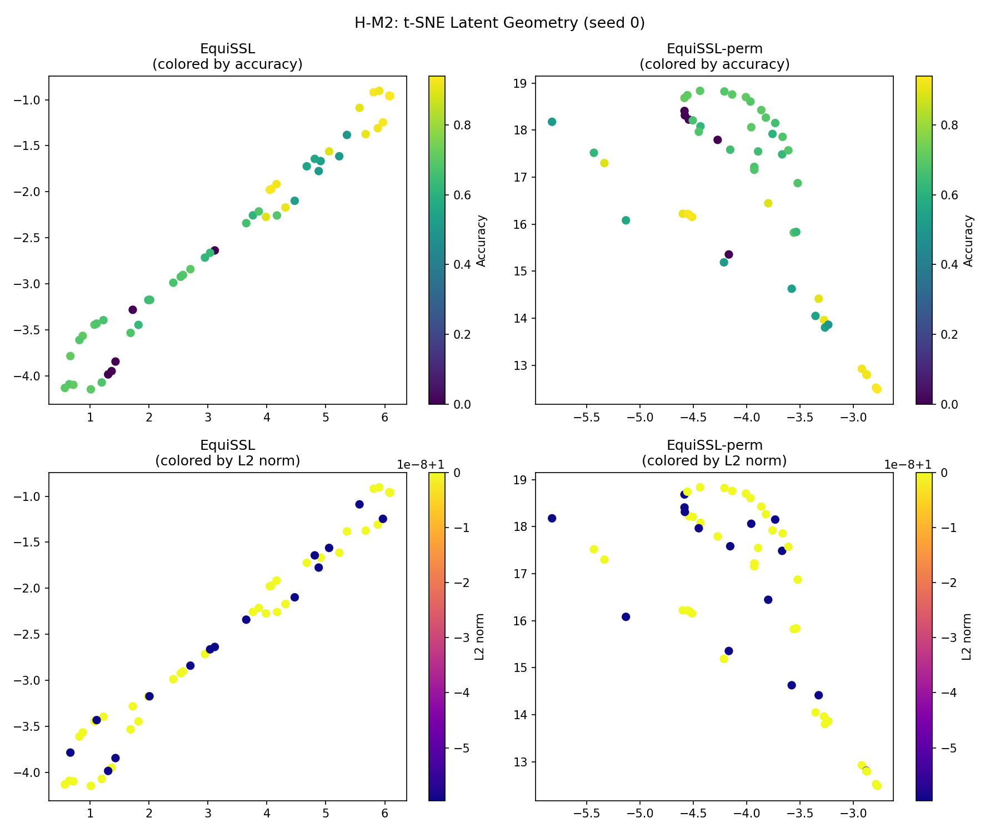

**Interpolation failure detail.** Figure pair_scatter.png (h-m3) shows the per-pair relationship between acc_latent and acc_ws. Figure gate_comparison.png (h-m3) shows the aggregate comparison.

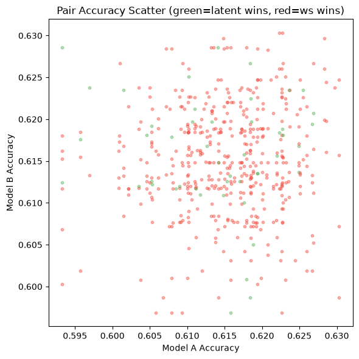

**MMD supplementary.** Figure mmd_comparison.png (h-e1) shows SANE vs. EquiSSL MMD side by side. This figure covers only the two methods for which cross-architecture MMD was computed in h-e1; EquiSSL-perm is not included.

**Note on MMD incompatibility.** The within-ViT-zoo subpopulation MMD values reported in h-m2 (EquiSSL-perm: 0.203, EquiSSL: 0.431) measure a different quantity — separation between high- and low-accuracy ViT subgroups within the test zoo — and are not directly comparable to the cross-architecture MMD values in Table 3. Both are labeled "MMD" in the experiment logs; readers should not compare them across experiments.

## Appendix B: Implementation Details

**Validated hyperparameter configuration (EquiSSL-perm, seed 0, h-m1):**

```yaml
encoder:
  type: "neural-graphs (permutation equivariant)"
  hidden_dim: 256
  latent_dim: 128
  num_layers: 4
  symmetry: "permutation"

training:
  lr: 1.0e-3
  weight_decay: 1.0e-4
  batch_size: 64
  epochs: 100
  temperature: 0.07
  lambda_rec: 0.1
  scheduler: "CosineAnnealingLR"
  T_max: 100
  eta_min: 1.0e-5

augmentation:
  perm_augment: true
  scale_augment: false

linear_probe:
  type: "RidgeCV"
  ridge_alphas: [0.1, 1.0, 10.0, 100.0]
  test_fraction: 0.2

training_data:
  zoo: "SANE MultiZoo CIFAR-10 (tune_zoo_cifar10_uniform_small)"
  n_models_used: ~3000
  n_models_available: ~30000

sane_baseline:
  vicregfix: true
  variance_weight: 0.1

graph_encoding:
  node_features: "[bias_mean, bias_std, bias_min, bias_max]"
  node_dim: 4
  edge_features: "[weight_mean, weight_std, weight_min, weight_max]"
  edge_dim: 4
```

*The EquiSSL (ScaleGMN) ablation was trained for 50 epochs in h-e1. A fully controlled ablation requires 100-epoch training for both methods.*

## Appendix C: Training Curves

EquiSSL-perm (λ=0.1, seed 0) NT-Xent loss progression: epoch 1: 2.80, epoch 5: 0.27, epoch 10: 0.13, epoch 20: 0.07, epoch 30: 0.04, epoch 50: 0.03. Validation loss tracks training loss without divergence. Training converges by approximately epoch 30.

SANE training loss progression (seed 0, 50 epochs): epoch 1: 0.039, epoch 50: 0.0002. Near-zero rapid convergence is consistent with latent collapse rather than genuine representation learning under cross-architecture inputs.

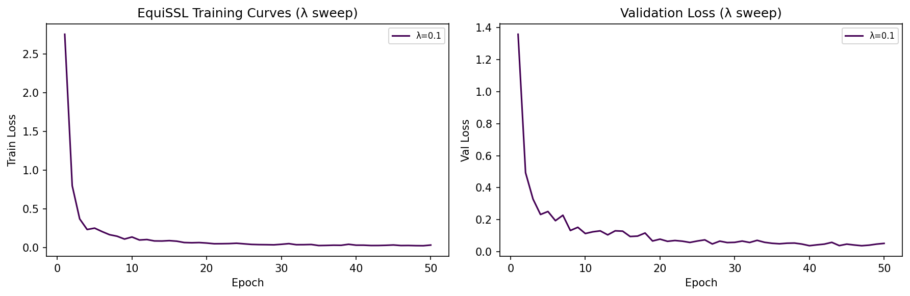
