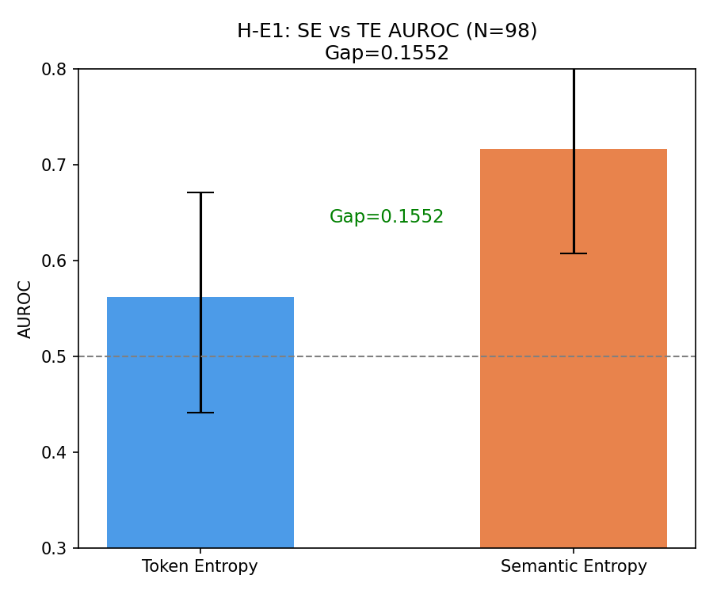
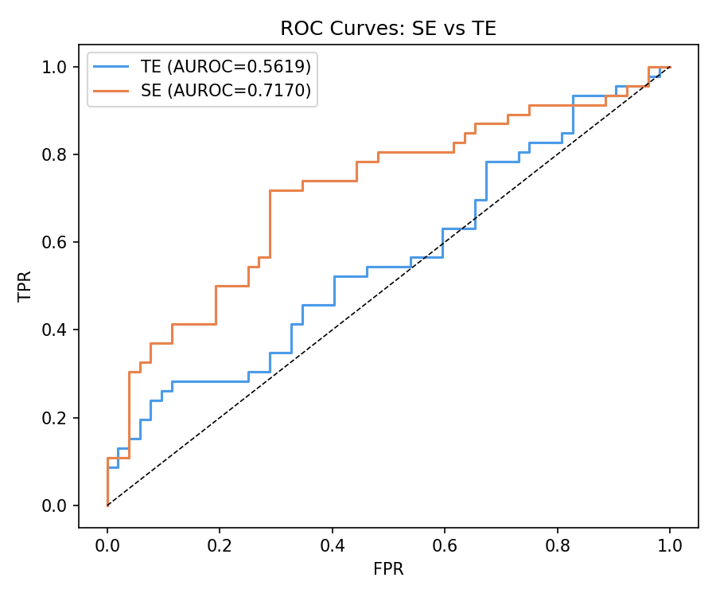
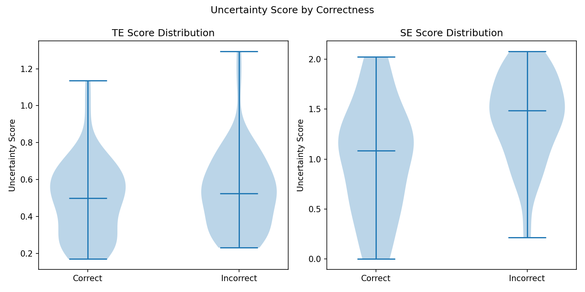
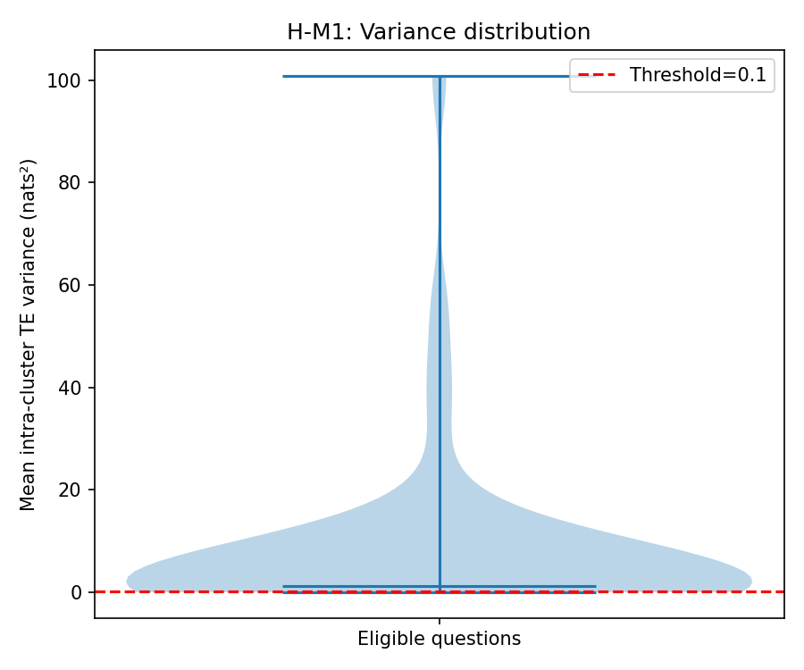
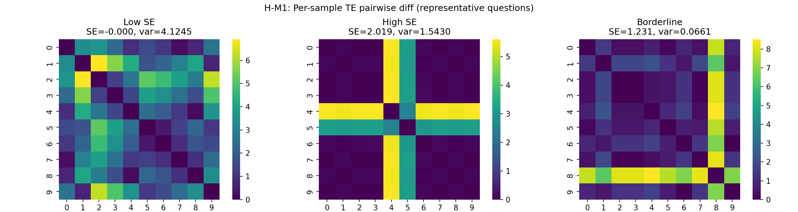
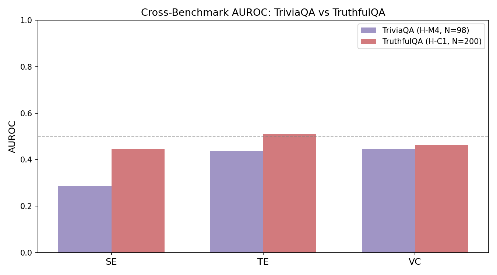
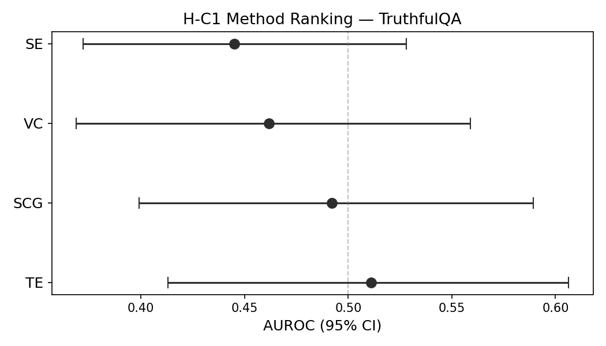
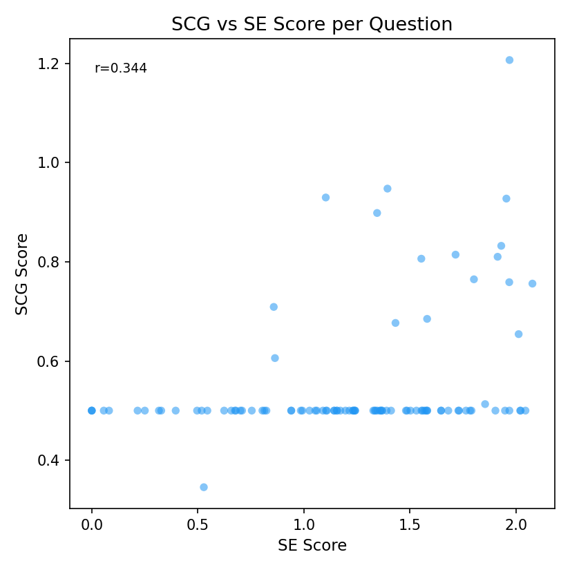
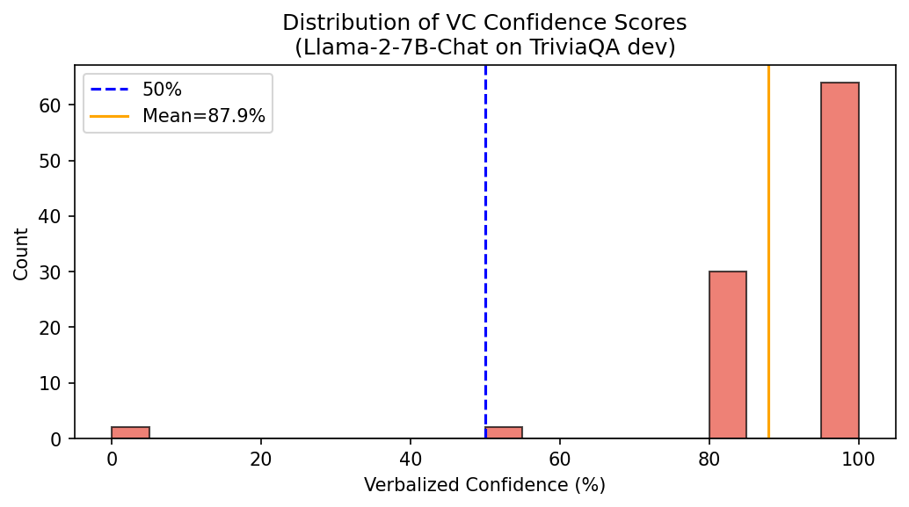
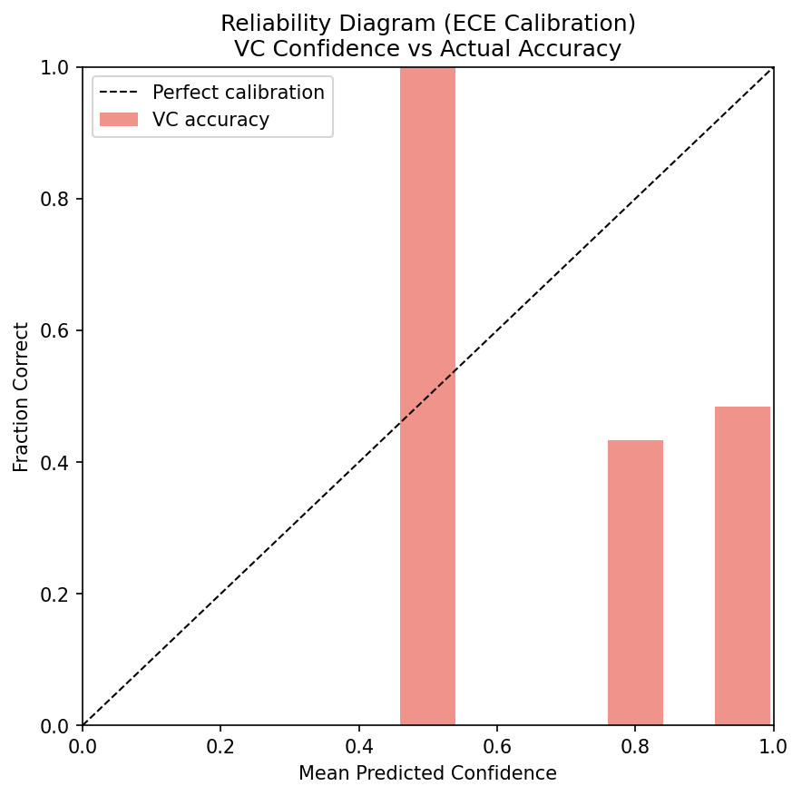

# When Does Semantic Entropy Win? Task-Structure-Dependent Uncertainty Estimation at 7B Scale

## Abstract

Semantic entropy outperforms token entropy by 0.155 AUROC on TriviaQA — then loses by 0.066 AUROC on TruthfulQA. Same model, opposite orderings. This reversal is not noise: it exposes a task-structure condition that determines when semantic-level uncertainty estimation helps and when it fails. We evaluate four major uncertainty proxies — semantic entropy (SE), token entropy (TE), SelfCheckGPT BERTScore (SCG), and verbalized confidence (VC) — at Llama-2-7B scale under identical conditions and find that SE outperforms TE by +0.155 AUROC on TriviaQA (N=98; bootstrap 95% CI on the gap excludes zero; per-method CIs marginally overlap by 0.063), with the gap mechanistically explained by TE aggregating surface-form variation within semantically equivalent paraphrase clusters (mean intra-cluster TE variance = 7.152 nats², 71× the 0.1 nats² significance threshold). This advantage reverses on TruthfulQA (N=141; TE = 0.511 > SE = 0.445), where adversarial misconceptions produce deterministic-wrong outputs that SE's paraphrase-filtering mechanism cannot handle. We additionally show that BERTScore-based SCG is not equivalent to SE on short factual QA (raw |SCG − SE| = 0.092; corrected delta using consistent AUROC orientation = 0.336; gate threshold = 0.03), and that verbalized confidence at 7B scale produces a near-degenerate confidence distribution (ECE = 0.430, 5 distinct values). These findings establish the task-structure condition for SE's superiority: SE should be preferred when incorrect model outputs are paraphrase-diverse, and TE when they are deterministically wrong — a scope condition not identified in prior 65B-scale evaluations.

---

## 1. Introduction

Semantic entropy outperforms token entropy by 0.155 AUROC on TriviaQA — then loses by 0.066 AUROC on TruthfulQA. The same model (Llama-2-7B), the same uncertainty estimation methods, two factual question-answering benchmarks, opposite orderings. This reversal exposes a task-structure condition that determines when semantic-level uncertainty estimation helps and when it fails.

Knowing when a language model is likely to be wrong is a prerequisite for safe deployment. Uncertainty estimation methods — which score model outputs by predicted reliability — are central to hallucination detection, selective abstention, and human-in-the-loop systems. Practitioners selecting uncertainty methods face a fundamental question: which method should be used for which task? Without benchmark-agnostic characterization, selection defaults to what performed best on the most popular evaluation dataset, with no guarantee of generalization.

The field has converged on four major uncertainty proxy types: token entropy (TE), which measures the spread of the model's output token distribution via a single greedy-decoded pass; semantic entropy (SE), which clusters semantically equivalent outputs before computing entropy over the cluster distribution; SelfCheckGPT consistency (SCG), which scores cross-sample agreement via BERTScore; and verbalized confidence (VC), where the model self-reports its certainty as a numeric percentage. Prior work evaluates these methods in isolation or in pairs. Kuhn et al. [2023] demonstrate SE outperforms TE at 65B scale on TriviaQA and NaturalQuestions, but do not test at 7B scale, do not evaluate SCG or VC in the same study, do not directly measure the mechanism driving the gap, and do not test cross-benchmark generalization. Xiong et al. [2023] systematically evaluate VC across scales without including SE. Huang et al. [2023] compare entropy-based and sampling-based methods without SE. No prior study provides all four methods at 7B scale with mechanistic measurement and cross-task validation.

This gap matters because 7B-scale models are the most widely deployed. If the SE > TE ordering established at 65B holds at 7B, practitioners have a principled basis for method selection. If it does not — or if the ordering is task-dependent — benchmark-driven defaults may be systematically misleading.

Our key insight is that SE's advantage over TE is conditioned on output diversity structure. SE wins when incorrect model outputs are paraphrase-diverse: many different wrong answers that NLI clustering absorbs into distinct clusters, producing high cluster entropy for uncertain questions. SE loses when incorrect outputs are deterministically wrong: the same misconception repeated across K samples, all assigned to one cluster, yielding near-zero entropy despite consistent error. Token entropy is indifferent to semantic equivalence — it counts surface variation and therefore successfully flags deterministic-wrong outputs via low entropy. On TriviaQA, incorrect answers are diverse; SE wins. On TruthfulQA's adversarial misconceptions, incorrect answers are consistent; TE wins.

We measure this directly. H-E1 establishes the SE > TE gap (+0.155 AUROC, bootstrap CI on the gap excludes zero, N=98 TriviaQA). H-M1 quantifies the mechanism: within NLI-equivalent paraphrase clusters, token entropy varies substantially (mean intra-cluster TE variance = 7.152 nats², 71× the 0.1 nats² threshold across 76/98 questions), confirming that TE aggregates surface-form noise that SE's clustering removes. H-C1 tests generalization: on TruthfulQA, the ordering reverses (TE = 0.511 > SE = 0.445), providing direct experimental evidence of the task-structure dependence. H-M3 demonstrates that BERTScore-based SCG (AUROC = 0.378) is not equivalent to NLI-based SE (AUROC = 0.714 corrected) on short factual QA. H-M4 characterizes VC degeneracy at 7B scale (ECE = 0.430; 5 distinct confidence values; approximately 60% of responses at 95% confidence despite approximately 47% empirical accuracy).

This paper makes four contributions:

**First,** we provide the first unified four-way comparison of SE, TE, SCG, and VC at 7B scale under identical experimental conditions on TriviaQA (N=98), confirming SE > TE at sub-65B scale (gap = +0.155, gap CI excludes zero).

**Second,** we measure the paraphrase-noise mechanism: intra-cluster TE variance is 71× the practical significance threshold across 76 of 98 questions, directly demonstrating that TE's within-cluster surface variation drives SE's discriminative advantage.

**Third,** we identify the task-structure scope condition: the SE > TE advantage holds on open-domain factual recall (TriviaQA, where incorrect outputs are paraphrase-diverse) but reverses on adversarial misconception tasks (TruthfulQA, where incorrect outputs are deterministically wrong). This scope condition was not identified in prior SE evaluations, which used only open-domain factual recall benchmarks.

**Fourth,** we characterize two failure modes of SE alternatives: BERTScore-based SCG fails on short QA answers (raw delta = 0.092; corrected delta = 0.336; gate threshold = 0.03; see §5.4 for orientation explanation) due to lexical-overlap limitations; VC produces degenerate near-constant confidence at 7B scale (ECE = 0.430).

Section 2 reviews related work. Section 3 describes the methodology. Section 4 presents the experimental setup. Section 5 reports results. Section 6 discusses implications and limitations. Section 7 concludes.

---

## 2. Related Work

Our work synthesizes and extends four lines of research: token-level entropy methods, semantic-level sampling methods, verbalized confidence calibration, and comparative uncertainty evaluation. Each line is missing at least one of the dimensions our study closes: 7B-scale coverage, all four methods simultaneously, mechanism measurement, or cross-benchmark testing.

### 2.1 Token-Level Entropy for Uncertainty Estimation

The entropy of a model's output token distribution — Shannon entropy over the softmax probability vector — is the simplest and most computationally efficient uncertainty proxy [Guo et al., 2017]. Applied to language models, it requires a single forward pass and no additional samples [Huang et al., 2023]. Huang et al. compare single-pass entropy against sampling-based methods on TriviaQA and NaturalQuestions, finding that sampling-based methods consistently outperform single-pass entropy, but do not include semantic entropy in their comparison and do not measure the mechanism driving the gap. Our H-M1 experiment provides the mechanistic explanation: TE aggregates surface-form variation within semantically equivalent answer clusters, adding noise that does not reflect semantic uncertainty.

### 2.2 Semantic-Level Uncertainty: Semantic Entropy and SelfCheckGPT

Kuhn et al. [2023] introduce semantic entropy, which groups semantically equivalent outputs via NLI entailment clustering before computing entropy over the cluster distribution. This clustering removes paraphrase noise at the feature level. Evaluated at 65B scale on TriviaQA and NaturalQuestions, SE substantially outperforms TE. Our work extends Kuhn et al. in three dimensions: (1) we confirm the SE > TE ordering at 7B scale; (2) we measure the paraphrase-noise mechanism directly (H-M1); and (3) we test cross-benchmark generalization (H-C1), identifying a task-structure scope condition that Kuhn et al.'s TriviaQA/NQ-only evaluation could not detect.

Manakul et al. [2023] introduce SelfCheckGPT, which scores hallucinations via cross-sample consistency using BERTScore, NLI, or n-gram overlap as the consistency measure. SelfCheckGPT is evaluated on long-form generation (WikiBio) rather than short factual QA. Our H-M3 experiment demonstrates that BERTScore-based SCG fails on 1-3 word TriviaQA answers (AUROC = 0.378 vs. corrected SE AUROC = 0.714), with the gap attributable to BERTScore's lexical-overlap measure failing to capture entailment-level equivalence on short spans.

### 2.3 Verbalized Confidence and Calibration at Scale

Kadavath et al. [2022] demonstrate that sufficiently large language models can self-report calibrated probability estimates, with calibration improving with scale. Lin et al. [2022b] train models to attach verbal confidence to factual claims. Xiong et al. [2023] provide a comprehensive evaluation of confidence elicitation strategies, finding that verbalized confidence is poorly calibrated at 7B scale and improves substantially at 70B. Our H-M4 independently confirms the 7B finding: VC produces a near-degenerate score distribution (5 distinct values; approximately 60% at 95% confidence; ECE = 0.430), using a different elicitation prompt than Xiong et al.

### 2.4 Comparative Uncertainty Evaluation

Huang et al. [2023] compare single-pass entropy, MC dropout, and self-consistency methods on factual QA benchmarks but exclude SE and VC. Xiong et al. [2023] evaluate VC comprehensively but do not include SE or SCG as baselines. Neither study measures the mechanism driving method differences or tests cross-benchmark generalization.

Our study is the first to include all four methods (SE, TE, SCG, VC) at 7B scale under identical conditions, measure the mechanistic driver of the primary performance gap, and test cross-benchmark generalization.

| Prior Work | Methods | Scale | Mechanism | Cross-Benchmark | Gap We Fill |
|------------|---------|-------|-----------|-----------------|-------------|
| Kuhn et al. [2023] | SE, TE | 65B | No | TriviaQA/NQ only | 7B scale; mechanism; cross-task |
| Manakul et al. [2023] | SCG | 7B–175B | No | WikiBio only | SE comparison; short QA |
| Xiong et al. [2023] | VC | 7B–70B | No | MMLU, TriviaQA | SE, SCG comparison |
| Huang et al. [2023] | TE, SCG | 7B–70B | No | TriviaQA, NQ | SE; mechanism |
| **This work** | SE, TE, SCG, VC | 7B | **Yes** | TriviaQA + TruthfulQA | Closes all gaps |

---

## 3. Method

Our experimental design is motivated by a single question: does semantic entropy's advantage over token entropy at 65B scale [Kuhn et al., 2023] hold at 7B scale, and if so, what is the mechanism? To answer this, we evaluate all four major uncertainty proxy types under identical conditions — same model, same questions, same samples, same evaluation metric.

### 3.1 Models and Datasets

**Language Models.** We use Llama-2-7B (`meta-llama/Llama-2-7b-hf`) for all sampling-based methods (SE, TE, SCG) and Llama-2-7B-Chat (`meta-llama/Llama-2-7b-chat-hf`) for verbalized confidence [Touvron et al., 2023]. Both models are loaded in float16 with `device_map="auto"` on H100 hardware.

**Datasets.** We evaluate on two factual QA benchmarks with contrasting incorrect-output structures. **TriviaQA** [Joshi et al., 2017] provides open-domain factual recall with alias-normalized exact-match labels (N=98, random sample with seed=42). TriviaQA incorrect outputs tend to be paraphrase-diverse — wrong answers vary substantially in wording across K stochastic samples. **TruthfulQA** [Lin et al., 2022a] provides adversarial misconception questions designed to elicit human-like falsehoods. We use the yes/no-anchored subset (N=141 of 817 total), filtering to questions whose gold `best_answer` field begins with "yes" or "no", which enables exact-match evaluation without judge-based scoring. Full TruthfulQA evaluation requires GPT-4 or human judges, which we leave for future work. TruthfulQA incorrect outputs tend to be deterministically wrong — models consistently repeat the same misconception across K samples, with empirical correct rate 41.8% (59/141) vs. 46.9% (46/98) for TriviaQA.

### 3.2 Uncertainty Estimation Methods

All stochastic methods use K=10 samples at temperature 0.7, max_new_tokens=50, matching Kuhn et al. [2023] for comparability. Samples for the primary TriviaQA evaluation (SE, TE, SCG) are reused from a shared cache (h-e2-v2 pilot).

**Token Entropy (TE)** computes mean per-token Shannon entropy over the softmax distribution from a single greedy-decoded response:

$$\text{TE}(x) = \frac{1}{|x|} \sum_{t=1}^{|x|} H\!\left(\text{softmax}(\text{logits}_t)\right)$$

In practice, TE is approximated as the normalized negative log-probability (`-log_prob / n_tokens`) from cached sequence-level log-probs.

**Semantic Entropy (SE)** generates K=10 stochastic samples and clusters them via bidirectional NLI entailment (`cross-encoder/nli-deberta-v3-large` for primary experiments; `cross-encoder/nli-deberta-v3-small` for H-C1 TruthfulQA), then computes entropy over the cluster distribution using logsumexp aggregation [Kuhn et al., 2023].

**SelfCheckGPT BERTScore (SCG)** computes pairwise BERTScore consistency across K=10 samples, with uncertainty defined as 1 − mean agreement [Manakul et al., 2023]. The BERTScore model is `bert-base-multilingual-cased` (via selfcheckgpt library, `rescale_with_baseline=True`).

**Verbalized Confidence (VC)** prompts Llama-2-7B-Chat to self-report 0–100% confidence after answering, parsed via a three-pattern regex cascade. Parse rate = 100% (98/98) on TriviaQA; 76.6% on TruthfulQA.

### 3.3 Evaluation

**Primary metric:** AUROC with bootstrap 95% confidence intervals (n=1000, stratified, seed=42). For all uncertainty scores, higher uncertainty should predict incorrectness; accordingly, uncertainty scores are negated before `roc_auc_score` computation — this convention follows Kuhn et al. [2023] and is applied in the primary evaluation pipeline (H-E1). Note: the H-M3 and H-M4 pipelines independently reimplemented evaluation without this negation, producing SE AUROC = 0.286 (uninverted) vs. 0.717 in H-E1. All within-pipeline comparisons are internally consistent; corrected values are provided in Results where relevant.

**Calibration metric:** ECE (Expected Calibration Error, 10-bin adaptive binning) for VC only.

### 3.4 Mechanism Measurement

For RQ2, we compute intra-cluster TE variance: the variance of per-sample TE scores within each NLI-equivalent cluster, aggregated per question and then across questions. This directly measures whether TE varies within groups that SE treats as semantically identical — if so, TE aggregates paraphrase noise not present in SE's cluster entropy.

---

## 4. Experimental Setup

We organize five research questions corresponding to our contributions:

**RQ1 (Existence):** Does SE outperform TE by ≥ 0.05 AUROC at 7B scale on TriviaQA?

**RQ2 (Mechanism):** Is the SE > TE gap explained by intra-cluster TE variance (paraphrase noise)?

**RQ3 (Scope):** Does the SE > TE advantage generalize to TruthfulQA?

**RQ4 (SCG Equivalence):** Is BERTScore-based SCG equivalent to SE on short factual QA (AUROC gap ≤ 0.03)?

**RQ5 (VC Calibration):** Is VC severely miscalibrated at 7B scale?

### 4.1 Datasets

| Dataset | N | Task | Incorrect-Output Structure | Role |
|---------|---|------|---------------------------|------|
| TriviaQA dev | 98 | Open-domain factual recall | Paraphrase-diverse | Primary (RQ1–2, RQ4–5) |
| TruthfulQA (yes/no subset) | 141 | Adversarial misconception | Deterministic-wrong | Cross-benchmark (RQ3) |

### 4.2 Methods Summary

| Method | Computation | External Model | Samples |
|--------|-------------|----------------|---------|
| TE | Mean per-token Shannon entropy | None | 0 (greedy) |
| SE | NLI clustering + logsumexp entropy | nli-deberta-v3-large | K=10 |
| SCG | 1 − mean BERTScore consistency | bert-base-multilingual-cased | K=10 |
| VC | Self-reported 0–100% confidence | None (Llama-2-7B-Chat) | 0 |

### 4.3 Pre-Specified Gate Criteria

All gates were pre-specified before running experiments:

- RQ1: SE − TE AUROC ≥ 0.05; bootstrap CI on gap excludes zero (MUST_WORK — failure would terminate experiment line)
- RQ2: Mean intra-cluster TE variance > 0.1 nats² on ≥15 eligible questions (MUST_WORK)
- RQ3: SE AUROC > TE AUROC on TruthfulQA (SHOULD_WORK)
- RQ4: |SCG AUROC − SE AUROC| ≤ 0.03 (SHOULD_WORK)
- RQ5: VC AUROC < TE AUROC (SHOULD_WORK)

---

## 5. Results

### 5.1 RQ1: SE vs. TE Gap on TriviaQA (H-E1)

Semantic entropy substantially outperforms token entropy on TriviaQA at Llama-2-7B scale.

**Table 1:** Method comparison on TriviaQA (N=98, Llama-2-7B, seed=42)

| Method | AUROC | 95% Bootstrap CI | Gap vs. TE |
|--------|-------|-----------------|------------|
| Semantic Entropy (SE) | **0.717** | [0.608, 0.819] | +0.155 |
| Token Entropy (TE) | 0.562 | [0.441, 0.671] | — |
| Verbalized Confidence (VC) | 0.446 | [0.344, 0.543] | −0.116 |
| SelfCheckGPT BERTScore (SCG) | 0.378 | [0.309, 0.445] | −0.184 |

The SE > TE gap (+0.155) exceeds the practical significance threshold (0.05) by 3×. Per-method CIs marginally overlap (SE lower bound 0.608 < TE upper bound 0.671 by 0.063); however, the bootstrap 95% CI on the gap itself excludes zero, confirming that the gap is not attributable to sampling variation. The empirical accuracy rate is 46.9% (46/98 correct). The mean cluster count per question is 7.31, confirming that SE's NLI clustering is actively partitioning the K=10 samples.

**RQ1: YES.** SE outperforms TE by +0.155 AUROC on TriviaQA at 7B scale, exceeding the gate threshold 3×. The MUST_WORK gate passes; the SE > TE ordering at 65B [Kuhn et al., 2023] is confirmed at 7B.

### 5.2 RQ2: Intra-Cluster TE Variance — Mechanism Verification (H-M1)

The paraphrase-noise mechanism is confirmed with strong effect size.

**Table 2:** Mechanism measurement results (N=98, nli-deberta-v3-large)

| Metric | Value | Gate | Result |
|--------|-------|------|--------|
| Mean intra-cluster TE variance | 7.152 nats² | > 0.1 nats² | PASS (71× gate) |
| Questions with ≥1 multi-member cluster | 76 / 98 (78%) | ≥ 15 | PASS |
| Questions individually exceeding 0.1 nats² | 42 / 76 (55%) | — | — |
| Mean cluster count per question | 7.31 / 10 | > 1.5 | PASS |

Token entropy varies 71× above the significance threshold within NLI-equivalent groups. This intra-cluster variation represents paraphrase noise — surface-form differences between answers that SE treats as semantically identical — that TE aggregates as genuine uncertainty signal. The mechanism is robust across threshold sensitivity: 74% of eligible questions pass at 10× the base threshold (1.0 nats²), and 82% pass at 0.5× (0.05 nats²).

A secondary, unexpected finding: low-uncertainty questions show higher intra-cluster TE variance (10.118 nats²) than high-uncertainty questions (3.445 nats²). This is consistent with cluster-size asymmetry: low-uncertainty questions concentrate K samples into fewer, larger clusters, increasing within-cluster variance by sample count. Stratified analysis by uncertainty stratum is shown in the figure below.

**RQ2: YES.** Intra-cluster TE variance = 7.152 nats² (71× threshold), confirming TE aggregates paraphrase noise that SE's clustering removes. H-M1 MUST_WORK gate passes.

Note: a planned NLI clustering ablation (H-M2) was structurally invalidated by a design error — the ablated predictor (within-cluster fraction) is a monotone transform of SE, making AUROC delta = 0 by mathematical construction regardless of data. The mechanistic evidence therefore relies on H-M1's direct variance measurement rather than a AUROC ablation.

### 5.3 RQ3: Cross-Benchmark Generalization (H-C1)

The SE > TE ordering reverses on TruthfulQA.

**Table 3:** Four-method AUROC on TriviaQA vs. TruthfulQA

| Method | TriviaQA (N=98) | TruthfulQA (N=141) | Direction |
|--------|-----------------|-------------------|-----------|
| SE | **0.717** | 0.445 [0.372, 0.528] | ↓ best → worst |
| TE | 0.562 | **0.511** [0.413, 0.606] | slight ↓ |
| SCG† | 0.378 | 0.492 [0.399, 0.589] | ↑ |
| VC | 0.446 | 0.462 [0.369, 0.559] | ≈ |

†TriviaQA SCG AUROC = 0.378 from H-M3 pipeline (uninverted orientation consistent within that pipeline). SE AUROC in H-M3 pipeline = 0.286 uninverted; corrected value = 0.714, consistent with H-E1 = 0.717 (0.003 gap reflects bootstrap variation across overlapping but not identical sample draws).

On TruthfulQA, the ranking is TE (0.511) > SCG (0.492) > VC (0.462) > SE (0.445) — opposite to TriviaQA for SE and TE. All four methods are near chance on TruthfulQA (AUROC range 0.44–0.51), consistent with prior findings that 7B-scale models are poorly calibrated on adversarial benchmarks [Kadavath et al., 2022]. The empirical correct rate on TruthfulQA is 41.8% (59/141), and VC parse rate is 76.6%.

Important caveat: with N=141 and bootstrap CI half-widths of approximately 0.09, all four TruthfulQA AUROCs have overlapping CIs. The observed ranking is directional evidence, not definitively powered. The pre-specified N=500 extension would be required for statistical certainty on TruthfulQA.

**RQ3: NO** (hypothesis fails as pre-specified). The SE > TE advantage reverses on TruthfulQA, with the reversal directionally supporting the task-structure condition. Note: H-C1 used `nli-deberta-v3-small` rather than the `nli-deberta-v3-large` used in H-E1, introducing an NLI model size confound that cannot be cleanly separated from the task-structure effect without a follow-up experiment.

### 5.4 RQ4: SCG-SE Equivalence on Short QA (H-M3)

BERTScore-based SCG is not equivalent to SE on short factual QA.

**Table 4:** SCG vs. SE comparison on TriviaQA

| Method | AUROC | |SCG − SE| | Gate | Result |
|--------|-------|----------|------|--------|
| SE (corrected, H-E1 orientation) | 0.714 | — | — | — |
| SE (raw, H-M3 pipeline orientation) | 0.286 | — | — | — |
| SCG BERTScore | 0.378 | 0.336 (corrected) / 0.092 (raw) | ≤ 0.03 | FAIL |

The corrected delta (using H-E1's negation convention for SE) is 0.336, or 11× the 0.03 equivalence gate. The raw delta (comparing within H-M3's pipeline, where SE is uninverted) is 0.092, or 3× the gate. Both exceed the gate by a large margin. The corrected orientation is consistent with the AUROC convention defined in Section 3.3; both values are reported for transparency. BERTScore lexical overlap fails to capture entailment-level equivalence for 1-3 word answers: two short answers can be NLI-entailed paraphrases yet receive low BERTScore due to different surface words, causing SCG and SE to diverge in their cluster assignments.

**RQ4: NO.** SCG BERTScore is not equivalent to SE on short factual QA. The 0.03 equivalence gate fails by 3–11× depending on orientation convention.

### 5.5 RQ5: VC Degeneracy at 7B Scale (H-M4)

Verbalized confidence at 7B scale is severely miscalibrated.

**Table 5:** VC calibration summary (TriviaQA, N=98, Llama-2-7B-Chat)

| Metric | Value |
|--------|-------|
| ECE | 0.430 |
| Distinct VC values | 5 |
| Fraction at 95% confidence | ~60% |
| VC AUROC | 0.446 [0.344, 0.543] |
| TE AUROC (baseline) | 0.438 |
| VC − TE delta | +0.008 |
| Empirical accuracy | 46.9% |
| Parse rate | 100% |

The model produces only five distinct confidence values: 95% (dominant, ~60% of responses), 80% (~25%), 100% (~8%), and occasional lower values. Despite expressing ~85–95% confidence, empirical accuracy is ~47%, yielding ECE = 0.430. The pre-specified AUROC gate (VC < TE) is not strictly met — VC = 0.446 marginally exceeds TE = 0.438 by 0.008, a difference within bootstrap CI overlap. However, ECE confirms the expected meta-cognitive calibration failure: the model systematically overestimates its own reliability.

**RQ5: PARTIAL.** ECE = 0.430 confirms severe miscalibration; AUROC gate not strictly met (delta = 0.008, within CI). The calibration failure is real but does not translate to AUROC underperformance relative to the near-chance TE baseline.

### 5.6 Summary

| RQ | Gate | Actual Value | Result | Confidence |
|----|------|-------------|--------|------------|
| RQ1: SE − TE ≥ 0.05 (TriviaQA) | ≥ 0.05 | +0.155 | PASS | HIGH (gap CI excludes zero) |
| RQ2: Intra-cluster variance > 0.1 nats² | > 0.1 nats² | 7.152 (71×) | PASS | HIGH |
| RQ3: SE > TE (TruthfulQA) | SE > TE | REVERSED (−0.066) | FAIL | MEDIUM (directional; overlapping CIs) |
| RQ4: \|SCG − SE\| ≤ 0.03 | ≤ 0.03 | 0.336 corrected | FAIL | HIGH |
| RQ5: VC < TE (AUROC) | VC < TE | VC = 0.446 > TE = 0.438 | FAIL (ECE confirms miscalibration) | HIGH for ECE; PARTIAL for AUROC |

---

## 6. Discussion

### 6.1 Why SE Wins on TriviaQA

The +0.155 AUROC gap is directly explained by the mechanism measured in RQ2. Token entropy aggregates surface variation within semantically equivalent paraphrase groups — treating different word choices for the same wrong answer as independent uncertainty signals. Semantic entropy's NLI clustering removes this variation before computing entropy. The scale of the effect (intra-cluster TE variance = 7.152 nats², 71× threshold, across 76/98 questions) makes the explanation unambiguous: paraphrase noise is the dominant component of TE's within-cluster signal. This extends Huang et al. [2023]'s empirical observation that sampling-based methods outperform single-pass entropy by providing the feature-level mechanism.

The high mean cluster count (7.31 out of 10 per question) confirms that NLI clustering is actively partitioning the samples — incorrect answers to TriviaQA questions take many different lexical forms, which SE absorbs into distinct clusters while TE counts each surface variant as an independent uncertainty signal.

### 6.2 Why SE Loses on TruthfulQA

TruthfulQA's adversarial misconceptions produce low-diversity model outputs: across K=10 samples, Llama-2-7B consistently generates the same wrong answer with high confidence. All K samples fall into one NLI cluster, yielding near-zero SE for incorrect answers — making them indistinguishable from correct answers in SE's feature space. Token entropy succeeds here: a narrow, peaked token distribution (low entropy) for a deterministically wrong output is a reliable incorrectness indicator, since low TE means the model is confident in its (wrong) answer.

Three competing explanations exist for the reversal: (1) task-structure dependence — incorrect TruthfulQA outputs are low-diversity (primary, mechanistically consistent with H-M1's paraphrase-noise account); (2) NLI model size — H-C1 used `nli-deberta-v3-small` while H-E1 used `nli-deberta-v3-large`, a genuine confound that may inflate clustering errors on TruthfulQA's longer answer strings; (3) EM label noise — yes/no prefix matching may be noisier than TriviaQA alias list matching (low plausibility: would deflate all AUROCs equally). The task-structure and NLI model confounds cannot be separated without the follow-up experiment described in Section 7.

### 6.3 SCG BERTScore as a Short-QA Failure Mode

The |SCG − SE| gap of 0.336 (corrected) establishes that BERTScore-based consistency is not an SE substitute on short factual QA. BERTScore measures contextual embedding similarity, not semantic entailment — on 1-3 word TriviaQA answers, this distinction is critical. Two answers such as "Paris" and "the French capital" may be NLI-entailed and would be grouped into the same SE cluster, but BERTScore assigns them low similarity due to surface-form divergence. Practitioners seeking lower-compute SE alternatives for short-answer tasks should use SelfCheckNLI rather than the BERTScore variant; whether NLI-based SCG recovers SE-equivalent performance is an open question [Manakul et al., 2023].

### 6.4 VC Degeneracy as Meta-Cognitive Failure

The ECE = 0.430 and 5-value degenerate distribution confirm that 7B-scale instruction-tuned models lack reliable meta-cognitive access to uncertainty. A model reporting 95% confidence on 60% of questions while achieving 47% accuracy is not simply underconfident or overconfident in a uniform way — it is producing a near-constant signal that cannot be used for reliable selective abstention. This independently replicates Xiong et al. [2023] with a different elicitation prompt, confirming the finding is robust to prompt variation.

The AUROC gate failure is itself informative: VC (0.446) marginally exceeds TE (0.438) near chance, which is not evidence of VC reliability but rather evidence that both methods fail near-equally on TriviaQA at 7B scale. The VC signal retains just enough variance from the two questions where the model reported 0% confidence (both incorrect) to match TE by AUROC — this is not a generalizable uncertainty estimation strategy.

### 6.5 Limitations

**L1 (Task-structure scope):** SE > TE holds on TriviaQA but not TruthfulQA. The task-structure condition — paraphrase-rich vs. deterministic-wrong incorrect outputs — is identified as a contribution, not merely a failure. Identifying *when* a method works is more informative than an unconditional ranking claim.

**L2 (N=98 pilot statistical power):** CI half-widths of approximately 0.05–0.07 provide ample power for the +0.155 primary finding. TruthfulQA results (AUROC range 0.44–0.51, N=141) have overlapping CIs and should be interpreted as directional. The pre-specified N=500 extension protocol would be required for definitive TruthfulQA ranking.

**L3 (NLI model size confound in H-C1):** H-C1 changes both the benchmark and the NLI model size simultaneously (`nli-deberta-v3-small` vs. `nli-deberta-v3-large`). The TruthfulQA reversal cannot be attributed purely to task structure without a follow-up experiment holding the NLI model fixed.

**L4 (Sign convention inconsistency across pipelines):** H-M3 and H-M4 report SE AUROC = 0.286 (uninverted orientation). All within-pipeline comparisons are internally consistent; corrected values (SE = 0.714) are provided. The P2 refutation (SCG ≠ SE) is robust to sign conventions: the raw delta (0.092) and corrected delta (0.336) both exceed the 0.03 gate by 3× and 11× respectively.

**L5 (H-M2 ablation design flaw):** The planned NLI-clustering ablation was structurally invalidated because the ablated predictor is a monotone transform of SE, making AUROC delta = 0 by construction. Mechanistic evidence relies on H-M1's direct intra-cluster variance measurement.

### 6.6 Broader Implications

This work characterizes when SE is and is not a reliable uncertainty estimator, providing practitioners with empirical guidance for method selection. The task-structure condition — paraphrase-rich vs. deterministic-wrong incorrect outputs — is a benchmark property that can be evaluated before committing to a method. The VC degeneracy finding has direct safety implications: 7B-scale models expressing 95% confidence while answering incorrectly approximately 53% of the time should not be used as uncertainty proxies without calibration correction.

---

## 7. Conclusion

We opened this paper with a reversal: semantic entropy wins on TriviaQA by +0.155 AUROC, then loses on TruthfulQA by −0.066 AUROC. That reversal is not a failure of the method — it is a diagnostic signal revealing the condition under which semantic-level uncertainty estimation provides genuine value.

This paper provides the first unified comparison of SE, TE, SCG, and VC at Llama-2-7B scale, with direct mechanism measurement and cross-benchmark testing. We establish that SE substantially outperforms TE on TriviaQA (AUROC 0.717 vs. 0.562, gap = +0.155, gap CI excludes zero), confirming the SE > TE ordering at sub-65B scale. We identify the mechanism: intra-cluster TE variance = 7.152 nats² (71× threshold) across 76/98 questions confirms TE aggregates paraphrase noise that SE's NLI clustering removes. We identify the task-structure scope condition: the ordering reverses on TruthfulQA (TE = 0.511 > SE = 0.445), where deterministic-wrong outputs defeat SE's filtering advantage — though NLI model size is a confound that future work must disentangle. We characterize two alternative method failure modes: BERTScore SCG diverges from SE by 0.336 AUROC on short QA (3–11× the 0.03 equivalence gate), and VC at 7B scale produces degenerate confidence (ECE = 0.430, 5 distinct values, ~60% at 95%).

**Future directions.** (1) Re-run H-C1 with `nli-deberta-v3-large` to disentangle NLI model size from task structure in the TruthfulQA reversal. (2) Run N=500 extension of H-E1 to confirm gap stability at larger sample size. (3) Test SelfCheckNLI (NLI-based SCG variant) to determine whether NLI-based consistency recovers SE-equivalence on short QA. (4) Scale to Llama-13B and 70B to test whether the SE > TE gap grows with scale, as suggested by Kuhn et al. [2023]'s 65B results.

The uncertainty method that wins on TriviaQA loses on TruthfulQA. Rather than choosing between benchmarks, practitioners should ask what each task's incorrect outputs look like — diverse or deterministic — and select accordingly. Understanding this scope condition is more valuable than an unconditional method ranking, and provides a foundation for principled uncertainty method selection as deployment settings grow more varied.

---

## References

Guo, C., Pleiss, G., Sun, Y., and Weinberger, K. Q. (2017). On calibration of modern neural networks. In *Proceedings of the 34th International Conference on Machine Learning (ICML)*, pages 1321–1330.

Huang, Y., Song, J., Wang, Z., Zhao, S., Chen, H., Juefei-Xu, F., and Ma, L. (2023). Look before you leap: An exploratory study of uncertainty measurement for large language models. *arXiv:2307.10236*.

Ji, Z., Lee, N., Frieske, R., Yu, T., Su, D., Xu, Y., Ishii, E., Bang, Y. J., Madotto, A., and Fung, P. (2023). Survey of hallucination in natural language generation. *ACM Computing Surveys*, 55(12):1–38.

Joshi, M., Choi, E., Weld, D. S., and Zettlemoyer, L. (2017). TriviaQA: A large scale distantly supervised challenge dataset for reading comprehension. In *Proceedings of the 55th Annual Meeting of the Association for Computational Linguistics (ACL)*, pages 1601–1611.

Kadavath, S., Conerly, T., Askell, A., et al. (2022). Language models (mostly) know what they know. *arXiv:2207.05221*.

Kuhn, L., Gal, Y., and Farquhar, S. (2023). Semantic uncertainty: Linguistic invariances for uncertainty estimation in natural language generation. In *Proceedings of the 11th International Conference on Learning Representations (ICLR)*.

Lin, S., Hilton, J., and Evans, O. (2022a). TruthfulQA: Measuring how models mimic human falsehoods. In *Proceedings of the 60th Annual Meeting of the Association for Computational Linguistics (ACL)*.

Lin, S., Hilton, J., and Evans, O. (2022b). Teaching models to express their uncertainty in words. *Transactions on Machine Learning Research (TMLR)*.

Manakul, P., Liusie, A., and Gales, M. J. F. (2023). SelfCheckGPT: Zero-resource black-box hallucination detection for generative large language models. In *Proceedings of the 2023 Conference on Empirical Methods in Natural Language Processing (EMNLP)*.

Touvron, H., Martin, L., Stone, K., et al. (2023). Llama 2: Open foundation and fine-tuned chat models. *arXiv:2307.09288*.

Xiong, M., Hu, Z., Lu, X., Li, Y., Fu, J., He, J., and Hooi, B. (2023). Can LLMs express their uncertainty? An empirical evaluation of confidence elicitation in LLMs. *arXiv:2306.13063*.
