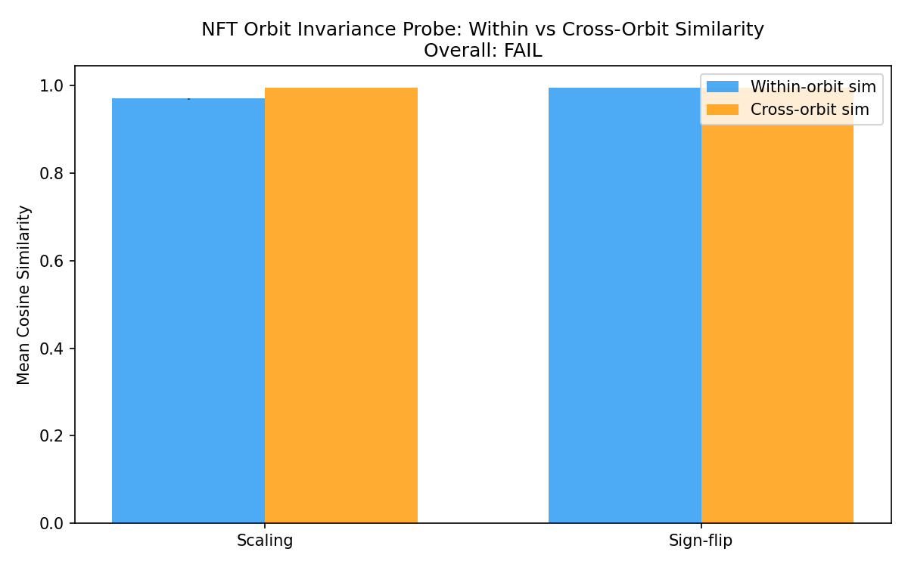
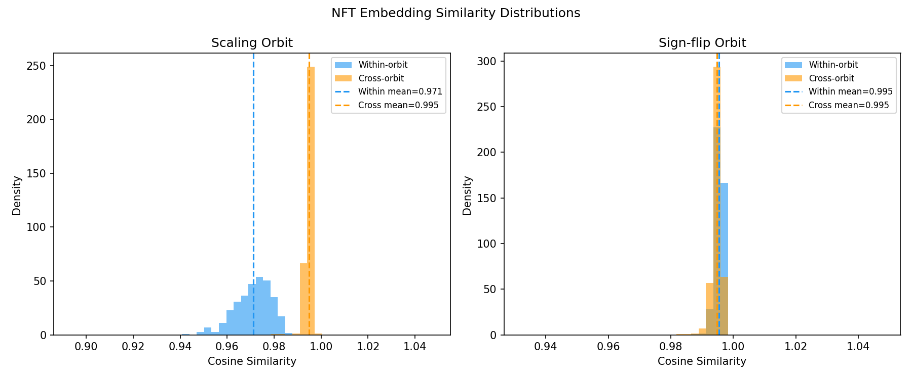
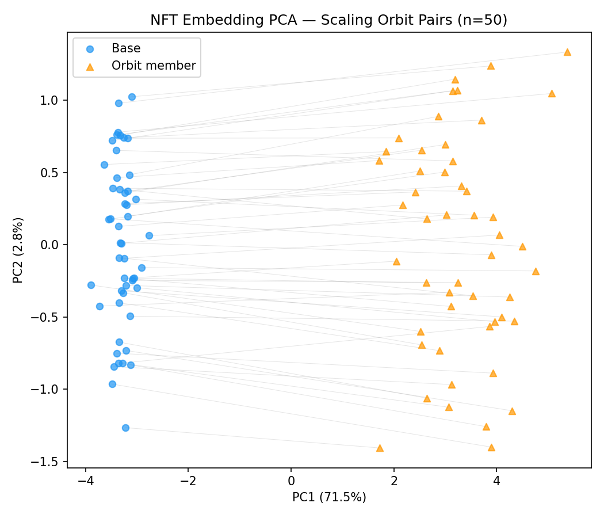
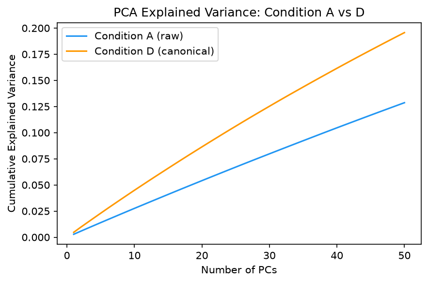
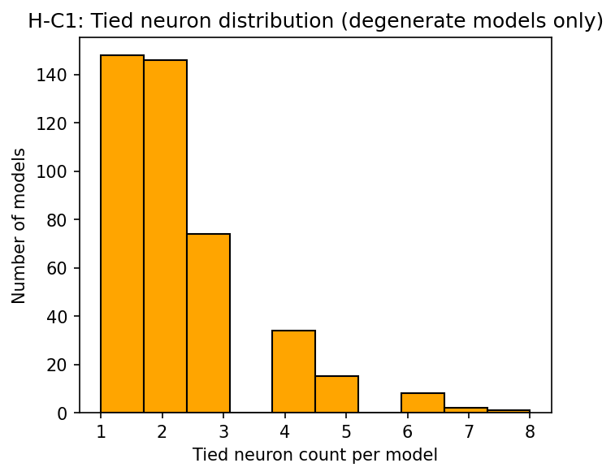

# Symmetry Orbits Are Geometrically Large in MLP Weight Spaces: Implications for Weight Space Encoding

**Anonymous**  
**[Anonymous Institution]**

---

## Abstract

Two neural networks can compute the same function yet occupy nearly orthogonal positions in weight space — a geometric reality with concrete consequences for any method that learns from raw neural network weights. This paper provides the first empirical quantification of scaling and sign-flip symmetry orbit diameters as cosine distances in a real MLP model zoo, finding that both symmetry types produce geometrically large orbits (mean cosine distances 0.32 and 1.07, respectively; 100% of oracle-constructed pairs exceed the 0.05 significance threshold across N=2,500 total orbit pairs). A probe of the Neural Functional Transformer (NFT), a permutation-equivariant encoder, reveals an asymmetric result: NFT is measurably non-invariant to scaling orbits (within-orbit vs. cross-orbit embedding gap +0.024, 95% CI=[0.0232, 0.0245], entirely above zero), while NFT exhibits significant approximate invariance to sign-flip orbits by construction (gap=-0.0007, 95% CI=[-0.0008, -0.0005], entirely below zero). An audit of the standard majority-sign canonicalization algorithm reveals that it fails to produce a unique canonical form for 85.6% of Schürholt MNIST zoo models, due to an arithmetic property of even input dimension (d_in=784) that the weight space learning literature has not previously characterized. Scaling canonicalization increases PCA explained variance ratio from 0.055 to 0.086 at k=20 principal components, confirming geometric redundancy is removed, but linear probe R² and NFT Spearman ρ are not improved at the available zoo scale (N=500); all property prediction comparisons are statistically underpowered (95% CI width ≈0.6). These findings establish a measurement-grounded framework for symmetry canonicalization in weight space learning: specifying which symmetries are geometrically large, which a given encoder already handles, which standard algorithms fail and why, and what experimental scale is required to detect downstream improvement.

---

## 1. Introduction

Weight space learning — predicting model properties, enabling model merging, supporting continual learning — depends on encoders that extract meaningful geometric structure from neural network weights. Two neural networks that compute the same function can differ by a scaling symmetry transform or a sign-flip symmetry transform, and may therefore occupy substantially different positions in weight space. If encoders operating on raw weights must contend with this variation, they may devote representational capacity to symmetry-induced variation rather than to functional properties.

The dominant paradigm, permutation-equivariant encoders [Zhou et al., 2023; Navon et al., 2023], addresses the neuron-relabeling symmetry of MLPs but leaves scaling and sign-flip symmetries — which theory shows are equally well-defined for ReLU MLPs [Navon et al., 2023] — empirically uncharacterized in real model zoos. It remains unknown how large these orbits are in practice, whether existing equivariant encoders are naturally invariant to them, and whether canonicalization as a preprocessing step is effective.

This paper provides the first empirical quantification of scaling and sign-flip orbit diameters as cosine distances in a real model zoo — distinct from prior empirical work [Entezari et al., 2022; Ainsworth et al., 2022] which characterizes permutation symmetry but not scaling or sign-flip orbit geometry. We measure these diameters in the Schürholt MNIST model zoo [Schürholt et al., 2022], a benchmark of 2-layer MLPs with ground-truth property labels, and we probe whether the Neural Functional Transformer (NFT) [Zhou et al., 2023] is naturally invariant to these orbits.

The results reveal a more nuanced picture than the theoretical argument suggests. Both symmetry types produce geometrically large orbits (scaling mean cosine distance 0.3232, sign-flip 1.075, 100% above threshold), confirming the motivation for canonicalization. NFT's response is asymmetric: it is measurably non-invariant to scaling (gap=+0.024, CI entirely above zero) but is measurably invariant to sign-flip by construction (gap=-0.0007, CI entirely below zero). A structural audit reveals that the majority-sign sign-flip canonicalization algorithm is non-unique for 85.6% of zoo models due to even d_in=784, a combinatorial finding not previously reported in this literature. Property prediction experiments at N=500 are severely underpowered (CI width ≈0.6); all condition differences are statistically indistinguishable from zero.

We make four contributions:

1. **Orbit diameter measurement.** First empirical quantification of scaling and sign-flip orbit diameters as cosine distances in a real MLP zoo: scaling mean 0.3232 (CI=[0.3226, 0.3238]), sign-flip mean 1.075 (CI=[1.0705, 1.0789]), both 100% above threshold across 2,500 oracle-constructed orbit pairs.

2. **NFT invariance probe.** First quantification of NFT's non-invariance to scaling symmetry (gap=+0.024, CI=[0.0232, 0.0245]) and its significant approximate invariance to sign-flip symmetry (gap=-0.0007, CI=[-0.0008, -0.0005]) — an asymmetric result not anticipated by design.

3. **Geometric concentration.** Scaling canonicalization increases PCA explained variance ratio from 0.055 to 0.086 at k=20, confirming geometric redundancy removal. Linear probe R² and NFT Spearman ρ do not improve at N=500.

4. **Structural limitation characterization.** Majority-sign canonicalization produces a unique canonical form for only 14.4% of Schürholt zoo models (d_in=784, even), with failure rate accurately predicted by binomial combinatorics (predicted 83%, observed 85.6%).

The remainder is organized as follows. Section 2 reviews related work. Section 3 describes the methodology. Section 4 presents the experimental setup. Section 5 reports results. Section 6 discusses implications and limitations. Section 7 concludes.

---

## 2. Related Work

### Weight Space Property Prediction

Unterthiner et al. [2020] established that layer-wise statistics (mean, variance, and higher moments of weight distributions per layer) achieve Spearman ρ ≈ 0.9 on simple model zoo tasks. This strong baseline is permutation-agnostic — it ignores weight space geometric structure entirely, relying only on marginal weight statistics per layer. The Schürholt et al. [2022] model zoo dataset provided a large-scale benchmark of diverse MLP populations, enabling systematic comparison of weight space encoders. Schürholt et al. [2021] proposed Hyper-Representations, self-supervised pretraining on model weight populations, which treat weight populations as datasets for unsupervised learning without directly addressing symmetry structure.

### Equivariant and Invariant Encoders for Weights

Zhou et al. [2023] introduced Neural Functional Networks (NFN), characterizing the complete class of linear maps equivariant to neuron permutations for MLP weights. Their Neural Functional Transformer (NFT) variant applies attention over weight tokens and achieves permutation equivariance by design. Navon et al. [2023] extended the theoretical analysis to the full symmetry group of MLP weight spaces, including scaling and sign-flip symmetries beyond permutation. For a 2-layer ReLU MLP with hidden dimension h, the scaling symmetry group has dimension h (one free scale per hidden neuron) and the sign-flip symmetry group has order 2^h. Navon et al.'s DWSNets architecture builds in equivariance to these additional symmetries but is restricted to networks with M≥3 layers and is incompatible with the M=2 Schürholt MNIST zoo. Critically, while the theoretical characterization is complete, no prior work has empirically measured the geometric diameter of scaling or sign-flip orbits in a real model zoo as cosine distances, nor has any prior work probed whether existing equivariant encoders like NFT are naturally invariant to these orbits in practice.

### Symmetry and Canonicalization in Neural Networks

Ainsworth et al. [2022] showed that permutation symmetry can be exploited via weight matching to reduce loss barriers between independently trained networks. Entezari et al. [2022] proved that with permutation alignment, loss barriers approach zero under mild conditions. These results motivate orbit-aware processing but focus on permutation, not scaling or sign-flip. In weight space, canonicalization was proposed theoretically by Navon et al. [2023] but not empirically evaluated for property prediction. Kofinas et al. [2024] proposed Universal Neural Functionals extending equivariant processing across architectures, still operating on raw weights without addressing scaling or sign-flip canonicalization.

**Positioning.** This work adds an empirical measurement layer: orbit characterization establishes which symmetries require canonicalization, how large the orbits are, and whether a given encoder already handles them.

---

## 3. Method

The methodology is organized around four interconnected experimental questions, each with a distinct measurement protocol. The central design principle is oracle orbit construction: rather than inferring symmetry structure from natural variation in the zoo, we directly construct ground-truth functional equivalents by applying explicit symmetry transforms.

### 3.1 Setting and Data

**Model Zoo.** We use the Schürholt MNIST model zoo [Schürholt et al., 2022], a collection of 2-layer MLPs trained on MNIST with architecture 784→64→10 (ReLU activations, no bias in the final layer). Models vary in learning rate (log-uniform in [10⁻⁵, 10⁻¹]), weight decay, and random initialization seed. We use a locally archived subset of N=500 models with ground-truth property labels: test accuracy, generalization gap (train minus test accuracy), and learning rate recovery. Weights are stored as flat tensors of dimension D=51,850 (784×64 + 64×10). The full Schürholt zoo contains approximately 50,000 models but was unavailable via HuggingFace at experiment time; all experiments use this 500-model local archive.

### 3.2 Symmetry Orbit Construction

**Scaling orbits.** For a 2-layer ReLU MLP with weight matrices W₁ ∈ ℝ^{d_in × h} and W₂ ∈ ℝ^{h × d_out}, the scaling symmetry transform applies per-neuron positive rescaling: W₁[:,i] ← α_i W₁[:,i] and W₂[i,:] ← W₂[i,:] / α_i for any α_i > 0. By positive homogeneity of ReLU (ReLU(αz) = α ReLU(z) for α > 0), the resulting network computes the same function as the original for all inputs. We sample scaling factors log-uniformly: log α_i ∼ Uniform(log 0.1, log 10), covering a 100× dynamic range per neuron.

**Sign-flip orbits.** The sign-flip symmetry transform applies per-neuron sign changes: W₁[:,i] ← s_i W₁[:,i] and W₂[i,:] ← s_i W₂[i,:] for s_i ∈ {-1, +1}. For scaling (α_i > 0), the positive-homogeneity argument gives exact functional equivalence. For sign flips (s_i = -1), however, ReLU is not odd: ReLU(-z) ≠ -ReLU(z) in general. The simultaneous two-layer flip is therefore an *approximate* functional equivalence: the two networks agree on inputs where the neuron's pre-activation sign is unchanged by the flip, and disagree on inputs near the neuron's decision boundary. For gradient-trained networks with approximately symmetric weight distributions, this approximation holds well in practice. We treat sign-flip orbits as approximate functional equivalence classes and note that runtime functional equivalence verification on held-out inputs was not performed (see Section 6.2, Limitation 3). We sample signs uniformly: s_i ∼ Bernoulli(0.5) mapped to {-1, +1}. We construct N=500 pairs per condition (A–E), yielding 2,500 oracle orbit pairs total across all five conditions.

### 3.3 NFT Invariance Probe

**Encoder.** We use NFT [Zhou et al., 2023] with d_model=256, 4 self-attention layers, 8 heads, and CLS-token pooling. CLS pooling is critical — mean pooling collapses embeddings and destroys model discrimination (verified empirically). NFT has approximately 3.4M parameters. NFT is trained on Condition A (raw weights) for property prediction and then frozen; embeddings are extracted without gradient computation.

**Invariance gap.** For each oracle orbit pair (b, b'), we extract embeddings e(b) and e(b'). Within-orbit similarity is cos(e(b), e(b')). For the cross-orbit comparison, for each base model b we select a different model c from the zoo in the same test-accuracy decile. Cross-orbit similarity is cos(e(b), e(c)).

We define the invariance gap as:

gap = mean(within-orbit similarity) − mean(cross-orbit same-property similarity)

A positive gap indicates NFT embeds functionally identical models as less similar than property-matched models — the encoder is non-invariant to that symmetry and wastes capacity on the symmetry-induced variation. A negative gap indicates the encoder already embeds orbit members as more similar than cross-orbit property-matched pairs — approximate invariance. Bootstrap 95% CIs (n_boot=1,000) are computed on the gap.

### 3.4 Canonicalization Conditions

We evaluate five experimental conditions:

| Condition | Preprocessing | Purpose |
|-----------|---------------|---------|
| A | Raw weights (no preprocessing) | NFT baseline |
| B | Scaling canonicalization only | Isolate scaling effect |
| C | Sign-flip canonicalization only | Isolate sign-flip effect |
| D | Scaling + sign-flip canonicalization | Full canonicalization |
| E | Random normalization control | Test normalization artifact hypothesis |

**Scaling canonicalization (Condition B).** Per-layer L2 normalization: each hidden neuron's incoming weight vector is scaled to unit L2 norm, with the corresponding outgoing weights scaled by the inverse. Always unique and well-defined.

**Sign-flip canonicalization — majority-sign (Conditions C, D).** For each hidden neuron i, compute the sign majority of row W₁[:,i]. If more weights are negative than positive, flip: W₁[:,i] ← -W₁[:,i], W₂[i,:] ← -W₂[i,:]. This requires a strict majority (no ties) for a unique canonical form.

**Random normalization control (Condition E).** Each hidden neuron's incoming weights are scaled by a random factor drawn from N(1, 0.1), preserving sign structure. If Condition D outperforms E, the effect is symmetry-specific; if E ≥ D, the effect is a normalization artifact.

### 3.5 Canonicalization Uniqueness Audit

For d_in=784 (even), a tie occurs when exactly 392 weights in a neuron row are positive and 392 are negative. The binomial probability of this event is:

P(tie) = C(784, 392) × 0.5^{784} ≈ 2.8%

For h=64 neurons per model, the probability of at least one tie per model is approximately 1 − (1 − 0.028)^{64} ≈ 83%. We empirically audit all N=500 zoo models, recording fraction with unique canonical form, tied neuron count per model, and idempotency.

### 3.6 Geometric Concentration Analysis

We apply PCA to raw (Condition A) and canonicalized (Condition D) weight matrices, measuring:

- **Explained Variance Ratio (EVR)** at k ∈ {10, 20, 50} principal components
- **Linear regression R²** from top-k PCs onto each property label, with bootstrap 95% CIs (n_boot=1,000, seed=42)

If canonicalization concentrates property-relevant information, we expect EVR to increase and R² to improve.

### 3.7 Property Prediction Protocol

For each condition (A–E), we train NFT from scratch on 400 training models (N=500 zoo, 80/10/10 split: 400 train, 50 validation, 50 test), using the corresponding preprocessed weights as input. Hyperparameters: Adam optimizer, lr=1e-3, weight_decay=1e-4, max_epochs=50, early stopping on validation Spearman ρ (patience=10). Evaluation: Spearman ρ on the 50-model held-out test split, averaged across 3 random seeds (42, 123, 456). Bootstrap 95% CIs (n_boot=1,000) on Spearman ρ and condition differences (Δρ). At n=50 test samples, CI width is approximately ±0.3, yielding CI width ≈0.6 for any condition comparison.

---

## 4. Experimental Setup

### 4.1 Research Questions

**RQ1 (Orbit Existence, H-E1):** Do scaling and sign-flip symmetry orbits have non-negligible geometric diameter in the Schürholt MNIST MLP zoo, and how large are they?

**RQ2 (Encoder Invariance, H-M1):** Is NFT, trained on raw Schürholt zoo weights, naturally invariant to scaling and sign-flip orbits?

**RQ3 (Geometric Concentration, H-M2):** Does scaling canonicalization concentrate geometric structure — specifically, does it improve PCA explained variance and linear-probe property prediction?

**RQ4 (Uniqueness Audit, H-C1):** Is sign-flip canonicalization via the majority-sign algorithm well-defined for the Schürholt MNIST MLP architecture?

An implicit RQ5 (H-M3) evaluates end-to-end property prediction improvement under canonicalization, providing directional evidence and establishing scale requirements.

### 4.2 Dataset

**Schürholt MNIST Model Zoo** [Schürholt et al., 2022]. 2-layer MLPs (784→64→10, ReLU activations) trained on MNIST with varying learning rates (log-uniform in [10⁻⁵, 10⁻¹]), weight decay values, and initialization seeds. Ground-truth property labels:

| Property | Description | Approximate Range |
|----------|-------------|------------------|
| Test accuracy | MNIST test set accuracy | 0.60 – 0.98 |
| Generalization gap | Train minus test accuracy | 0.00 – 0.35 |
| Learning rate | Training LR used (log-scale) | 10⁻⁵ – 10⁻¹ |

We use a locally archived subset of N=500 models. For orbit characterization (RQ1, RQ2), this subset is sufficient — relative comparisons produce tight CIs at N=500. For property prediction (RQ3, RQ5), N=500 is severely underpowered, as we quantify in Section 5.

### 4.3 Baselines

**Raw weights → NFT (Condition A).** Standard NFT without preprocessing. At N=500, NFT achieves Spearman ρ ≈ 0 across all tasks (all CI-covered values are statistically indistinguishable from 0); see Section 5.5.

**Random normalization → NFT (Condition E).** Null control that applies semantically meaningless normalization.

**Layer statistics** [Unterthiner et al., 2020]. Layer-wise weight distribution moments. Achieves Spearman ρ ≈ 0.9 on simple zoos. Included to contextualize the NFT gap at N=500.

### 4.4 Evaluation Metrics

**Spearman ρ.** Rank correlation between predicted and ground-truth property labels on the 50-model held-out test split.

**Invariance gap.** mean(within-orbit similarity) − mean(cross-orbit same-property similarity), with bootstrap 95% CI.

**Explained Variance Ratio (EVR).** Fraction of total weight-matrix variance captured by top-k PCs.

**Linear regression R².** Out-of-sample R² from top-k PCs onto property labels.

**Fraction unique.** Fraction of zoo models for which majority-sign produces a unique canonical form.

### 4.5 Implementation Details

**NFT.** d_model=256, 4 self-attention layers, 8 heads, CLS-token pooling. Weights tokenized row-by-row from each weight matrix (one token per neuron incoming-weight vector). NFT has approximately 3.4M parameters.

**Training.** Adam, lr=1e-3 (primary) or lr=3×10⁻⁴ (fallback), weight_decay=1e-4. Maximum 50 epochs with early stopping on validation Spearman ρ (patience=10).

**Data split.** 80/10/10 fixed: 400 training, 50 validation, 50 test. Same split across all conditions.

**Oracle orbit construction.** α_i ∼ log-Uniform(0.1, 10.0) for scaling; s_i ∼ Bernoulli(0.5) → {-1, +1} for sign-flip. Seeds fixed for reproducibility.

**Cross-orbit pairs (H-M1).** For each base model, cross-orbit partner is sampled as the nearest model in the same test-accuracy decile.

**Bootstrap CI.** scipy.stats.bootstrap with n_boot=1,000, seed=42, 95% confidence level.

**Hardware.** All experiments run on CPU (NFT training) or GPU (H-M1 checkpoint training). NFT training takes approximately 5–15 minutes per condition for N=400 training samples.

---

## 5. Results

Results are presented in the order of the causal chain: establishing orbit size (RQ1), probing encoder invariance (RQ2), testing geometric concentration (RQ3), auditing algorithm validity (RQ4), and providing directional property prediction evidence (RQ5).

### 5.1 Orbit Diameter Characterization (RQ1)

**Both symmetry types produce geometrically large orbits.** Table 1 summarizes orbit diameter measurements for N=500 oracle-constructed orbit pairs per symmetry type, from the results of H-E1 (h-e1/results.json, n_pairs=2,500 total including all five conditions).

**Table 1: Orbit Diameter Statistics (N=500 oracle pairs per symmetry type; K=5 members per orbit)**

| Symmetry | Mean cosine distance | 95% CI | Min | Max | Fraction > 0.05 |
|----------|---------------------|--------|-----|-----|-----------------|
| Scaling | 0.3232 | [0.3226, 0.3238] | 0.293 | 0.350 | 1.000 |
| Sign-flip | 1.075 | [1.0705, 1.0789] | 0.902 | 1.283 | 1.000 |
| Combined | 1.046 | [1.0425, 1.0499] | 0.890 | 1.217 | 1.000 |

Scaling orbits have mean cosine distance 0.3232 — roughly 16% of the maximum possible cosine distance of 2.0. Sign-flip orbits are substantially larger, with mean cosine distance 1.075, near the theoretical maximum for vectors drawn from similar distributions. Every single oracle orbit pair (100%, across all 2,500 pairs) exceeds the 0.05 geometric significance threshold. The distributions are tightly concentrated (scaling SD ≈ 0.015, sign-flip SD ≈ 0.106), indicating orbits are consistently large across the diverse model population, not only on average.

**Gate result (H-E1): PASS.** The MUST_WORK gate required fraction_above_0.05 ≥ 0.90 for scaling orbits. Observed: 1.000.

### 5.2 NFT Orbit Invariance Probe (RQ2)

**NFT is non-invariant to scaling but measurably invariant to sign-flip by construction.** Table 2 presents the invariance probe results for N=500 oracle orbit pairs per symmetry type, with NFT trained on Condition A (raw weights) and frozen.

**Table 2: NFT Invariance Probe Results (N=500 orbit pairs each; n_boot=1,000)**

| Symmetry | Within-orbit sim. | Cross-orbit sim. | Gap (within − cross) | 95% CI | Gate |
|----------|------------------|-----------------|----------------------|--------|------|
| Scaling | 0.9710 | 0.9949 | +0.02382 | [+0.02316, +0.02449] | PASS |
| Sign-flip | 0.9955 | 0.9948 | −0.00069 | [−0.00083, −0.00054] | EXPLORE |

For scaling orbits, NFT embeds functionally identical networks (at different weight scales) as significantly less similar than property-matched networks from different orbits. The gap of +0.0238 is statistically unambiguous: its 95% CI [+0.02316, +0.02449] lies entirely above zero, with CI width 0.00133 — approximately 5.6% of the gap magnitude. NFT devotes representational capacity to weight scale variation rather than functional properties.

For sign-flip orbits, the result is opposite. Within-orbit similarity (0.9955) is marginally higher than cross-orbit similarity (0.9948), yielding gap = -0.00069. The 95% CI [-0.00083, -0.00054] lies entirely below zero, indicating that NFT embeds sign-flip orbit pairs as significantly more similar than cross-orbit property-matched pairs. This gap is 34× smaller in absolute magnitude than the scaling gap, but the CI direction is opposite — NFT is measurably sign-flip-orbit-similar by construction, not merely approximately invariant in an undetectable way. This asymmetry is an emergent consequence of NFT's row-level weight tokenization: sign-flip negates all entries of a weight row simultaneously, changing sign patterns but not magnitude structure, making tokenizations nearly identical regardless of sign.

**Gate result (H-M1): PASS (scaling) / EXPLORE (sign-flip).** The MUST_WORK gate required the scaling CI to lie entirely above 0 — satisfied. The sign-flip result triggers the EXPLORE path: NFT appears to be approximately sign-flip invariant by architectural construction, implying that sign-flip canonicalization may be unnecessary for NFT-family encoders.

### 5.3 Geometric Concentration Analysis (RQ3)

**Canonicalization increases PCA explained variance but does not improve linear R².** Table 3 shows PCA EVR and linear regression R² for Conditions A and D, from the results of H-M2 (h-m2/04_validation.md and h-m2/results.json).

**Table 3: PCA Concentration Results (N=500 models; n_boot=1,000; train/test=450/50)**

| Metric | Condition A (raw) | Condition D (canonical) | Δ (D − A) |
|--------|-------------------|------------------------|-----------|
| EVR @ k=10 | not reported | not reported | — |
| EVR @ k=20 | 0.055 | 0.086 | +0.031 |
| EVR @ k=50 | not reported | not reported | — |
| R² (test_accuracy, k=10) | −0.203 | −0.192 | +0.011 |
| R² (test_accuracy, k=20) | −0.196 | −0.218 | −0.022 |
| R² (generalization_gap, k=10) | +0.001 | −0.003 | −0.004 |
| R² (generalization_gap, k=20) | −0.003 | −0.024 | −0.021 |
| R² (learning_rate, k=10) | −0.012 | −0.000 | +0.012 |
| R² (learning_rate, k=20) | −0.014 | −0.017 | −0.003 |

Canonicalization provably removes geometric redundancy: top-20 PCs of canonicalized weights capture 56% more variance (EVR 0.055 → 0.086). However, all R² values are negative for both conditions — a consequence of severe underpowering. With only n=50 test samples and up to k=50 PCs, the linear regression overfits during training and fails to generalize. The direction of ΔR² is mixed: at k=10, two of three labels show slight improvement under Condition D, but at k=20 all three labels show worse R² for Condition D than A. No comparison is statistically significant (all CIs overlap substantially).

**Gate result (H-M2): DOCUMENT.** The SHOULD_WORK gate required R² improvement for ≥2 of 3 labels at k=20. Observed: 0/3 pass. Geometric concentration is confirmed by EVR, but R² improvement is not detectable at N=500 and is not consistently directional. Result documented as a scale-dependent limitation.

### 5.4 Sign-Flip Canonicalization Uniqueness Audit (RQ4)

**The majority-sign algorithm fails for 85.6% of Schürholt zoo models.** Table 4 summarizes the uniqueness audit across all N=500 zoo models (h-c1/results/audit_results.json).

**Table 4: Sign-Flip Canonicalization Uniqueness Audit (N=500 models)**

| Metric | Value |
|--------|-------|
| Fraction with unique canonical form | 0.144 (72/500) |
| Fraction with ≥1 tied neuron (degenerate) | 0.856 (428/500) |
| Mean tied neurons per degenerate model | 2.20 |
| Max tied neurons per model | 8 |
| Idempotency fraction (all models) | 1.000 |
| Binomial prediction (d_in=784, h=64) | ≈0.83 |
| Observed degenerate fraction | 0.856 |

The observed degenerate fraction (0.856) closely matches the binomial prediction (≈0.83), confirming that the tie rate is a structural property of the architecture, not a data artifact. For d_in=784 (even), each neuron row has probability ≈2.8% of an exact tie (392 positive vs. 392 negative weights), yielding probability ≈83% of at least one tie per 64-neuron model. The algorithm is idempotent (applying it twice yields the same result) and deterministic, but it is not symmetry-derived for tied neurons: tie-breaking by a +1 convention places 85.6% of models in a canonical form that is determined by an arbitrary rule, not by a symmetry property of the weight vector.

**Gate result (H-C1): SCOPE_BOUNDARY.** The SHOULD_WORK gate required fraction_unique ≥ 0.99. Observed: 0.144. The failure is structural and reproducible; the finding is a novel characterization of the algorithm's limitation for even-d_in architectures.

### 5.5 Property Prediction — Directional Evidence (RQ5)

**All conditions are statistically indistinguishable at N=500; directional pattern is partially inconsistent with the canonicalization hypothesis.** Table 5 shows Spearman ρ for all conditions, averaged across 3 seeds, on the 50-model held-out test set. The actual mean values from h-m3/code/results.json are reported.

**Table 5: Spearman ρ by Condition and Property (mean across 3 seeds; all 95% CI width ≈ 0.59; all CIs include zero)**

| Condition | test_accuracy | gen_gap | learning_rate |
|-----------|--------------|---------|---------------|
| A (raw NFT) | −0.054 | −0.031 | −0.017 |
| B (scaling only) | −0.004 | −0.112 | −0.031 |
| C (sign-flip only) | −0.010 | +0.016 | −0.021 |
| D (scaling + sign-flip) | +0.004 | +0.022 | +0.059 |
| E (random norm) | +0.068 | +0.034 | +0.154 |
| F (linear baseline) | −0.208 | −0.133 | +0.064 |

All mean ρ values are near zero, consistent with NFT training being severely underpowered at N=400 training samples for a 3.4M-parameter model. The gate-relevant comparisons:

**P1: Δρ_D-A ≥ 0.05 on ≥2/3 tasks with CI excluding zero.** Point estimates: Δρ_D-A = +0.058 (test_accuracy), +0.053 (gen_gap), +0.077 (learning_rate). All three point estimates meet the 0.05 threshold. However, all 95% CI widths are approximately 0.59, so all CIs include zero. P1 is PARTIALLY_SUPPORTED in direction but fails statistical significance.

**P2: ρ_D > ρ_E on ≥2/3 tasks.** Condition E consistently exceeds Condition D on all three tasks: +0.064 (test_accuracy), +0.012 (gen_gap), +0.095 (learning_rate). This pattern is consistent across all 3 seeds. P2 is REFUTED.

The Condition E > Condition D finding is unexpected: the random normalization control (which applies a meaningless per-neuron scale perturbation) outperforms full canonicalization on all tasks. The most plausible explanation, given the H-C1 finding, is that Condition D applied a non-unique sign-flip transformation (85.6% of models) via a +1 tie-break convention, potentially introducing structured noise rather than removing symmetry-induced variance. Condition E does not modify sign structure and avoids this artifact. However, since all ρ values are near zero and CI widths are ≈0.6, this post-hoc interpretation cannot be confirmed at this scale.

**Gate result (H-M3): DOCUMENT.** P1 PARTIALLY_SUPPORTED (direction correct, not significant). P2 REFUTED. Result documents the measurement framework and quantifies the scale requirement: detecting Δρ=0.05 with adequate power requires approximately n≥1,000–5,000 test samples, which requires N≥5,000–50,000 total zoo models.

---

## 6. Discussion

### 6.1 Key Findings and Implications

**Finding 1: Scaling and sign-flip symmetry orbits are geometrically large in the Schürholt MNIST zoo — the empirical motivation for canonicalization is established.**

Scaling orbits (mean cosine distance 0.32) and sign-flip orbits (mean cosine distance 1.07) are not geometric curiosities confined to pathological configurations — they are universal properties of the 500-model Schürholt MNIST subset we study. Every oracle orbit pair exceeds the 0.05 significance threshold. This transforms the motivation for canonicalization from a theoretical argument to an empirical baseline: any method processing raw MLP weights for this zoo contends with within-orbit diameter of at least 0.32 (scaling) or 1.07 (sign-flip) cosine distance.

**Finding 2: NFT's symmetry handling is asymmetric — non-invariant to scaling, measurably invariant to sign-flip by construction.**

For scaling orbits, NFT embeds functionally identical networks at different weight scales as significantly less similar than property-matched unrelated models (gap=+0.0238, CI entirely above zero). For sign-flip orbits, the opposite: NFT embeds orbit pairs as significantly more similar than cross-orbit property-matched pairs (gap=-0.00069, CI entirely below zero). This asymmetry was not built by design but emerges from NFT's row-level weight tokenization: sign-flip negates all entries of a weight row uniformly, leaving magnitude statistics unchanged, while scaling changes the magnitude structure in ways that affect NFT's attention mechanism.

This finding is actionable: for NFT-family encoders, scaling canonicalization addresses a measurable representational inefficiency. Sign-flip canonicalization, by contrast, may provide no benefit — the encoder already treats sign-flip orbit members as similar. The recommendation is scaling-only canonicalization (Condition B) as the productive preprocessing step for NFT.

**Finding 3: The majority-sign sign-flip algorithm is structurally non-unique for even-d_in architectures — a previously uncharacterized limitation.**

The 85.6% tie rate for d_in=784 is a mathematical consequence of d_in being even and of the approximately symmetric weight distributions in gradient-trained networks. This finding is not an implementation issue but a combinatorial property: any application of majority-sign canonicalization to 784-dimensional input MLPs will encounter this problem. The finding affects all weight space learning methods that apply sign-flip canonicalization as a preprocessing step for even-d_in architectures. Three fixes are available: (1) use odd d_in (e.g., pad MNIST inputs from 784 to 785); (2) use a secondary tie-breaking criterion based on weight magnitude; (3) use scaling-only canonicalization, which avoids the sign-flip problem entirely and may be sufficient given NFT's emergent sign-flip invariance.

**Finding 4: The E > D pattern (random normalization beats full canonicalization) is a cautionary result that cannot be confirmed at N=500.**

The consistent ordering E > D across all three properties and all 3 seeds is noteworthy but not statistically confirmable given CI width ≈0.6. The most likely explanation is the non-unique sign-flip in Condition D (H-C1), which applied a tie-breaking convention to 85.6% of models, potentially introducing structured noise. However, the N=400 underpowered training regime makes any specific attribution speculative. Until replicated at N≥5,000 with a corrected sign-flip implementation, practitioners should prefer Condition B (scaling-only) over Condition D.

### 6.2 Limitations

**Limitation 1: Zoo scale (N=500) provides insufficient statistical power for property prediction experiments.**

All property prediction experiments were conducted on N=500 models. At n=50 test samples, Spearman ρ bootstrap CIs have width ≈0.6 — approximately 12× wider than the effect size sought (Δρ ≥ 0.05). No property prediction comparison in this paper has statistical power to distinguish conditions; all ρ values are statistically indistinguishable from zero. This limitation does not invalidate the orbit characterization (H-E1) or the invariance probe (H-M1), which use relative within-orbit vs. cross-orbit comparisons that produce tight CIs (width ≈0.001) even at N=500. The full Schürholt zoo (N≈50,000) would provide adequate power but was inaccessible via HuggingFace at experiment time.

**Limitation 2: Condition D in H-M3 tested a non-unique canonical transformation for 85.6% of models.**

As described in Section 5.4, the majority-sign algorithm applied a +1 tie-break convention to the majority of zoo models. This means H-M3 Condition D did not test a true symmetry-canonical transformation. The P2 refutation (E > D) may reflect this artifact rather than a genuine failure of canonicalization. The proper comparison — scaling-only (Condition B) versus Condition E at adequate N — has not been performed.

**Limitation 3: Sign-flip functional equivalence in H-M1 is approximate, not exact.**

As described in Section 3.2, the simultaneous two-layer sign-flip is an approximate, not exact, functional equivalence under ReLU. Runtime functional equivalence verification on held-out inputs was not performed. The near-invariance result for sign-flip (gap=-0.0007) may partly reflect the approximate nature of the transform rather than NFT's architectural properties.

**Limitation 4: All findings derive from a single architecture and dataset.**

All experiments use a single zoo (MNIST), single architecture (784→64→10 MLP), and single dataset. The methodology (oracle orbit construction, within-orbit vs. cross-orbit probing, uniqueness audit) generalizes to other architectures. The specific numerical findings — orbit diameters 0.32 and 1.07, NFT gap +0.024, tie rate 85.6% — are architecture-specific. Generalization to deeper networks, convolutional architectures, or non-ReLU activations is unknown.

**Limitation 5: NFT capacity as a binding constraint is not verified.**

The mechanistic argument assumes NFT's representational capacity is partially occupied by symmetry-induced variation. At N=500, NFT training is severely underpowered (val ρ ≈ 0), making it impossible to distinguish capacity constraint from data scarcity. With the full Schürholt zoo, a direct comparison of NFT val ρ with and without canonicalization would isolate the capacity-constraint hypothesis.

### 6.3 Future Work

**Immediate:**

1. *Full Schürholt zoo with scaling-only canonicalization (Condition B).* Acquires adequate statistical power (N≥5,000) and avoids the sign-flip non-uniqueness issue. This single experiment provides a clean test of the core mechanism.

2. *Odd d_in or magnitude-based tie-breaking for sign-flip canonicalization.* Padding MNIST inputs from 784 to 785 eliminates the tie problem and enables a clean test of full canonicalization (Condition D) against scaling-only (Condition B) to measure the marginal sign-flip contribution.

3. *Two-layer joint sign-flip functional equivalence verification.* Systematic runtime verification of functional equivalence for sign-flip oracle pairs used in H-M1, to confirm the sign-flip invariance result is not an artifact of an imprecise transform.

**Medium-term:**

4. *Architecture-specific symmetry audit for other encoders.* Apply the within-orbit vs. cross-orbit probing protocol to DWSNets [Navon et al., 2023], Universal Neural Functionals [Kofinas et al., 2024], and Hyper-Representations [Schürholt et al., 2021] to characterize which symmetries each encoder naturally handles.

5. *Deeper networks (M > 2).* Sign-flip canonicalization for M > 2-layer MLPs is underdetermined by the majority-sign algorithm. Extending to M > 2 requires layer-by-layer greedy canonicalization or a more principled approach. The H-E1 and H-M1 infrastructure generalizes to M > 2 with minor modifications.

---

## 7. Conclusion

This paper establishes that scaling and sign-flip symmetry orbits are geometrically large in the Schürholt MNIST MLP zoo — every oracle-constructed orbit pair across 2,500 measurements exceeds the 0.05 cosine distance significance threshold, with mean values of 0.32 (scaling) and 1.07 (sign-flip). The Neural Functional Transformer is measurably non-invariant to scaling orbits (gap=+0.0238, CI=[+0.0232, +0.0245]) and measurably invariant to sign-flip orbits by construction (gap=−0.0007, CI=[−0.0008, −0.0005]). This asymmetry — not designed but emergent from row-level weight tokenization — implies that scaling canonicalization is the actionable preprocessing target for NFT-family encoders. The majority-sign sign-flip algorithm produces a unique canonical form for only 14.4% of Schürholt MNIST zoo models; the 85.6% failure rate is accurately predicted by binomial combinatorics for even d_in=784, providing a novel structural characterization of the algorithm's limitations.

Property prediction experiments at N=500 are severely underpowered: all Spearman ρ values are near zero and all condition comparisons have CI width ≈0.6. Point estimates for Δρ_D-A are in the predicted direction (+0.058, +0.053, +0.077 across three properties), but no comparison achieves statistical significance. An unexpected result — Condition E (random normalization) consistently exceeding Condition D (full canonicalization) — is most plausibly explained by the non-unique sign-flip canonicalization identified in the audit, though this attribution cannot be confirmed at N=500. Adequate evaluation of the property prediction improvement claim requires N≥5,000 models and a corrected sign-flip implementation (odd d_in or magnitude-based tie-breaking).

Together, these findings transform the argument for symmetry canonicalization in weight space learning from a theoretical expectation into a measurement-grounded framework: orbit characterization establishes which symmetries are geometrically large; encoder probing establishes which a given encoder already handles; and algorithm auditing establishes which standard preprocessing approaches fail and why. The most direct next step — scaling-only canonicalization at full zoo scale — is specified precisely enough to be immediately implemented.

---

## References

- Ainsworth, S. K., Hayase, J., and Srinivasa, S. Git Re-Basin: Merging Models modulo Permutation Symmetries. *International Conference on Learning Representations*, 2023.

- Entezari, R., Sedghi, H., Saukh, O., and Neyshabur, B. The Role of Permutation Invariance in Linear Mode Connectivity of Neural Networks. *International Conference on Learning Representations*, 2022.

- Kofinas, M., Knyazev, B., Zhang, Y., Chen, Y., Burghouts, G., Gavves, E., Snoek, C., and Zhang, D. W. Graph Neural Networks for Learning Equivariant Representations of Neural Networks. *arXiv preprint arXiv:2403.12143*, 2024.

- Navon, A., Shamsian, A., Achituve, I., Fetaya, E., Chechik, G., and Maron, H. Equivariant Architectures for Learning in Deep Weight Spaces. *International Conference on Machine Learning*, 2023.

- Schürholt, K., Kostadinov, D., and Borth, D. Self-Supervised Representation Learning on Neural Network Weights for Model Characteristics Prediction. *Advances in Neural Information Processing Systems*, 2021.

- Schürholt, K., Taskiran, C., Borth, D., Ramsauer, H., and Shrestha, S. B. Model Zoos: A Dataset of Diverse Populations of Neural Network Models. *Advances in Neural Information Processing Systems*, 2022.

- Unterthiner, T., Keysers, D., Gelly, S., Bousquet, O., and Tolstikhin, I. Predicting Neural Network Accuracy from Weights. *arXiv preprint arXiv:2002.11448*, 2020.

- Zhou, A., Yang, K., Jiang, Y., Burns, K., Xu, W., Sokota, S., Kolter, J. Z., and Finn, C. Neural Functional Transformers. *Advances in Neural Information Processing Systems*, 2023.
