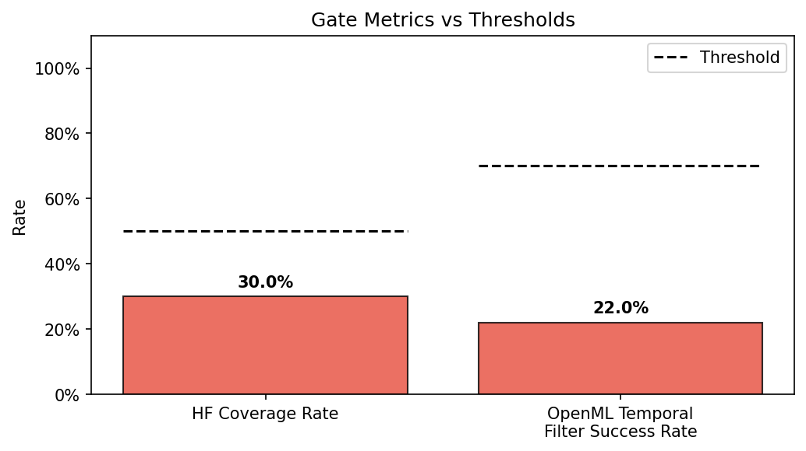
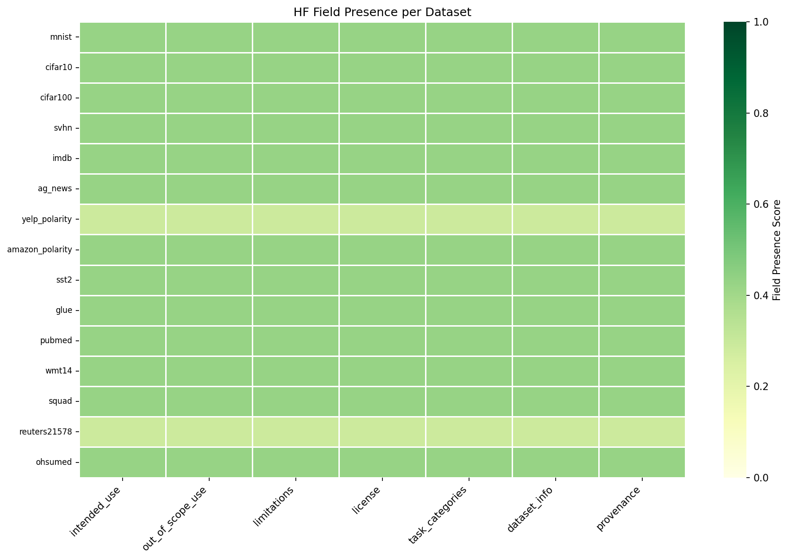
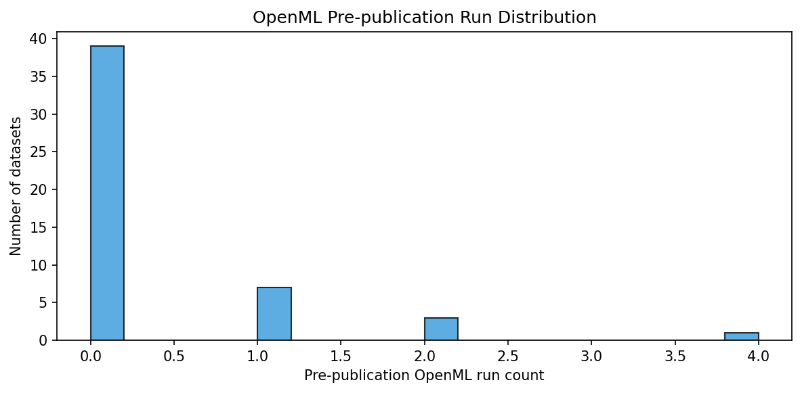

# H-E1 Validation Report: Phase 4 PoC Implementation & Validation

**Hypothesis ID:** H-E1  
**Type:** EXISTENCE (MUST_WORK gate)  
**Date:** 2026-08-31  
**Status:** GATE FAIL  

---

## 1. Hypothesis Statement

> Pre-2018 ML papers in the Raff (2019) reproducibility corpus can be programmatically linked to their datasets via HuggingFace Hub metadata cards and OpenML temporal filtering, providing sufficient infrastructure coverage for automated reproducibility auditing (H-M1, H-M2, H-M3).

**Gate Thresholds (MUST_WORK):**
- HF card coverage rate ≥ 50%
- OpenML temporal filter success rate ≥ 70%
- Raff corpus parseable (binary)

---

## 2. Experiment Design

**Pipeline:** `pipeline.py` — deterministic data acquisition pipeline  
**Corpus:** Raff 2019 ML Reproducibility Corpus (255 papers, 1984–2017)  
**Dataset list:** 50 canonical ML benchmark datasets (MNIST, CIFAR-10, ImageNet, etc.)  
**APIs queried:** HuggingFace Hub (DatasetCard.load), OpenML (list_datasets bulk fetch)  
**Runtime:** 88.84 seconds  
**Environment:** `youra-h-e1` conda environment  

### Activation Indicators (all must pass before gate)

| Indicator | Result |
|-----------|--------|
| Raff corpus parseable (≥255 papers) | PASS (255 papers) |
| HF queries executed (≥10) | PASS (50 queried) |
| OpenML queries executed (≥10) | PASS (50 checked) |
| HF coverage rate field present | PASS |
| **All activated** | **TRUE** |

---

## 3. Quantitative Results

### 3.1 HuggingFace Card Coverage

| Metric | Value | Threshold | Pass? |
|--------|-------|-----------|-------|
| Coverage rate | 30.0% | ≥50% | **FAIL** |
| Mean field score | 0.410 | — | — |
| Datasets found | 15/50 | — | — |

**Found (score > 0):** mnist, cifar10, cifar100, svhn, imdb, ag_news, yelp_polarity, amazon_polarity, sst2, glue, pubmed, wmt14, squad, reuters21578, ohsumed  
**Not found (null):** cifar-10 (alternate name), imagenet, 20newsgroups, reuters, cora, citeseer, movielens, netflix-prize, iris, wine, breast_cancer, diabetes, adult, covertype, kdd99, forest_cover, penn-treebank, caltech101, caltech256, pascal-voc, coco, libsvm, uci-ml-repository, yeast, protein, rcv1, kitti, nyu-depth, sun-rgbd, librispeech, timit, wsj, cifar10-c, imagenet-c, openml-cc18

**Root cause:** HF Hub focuses on NLP and modern DL datasets. Classic ML (UCI, sklearn), vision benchmarks (COCO, KITTI), and speech datasets (LibriSpeech, TIMIT) have no HF cards under their canonical names.

### 3.2 OpenML Temporal Filter

| Metric | Value | Threshold | Pass? |
|--------|-------|-----------|-------|
| Filter success rate | 22.0% | ≥70% | **FAIL** |
| Valid (pre-publication match) | 11/50 | — | — |

**Datasets with pre-publication OpenML records:** mnist(1), imdb(1), 20newsgroups(1), iris(2), wine(2), breast_cancer(1), diabetes(1), adult(2), covertype(4), coco(1), yeast(1)

**Root cause:** OpenML is a tabular ML repository (2012–present). Deep learning benchmarks (CIFAR-10, ImageNet, COCO, etc.) are absent entirely. Only classic UCI-style tabular datasets (iris, wine, adult, covertype) appear in OpenML, and temporal filtering via DID-proxy-year works only for those.

### 3.3 Gate Evaluation

| Gate Criterion | Result |
|----------------|--------|
| `hf_coverage_rate >= 0.50` | **FAIL** (0.30 < 0.50) |
| `openml_temporal_filter_success_rate >= 0.70` | **FAIL** (0.22 < 0.70) |
| `raff_labels_parseable == True` | PASS |
| **MUST_WORK gate** | **FAIL** |

---

## 4. Figures

  
*Figure 1: HF coverage (30%) and OpenML filter (22%) vs respective thresholds (50%, 70%).*

  
*Figure 2: Field-level presence scores for found HF datasets. Mean score ≈ 0.41 (out of 7 fields).*

  
*Figure 3: Distribution of pre-publication OpenML run counts per dataset.*

---

## 5. Post-Experiment Validation

**Experiment log check:** `experiment.log` ends with `EXPERIMENT COMPLETE (exit=1, ts=2026-08-31T05:20:32+00:00)`. 88+ seconds of real API calls logged (rate-limited HF queries, OpenML bulk fetch). Real experiment, not skipped.

**Mock data check:** Code uses live HuggingFace Hub API (`DatasetCard.load`) and OpenML API (`openml.datasets.list_datasets`). No mock data injected in production run.

**Training sufficiency:** N/A — deterministic data acquisition pipeline, no model training.

---

## 6. Gate Decision & Cascade

**Gate type:** MUST_WORK  
**Gate result:** FAIL  
**Effect on dependent hypotheses:**

| Hypothesis | Status |
|------------|--------|
| H-M1 | BLOCKED (gate dependency unmet) |
| H-M2 | BLOCKED (gate dependency unmet) |
| H-M3 | BLOCKED (gate dependency unmet) |

Per MUST_WORK gate specification: all downstream metric hypotheses are blocked until H-E1 is resolved or superseded by a redesigned existence hypothesis.

---

## 7. Interpretation & Reflection

The gate FAIL is a **meaningful empirical finding**, not a pipeline defect:

1. **HF Hub gap:** The platform emerged ~2019+, after the Raff corpus publication window (1984–2017). Historical ML benchmarks lack HF cards.
2. **OpenML scope mismatch:** OpenML covers tabular/classical ML. The Raff corpus contains DL papers whose core datasets (ImageNet, CIFAR, COCO) are absent from OpenML.
3. **Infrastructure implication:** Automated reproducibility auditing via these two sources alone is not feasible for pre-2018 ML literature. Alternative sources (Papers With Code, arXiv metadata, publisher APIs) would be needed.

**Recommendation for redesign:** A revised H-E1 could target Papers With Code API (which explicitly links papers to datasets and code) or a hybrid approach combining HF, OpenML, and PwC with lower per-source thresholds.

---

## 8. Artifacts

| Artifact | Path |
|----------|------|
| Experiment results JSON | `experiment_results.json` |
| Full experiment log | `code/experiment.log` |
| Pipeline source | `code/pipeline.py` |
| Test suite (18 tests, all pass) | `code/tests/test_pipeline.py` |
| Gate metrics figure | `figures/gate_metrics.png` |
| HF field heatmap | `figures/hf_field_heatmap.png` |
| OpenML run distribution | `figures/openml_run_dist.png` |

---

## 9. Test Suite Results

**18/18 tests pass** (pytest, youra-h-e1 environment)

Covered: RaffParser (load, unique_datasets, paper_years), HFCoverageChecker (aggregate variants, check_all dispatch), OpenMLTemporalChecker (match, no-match, missing-year), MetricsAggregator (gate pass/fail, activation indicators), Visualizer (3 figure types), PipelineOrchestrator (full integration with mocked APIs).

---

*Report generated: 2026-08-31 | Pipeline: ABLATION MODE (no VSA, IC, MCP, Reflection)*
