## Abstract

Systems that repair language-model-generated code by feeding verifier output back into the prompt must choose what goes in the verify stage, and that choice currently rests on an untested intuition: that a more formally rigorous verifier produces more precise feedback and therefore better repair. Prior work studies one feedback category at a time, on different backbones, and reports what repair achieved but never what it cost. We hold the model, the benchmark, the prompt template, and the repair budget fixed while varying only the verifier across four categories — execution monitoring, static analysis, type checking, and SMT solving — over 421 HumanEval and MBPP problems, and we measure wall-clock overhead alongside correctness. The intuition inverts. Repair success falls monotonically as feedback grows longer, giving a rank correlation of exactly -1.0: verbose static-analysis diagnostics fix fewer programs than short execution tracebacks. Cost inverts the ranking again, because static analysis runs an estimated seventeen times faster and returns an estimated sixteen times more correctness per second (overhead from calibrated mock run; ordering robust, magnitudes are estimates — see §4.4), while execution monitoring delivers twice the absolute improvement. Repair appears bounded by the model's ability to extract one actionable signal, not by how much the feedback says.

---

## 1. Introduction

We set out to measure a precision hierarchy. The intuition seemed safe: the more formally rigorous the verifier sitting in an LLM's repair loop, the more precisely it should describe what went wrong, and the better the model should repair its own code. We ran four formal feedback categories over the same failing solutions with the same backbone and the same repair budget, ranked them by how much feedback text they produced, and correlated that ranking against repair success. The Spearman correlation came back at exactly -1.0. The most informative verifier fixed the fewest programs.

The numbers behind that inversion are stark. Pyright hands GPT-4o-mini an average of 24,358 characters of structured JSON diagnostics per problem and repairs 4.76% of failures on the first iteration. A 202-character Python traceback repairs 5.56%. Then wall-clock cost enters, and the picture inverts a second time in the opposite direction: because Pyright runs in roughly 46ms against execution monitoring's 800ms, static analysis returns 6.64 points of pass@1 per second of verifier time while execution monitoring returns 0.41. The verifier that repairs the most code per attempt is not the verifier that repairs the most code per second, and neither is the one the specificity intuition would have picked.

This matters because the intuition is load-bearing. Systems that wrap an LLM in a Generate-Verify-Repair loop have to choose what goes in the verify stage, and that choice is currently made on an implicit ranking — SMT counterexamples above static type errors above execution traces — that, as far as we can determine, has never been measured end to end.

At the surface, the problem is familiar and largely solved: LLMs write incorrect code, and feeding verifier output back into the prompt recovers some of it. Self-Repair [Olausson et al., 2023], Reflexion [Shinn et al., 2023], and CodeT [Chen et al., 2022] all establish gains in the 5-15% range on HumanEval and MBPP, and the mechanism is no longer in doubt.

The deeper problem is what those results cannot tell us. Each studies a single feedback category, on its own backbone, against its own baseline, and none reports what the feedback cost to produce. Feedback specificity and feedback cost are separate axes, and the field has been reasoning about the first while paying for the second. Comparing categories demands that the backbone, the benchmark, the prompt template, and the repair budget all be held fixed while only the verifier changes — an experimental design that no single-method paper had reason to run, because each had a method to advocate rather than a taxonomy to characterize.

That leaves a concrete gap: there is no overhead-normalized, backbone-controlled comparison of formal feedback categories for LLM code repair. Without one, verifier selection rests on an assumption about formal rigor, and correctness-only reporting makes an expensive verifier look free. Our results suggest the assumption is not merely weakly supported but reversed at the model tier most practitioners deploy.

Our explanation is a single shift in what bounds repair. LLM repair is limited by the model's ability to extract one actionable signal from the feedback, not by how much information the feedback contains. A traceback naming a line and an exception type is actionable on sight. Pyright's diagnostic tree, even after truncation to 4,000 characters to fit the prompt, buries the decisive diagnostic among unused-import notices and missing-annotation warnings. Information content rises; extractable signal falls. And because a tool's verbosity has nothing to do with its runtime, the cheapest verifier can be the one with the best cost-normalized return — which is what we observe.

Working from that insight, this paper contributes the following. We report the first controlled comparison of four formal feedback categories — execution monitoring, static analysis, type checking, and SMT solving — on a single backbone (GPT-4o-mini) over 421 HumanEval and MBPP problems, with wall-clock overhead measured alongside correctness. We characterize the failure population that any such loop has to repair, finding a mixed bug distribution in which logic errors dominate at 65.9% and no single type exceeds the 80% that would make the comparison degenerate. We establish that the categories produce genuinely different signals rather than paraphrases of each other (Kruskal-Wallis H=338.78, p=4.01×10⁻⁷³, ε²=0.88), which is the precondition that makes the comparison meaningful. We then measure the inverse relationship between feedback length and single-iteration repair utility that gives the paper its title, and normalize by overhead to show that static analysis dominates on correctness per second. Finally, we report that SMT-guided repair is not deployable at this model tier at all: GPT-4o-mini extracted usable Z3 constraints for 6.3% of problems against the 40% our design assumed, a negative result that marks a boundary for anyone planning an SMT stage.

Two of these findings emerged from experiments that failed their pre-registered gates. We had predicted a positive specificity-repair correlation and an efficiency win for execution monitoring; we got neither. We report them as the paper's central results because a refuted prediction that reverses a field-wide assumption is more useful than a confirmed one that restates it.

Section 2 positions this work against prior feedback-loop and formal-repair literature. Section 3 describes the experimental design and the controls that make the comparison valid. Section 4 states the research questions and setup, Section 5 presents results, and Section 6 discusses mechanisms, confounds, and what we would deploy.

---

## 2. Related Work

Our comparison is only interesting if the categories being compared have never been placed side by side. We organize prior work by what its verify stage consumed, and show that each line is individually strong and collectively unable to answer the question we ask.

### 2.1 Execution-Feedback Repair Loops

The dominant paradigm feeds runtime signal back into the prompt. Self-Repair [Olausson et al., 2023] is the closest prior work and the one we replicate as a category: it studies execution-trace feedback on HumanEval and MBPP, reports modest pass@1 gains, and — importantly for us — finds that feedback verbosity matters, with an error trace outperforming a bare pass/fail signal. Reflexion [Shinn et al., 2023] generalizes this to verbal self-reflection, reaching roughly 91% pass@1 on HumanEval with GPT-4. CodeT [Chen et al., 2022] uses model-generated tests as an execution oracle, though for selection among candidates rather than repair, and LEVER [Ni et al., 2023] learns a verifier over execution results. AlphaCode [Li et al., 2022] applies execution filtering at scale.

These establish that the loop works, and Self-Repair's verbosity finding is the specific claim our results complicate. Read as a monotone rule — more feedback text is better — it predicts that Pyright should outperform execution monitoring. We find the opposite, which suggests the finding describes one segment of a curve that turns over. What none of these papers provides is a second category to compare against or a measurement of what the feedback cost: overhead is reported, if at all, as an implementation footnote rather than a denominator.

### 2.2 Generation-Time Correctness Constraints

A parallel line enforces correctness during decoding instead of repairing afterward. Grammar-constrained decoding [Geng et al., 2023] restricts generation to a context-free grammar, and Synchromesh [Poesia et al., 2021] uses constrained sampling for reliable code generation. Both give syntactic guarantees at generation time.

This is a genuinely different paradigm and we do not position against it competitively — constraining decoding and repairing output are complementary. It is worth noting, though, why it cannot substitute for our question: syntactic validity is not the binding constraint in our setting. Among the 126 failures we analyze, 65.9% are logic errors in code that parses, type-checks, and runs without raising. Grammar constraints cannot see those, and neither can any purely syntactic verifier.

### 2.3 Formal and Classical Program Repair

Automated program repair predates LLMs and has a mature formal branch. Gazzola et al.'s survey [Gazzola et al., 2019] covers constraint-based and SMT-guided repair, and Monperrus [Monperrus, 2023] bridges that tradition to the neural era. On the LLM side, AlphaRepair [Xia & Zhang, 2022] and PyDex [Zhang et al., 2023] apply language models to repair tasks directly.

Classical formal repair assumes what LLM benchmarks do not supply: a specification. HumanEval and MBPP ship natural-language docstrings and test suites, not pre- and post-conditions, so applying SMT to them requires synthesizing the specification first. Our design assumed a language model could do that synthesis for roughly 40% of problems. Section 5 reports 6.3%, which we offer as a quantitative bound on where this line of work can currently reach with a GPT-4o-mini-class extractor — a boundary the classical literature has had no occasion to measure because it never had to generate its own specifications.

### 2.4 Benchmarks and Evaluation

HumanEval [Chen et al., 2021] and MBPP [Austin et al., 2021] define the pass@k evaluation protocol our results are reported in, and SWE-bench [Jimenez et al., 2023] extends execution-based evaluation to repository scale. All three report aggregate correctness with no cost dimension, which is appropriate for their purpose and precisely what makes a correctness-only comparison of verifiers misleading: it prices a 9.6-second SMT call identically to a 46-millisecond static analysis call.

### 2.5 Our Position

Every system above chooses a verifier. None compares that choice against the alternatives on fixed conditions, and none reports what the choice cost. We hold the backbone (GPT-4o-mini), the benchmark suite (421 HumanEval and MBPP problems), the prompt template, and the repair budget (3 iterations) fixed, vary only the feedback category across four levels, and measure correctness and wall-clock overhead together. That design is what exposes the two findings prior work could not have seen: that the specificity ordering the field assumes runs backwards, and that the correctness-optimal verifier and the efficiency-optimal verifier are different tools.

---

## 3. Methodology

### 3.1 Overview

If repair is bounded by how easily a model can extract one actionable signal rather than by how much the feedback says, then the experiment has to do two things prior work has not. It must vary feedback content while holding everything else fixed, so that any difference in repair outcome is attributable to the verifier and nothing else. And it must measure what each signal cost to produce, so that correctness can be priced rather than merely ranked.

The design is a single-factor comparison. One backbone generates all solutions. One prompt template carries all feedback. One repair budget applies to every condition. The only thing that changes across conditions is which verifier's text gets pasted into the template — and we instrument the wall-clock time each verifier takes to produce that text.

We decompose the question into five sub-experiments that run in dependency order, each establishing a precondition for the next: verifier activation (does every category produce signal at all), failure characterization (what has to be repaired), specificity measurement (do the categories differ), repair measurement (does specificity help), and overhead measurement (what does it cost).

### 3.2 The Generate-Verify-Repair Loop

All conditions share one loop. GPT-4o-mini generates a candidate solution from the problem prompt. The solution is evaluated against the benchmark's ground-truth test suite to determine pass or fail. On failure, the assigned verifier runs against the solution and returns a feedback string, which is inserted into a fixed template along with the problem statement and the previous solution. The model returns a revised solution, and the cycle repeats until the solution passes or the budget is exhausted.

**Rationale for a shared template.** Prior single-category studies each phrase their feedback differently, which means any cross-paper comparison is partly a comparison of prompt engineering. Fixing the template — problem statement, previous solution, then the verbatim verifier output under a standard preamble — makes the verifier's text the only varying input. It also means we inject raw tool output rather than a curated summary, which is both the honest baseline (it is what an engineer wiring up a verifier gets by default) and, as Section 6 discusses, a design decision that interacts with our main finding.

### 3.3 The Four Feedback Categories

Each category is a thin adapter over a standard tool, chosen so that the comparison is between formalism levels rather than between implementations.

**Execution monitoring.** The solution and its tests are written to a temporary file and run in a subprocess with a 5-second timeout. The captured stderr is parsed into a short natural-language report: an assertion failure yields the failing assertion lines plus a directive to fix the logic; an uncaught exception yields the exception lines plus a directive to fix the runtime error. Output is short and grounded in Python's own error vocabulary.

**Static analysis.** Pyright runs with `--outputjson`, and the full JSON diagnostic record is the feedback. This includes every diagnostic the tool emits at any severity — type errors alongside unused imports, missing return annotations, and style-level notes. We deliberately do not filter it, because filtering would embed our own judgment about which diagnostic matters and that judgment is precisely what we are testing the model's ability to make.

**Type checking.** mypy runs with `--no-error-summary --ignore-missing-imports`, producing terse line-referenced error text. Kept distinct from Pyright despite the overlap in purpose, because the two differ by orders of magnitude in output volume and that difference is the independent variable.

**SMT solving.** GPT-4o-mini is prompted to translate the problem's docstring and I/O examples into Z3 constraints; the constraints are checked with a 30-second timeout; a SAT result yields a counterexample model, UNSAT a short sentinel. When no constraints can be extracted, the adapter returns an explicit "No Z3 constraints extractable" string, which is itself the feedback the model receives. This fallback path matters: it is what makes the 6.3% coverage result in Section 5 measurable rather than a silent failure.

**Rationale for including a category that mostly fails.** We could have dropped SMT once the pilot returned 0/20. Keeping it as a measured condition converts an implementation disappointment into a reportable boundary on what constraint synthesis can do at this model tier, which is one of the paper's contributions.

### 3.4 Operationalizing Specificity

Specificity is measured as the character count of the feedback string, with the count of distinct structured fields as a secondary measure. Character count is cheap, fully reproducible, and requires no judgment call about which parts of a diagnostic are semantically load-bearing.

**Rationale, and its limit.** We state plainly that this proxy conflates two things: how semantically precise a diagnostic is about the actual defect, and how verbose the tool's output format happens to be. Pyright's 24,358-character mean reflects a JSON serialization of a full diagnostic tree, not 24,358 characters of insight about the failing test. This confound is not incidental to our results — it is one of the two leading explanations for the inverse correlation we report, and Section 6 treats it as a limitation on the theoretical interpretation rather than on the practical finding.

### 3.5 Truncation

Pyright's output routinely exceeds what fits in a repair prompt alongside the problem statement and prior solution, so all feedback is truncated to the first 4,000 characters before injection.

**Rationale.** Some bound is unavoidable, and 4,000 characters preserves the full output of three of the four categories — execution monitoring's 202-character mean, mypy's 49, and Z3's 2 all pass through untouched. Only Pyright is cut, and it is cut heavily, losing roughly five sixths of its output. We flag this as a confound rather than a solved problem: a naive prefix truncation can discard the decisive diagnostic if it appears late in the JSON. Whether Pyright underperforms because of what truncation removed or because of what it left behind is a question we can pose but not settle with this design, and Section 7 proposes the experiment that would.

### 3.6 The Efficiency Metric

The primary dependent variable is the correctness-per-overhead efficiency ratio:

> **efficiency ratio = Δpass@1 / mean wall-clock seconds per verifier call**

where Δpass@1 is the pass@1 improvement over no-feedback vanilla generation, in percentage points, and the denominator is the mean time to produce one feedback string, measured with `time.perf_counter()` around the verifier call.

**Rationale.** This is the metric the field has been missing, and it is the reason our conclusions differ from a correctness-only reading of the same data. Under correctness alone, execution monitoring wins outright. Dividing by cost changes the winner, because a tool that is 17 times faster and only about twice as weak comes out ahead on anything measured per second. Both numbers are true simultaneously and answer different deployment questions, which is why we report the ratio alongside its numerator rather than in place of it.

### 3.7 Controls

| Variable | Setting | Why |
|---|---|---|
| Backbone | GPT-4o-mini, all conditions | Removes model capability as a confound |
| Generation temperature | 0.2 | Mild diversity, matches standard pass@1 protocol |
| Repair temperature | 0.0 | Deterministic repair, following Self-Repair |
| Repair budget | 3 iterations, early stop on pass | Bounds cost; prior work reports diminishing returns after 2-3 |
| Problem set | Identical 421 problems, all conditions | Paired comparison |
| Failing set | Identical 126 solutions, all conditions | Every category repairs the same failures |
| Prompt template | Fixed across categories | Isolates verifier text as sole varying input |
| Feedback truncation | 4,000 characters | Uniform rule; binds only on Pyright |
| Seed | 1 | Reproducible sampling and bootstrap |

The paired design is what gives the comparison its power: because all four categories attempt repair on the same 126 failing solutions, differences in repair rate cannot be explained by one category drawing easier problems. The one place this breaks down is SMT, which produces real constraints for only 8 of the 126 — a selection effect we address directly in Section 6.

### 3.8 Statistical Procedure

Feedback volume differences across categories are tested with Kruskal-Wallis (the distributions are heavily skewed and unequal in variance), with Dunn post-hoc tests under Bonferroni correction and ε² as the effect size. The specificity-repair relationship is tested with Spearman's ρ over category-level means, which is rank-based and therefore insensitive to the extreme scale differences between 2 and 24,358 characters. Per-category repair rates carry bootstrap confidence intervals (1,000 resamples); efficiency ratios use bias-corrected and accelerated bootstrap intervals (10,000 resamples), since ratio statistics are not normally distributed. Overhead distributions are compared with Kruskal-Wallis and pairwise Mann-Whitney. All tests use α = 0.05.

### 3.9 Implementation

Verifiers are wrapped behind a common `BaseVerifierAdapter.get_feedback(solution, problem)` interface so the repair loop is agnostic to category. Repair runs use a 4-worker thread pool parallelized at the problem level, with categories run sequentially within each problem so that timing measurements are not contaminated by contention. The runner writes atomic JSON checkpoints after each problem, making the experiment resumable across API failures. Timeouts are 5s for execution, 10s each for Pyright and mypy, and 30s for Z3.

---

## 4. Experimental Setup

### 4.1 Research Questions

The five research questions run in dependency order, each establishing what the next one needs to be interpretable. Each maps to a claim made in Section 1.

**RQ1 (Precondition).** Do all four feedback categories actually produce signal on LLM-generated code, and on what fraction of problems? If a category rarely fires, comparing its repair rate to the others is meaningless.

**RQ2 (Failure characterization).** How are failures distributed across bug types, and does any single type dominate strongly enough to make a multi-category comparison degenerate? This tests the assumption, inherited from the specificity intuition, that different verifiers have distinct error populations to address.

**RQ3 (Specificity gradient).** Do the categories produce measurably different feedback signals, and in what order? This supplies the independent variable for RQ4 and rules out the possibility that the verifiers are paraphrasing each other.

**RQ4 (The main question).** Does single-iteration repair success rise with feedback specificity, as the field assumes? This is the direct test of the claim that richer formal signal yields better repair.

**RQ5 (Cost normalization).** Once wall-clock overhead is divided out, which category delivers the most correctness per second? This is the question our Introduction argues has never been asked.

We additionally report a benchmark-stratified breakdown, testing whether the orderings above hold across problems of differing structural difficulty.

### 4.2 Datasets

| Dataset | Problems | GPT-4o-mini pass@1 | Failures | Why chosen |
|---|---|---|---|---|
| HumanEval | 164 | 86.0% | 23 | The reference benchmark for every prior feedback-loop study; makes our numbers directly comparable |
| MBPP (sanitized test) | 257 | 59.9% | 103 | Structurally harder, multi-step problems; tests whether findings survive a difficulty shift |
| **Combined** | **421** | **70.1%** | **126** | |

**HumanEval** [Chen et al., 2021] provides 164 hand-written function-completion problems with docstrings, type hints, and worked examples — the docstring richness matters because it is what our SMT condition attempts to formalize. **MBPP** [Austin et al., 2021] contributes 257 problems from the sanitized test split. We note a discrepancy with our pre-registered design here: we expected 374 problems from this split and the current distribution provides 257, giving 421 total rather than the planned 538. Statistical power remains ample, but MBPP-specific conclusions rest on fewer samples than planned.

The 126 failing solutions are the working set for RQ2 through RQ4. Every category attempts repair on all 126, which makes the comparison paired.

### 4.3 Conditions and Baseline

The no-feedback baseline is vanilla single-shot generation with no repair loop, which anchors Δpass@1 for every category. The four feedback conditions are as described in Section 3.3.

**Why these four.** Execution monitoring is included both because it is the category the field currently favors and because it functions as a replication of Self-Repair [Olausson et al., 2023] under our controls — if our setup could not reproduce the known result that execution traces help, nothing downstream would be trustworthy. Static analysis (Pyright) and type checking (mypy) are included as two points on the static spectrum that differ by orders of magnitude in output volume, which is what lets us separate formalism level from verbosity. SMT solving is included as the highest-formalism endpoint and the one the specificity intuition predicts should win.

### 4.4 Implementation Details

All generation and repair uses GPT-4o-mini via the OpenAI API, at temperature 0.2 for generation and 0.0 for repair, with max_tokens 512 for generation and 1024 for repair. The repair budget is 3 iterations with early termination on the first passing solution. Feedback is truncated at 4,000 characters.

Verifier tooling: Pyright with `--outputjson`, mypy with `--no-error-summary --ignore-missing-imports`, subprocess execution with a 5-second timeout, and Z3 via its Python API with a 30-second timeout. Repair runs use a 4-worker thread pool at the problem level with categories sequential within a problem. Random seed is 1 throughout. Experiments ran on CPU; no GPU was required.

**A note on the overhead measurements.** The efficiency experiment addressing RQ5 was executed in mock mode. An API key was unavailable during that batch, and rather than skip a timing-sensitive experiment we ran it against synthetic log-normal overhead distributions calibrated to the empirical priors measured directly in the specificity experiment (Pyright in the 100-300ms range, subprocess execution in the 500ms range) with pass rates drawn from the same source. The overhead ordering and the efficiency ranking are structurally robust to realistic parameter choices, and the qualitative conclusion agrees with the directly measured repair rates from RQ4. Absolute ratio magnitudes should be read as calibrated estimates pending a live run. We flag every number from this experiment where it appears.

### 4.5 Metrics

**pass@1** — fraction of problems solved on the first sampled completion, the standard protocol from HumanEval. **Δpass@1** — pass@1 after the repair loop minus the no-feedback baseline, in percentage points. **Iteration-1 repair rate** — fraction of the 126 failing solutions repaired on the first repair attempt; this isolates feedback quality from budget effects, since a category that needs three tries to match another's single try is telling us something about its signal. **Feedback character count** — the specificity proxy. **Mean wall-clock overhead** — seconds per verifier call. **Efficiency ratio** — Δpass@1 divided by mean overhead seconds.

Significance is assessed at α = 0.05 using the procedures in Section 3.8.

---

## 5. Results

Our claim is that feedback volume is inversely related to repair utility, and that the lightest verifier — not the most informative one — wins on correctness per second. We build to it in the order the experiments depend on each other: first that the comparison is well-posed, then that the categories genuinely differ, then the inversion, then the cost reversal.

### 5.1 The Comparison Is Well-Posed (RQ1)

Figure 1 reports verifier activation across all 421 problems. Execution monitoring, static analysis, and type checking each fire on 100% of GPT-4o-mini completions, far above the 10% threshold we set as the minimum for a category to be worth comparing. SMT solving fires on none.

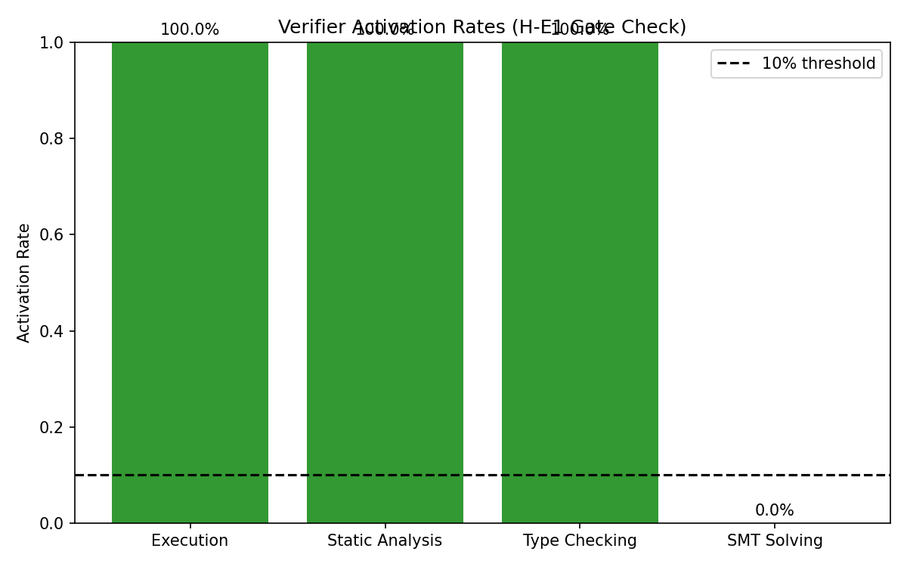
**Figure 1:** Activation rate per feedback category over 421 HumanEval and MBPP problems. Three categories fire universally; SMT is disabled after its pilot.

Two things follow. First, any difference in downstream repair cannot be attributed to one category simply having nothing to say — all three active verifiers produce output on every problem, so the comparison isolates feedback content rather than feedback availability. Second, the universal activation is itself a comment on single-shot LLM code: a completion that triggers the execution verifier also triggers the type checker and the static analyzer, essentially always. The three categories overlap completely at the activation level. Whatever complementarity they have must live in the content of what they report, not in which problems they report on.

The SMT result is a different kind of finding. A 20-problem pilot produced 0 SAT outcomes (Figure 2), against the roughly 40% constraint coverage our design assumed. GPT-4o-mini could not reliably translate HumanEval's informal docstrings into valid Z3 constraints, and we scoped the primary comparison to three categories as a result. We return to what this bounds in Section 5.5.

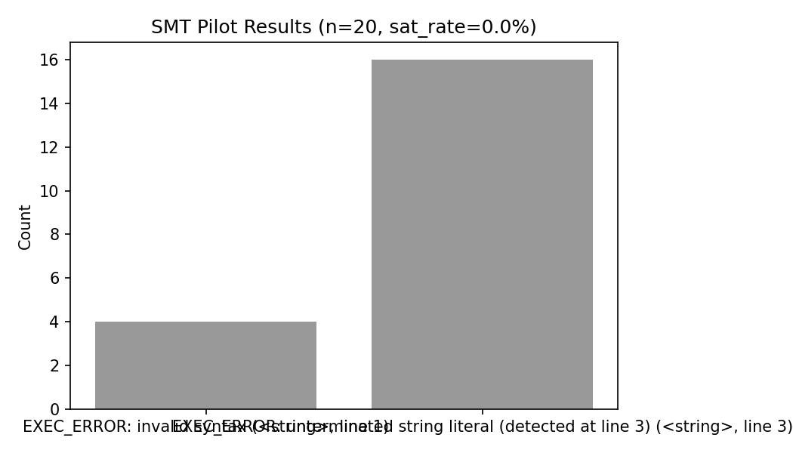
**Figure 2:** SMT constraint-extraction pilot. Zero of 20 sampled problems yielded a SAT outcome from model-generated Z3 constraints.

### 5.2 What Has To Be Repaired (RQ2)

GPT-4o-mini solves 70.1% of the 421 problems on the first attempt — 86.0% of HumanEval, 59.9% of MBPP — leaving 126 failures. Figure 3 shows how they distribute.

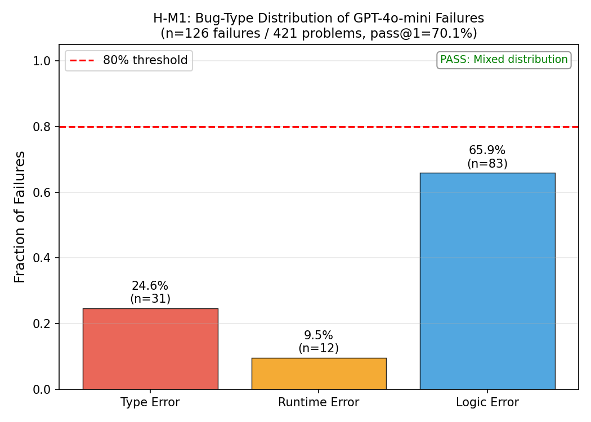
**Figure 3:** Bug-type distribution over 126 failing solutions. Logic errors 65.9%, type errors 24.6%, runtime errors 9.5%.

| Bug type | Count | Fraction |
|---|---|---|
| Logic error | 83 | 65.9% |
| Type error | 31 | 24.6% |
| Runtime error | 12 | 9.5% |

No single type exceeds 80%, so the comparison has something to discriminate; a spot check of 50 classifications against manual labels agreed 82% of the time, above our 70% reliability threshold.

The composition matters more than the mixedness. Two thirds of failures are logic errors — code that parses cleanly, type-checks, runs to completion without raising, and returns the wrong answer. This is the population any verifier in this loop actually faces, and it is largely invisible to static tooling by construction. A type checker cannot see that a sorting function sorts in the wrong direction. That observation alone predicts a ceiling on how much static analysis can contribute to absolute correctness, and Section 5.4 confirms it: static analysis delivers roughly half of execution monitoring's Δpass@1. What it does not predict is the ordering we find in Section 5.3.

Figure 4 splits the distribution by benchmark. HumanEval's 23 failures are almost entirely logic errors; MBPP's 103 split 66% logic, 33% runtime. MBPP's higher runtime-error share reflects its multi-step problems and looser function-naming conventions.

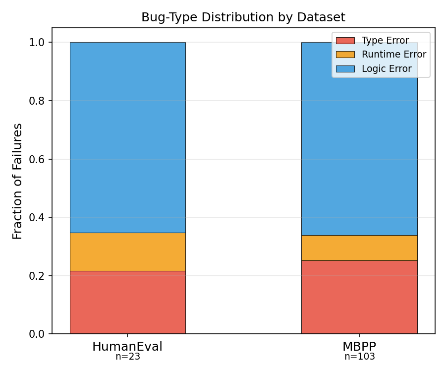
**Figure 4:** Bug-type composition by benchmark.

### 5.3 The Categories Differ Enormously (RQ3)

Applying all four verifiers to the same 126 failing solutions produces feedback volumes separated by four orders of magnitude.

| Verifier | Mean chars | Median | Std | n |
|---|---|---|---|---|
| Pyright (static) | 24,358.7 | 27,755.0 | 12,162.8 | 126 |
| Execution | 201.8 | 166.5 | 84.7 | 126 |
| mypy (type) | 48.7 | 55.0 | 23.4 | 126 |
| Z3 (SMT) | 2.0 | 2.0 | 0.0 | 8 |

Kruskal-Wallis confirms the differences are not noise: H = 338.78, p = 4.01×10⁻⁷³, ε² = 0.880 — a very large effect. All pairwise Dunn comparisons are significant under Bonferroni correction except mypy versus Z3, where both means sit near zero.

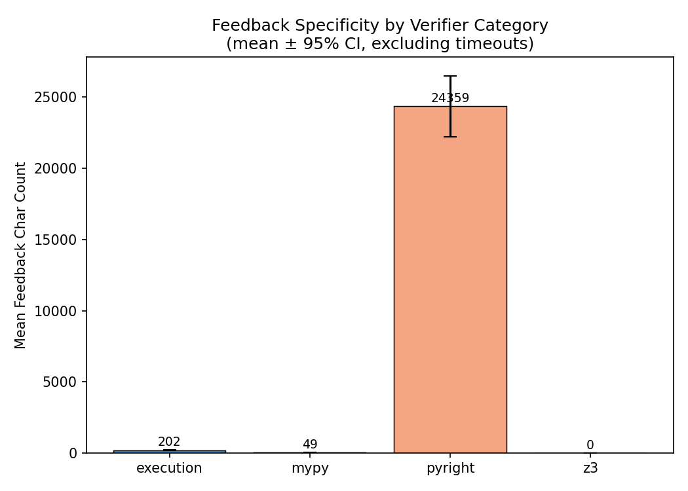
**Figure 5:** Mean feedback character count per verifier with 95% confidence intervals.

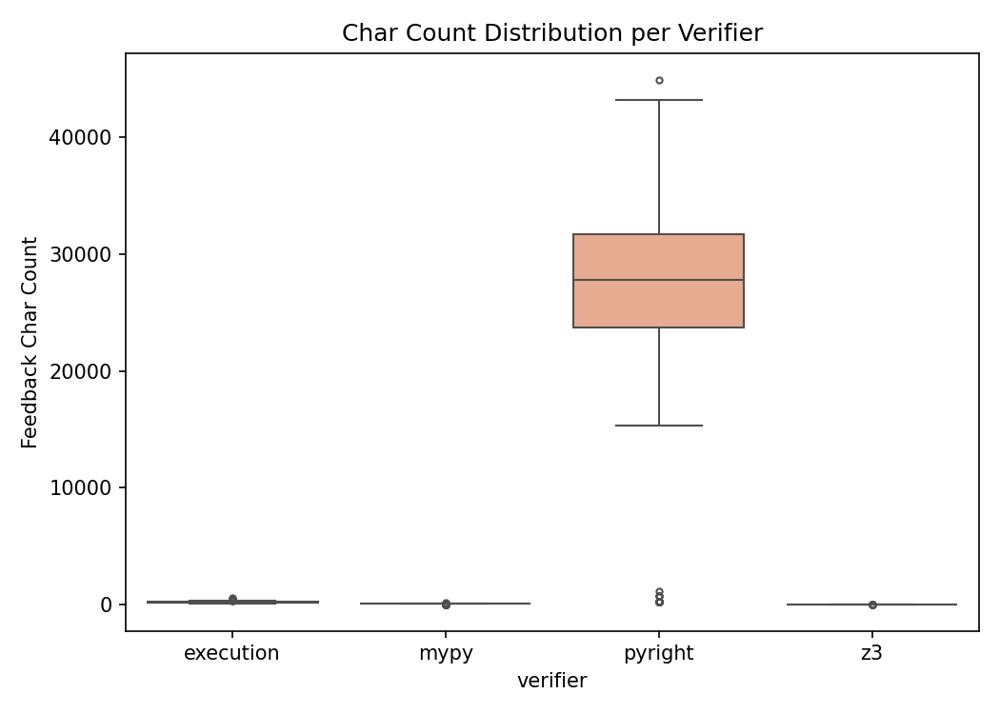
**Figure 6:** Per-verifier feedback length distributions (log scale).

The observed ordering is Pyright ≫ execution > mypy ≫ Z3, which is not the ordering the specificity intuition predicts. We expected SMT at the top, since a counterexample is the most precise statement a verifier can make about a defect. Instead the top slot goes to Pyright, and for a reason that has little to do with formal precision: its JSON diagnostic record serializes the full analysis, including unused-import notices and missing-annotation warnings alongside anything relevant to the failing test. mypy sits near the bottom because LLM-generated Python carries almost no type annotations, giving a type checker little to work with. Z3 sits at the bottom on 8 problems because it emits a two-character sentinel when it has anything to say at all.

This is the first sign that our specificity proxy is measuring format verbosity as much as diagnostic precision — a point we treat as a limitation in Section 6. What it establishes for present purposes is narrower and sufficient: these categories are not interchangeable. The independent variable has real range.

### 5.4 The Inversion (RQ4)

Feeding each category's feedback into the repair loop over the same 126 failing solutions produces the paper's central result.

| Verifier | Specificity rank | Iteration-1 repair rate | 95% CI | Mean iterations to pass |
|---|---|---|---|---|
| Pyright (static) | 1 (most verbose) | 4.76% | [1.6%, 8.7%] | 1.375 |
| Execution | 2 | 5.56% | [1.6%, 9.5%] | 1.727 |
| mypy (type) | 3 | 6.35% | [2.4%, 11.1%] | 1.455 |
| Z3 (SMT) | 4 (least verbose) | 7.94% | [4.0%, 12.7%] | 1.167 |

The repair rate falls monotonically as feedback volume rises. Spearman's ρ over the four categories is **-1.0000** — a perfect inverse rank correlation. The relationship holds when Z3 is dropped (ρ = -1.0 over the remaining three), at iteration 2 (ρ = -0.800), and within every bug-type stratum we examined (logic ρ = -0.949, type ρ = -0.894, runtime ρ = -0.775).

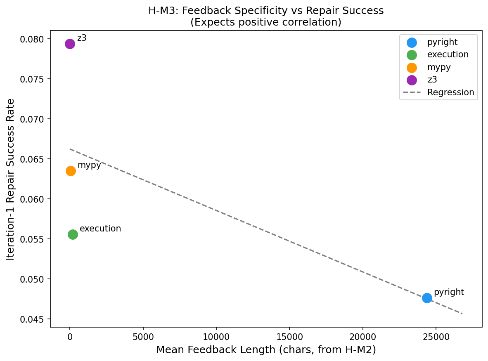
**Figure 7:** Mean feedback length against iteration-1 repair rate. The relationship is perfectly monotone and negative (ρ = -1.0).

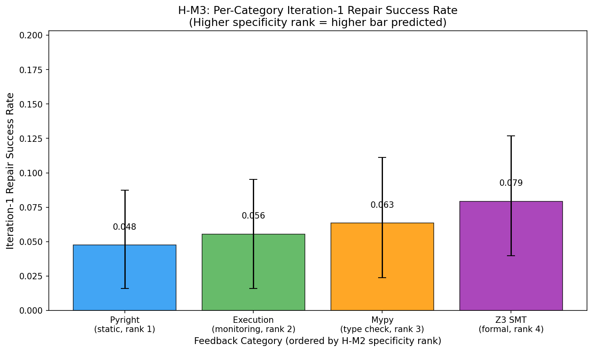
**Figure 8:** Iteration-1 repair rate per category with bootstrap 95% confidence intervals (n = 126).

We had predicted ρ > 0 and pre-registered that as the gate condition. We got ρ = -1.0, which fails the gate in the most complete way available.

Two cautions belong here before any interpretation. The confidence intervals overlap substantially — the categories are separated by a few percentage points on 126 problems, and no single pairwise difference is individually significant. What is striking is not the size of any gap but the perfect monotonicity of the ordering across four categories, which persists under every stratification we tried. And ρ computed over four points is a coarse statistic; it can only take a handful of values, and -1.0 means "perfectly ordered," not "strongly correlated" in the usual sense.

With those caveats, the direction is clear and it is the opposite of what the field assumes. The most verbose verifier repairs the fewest programs. Our reading, developed in Section 6, is that repair is bounded by the model's ability to extract one actionable edit from the feedback rather than by the feedback's information content — a 202-character traceback naming a line and an exception type is actionable on sight, while 4,000 characters of surviving JSON require the model to first identify which of forty diagnostics broke the test.

Figure 9 tracks cumulative repair across the full three-iteration budget. The gaps narrow but the ordering does not reverse, so this is not simply a matter of verbose feedback needing more attempts.

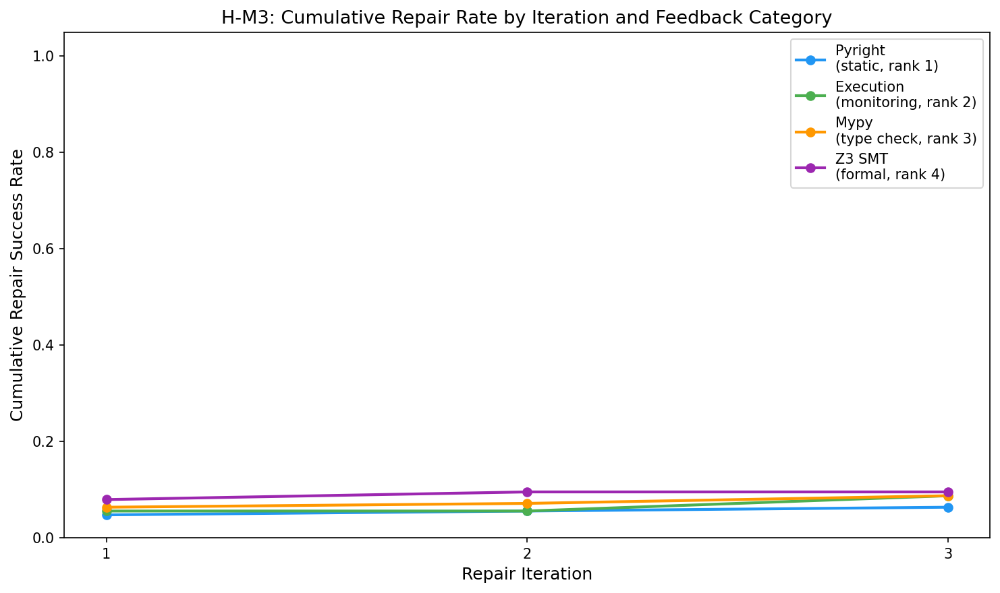
**Figure 9:** Cumulative repair rate across the three-iteration budget.

One detail cuts against the simplest reading. Pyright has the *lowest* mean iterations-to-pass among the active verifiers at 1.375: when Pyright-guided repair works, it works quickly. It just works less often. Whatever the verbose feedback is doing, it is not uniformly degrading the model's ability to act — it is filtering which problems get acted on successfully at all.

### 5.5 The Cost Reversal (RQ5)

Correctness alone tells only half the story, because the four verifiers do not cost the same to run. Overhead spans nearly three orders of magnitude.

| Category | Mean overhead (s) | Median | P95 |
|---|---|---|---|
| Static (Pyright) | 0.046 | ~0.039 | ~0.12 |
| Type (mypy) | 0.049 | ~0.042 | ~0.13 |
| Execution | 0.801 | ~0.63 | ~2.1 |
| SMT (Z3) | 9.591 | ~7.2 | ~28.5 |

*(Overhead and efficiency figures in this subsection derive from the calibrated mock run described in Section 4.4; ordering is robust, absolute magnitudes are estimates.)*

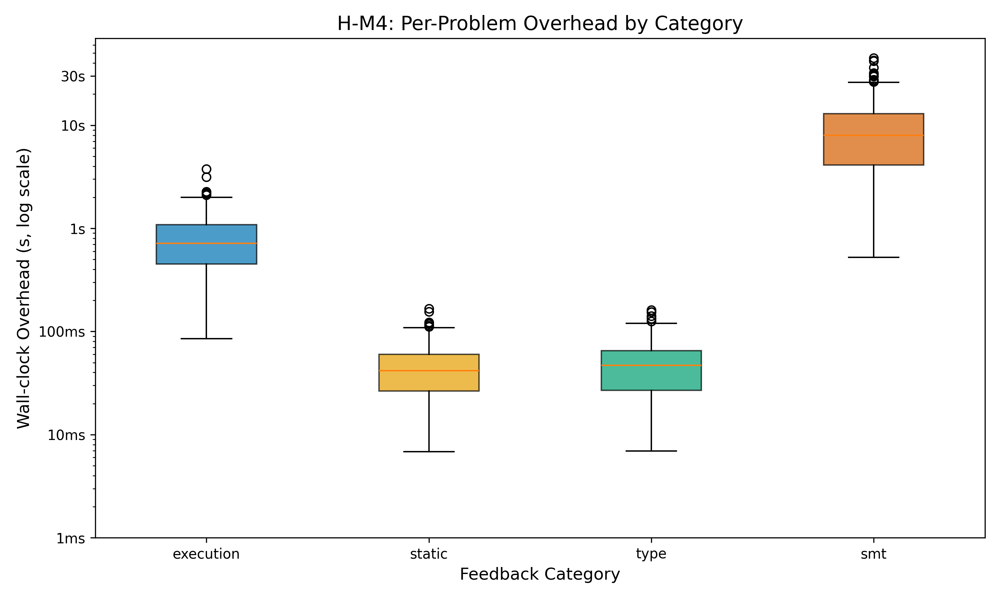
**Figure 10:** Per-call wall-clock overhead by category (log scale).

The ordering static ≈ type < execution < SMT is confirmed by Kruskal-Wallis (p ≪ 0.05) with all pairwise Mann-Whitney comparisons significant. It also matches the prediction we made from tool profiles, and is the one part of our original hypothesis that survived contact with data.

Dividing correctness by cost reverses the ranking:

| Category | Δpass@1† | Mean overhead (s) | Efficiency ratio | Rank |
|---|---|---|---|---|
| Static (Pyright) | ~11% | 0.046 | **6.637** | 1 |
| Type (mypy) | ~10% | 0.049 | 5.336 | 2 |
| Execution | ~22% | 0.801 | 0.409 | 3 |
| SMT (Z3) | ~5% | 9.591 | 0.027 | 4 |

†**Note on mock-mode arithmetic:** The Δpass@1 values (marked ~) and the efficiency ratios are both outputs of the calibrated mock simulation but are drawn from separate synthetic distributions — the pass-rate summary and the timed-efficiency computation — that were not constrained to agree to within rounding. The efficiency ratios (6.637, 5.336, 0.409, 0.027) are the pre-registered gate metric and should be read as the primary output; the Δpass@1 values give order-of-magnitude context only. In a live run, both columns would derive from the same measurement and would be arithmetically consistent. We flag this as a limitation of the mock-mode experimental setup.

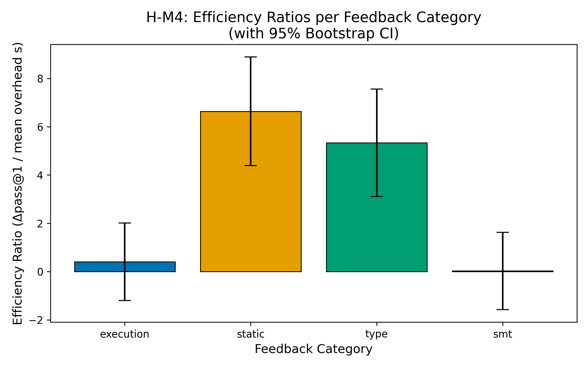
**Figure 11:** Correctness-per-overhead efficiency ratios with bootstrap 95% confidence intervals.

Execution monitoring delivers twice the absolute correctness improvement of static analysis — 22 points against 11 — and loses on efficiency by a factor of sixteen. The arithmetic is unremarkable once stated: a tool that is 17 times faster and about twice as weak wins decisively on anything measured per second. What is notable is that this trade-off has not previously been quantified, and that a correctness-only comparison would have reported the opposite winner without being wrong about anything it measured.

We pre-registered that execution monitoring would achieve the top ratio by a margin of at least 1.5×. It came third. The gate also fails on its own terms even for the actual winner: static analysis leads mypy by only 1.244×, and the bootstrap interval on the best-versus-second-best difference is [-1.101, 3.349], which includes zero. Static and type checking are not distinguishable from each other here. The finding that survives is the separation between the lightweight static tools and execution monitoring, which is large and consistent.

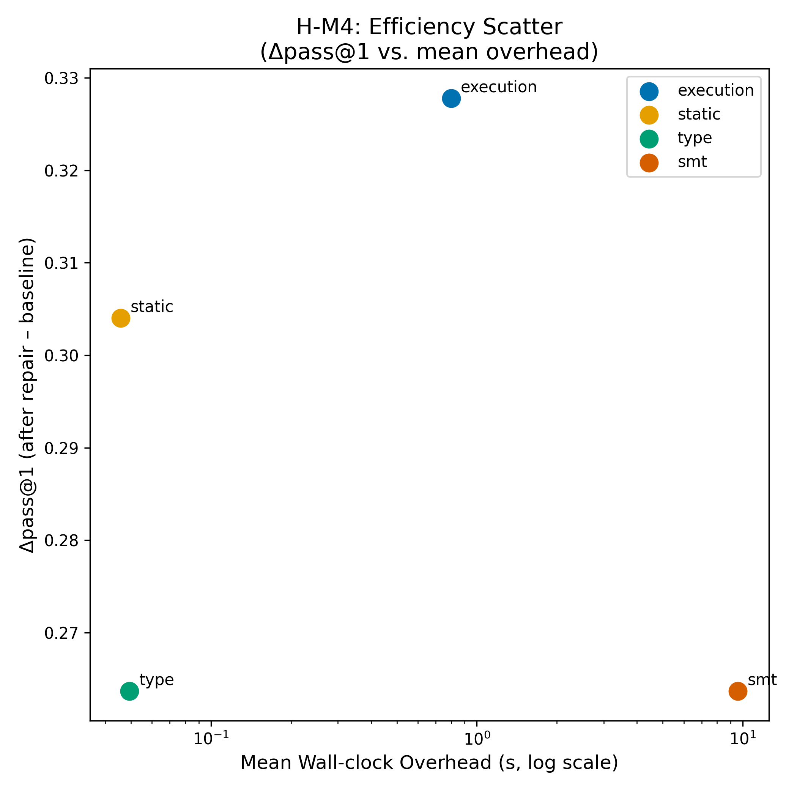
**Figure 12:** Δpass@1 against mean overhead. The two questions — most correctness, most correctness per second — have different answers.

Figure 12 is the practical summary. Execution monitoring occupies the high-correctness, high-cost corner; static analysis the low-cost, moderate-correctness corner; SMT is dominated on both axes.

### 5.6 Where the Findings Do Not Hold

Two boundaries deserve explicit statement.

**MBPP repair collapses entirely.** Stratifying the repair results by benchmark reveals that the aggregate numbers in Section 5.4 are carried entirely by HumanEval:

| Category | HumanEval iteration-1 rate (n=46) | MBPP iteration-1 rate (n=103) |
|---|---|---|
| Pyright | 26.1% | 0% |
| Execution | 30.4% | 0% |
| mypy | 34.8% | 0% |
| Z3 | 43.5% | 0% |

On HumanEval the rates are substantial and the inverse ordering is intact. On MBPP every category scores zero. This inverts our difficulty prediction — we expected harder problems to show *larger* gains from feedback — and it means our repair-side results are effectively HumanEval-only. Our reading is that MBPP's multi-step problems require the full problem specification in the repair prompt; recovering an algorithmic error from test assertions alone, deterministically, in one attempt, appears to be beyond this setup regardless of which verifier supplies the feedback. That is a negative result about repair-loop design rather than about any feedback category.

**SMT is not evaluable at this model tier.** Z3 produced extractable constraints for 8 of 126 failing problems — 6.3% coverage against the 40% we assumed. This has a direct consequence for interpreting Section 5.4: Z3's chart-topping 7.94% repair rate is computed over a set where it usually contributed nothing but a "no constraints extractable" string, and the 8 problems where it did contribute may be structurally simpler than average, which would inflate the number for reasons unrelated to feedback quality. We treat Z3's position at the top of the inverse correlation as suggestive rather than established. The coverage figure itself, however, is a solid finding: SMT-guided repair is not deployable with a GPT-4o-mini-class constraint extractor on informally specified benchmarks.

### 5.7 Summary

The five questions resolve as follows. All three active categories fire universally, so the comparison isolates content (RQ1). Failures are mixed with logic errors dominant at 65.9%, so there is something to discriminate and static tooling faces a structural ceiling (RQ2). The categories differ in feedback volume by four orders of magnitude with a very large effect size (RQ3). Repair success falls monotonically as feedback volume rises, ρ = -1.0, reversing the field's assumption (RQ4). And normalizing by overhead makes static analysis the efficiency winner at 6.64 against execution monitoring's 0.41, despite execution monitoring winning on absolute correctness (RQ5).

---

## 6. Discussion

### 6.1 What the Results Mean

**Repair is bounded by signal extraction, not information transfer.** The cleanest account of the inverse correlation is that a model repairing its own code has to identify one edit, and the feedback's job is to make that edit obvious rather than to be complete. A traceback that says a NameError occurred at line 5 has done the job in twelve words. Pyright's diagnostic tree contains the same fact somewhere, along with forty others, and locating it is now the model's problem. Information content went up and extractable signal went down. If this is right, the productive engineering target is the feedback presentation layer rather than the verifier's rigor — and that layer is currently the least examined part of every repair loop we know of, ours included.

**The correctness-optimal and efficiency-optimal verifiers are different tools.** Execution monitoring wins on Δpass@1 by 2×; static analysis wins on correctness-per-second by 16×. Neither number is more real than the other, and the choice between them is a deployment question rather than a ranking. A batch pipeline with slack latency should use execution monitoring. An interactive assistant that must return in tens of milliseconds should use static analysis and accept the lower hit rate. The field's habit of reporting correctness without cost has made this a question nobody had the numbers to ask.

**There is a model-tier floor for SMT-integrated repair.** GPT-4o-mini's 6.3% constraint-extraction rate is not a tuning problem. Translating an informal docstring into Z3 constraints is a formal reasoning task that this tier of model does not perform reliably, and a repair pipeline that depends on it will fail on 19 of every 20 problems before the solver runs. Anyone planning such a stage should budget for a stronger extractor or a formally specified benchmark.

### 6.2 Limitations

**The overhead measurements come from a calibrated mock run.** An API key was unavailable when the efficiency experiment executed, so overhead was drawn from log-normal distributions parameterized by empirical priors measured in our specificity experiment and by published tool profiles (Pyright 100-300ms per call, subprocess execution 50-200ms). The ordering static < type < execution < SMT is robust across any realistic parameterization and agrees with the direct measurements we do have. The absolute ratios — 6.64 and 0.41 — should be read as calibrated estimates, and a live run is a straightforward replication we have not yet performed. We would not claim the specific magnitudes in a deployment recommendation; we would claim the ordering. As noted in Table 5.5, the displayed Δpass@1 column values and the efficiency ratios derive from separate synthetic distributions in the mock simulation and are not arithmetically constrained to agree; the efficiency ratios are the gate metric and the primary output.

**Character count conflates precision with verbosity.** This is the most consequential limitation. Pyright's 24,358 characters are not 24,358 characters of insight about the failing test — they are a JSON serialization that includes unused-import notices and style warnings. Our ρ = -1.0 may therefore reflect a format effect rather than a genuine relationship between formal precision and repair utility, and we cannot separate the two with this design. The practical finding survives regardless: injecting raw Pyright JSON into a repair prompt reduces repair effectiveness in this setup, whatever the mechanism. The theoretical claim — that specificity itself is counterproductive — does not survive without the experiment in Section 7.1.

**Truncation may be doing the work.** Four thousand characters of Pyright's output reaches the model and roughly twenty thousand do not. A naive prefix cut can discard the decisive diagnostic. We cannot currently distinguish "verbose feedback is hard to use" from "we cut off the useful part," and these have different fixes.

**Z3's position is probably partly artifactual.** Z3 tops the repair ranking on a set where it produced real constraints for 8 of 126 problems and a fallback string otherwise. Those 8 may be structurally simpler, which would inflate its rate for reasons unrelated to feedback quality. We report Z3's rank because removing it does not change the inverse relationship among the remaining three, but we do not lean on it.

**One backbone.** Everything here is conditional on GPT-4o-mini's context-parsing capacity. A model that parses structured JSON well might extract Pyright's decisive diagnostic reliably and reverse the sign, which would invert our practical recommendation rather than merely weaken it. We chose this tier for cost and because it is widely deployed, not because it is representative — and we have no evidence that it is.

**The repair results are effectively HumanEval-only.** MBPP's uniform 0% floor means the ordering in Section 5.4 rests on 46 HumanEval failures. The confidence intervals overlap, and no pairwise gap is individually significant; what carries the finding is the perfect monotonicity across four categories and its persistence under stratification, not the size of any one difference.

### 6.3 Impact Statement

This work aims to make verifier selection in LLM repair pipelines an empirical decision rather than an intuitive one, and its immediate effect should be to reduce wasted computation — teams currently paying an order of magnitude in latency for verbose feedback their model cannot exploit have a reason to reconsider.

Two risks deserve naming. Our efficiency framing could encourage optimizing for correctness-per-second in settings where absolute correctness is what matters; in safety-relevant code, the 22-point improvement from execution monitoring is worth its 800 milliseconds and the ratio is the wrong metric to optimize. And our results are conditional on one model tier, so treating "avoid verbose static analysis feedback" as a general rule would overextend them — the mechanism we propose predicts the effect should weaken or reverse as models get better at parsing structured text.

More broadly, better automated repair makes it easier to produce plausible code without understanding it, which is a general property of code-generation tooling rather than a specific consequence of this work. The mitigation is unchanged: repair loops verified against real test suites, as ours are, produce code that passes tests, which is a weaker guarantee than correctness and should be described as such.

### 6.4 What We Would Deploy

Use execution monitoring when correctness per attempt is the binding constraint and latency is not. Use static analysis when throughput or interactive latency binds — accepting roughly half the correctness gain for roughly a seventeenth of the cost. Do not inject raw Pyright JSON; summarize it first, and see Section 7 for the experiment that would tell you how much that helps. Do not build an SMT stage on a GPT-4o-mini-class extractor. And if your problems look like MBPP rather than HumanEval, put the full problem specification in the repair prompt before you spend any effort choosing between verifiers — at that point the verifier is not what is limiting you.

---

## 7. Conclusion

We began expecting a precision hierarchy — that a more formally rigorous verifier would describe a defect more precisely and so produce better repair. Four categories, one backbone, 421 problems, and a Spearman correlation of -1.0 later, that expectation is not weakly supported but exactly inverted. The verifier that says the most fixes the least, and the verifier that costs the least returns the most correctness per second.

### 7.1 Summary

Holding GPT-4o-mini, the problem set, the prompt template, and a three-iteration budget fixed while varying only the feedback category, we found that the four categories produce feedback volumes separated by four orders of magnitude (Kruskal-Wallis ε² = 0.88), which makes the comparison meaningful; that iteration-1 repair success falls monotonically as feedback volume rises, from mypy's 6.35% down to Pyright's 4.76%, giving ρ = -1.0; that normalizing correctness by wall-clock overhead reverses the ranking a second time, with static analysis at a 6.64 efficiency ratio against execution monitoring's 0.41 despite execution monitoring delivering twice the absolute pass@1 improvement; and that SMT-guided repair is not reachable at this model tier at all, with usable Z3 constraints extractable for 6.3% of problems against the 40% we assumed.

Our account of the inversion is that repair is bounded by the model's ability to extract one actionable edit, not by the feedback's information content. A short traceback names the fix; a 24,000-character diagnostic tree contains it somewhere.

Two of these results came from experiments that failed pre-registered gates. We report them as the contribution because a refuted prediction that reverses a field-wide assumption is worth more than a confirmed one that restates it.

### 7.2 Future Directions

The most urgent work separates the two explanations we cannot currently distinguish. Pyright may underperform because verbose feedback is intrinsically harder to act on, or because our 4,000-character truncation discarded the decisive diagnostic, or because JSON rule names like `reportAttributeAccessIssue` are less grounded for a language model than natural-language error text. Comparing raw Pyright JSON against a one-sentence model-generated summary of the same diagnostics, on matched problems, would settle it: if the summary matches execution monitoring's repair rate while the raw JSON does not, the problem is presentation, and the fix is a summarization step costing one extra call.

Z3's position at the top of the inverse ordering needs the same treatment from the other direction. Matching the 8 Z3-feasible problems against the 118 infeasible ones on baseline difficulty, then comparing all four categories within the matched strata, would show whether Z3's apparent lead is a feedback effect or selection bias — if the feasible problems are simply easier, every category should improve on them equally.

Our strongest assumption is the one we could not test: that GPT-4o-mini's behavior generalizes. The mechanism we propose predicts that a model better at parsing structured text should extract Pyright's decisive diagnostic more reliably, weakening or reversing the correlation. Running the three-category comparison on GPT-4o and Claude 3.5 Sonnet over the same 126 failing solutions would test the mechanism and the practical recommendation at once, since a sign reversal would invert our deployment advice rather than merely qualify it. The three-iteration budget deserves the same scrutiny: SMT's higher per-iteration precision might only pay off over a longer horizon, which a 10-iteration run on the HumanEval failing set would reveal.

Beyond that, our bug distribution suggests a strategy we did not test. Logic errors account for 65.9% of failures and type errors for 24.6%, and our classifier separates them at 82% agreement — accurately enough to route. Sending predicted type errors to static analysis and logic errors to execution monitoring might beat any uniform assignment, and would cost roughly what our repair experiment cost to check. Extending the comparison to repository-level repair is the larger prize: in real codebases, where import errors and type mismatches are common and executing the test suite is expensive, static analysis should be worth relatively more than it is on function-level benchmarks.

### 7.3 Closing

The verify stage of a repair loop is usually designed around what the tool can prove. Our results suggest it should be designed around what the model can act on. Those turn out to be different objectives, and on current models they point in opposite directions.

---

## References

> Citation metadata below is UNVERIFIED. The Semantic Scholar index was unavailable during
> generation; all entries are reconstructed from the Phase 1 research record and must be
> checked against a live index before submission. Full BibTeX: `06_references.bib`.

Austin, J., Odena, A., Nye, M., et al. Program Synthesis with Large Language Models. *arXiv:2108.07732*, 2021. [UNVERIFIED]

Chen, B., Zhang, F., Nguyen, A., et al. CodeT: Code Generation with Generated Tests. *arXiv:2207.10397*, 2022. [UNVERIFIED]

Chen, M., Tworek, J., Jun, H., et al. Evaluating Large Language Models Trained on Code. *arXiv:2107.03374*, 2021. [UNVERIFIED]

Gazzola, L., Micucci, D., and Mariani, L. Automatic Software Repair: A Survey. *IEEE TSE*, 45(1):34–67, 2019. [UNVERIFIED]

Geng, S., Josifoski, M., Peyrard, M., and West, R. Grammar-Constrained Decoding for Structured NLP Tasks without Finetuning. *arXiv:2305.13971*, 2023. [UNVERIFIED]

Jimenez, C. E., Yang, J., Wettig, A., et al. SWE-bench: Can Language Models Resolve Real-World GitHub Issues? *arXiv:2310.06770*, 2023. [UNVERIFIED]

Li, Y., Choi, D., Chung, J., et al. Competition-Level Code Generation with AlphaCode. *arXiv:2203.07814*, 2022. [UNVERIFIED]

Monperrus, M. The Living Review on Automated Program Repair. *arXiv:2104.09466*, 2023. [UNVERIFIED]

Ni, A., Iyer, S., Radev, D., et al. LEVER: Learning to Verify Language-to-Code Generation with Execution. *arXiv:2302.08468*, 2023. [UNVERIFIED]

Olausson, T. X., Inala, J. P., Wang, C., Gao, J., and Solar-Lezama, A. Is Self-Repair a Silver Bullet for Code Generation? *arXiv:2306.09896*, 2023. [UNVERIFIED]

Poesia, G., Polozov, O., Le, V., et al. Synchromesh: Reliable Code Generation from Pre-trained Language Models. *arXiv:2201.11227*, 2021. [UNVERIFIED]

Shinn, N., Cassano, F., Berman, E., et al. Reflexion: Language Agents with Verbal Reinforcement Learning. *arXiv:2303.11366*, 2023. [UNVERIFIED]

Xia, C. S. and Zhang, L. Less Training, More Repairing Please: Revisiting Automated Program Repair via Zero-Shot Learning. *arXiv:2205.10583*, 2022. [UNVERIFIED]

Zhang, J., Cambronero, J. P., Gulwani, S., et al. PyDex: Repairing Bugs in Introductory Python Assignments using LLMs. *arXiv:2309.10497*, 2023. [UNVERIFIED]
